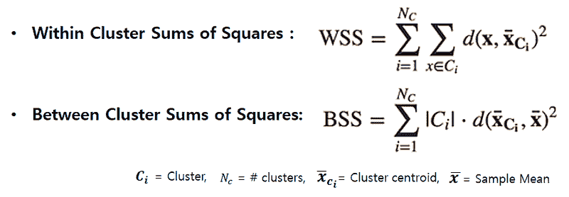
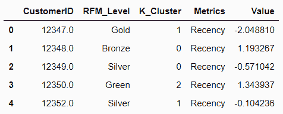

# 谁是你的金鹅？： cohort 分析

> 原文：[`www.kdnuggets.com/2019/05/golden-goose-cohort-analysis.html/2`](https://www.kdnuggets.com/2019/05/golden-goose-cohort-analysis.html/2)

### K 均值聚类

[**K 均值聚类**](https://en.wikipedia.org/wiki/K-means_clustering) 是一种无监督学习算法，根据点之间的距离进行分组。怎么做？K 均值聚类中有两个距离概念。**簇内平方和**（WSS）和**簇间平方和**（BSS）。



WSS 指每个簇内点与相应质心之间的距离总和，而 BSS 指质心与总体样本均值之间的距离总和乘以每个簇内点的数量。因此，你可以将 WSS 视为紧凑度的度量，将 BSS 视为分离度的度量。为了使聚类成功，我们需要获得较低的 WSS 和较高的 BSS。

通过迭代和移动簇质心，K 均值算法试图获得质心的优化点，以最小化 WSS 值并最大化 BSS 值。我不会深入讲解基本概念，但你可以从[视频](https://www.youtube.com/watch?v=_aWzGGNrcic)中找到进一步的解释。


图片来源于维基百科

由于 K 均值聚类使用距离作为相似度因素，因此我们需要对数据进行缩放。假设我们有两个不同尺度的特征，例如身高和体重。身高超过 150cm，而体重平均低于 100kg。如果我们绘制这些数据，点之间的距离将高度受身高的主导，导致分析偏倚。

因此，在 K 均值聚类中，缩放和归一化数据是预处理的关键步骤。如果我们检查 RFM 值的分布，可以发现它们是右偏的。没有标准化的状态下使用它并不好。我们先将 RFM 值转换为对数尺度，然后再进行归一化。

```py

```

# 为小于 0 的值定义函数

定义函数以将负值变为零

    如果 x <= 0：

        返回 1

    否则：

        返回 x

# 将函数应用于 Recency 和 MonetaryValue 列

rfm['Recency'] = [neg_to_zero(x) for x in rfm.Recency]

rfm['Monetary'] = [neg_to_zero(x) for x in rfm.Monetary]

# 去偏数据

rfm_log = rfm[['Recency', 'Frequency', 'Monetary']].apply(np.log, axis = 1).round(3)

```py

The values below or equal to zero go negative infinite when they are in log scale, I made a function to convert those values into 1 and applied it to `Recency` and `Monetary` column, using list comprehension like above. And then, a log transformation is applied for each RFM values. The next preprocessing step is scaling but it’s simpler than the previous step. Using **StandardScaler()**, we can get the standardized values like below.

```

# 缩放数据

scaler = StandardScaler()

rfm_scaled = scaler.fit_transform(rfm_log)

# 转换为数据框

rfm_scaled = pd.DataFrame(rfm_scaled, index = rfm.index, columns = rfm_log.columns)

```py


The plot on the left is the distributions of RFM before preprocessing, and the plot on the right is the distributions of RFM after normalization. By making them in the somewhat normal distribution, we can give hints to our model to grasp the trends between values easily and accurately. Now, we are done with preprocessing.
What is the next? The next step will be selecting the right number of clusters. We have to choose how many groups we’re going to make. If there is prior knowledge, we can just give the number right ahead to the algorithm. But most of the case in unsupervised learning, there isn’t. So we need to choose the optimized number, and the Elbow method is one of the solutions where we can get the hints.

```

```py
# the Elbow method
wcss = {}
for k in range(1, 11):
    kmeans = KMeans(n_clusters= k, init= 'k-means++', max_iter= 300)
    kmeans.fit(rfm_scaled)
    wcss[k] = kmeans.inertia_
# plot the WCSS values
sns.pointplot(x = list(wcss.keys()), y = list(wcss.values()))
plt.xlabel('K Numbers')
plt.ylabel('WCSS')
plt.show()

```

使用 for 循环，我为从 1 到 10 的每个聚类数量建立了模型。然后收集每个模型的 WSS 值。看看下面的图。随着聚类数量的增加，WSS 值减少。这并不奇怪，因为我们创建的聚类越多，每个聚类的大小就会减小，因此每个聚类内的距离总和会减少。那么最佳数量是多少呢？


答案在这条线的“肘部”位置。某个地方 WSS 显著减少，但 K 值不太高。我的选择是三。你怎么看？这难道不真的像是这条线的肘部吗？

现在我们选择了聚类数量，可以建立模型并生成实际的聚类，如下所示。我们还可以检查每个点与质心或聚类标签之间的距离。让我们创建一个新列，并为每个客户分配标签。

```py
# clustering
clus = KMeans(n_clusters= 3, init= 'k-means++', max_iter= 300)
clus.fit(rfm_scaled)
# Assign the clusters to datamart
rfm['K_Cluster'] = clus.labels_
rfm.head()

```


现在我们制作了两种类型的分段，RFM 分位组和 K-均值组。让我们进行可视化并比较这两种方法。

蛇形图和热力图

我将制作两种图，一种是折线图，另一种是热力图。通过这两种图，我们可以轻松比较 RFM 值的差异。首先，我会创建列以分配两个聚类标签。然后通过将 RFM 值融入一列来重塑数据框。

```py
# assign cluster column 
rfm_scaled['K_Cluster'] = clus.labels_
rfm_scaled['RFM_Level'] = rfm.RFM_Level
rfm_scaled.reset_index(inplace = True)
# melt the dataframe
rfm_melted = pd.melt(frame= rfm_scaled, id_vars= ['CustomerID', 'RFM_Level', 'K_Cluster'], var_name = 'Metrics', value_name = 'Value')
rfm_melted.head()

```



这将使得最近性、频率和货币价值类别作为观察对象，这允许我们将值绘制在一个图中。将`Metrics`放在 x 轴，将`Value`放在 y 轴，并按`RFM_Level`对值进行分组。这次重复相同的代码，将值按`K_Cluster`分组。结果如下所示。

```py
# a snake plot with RFM
sns.lineplot(x = 'Metrics', y = 'Value', hue = 'RFM_Level', data = rfm_melted)
plt.title('Snake Plot of RFM')
plt.legend(loc = 'upper right')
# a snake plot with K-Means
sns.lineplot(x = 'Metrics', y = 'Value', hue = 'K_Cluster', data = rfm_melted)
plt.title('Snake Plot of RFM')
plt.legend(loc = 'upper right')

```


这种图被称为“蛇形图”，尤其在市场分析中使用。看起来**金色**和**绿色**组在左侧图上类似于右侧图上的**1**和**2**簇。而**铜色**和**银色**组似乎被合并为**0**组。

让我们再试一次热力图。[热力图](https://en.wikipedia.org/wiki/Heat_map)是数据的图形表示，其中较大的值以较深的色调显示，较小的值以较浅的色调显示。我们可以通过颜色直观地比较组之间的方差。

```py
# the mean value in total 
total_avg = rfm.iloc[:, 0:3].mean()
total_avg
# calculate the proportional gap with total mean
cluster_avg = rfm.groupby('RFM_Level').mean().iloc[:, 0:3]
prop_rfm = cluster_avg/total_avg - 1
# heatmap with RFM
sns.heatmap(prop_rfm, cmap= 'Oranges', fmt= '.2f', annot = True)
plt.title('Heatmap of RFM quantile')
plt.plot()

```

然后重复之前做的 K-聚类的相同代码。

```py
# calculate the proportional gap with total mean
cluster_avg_K = rfm.groupby('K_Cluster').mean().iloc[:, 0:3]
prop_rfm_K = cluster_avg_K/total_avg - 1
# heatmap with K-means
sns.heatmap(prop_rfm_K, cmap= 'Blues', fmt= '.2f', annot = True)
plt.title('Heatmap of K-Means')
plt.plot()

```


可能会看到不匹配，特别是在图的顶部。但这只是因为顺序不同。左侧的**绿色**组将对应于**2**组。如果你查看每个框内的值，可以看到**金色**和**1**组之间的差异变得显著。而这可以通过颜色的深浅轻易识别出来。

结论

我们讨论了如何从客户购买数据中获取 RFM 值，并使用 RFM 分位数和 K-Means 聚类方法进行了两种分段。通过这些结果，我们现在可以确定谁是我们的‘黄金’客户，即最盈利的群体。这也告诉我们应关注哪些客户，并向他们提供特别优惠或促销，以培养客户忠诚度。我们可以为每个细分选择最佳的沟通渠道，并改进新的营销策略。

资源

+   一篇关于 RFM 分析的精彩文章：[`clevertap.com/blog/rfm-analysis/`](https://clevertap.com/blog/rfm-analysis/)

+   另一个有用的 RFM 分析解释：[`www.optimove.com/learning-center/rfm-segmentation`](https://www.optimove.com/learning-center/rfm-segmentation)

+   K-means 聚类的直观解释：[`www.youtube.com/watch?v=_aWzGGNrcic`](https://www.youtube.com/watch?v=_aWzGGNrcic)

**简介：**[Jiwon Jeong](https://www.linkedin.com/in/jiwon-jeong/) 是延世大学的研究生助理。

[原文](https://towardsdatascience.com/who-is-your-golden-goose-cohort-analysis-50c9de5dbd31)。已获授权转载。

**相关：**

+   使用 K-means 算法进行聚类

+   K-Means 和其他聚类算法：Python 快速入门

+   客户细分初学者指南

* * *

## 我们的前 3 个课程推荐

 1\. [Google 网络安全证书](https://www.kdnuggets.com/google-cybersecurity) - 快速进入网络安全职业生涯

 2\. [Google 数据分析专业证书](https://www.kdnuggets.com/google-data-analytics) - 提升你的数据分析技能

 3\. [Google IT 支持专业证书](https://www.kdnuggets.com/google-itsupport) - 支持组织的信息技术

* * *

### 更多相关主题

+   [最后呼叫：Stefan Krawcyzk 的《掌握 MLOps》现场课程](https://www.kdnuggets.com/2022/08/sphere-last-call-stefan-krawcyzk-mastering-mlops.html)

+   [使用聚类分析进行数据分段](https://www.kdnuggets.com/using-cluster-analysis-to-segment-your-data)

+   [文本分类任务的最佳架构：基准测试…](https://www.kdnuggets.com/2023/04/best-architecture-text-classification-task-benchmarking-options.html)

+   [市场数据和新闻：时间序列分析](https://www.kdnuggets.com/2022/06/market-data-news-time-series-analysis.html)

+   [最佳 Python 课程：分析总结](https://www.kdnuggets.com/2022/01/best-python-courses-analysis-summary.html)

+   [机器学习的甜蜜点：NLP 和文档分析中的纯方法](https://www.kdnuggets.com/2022/05/machine-learning-sweet-spot-pure-approaches-nlp-document-analysis.html)

```py

```
