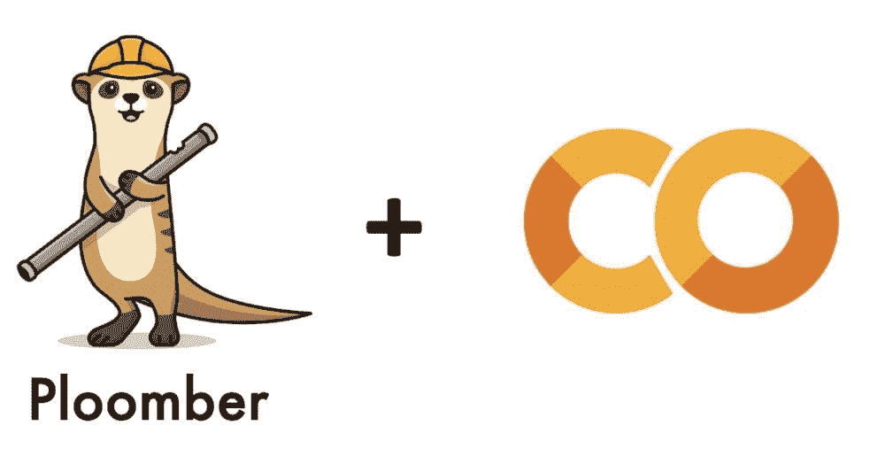
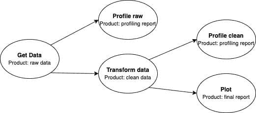

# 从 Google Colab 到 Ploomber 管道：利用 GPU 扩展的机器学习

> 原文：[`www.kdnuggets.com/2022/03/google-colab-ploomber-pipeline-ml-scale-gpus.html`](https://www.kdnuggets.com/2022/03/google-colab-ploomber-pipeline-ml-scale-gpus.html)

# **背景**

Google Colab 相当简单，你可以在一个受管的 Jupyter 环境中打开笔记本，使用免费的 GPU 进行训练，并共享驱动器笔记本，它在某种程度上也具有 Git 界面（将笔记本镜像到一个仓库）。我希望将我的笔记本从探索性数据分析（EDA）阶段扩展到一个可以在生产中运行的工作管道。拥有更好的 Git 集成以存储工件和与团队协作也很重要。Ploomber 使我实现了这一目标，同时通过逐步构建变化的任务加快了开发阶段。

# **它是如何工作的？**

我开始通过引导我的 Colab 安装一些依赖项（`pip install ploomber`）。我使用了 Ploomber 提供的第一个管道示例 - 获取数据、清理数据和可视化数据。管道结构在 pipeline.yaml 文件中指定，该文件由任务（可以是函数、.py 脚本或笔记本，即我图中的节点）和其产品组成，每个产品可以是许多东西，如原始/清洁数据、执行过的笔记本、HTML 报告等。

这是我通过 Ploomber 运行的管道，获取原始的 Covid 数据，进行数据分析，随后清理和转换数据，然后可视化清洁数据以及分析数据。

在下图中，你可以看到 Ploomber 和我的 Colab 是同步的，从 Git 仓库加载和推送，并且我可以直接从 Colab 更改组成管道的文件。如果我完成了我的 POC，我可以通过单一命令将其部署到云端，例如 Airflow、Kubernetes 或 AWS。

Colab 笔记本是从 Git 加载的（来源于 .ipynb 文件），它在后台运行 Ploomber，允许将原始代码推送到 Git 以及进行单一命令的云部署。

# **好处**

这一补充让我能够快速开发，并从一个大型笔记本转变为一个可扩展的管道。我随后将所有代码推送到 GitHub，现在我们可以作为团队协作并同时工作 - 只有真正的代码差异被保存。此外，我的笔记本不是按顺序运行，这意味着通过并行化实现更快的运行。这也标准化了工作，因此如果我们想将这个项目复制到不同的业务用例中（这就像有一个模板），它将需要更少的维护，并且学习曲线将显著缩短。

# **什么是 Ploomber？**

Ploomber（https://github.com/ploomber/ploomber）是一个开源框架，帮助数据科学家快速开发数据管道并将其部署到任何地方。通过直接从笔记本使用它，它允许你跳过数周的重构，专注于建模工作而不是基础设施。我们有一个非常活跃的社区，你可以[在这里查看](https://ploomber.io/community)。

感谢阅读！

**[Ido Michael](https://www.linkedin.com/in/ido-michael/)** 共同创办了 Ploomber，旨在帮助数据科学家更快地构建数据管道。他曾在 AWS 领导数据工程/科学团队。他与团队一起单独构建了数百条数据管道。来自以色列，他来到纽约攻读哥伦比亚大学的硕士学位。在发现项目通常需要将大约 30%的时间用于将开发工作（原型）重构成生产管道后，他专注于构建 Ploomber。

* * *

## 我们的三大课程推荐

 1\. [Google 网络安全证书](https://www.kdnuggets.com/google-cybersecurity) - 快速进入网络安全职业生涯。

 2\. [Google 数据分析专业证书](https://www.kdnuggets.com/google-data-analytics) - 提升你的数据分析技能

 3\. [Google IT 支持专业证书](https://www.kdnuggets.com/google-itsupport) - 支持你的组织在 IT 领域

* * *

### 更多相关内容

+   [Ploomber 与 Kubeflow：让 MLOps 更简单](https://www.kdnuggets.com/2022/02/ploomber-kubeflow-mlops-easier.html)

+   [使用 Ploomber、Arima、Python 和 Slurm 进行时间序列预测](https://www.kdnuggets.com/2022/03/time-series-forecasting-ploomber-arima-python-slurm.html)

+   [掌握 GPU：Python 中 GPU 加速 DataFrames 的初学者指南](https://www.kdnuggets.com/2023/07/mastering-gpus-beginners-guide-gpu-accelerated-dataframes-python.html)

+   [利用 CuPy 在 Python 中发挥 GPU 的强大作用](https://www.kdnuggets.com/leveraging-the-power-of-gpus-with-cupy-in-python)

+   [在 Google Colab 上免费微调 LLAMAv2 与 QLora](https://www.kdnuggets.com/fine-tuning-llamav2-with-qlora-on-google-colab-for-free)

+   [在 Google Colab 上免费运行 Mixtral 8x7b](https://www.kdnuggets.com/running-mixtral-8x7b-on-google-colab-for-free)
