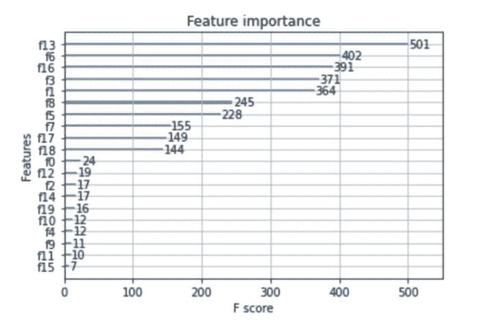
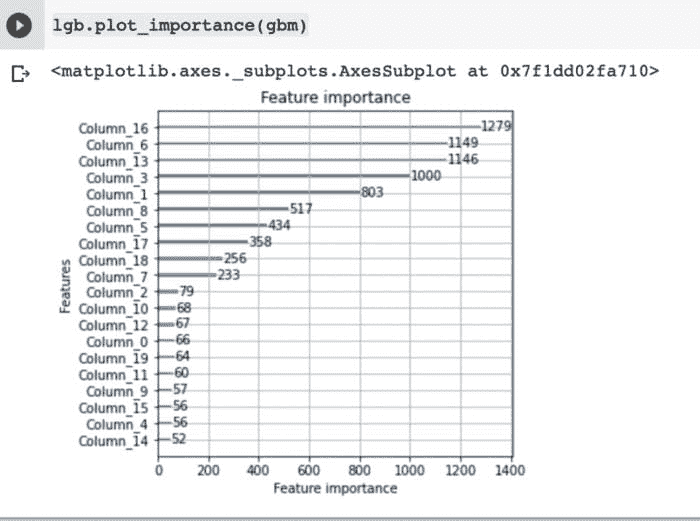
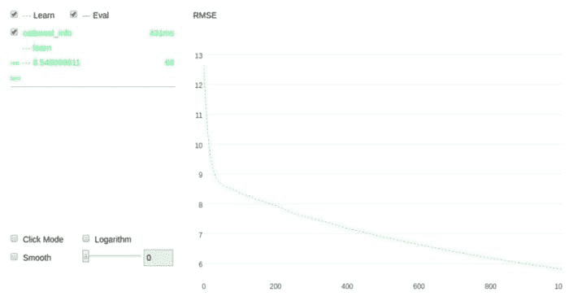

# 梯度提升决策树——概念解释

> 原文：[`www.kdnuggets.com/2021/04/gradient-boosted-trees-conceptual-explanation.html`](https://www.kdnuggets.com/2021/04/gradient-boosted-trees-conceptual-explanation.html)

评论

梯度提升决策树已被证明优于其他模型。这是因为提升涉及实现多个模型并聚合它们的结果。

梯度提升模型最近因其在 Kaggle 机器学习比赛中的表现而变得流行。

* * *

## 我们的前三大课程推荐

 1\. [谷歌网络安全证书](https://www.kdnuggets.com/google-cybersecurity) - 快速进入网络安全职业。

 2\. [谷歌数据分析专业证书](https://www.kdnuggets.com/google-data-analytics) - 提升你的数据分析能力

 3\. [谷歌 IT 支持专业证书](https://www.kdnuggets.com/google-itsupport) - 支持您的 IT 组织

* * *

在本文中，我们将深入了解梯度提升决策树的内容。

### 梯度提升

在[梯度提升](https://en.wikipedia.org/wiki/Gradient_boosting#:~:text=Gradient%20boosting%20is%20a%20machine,prediction%20models%2C%20typically%20decision%20trees.)中，使用一个弱学习者的集合来提高机器学习模型的性能。弱学习者通常是决策树。它们的组合结果是更好的模型。

在回归的情况下，最终结果是通过所有弱学习者的平均值生成的。在分类中，最终结果可以计算为弱学习者的多数投票类别。

在梯度提升中，弱学习者顺序工作。每个模型都尝试改进前一个模型的错误。这与袋装技术不同，后者在并行方式下在数据的子集上拟合多个模型。这些子集通常是随机抽取的并且可以重复。袋装的一个很好的例子是随机森林®。

**提升过程如下**：

+   使用数据构建初始模型，

+   对整个数据集进行预测，

+   使用预测和实际值计算错误，

+   给不正确的预测分配更多权重，

+   创建另一个模型来尝试修复上一个模型的错误，

+   用新模型对整个数据集进行预测，

+   创建多个模型，每个模型旨在纠正前一个模型生成的错误，

+   通过加权所有模型的平均值来获得最终模型。

### 机器学习中的提升算法

让我们来看看机器学习中的提升算法。

### AdaBoost

AdaBoost 将一系列弱学习者拟合到数据中。然后，它对错误预测赋予更多权重，对正确预测赋予较少权重。这样，算法会更多地关注难以预测的观察结果。最终结果是通过分类中的多数投票或回归中的平均值获得的。

你可以使用 Scikit-learn 实现该算法。可以传递 `n_estimators` 参数以指示所需的弱学习者数量。你可以使用 `learning_rate` 参数控制每个弱学习者的贡献。

该算法默认使用决策树作为基估计器。基估计器和决策树的参数可以调整以提高模型的性能。默认情况下，AdaBoost 中的决策树具有单一分裂。

**使用 AdaBoost 进行分类**

你可以使用 Scikit-learn 的 `AdaBoostClassifier` 来实现分类问题的 AdaBoost 模型。如下面所示，基估计器的参数可以根据你的喜好进行调整。分类器也接受你想要的估计器数量。这是模型所需的决策树数量。

```py
from sklearn.tree import DecisionTreeClassifier
from sklearn.ensemble import AdaBoostClassifier
base_estimator=DecisionTreeClassifier(max_depth=1,criterion='gini', splitter='best', min_samples_split=2)
model = AdaBoostClassifier(base_estimator=base_estimator,n_estimators=100)
model.fit(X_train, y_train)
```

**使用 AdaBoost 进行回归**

将 AdaBoost 应用于回归问题类似于分类过程，只是有一些外观上的变化。首先，你需要导入 `AdaBoostRegressor`。然后，作为基估计器，你可以使用 `DecisionTreeRegressor`。与之前一样，你可以调整决策树回归器的参数。

```py
from sklearn.tree import DecisionTreeRegressor
from sklearn.ensemble import AdaBoostRegressor
base_estimator = DecisionTreeRegressor(max_depth=1, splitter='best', min_samples_split=2)
model = AdaBoostRegressor(base_estimator=base_estimator,n_estimators=100)
model.fit(X_train, y_train)
```

### Scikit-learn 梯度提升估计器

梯度提升不同于 AdaBoost，因为损失函数的优化是通过梯度下降完成的。像 AdaBoost 一样，它也使用决策树作为弱学习者，并且是顺序地拟合这些树。添加后续树时，通过梯度下降来最小化损失。

在 Scikit-learn 的实现中，你可以指定树的数量。这是一个需要仔细查看的参数，因为指定过多的树可能导致过拟合。另一方面，指定非常少的树可能导致欠拟合。

该算法允许你指定学习率。这决定了模型学习的速度。低学习率通常需要更多的树来完成模型训练。这意味着更多的训练时间。

现在让我们来看一下在 Scikit-learn 中实现梯度提升树的过程。

**使用 Scikit-learn 梯度提升估计器进行分类**

这通过 `GradientBoostingClassifier` 实现。该算法所期望的一些参数包括：

+   `loss` 定义了需要优化的损失函数

+   `learning_rate` 决定了每棵树的贡献

+   `n_estimators` 决定了决策树的数量

+   `max_depth` 是每个估计器的最大深度

```py
from sklearn.ensemble import GradientBoostingClassifier
gbc = GradientBoostingClassifier(loss='deviance', learning_rate=0.1, n_estimators=100, subsample=1.0, criterion='friedman_mse', min_samples_split=2, min_samples_leaf=1)
gbc.fit(X_train,y_train)
```

拟合分类器后，你可以使用 `feature_importances_` 属性获得特征的重要性。这通常称为基尼重要性。

```py
gbc.feature_importances_
```


值越高，特征越重要。获得的数组中的值将加总为 1。

注意：基于不纯度的重要性并不总是准确，特别是当特征过多时。在这种情况下，你应该考虑使用[基于排列的重要性](https://scikit-learn.org/stable/modules/generated/sklearn.inspection.permutation_importance.html#sklearn.inspection.permutation_importance)。

**使用 Scikit-learn 梯度提升估计器进行回归**

Scikit-learn 梯度提升估计器可以使用`GradientBoostingRegressor`进行回归。它接受的参数与分类问题类似：

+   损失，

+   估计器数量，

+   树的最大深度，

+   学习率…

…仅仅提到几个。

```py
from sklearn.ensemble import GradientBoostingRegressor
params = {'n_estimators': 500,
          'max_depth': 4,
          'min_samples_split': 5,
          'learning_rate': 0.01,
          'loss': 'ls'}
gbc = GradientBoostingRegressor(**params)
gbc.fit(X_train,y_train)
```

像分类模型一样，你也可以获得回归算法的特征重要性。

```py
gbc.feature_importances_
```

### XGBoost

[XGBoost](https://neptune.ai/blog/how-to-organize-your-xgboost-machine-learning-ml-model-development-process)是一个支持 Java、Python、Java、C++、R 和 Julia 的梯度提升库。它还使用了一个弱决策树的集成。

这是一个线性模型，通过并行计算进行树学习。该算法还配备了执行交叉验证和显示特征重要性的功能。该模型的主要特点有：

+   接受树提升器和线性提升器的稀疏输入，

+   支持自定义评估和目标函数，

+   `Dmatrix`，其优化的数据结构提高了性能。

让我们来看看如何在 Python 中应用 XGBoost。该算法接受的参数包括：

+   `objective`用于定义任务类型，例如回归或分类；

+   `colsample_bytree`构建每棵树时的列子样本比例。子样本发生在每次迭代中。这通常是 0 到 1 之间的值；

+   `learning_rate`决定了模型学习的快慢；

+   `max_depth`表示每棵树的最大深度。树木越多，模型复杂度越高，过拟合的机会也越大；

+   `alpha`是权重的[L1 正则化](https://en.wikipedia.org/wiki/Regularization_(mathematics))；

+   `n_estimators`是拟合的决策树数量。

**使用 XGBoost 进行分类**

在导入算法后，定义你希望使用的参数。由于这是一个分类问题，使用`binary: logistic`目标函数。下一步是使用`XGBClassifier`并解包定义的参数。你可以调整这些参数，直到获得适合你问题的最佳参数。

```py
import xgboost as xgb
params = {"objective":"binary:logistic",'colsample_bytree': 0.3,'learning_rate': 0.1,
                'max_depth': 5, 'alpha': 10}
classification = xgb.XGBClassifier(**params)
classification.fit(X_train, y_train)
```

**使用 XGBoost 进行回归**

在回归中，使用`XGBRegressor`代替。在这种情况下，目标函数将是`reg:squarederror`。

```py
import xgboost as xgb
params = {"objective":"reg:squarederror",'colsample_bytree': 0.3,'learning_rate': 0.1,
                'max_depth': 5, 'alpha': 10}
regressor = xgb.XGBRegressor(**params)
regressor.fit(X_train, y_train)
```

XGBoost 模型还允许你通过`feature_importances_`属性获取特征重要性。

```py
regressor.feature_importances_
```


你可以使用 Matplotlib 轻松可视化它们。这是通过 XGBoost 的 `plot_importance` 函数完成的。

```py
import matplotlib.pyplot as plt
xgb.plot_importance(regressor)
plt.rcParams['figure.figsize'] = [5, 5]
plt.show()
```



`save_model` 函数可以用于保存你的模型。然后你可以将这个模型发送到你的模型注册表。

```py
regressor.save_model("model.pkl")
```

查看 Neptune 文档关于 [XGBoost](https://docs.neptune.ai/essentials/integrations/machine-learning-frameworks/xgboost) 和 [matplotlib](https://docs.neptune.ai/essentials/integrations/visualization-libraries/matplotlib) 的集成。

### LightGBM

[LightGBM](https://neptune.ai/blog/how-to-organize-your-lightgbm-ml-model-development-process-examples-of-best-practices) 与其他梯度提升框架不同，因为它使用了基于叶子生长的树算法。基于叶子生长的树算法比基于深度生长的算法收敛更快。然而，它们更容易过拟合。

[*来源*](https://lightgbm.readthedocs.io/en/latest/Features.html?highlight=dart#other-features)

该算法是 [基于直方图的](https://scikit-learn.org/stable/modules/generated/sklearn.ensemble.HistGradientBoostingClassifier.html)，因此它将连续值分配到离散的区间。这导致训练更快且内存利用更高效。

该算法的其他显著特点包括：

+   支持 GPU 训练，

+   对类别特征的原生支持，

+   处理大规模数据的能力，

+   默认处理缺失值。

我们来看看该算法的一些主要参数：

+   `max_depth` 每棵树的最大深度；

+   `objective` 默认为回归；

+   `learning_rate` 提升学习率；

+   `n_estimators` 要拟合的决策树数量；

+   `device_type` 指你是在 CPU 还是 GPU 上工作。

**使用 LightGBM 进行分类**

训练一个二分类模型可以通过将 `binary` 设置为目标来完成。如果是多分类问题，则使用 `multiclass` 目标。

数据集也被转换为 LightGBM 的 `Dataset` 格式。然后使用 `train` 函数训练模型。你还可以通过 `valid_sets` 参数传递验证数据集。

```py
import lightgbm as lgb
lgb_train = lgb.Dataset(X_train, y_train)
lgb_eval = lgb.Dataset(X_test, y_test, reference=lgb_train)
params = {'boosting_type': 'gbdt',
              'objective': 'binary',
              'num_leaves': 40,
              'learning_rate': 0.1,
              'feature_fraction': 0.9
              }
gbm = lgb.train(params,
    lgb_train,
    num_boost_round=200,
    valid_sets=[lgb_train, lgb_eval],
    valid_names=['train','valid'],
   )

```

**使用 LightGBM 进行回归**

对于 LightGBM 回归，只需将目标更改为 `regression`。默认的提升类型是梯度提升决策树。

如果你愿意，可以将其更改为随机森林算法、`dart` — Dropouts meet Multiple Additive Regression Trees，或 `goss` — 基于梯度的单边采样。

```py
import lightgbm as lgb
lgb_train = lgb.Dataset(X_train, y_train)
lgb_eval = lgb.Dataset(X_test, y_test, reference=lgb_train)
params = {'boosting_type': 'gbdt',
              'objective': 'regression',
              'num_leaves': 40,
              'learning_rate': 0.1,
              'feature_fraction': 0.9
              }
gbm = lgb.train(params,
    lgb_train,
    num_boost_round=200,
    valid_sets=[lgb_train, lgb_eval],
    valid_names=['train','valid'],
   )
```

你还可以使用 LightGBM 绘制模型的特征重要性。

```py
lgb.plot_importance(gbm)
```



LightGBM 也有一个内置的模型保存功能。该功能是 `save_model`。

```py
gbm.save_model('mode.pkl')
```

### CatBoost

[CatBoost](https://github.com/catboost) 是 Yandex 开发的深度梯度提升库。该算法使用忽略型决策树构建平衡树。

它在树的每一层使用相同的特征来进行左右分裂。

例如在下图中，你可以看到 `297,value>0.5` 被用于该层级。


其他显著特点包括 [CatBoost](https://catboost.ai/news/catboost-enables-fast-gradient-boosting-on-decision-trees-using-gpus)：

+   原生支持分类特征，

+   支持在多个 GPU 上训练，

+   默认参数下表现良好，

+   通过 CatBoost 的模型应用程序实现快速预测，

+   原生处理缺失值，

+   支持回归和分类问题。

现在让我们提及 CatBoost 的几个训练参数：

+   `loss_function` 用于分类或回归的损失函数；

+   `eval_metric` 模型的评估指标；

+   `n_estimators` 决策树的最大数量；

+   `learning_rate` 决定模型学习的速度；

+   `depth` 每棵树的最大深度；

+   `ignored_features` 确定在训练期间应忽略的特征；

+   `nan_mode` 用于处理缺失值的方法；

+   `cat_features` 一个分类列的数组；

+   `text_features` 用于声明基于文本的列。

**使用 CatBoost 进行分类**

对于分类问题，使用 `CatBoostClassifier`。在训练过程中设置 `plot=True` 将可视化模型。

```py
from catboost import CatBoostClassifier
model = CatBoostClassifier()
model.fit(X_train,y_train,verbose=False, plot=True)
```



**使用 CatBoost 进行回归**

在回归的情况下，使用 `CatBoostRegressor`。

```py
from catboost import CatBoostRegressor
model = CatBoostRegressor()
model.fit(X_train,y_train,verbose=False, plot=True)
```

你还可以使用 `feature_importances_` 获取特征按重要性排序。

```py
model.feature_importances_
```


算法还支持执行交叉验证。这是通过 `cv` 函数完成的，并传递所需的参数。

传递 `plot=”True”` 将可视化交叉验证过程。`cv` 函数期望数据集为 CatBoost 的 `Pool` 格式。

```py
from catboost import Pool, cv
params = {"iterations": 100,
          "depth": 2,
          "loss_function": "RMSE",
          "verbose": False}
cv_dataset = Pool(data=X_train,
                  label=y_train)
scores = cv(cv_dataset,
            params,
            fold_count=2, 
            plot=True)
```

你还可以使用 CatBoost 执行网格搜索。这是通过 `grid_search` 函数完成的。搜索后，CatBoost 会在最佳参数下进行训练。

在这个过程中你不应该已经拟合模型。传递 `plot=True` 参数将可视化网格搜索过程。

```py
grid = {'learning_rate': [0.03, 0.1],
        'depth': [4, 6, 10],
        'l2_leaf_reg': [1, 3, 5, 7, 9]}

grid_search_result = model.grid_search(grid, X=X_train, y=y_train, plot=True)
```

CatBoost 还使你能够可视化模型中的单棵树。这是通过 `plot_tree` 函数完成的，并传递你希望可视化的树的索引。

```py
model.plot_tree(tree_idx=0)
```


### 梯度提升树的优点

有几个原因你可能会考虑使用梯度提升树算法：

+   相较于其他模型，通常更准确，

+   在较大的数据集上训练更快，

+   大多数算法提供对分类特征的处理支持，

+   其中一些算法可以原生处理缺失值。

### 梯度提升树的缺点

现在让我们讨论一下使用梯度提升树时遇到的一些挑战：

+   易于过拟合：可以通过应用 L1 和 L2 正则化惩罚来解决。你也可以尝试较低的学习率；

+   模型可能计算开销大，训练时间较长，特别是在 CPU 上；

+   最终模型难以解释。

### 最后的思考

在这篇文章中，我们探讨了如何在机器学习问题中实现梯度提升决策树。我们还介绍了各种基于提升的算法，你可以立即开始使用。

具体来说，我们涵盖了：

+   什么是梯度提升，

+   梯度提升如何运作，

+   各种类型的梯度提升算法，

+   如何使用梯度提升算法解决回归和分类问题，

+   梯度提升树的优点，

+   梯度提升树的缺点，

…以及更多内容。

你现在已经准备好开始提升你的机器学习模型。

### 资源

+   [TensorFlow 中的梯度提升](https://www.tensorflow.org/tutorials/estimator/boosted_trees_model_understanding)

+   [基于直方图的梯度提升](https://scikit-learn.org/stable/modules/generated/sklearn.ensemble.HistGradientBoostingClassifier.html)

+   [分类笔记本](https://colab.research.google.com/drive/1O6ChgoMcnEdr4opf2d1Qgoltw_VMYzzn?usp=sharing)

+   [回归笔记本](https://colab.research.google.com/drive/1LE0Hj0axWfjL7DqWP04NX_tb6gzLpk-t?usp=sharing)

**简介：[德里克·姆维提](https://www.linkedin.com/in/mwitiderrick/)** 是一位数据科学家，对知识分享充满热情。他通过如 Heartbeat、Towards Data Science、Datacamp、Neptune AI、KDnuggets 等博客积极贡献于数据科学社区。他的内容在互联网上的浏览量已超过一百万次。德里克还是一名作者和在线讲师。他还与各种机构合作，实施数据科学解决方案，并提升其员工技能。你可能想查看他的[完整数据科学与机器学习 Python 训练营课程](https://www.udemy.com/course/data-science-bootcamp-in-python/?referralCode=9F6DFBC3F92C44E8C7F4)。

[原文](https://neptune.ai/blog/gradient-boosted-decision-trees-guide)。经许可转载。

**相关内容：**

+   LightGBM：一种高效的梯度提升决策树

+   Scikit-learn 的最佳机器学习框架和扩展

+   使用 CatBoost 的快速梯度提升

### 更多相关内容

+   [从头开始学习机器学习：决策树](https://www.kdnuggets.com/2022/11/machine-learning-scratch-decision-trees.html)

+   [决策树与随机森林，详解](https://www.kdnuggets.com/2022/08/decision-trees-random-forests-explained.html)

+   [广义可扩展最优稀疏决策树（GOSDT）](https://www.kdnuggets.com/2023/02/generalized-scalable-optimal-sparse-decision-treesgosdt.html)

+   [揭开决策树的神秘面纱](https://www.kdnuggets.com/demystifying-decision-trees-for-the-real-world)

+   [线性回归与逻辑回归：简明解释](https://www.kdnuggets.com/2022/03/linear-logistic-regression-succinct-explanation.html)

+   [KDnuggets 新闻 22:n12，3 月 23 日：最佳数据科学书籍…](https://www.kdnuggets.com/2022/n12.html)
