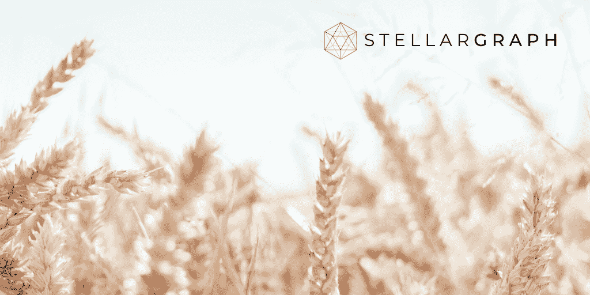
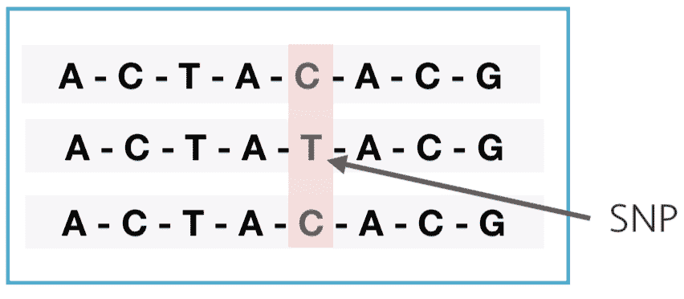
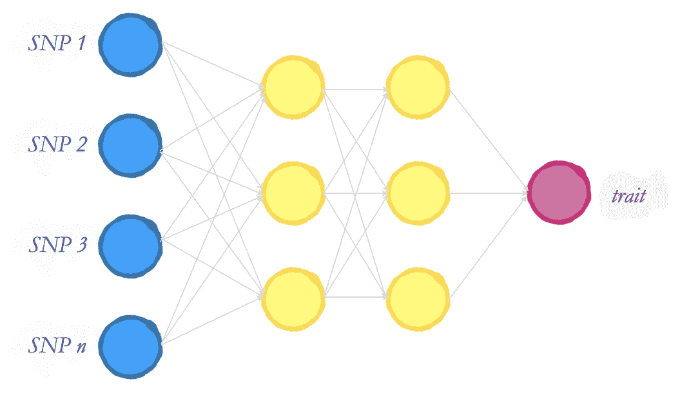
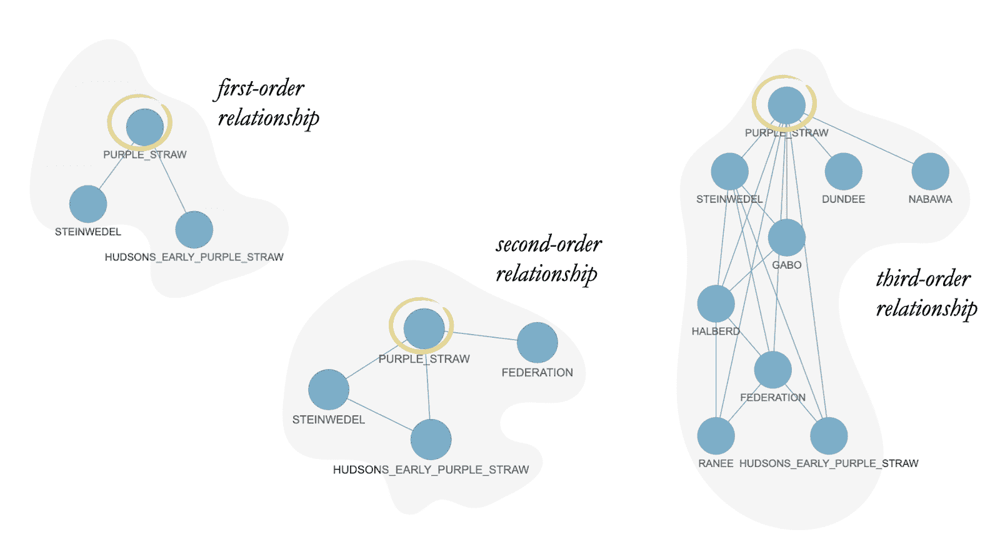
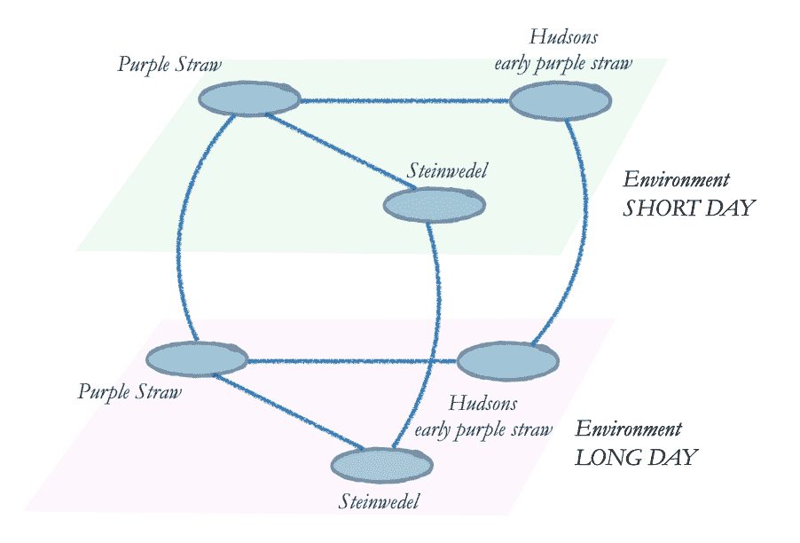
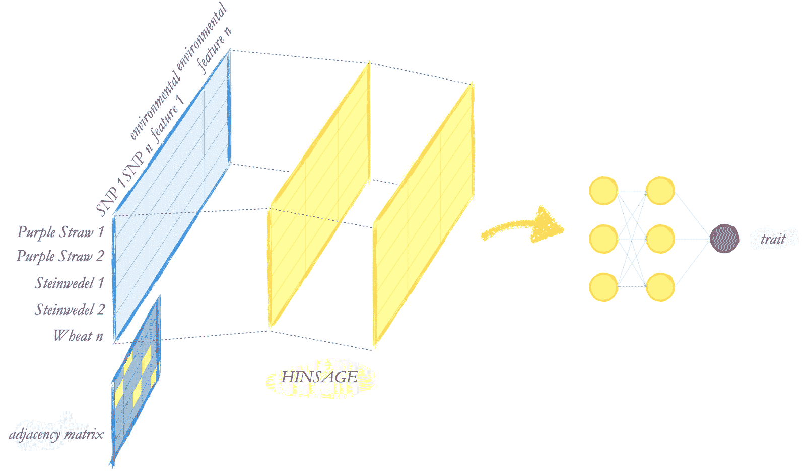

# 图形机器学习在基因组预测中的应用

> 原文：[`www.kdnuggets.com/2020/06/graph-machine-learning-genomic-prediction.html`](https://www.kdnuggets.com/2020/06/graph-machine-learning-genomic-prediction.html)

评论

**作者：[Thanh Nguyen Mueller](https://www.linkedin.com/in/thanh-nm/?originalSubdomain=au)，CSIRO Data61**

图片由*[David Becker](https://unsplash.com/@beckerworks?utm_source=unsplash&utm_medium=referral&utm_content=creditCopyText)*提供，来源于*[Unsplash](https://unsplash.com/s/photos/wheat?utm_source=unsplash&utm_medium=referral&utm_content=creditCopyText)*

* * *

## 我们的前三个课程推荐

 1\. [谷歌网络安全证书](https://www.kdnuggets.com/google-cybersecurity) - 快速进入网络安全职业道路

 2\. [谷歌数据分析专业证书](https://www.kdnuggets.com/google-data-analytics) - 提升你的数据分析技能

 3\. [谷歌 IT 支持专业证书](https://www.kdnuggets.com/google-itsupport) - 支持你组织的 IT

* * *

在基因组环境中，大量个体和基因组结构的高度复杂性使得有价值的分析和洞察变得*困难*。深度学习因其灵活性和在大型数据集中揭示复杂模式的能力而广为人知；凭借这些优势，*[基因组领域的深度学习](https://pubmed.ncbi.nlm.nih.gov/31330861/)*应用逐渐出现。

其中一个应用是基因组预测，其中个体的特征——如对疾病的易感性或与产量相关的特征——通过其基因组信息进行预测。理解遗传特征与基因组变异之间的相关性可以带来许多好处，例如推动作物育种过程，从而提高食品安全。

在本文中，我们探讨了如何利用遗传关系和基因组信息来预测遗传特征，并借助*[图形机器学习](https://medium.com/stellargraph/knowing-your-neighbours-machine-learning-on-graphs-9b7c3d0d5896?source=friends_link&sk=ac71607f5272aeb68e168453a5ce3edd)*算法进行预测。

### 基因组预测中的深度学习

在基因组预测中，传统的深度学习会使用个体的基因组信息——如单核苷酸多态性（SNP）——作为神经网络的输入特征。SNP 本质上是发生在个体基因组特定位置的差异。

通过观察个体的基因组信息，例如 SNPs 和观察到的特征，神经网络将学会从其基因组信息中预测未见个体的特征。

以以下多层感知器（MLP）网络为例，该网络包含一个输入层，用于容纳 SNPs，一个或多个隐藏层，以及一个输出层，用于预测性状（定量或分类）。我们通过调整网络参数以最小化训练集中每个个体预测的性状与观察到的性状之间的平均误差来训练网络，使用一种梯度下降优化算法的变体，例如随机梯度下降。

*图 1：一个 MLP 神经网络示例，展示了使用 SNPs 特征作为输入，两个隐藏（全连接）层，以及一个预测性状值的输出层。*

除了这些基因组信息外，个体之间的遗传关系也可以有助于提高性状预测的准确性。我们的问题是；*如何利用这些关系进行性状预测？*

### 性状预测的图表示

图机器学习是一种工具，它不仅允许我们利用关于实体的内在信息（例如 SNP 特征），还允许我们利用实体之间的关系来执行预测任务。这是深度学习在可以建模为图的数据上的扩展。

个体图会将个体表示为节点，而它们之间的关系表示为边。基于谱系的亲缘关系矩阵可以表示为个体之间的关系。这种*N x N*矩阵，其中*N*是个体的数量，包含基于谱系的[关系系数](https://en.wikipedia.org/wiki/Coefficient_of_relationship)，这些系数表示个体之间的生物学关系，例如一级（父子，兄弟姐妹），二级（姑姑、叔叔），三级（堂兄妹，祖父母）等。

使用基于谱系的关系，我们可以构建一个由具有遗传特征的节点（例如 SNPs）和表示它们之间一定程度相关性的边组成的图。这是一种自然的数据表示方式，可用于性状预测。

*图 2 展示了紫色稻草小麦的一些关系的图示。左侧的图仅包括一级关系。在第二张图中，考虑了一级和二级关系，第三张图则显示了包含一级、二级和三级关系时的连接密度。*

在基因组育种（例如小麦）的背景下，除了遗传特征外，生长条件对个体性状也有重要影响。也就是说，同一物种的个体在不同环境中生长时，虽然可能共享相同的 SNPs，但由于生长条件不同，它们可能还会具有额外的、与环境相关的特征和性状。因此，将这些信息添加到图中是有用的，因为我们可能想要：

1.  观察在**一个环境条件**下的植物，同时预测同一植物在另一种环境中的特征。

1.  观察在**各种环境条件**下生长的植物，并预测在相同环境下处理的完全不同植物的特征。

将这些信息纳入图中的一种可能方法是为每个环境条件创建个体的复制品，并在这些复制品之间绘制一条边，编码这些是相同基因组的复制品这一事实。

*图 3：图表展示了紫草在长日照和短日照环境处理中的一级关系。一个边表示谱系关系或与其复制品的连接。*

然而，将个体的复制品连接起来的边具有与谱系关系的边不同的语义含义。为了考虑这一点，我们构建了一个异质图，将个体作为单一节点类型，谱系和环境条件作为两种不同的边类型。

*图 4：紫草在长日照和短日照环境处理中，有两种边类型——“谱系”表示一级关系，“条件”显示与在不同环境中生长的复制品的连接。*

到目前为止，我们已经用环境条件和谱系关系表示个体作为图。我们最后的问题是；*如何将神经网络应用于这样的图结构数据进行特征预测*？

### 从图中预测特征

GraphSAGE [1]，属于图卷积神经网络的一类，是一种神经网络，应用于图时将学习生成适用于下游预测任务（例如节点分类或回归）的潜在向量表示，也称为“嵌入”。它通过将节点特征与其邻域内节点的聚合特征融合来实现这一点。

将此应用于我们上面的个体图，GraphSAGE 层为每个个体形成一个新的嵌入向量，将个体的特征与来自其直接亲属及其在其他环境中的复制品的特征融合。

当堆叠*k*个 GraphSAGE 层时，我们扩展每个节点的邻域，还融合来自*k*跳远的邻居的嵌入。例如，使用两个 GraphSAGE 层，我们还会包括每个个体亲属的亲属的信息。

为了扩展性，GraphSAGE 层不会融合所有邻居的特征，而是只融合一组随机选择的邻居的特征。使用 GraphSAGE 时，层数和每层的邻居数量都是用户定义的。

最终，将这些节点嵌入传递到隐藏层堆叠和输出层，神经网络学习调整生成的节点嵌入和模型参数，以找到适合特征预测的最优嵌入。与 MLP 一样，神经网络的输出层包含了个体的预测特征。

*图 5 说明了一个端到端的图神经网络，其中输入层包含节点和边（邻接矩阵）、两个 GraphSAGE 层、两个全连接层和一个输出层。*

### HinSAGE 在异质图上的特征预测

GraphSAGE 算法仅适用于同质图，因此在融合来自节点及其“邻居”的信息时，不区分节点类型和边类型。然而，如图 4 所示，这种区分对于谱系和环境条件关系是必要的，因为这些是语义上不同的关系，对应的节点邻域也有所不同。

[HinSAGE](https://stellargraph.readthedocs.io/en/stable/hinsage.html)（异质图 SAGE）[2] 是对 GraphSAGE 算法的扩展，允许我们利用图中节点和边的异质性。HinSAGE 遵循邻域聚合策略，通过边的类型选择和融合邻居。因此，HinSAGE 不是直接将亲属和环境依赖的副本融合，而是首先融合亲属的特征，然后是副本的特征（或相反），最后将结果与个体本身的特征融合。

类似于 GraphSAGE 神经网络，我们的图神经网络架构包括一个输入层、一个或多个 HinSAGE 层、一个或多个全连接层以及一个输出层。输入层包含了以个体为节点的图，每个节点具有 SNP 和环境特征。谱系和环境条件通过不同类型的边来表示。

*图 6: 一个端到端的图神经网络，包含输入层、两个 HinSAGE 层、两个全连接层和一个输出层。输入层展示了具有两种边类型的邻接矩阵，谱系（蓝色单元格）和环境条件（黄色单元格）。*

### 新的潜力

图计算机学习在基因组预测领域展示了新的潜力。除了深度学习提供的灵活性和可扩展性，图计算机学习还让我们利用数据中可用的宝贵信息来进行预测任务。

尽管有其优势，图机器学习面临与深度学习类似的挑战——如调整架构和超参数以获得最佳性能——并且需要足够大的数据集进行训练。此外，还需要在基因组数据的图表示方面进一步探索。

我们将图机器学习应用于基因组预测的工作仍在进行中。不过，图机器学习是一个前景广阔的工具，值得在基因组预测工具箱中占有一席之地。

[StellarGraph](https://github.com/stellargraph/stellargraph) 是一个开源 Python 库，提供基于 Tensorflow 和 Keras 的最先进的图机器学习算法。要开始使用，请运行`pip install stellargraph`，然后跟随 GraphSAGE 或 [HinSAGE](https://stellargraph.readthedocs.io/en/latest/demos/link-prediction/hinsage-link-prediction.html) [演示](https://stellargraph.readthedocs.io/en/latest/demos/index.html)。

*感谢*[*安娜·列昂捷娃*](https://www.linkedin.com/in/anna-leontjeva-datascientist/)*对本项目的重大贡献，以及*[*尤里·季谢茨基*](https://www.linkedin.com/in/yuriy-tyshetskiy-b42bb216/)*和*[*莱达·卡莱斯基*](https://www.linkedin.com/in/leda-kalleske-700280a/)*对博客文章的审阅。*

*本工作得到*[*CSIRO Data61*](https://www.data61.csiro.au/)*的支持，CSIRO Data61 是澳大利亚领先的数字研究网络，本研究由科学与工业捐赠基金支持。*

### 参考文献

1.  大规模图的归纳表示学习。W.L. Hamilton, R. Ying 和 J. Leskovec。神经信息处理系统（NIPS），2017

1.  异构 GraphSAGE ([HinSAGE](https://stellargraph.readthedocs.io/en/latest/demos/link-prediction/hinsage-link-prediction.html))：Data61 对 GraphSAGE 的推广。[StellarGraph 发布 v0.10.0, 2020](https://github.com/stellargraph/stellargraph/releases/)

**简历：[Thanh Nguyen Mueller](https://www.linkedin.com/in/thanh-nm/?originalSubdomain=au)** 是澳大利亚领先数字研究网络 CSIRO Data61 的高级软件工程师。

[原文](https://medium.com/stellargraph/graph-machine-learning-in-genomic-prediction-56c93c362556?source=friends_link&sk=92beaa31ccde9c69af9d28e92887fe6c)。经许可转载。

**相关：**

+   通过 CI 改善笔记本：自动测试图机器学习文档

+   使用 NumPy 和 Pandas 在更大的图上进行更快的机器学习

+   可扩展的图机器学习：我们能攀登的高山吗？

### 更多相关话题

+   [数据科学项目：烂番茄电影评分预测的初步方法…](https://www.kdnuggets.com/2023/06/data-science-project-rotten-tomatoes-movie-rating-prediction-first-approach.html)

+   [烂番茄电影评分预测的数据科学项目：第二种方法](https://www.kdnuggets.com/2023/07/data-science-project-rotten-tomatoes-movie-rating-prediction-second-approach.html)

+   [使用 BQML 进行多变量时间序列预测](https://www.kdnuggets.com/2023/07/multivariate-timeseries-prediction-bqml.html)

+   [有关可信图神经网络的综合调查：隐私、鲁棒性、公平性和解释性](https://www.kdnuggets.com/2022/05/comprehensive-survey-trustworthy-graph-neural-networks-privacy-robustness-fairness-explainability.html)

+   [用 Python 图表库制作惊人的可视化](https://www.kdnuggets.com/2022/12/make-amazing-visualizations-python-graph-gallery.html)

+   [如何利用图论来侦察足球比赛](https://www.kdnuggets.com/2022/11/graph-theory-scout-soccer.html)
