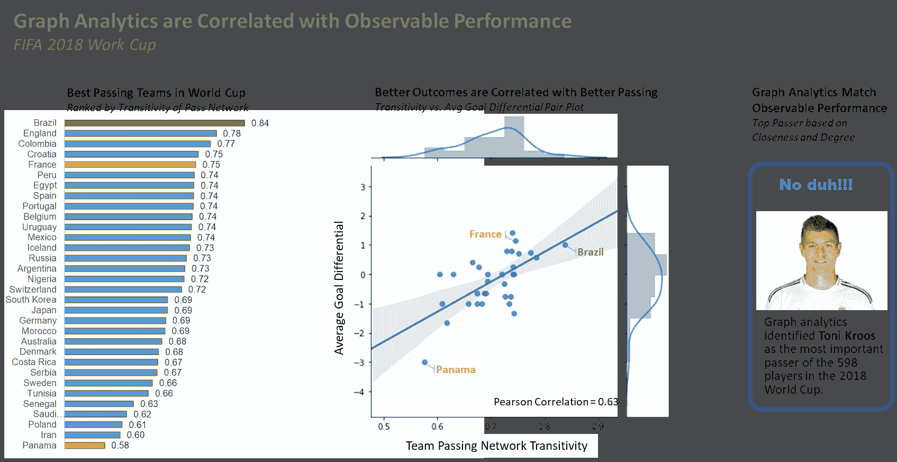

# 如何使用图论来侦察足球

> 原文：[`www.kdnuggets.com/2022/11/graph-theory-scout-soccer.html`](https://www.kdnuggets.com/2022/11/graph-theory-scout-soccer.html)

并非所有网络都是社交网络！图论在社交网络兴起时展现了它的威力。但它对体育分析能做些什么呢？如果我们将足球传球建模为一个网络，会怎么样？我们能学到哪个队更有可能获胜吗？我们能识别出对方队伍中需要施加压力的关键球员吗？我们能找到改善我们球队表现的机会吗？

为了了解，我们可以使用 Statsbomb API 获取 2018 年世界杯每次传球的免费数据。

* * *

## 我们的三大课程推荐

 1\. [谷歌网络安全证书](https://www.kdnuggets.com/google-cybersecurity) - 快速进入网络安全职业生涯。

 2\. [谷歌数据分析专业证书](https://www.kdnuggets.com/google-data-analytics) - 提升你的数据分析水平

 3\. [谷歌 IT 支持专业证书](https://www.kdnuggets.com/google-itsupport) - 支持你所在组织的 IT 工作

* * *

# 什么是足球的图论？

“网络”是数据科学所称的图的日常用词。在分析中，图是一种正式表示一组互联对象的方式。这一概念源自数学，图被定义为包含一组节点和一组边的有序对。

使用实例可以让术语更易于理解。让我们看看一个足球传球的图示可能是什么样的：

对我们来说，团队传球图是 2018 年世界杯中某支球队所有比赛的这些属性的组合。

现在让我们看看开箱即用的图形分析结果。这些是我们可以用来调查特定球队或球员传球网络属性的常见指标：

特征向量（EV）中心性需要额外的解释。它涉及到并非所有节点都是相同的概念。它根据每个节点的相对影响力来加权。想象一个社交网络，你与金·卡戴珊有可靠的联系。

# 方法

该项目使用 Python 和 Google Colaboratory 进行编码，并在 GitHub 上提供。工作流程非常简单：

使用 Statsbomb API 加载 2018 年世界杯的事件数据。筛选数据，只保留传球事件。然后使用在常规比赛中观察到的 34,580 次传球，为 32 支球队创建有向加权图。这一数据不包括 28,292 次在界外球、开场、角球等情况中的传球。

# 发现：图形分析与表现相关

使用 NetworkX 库中的“非传统”方法，我们计算了每个球队和球员的基本图形分析。让我们看一些发现：

上面的团队分析中突出了三支球队。巴西因为他们在纸面上获胜。他们在传球指标方面表现最好。巴拿马则处于另一端的谱系。法国则因为他们在关键时刻获胜而被突出显示。

关键的收获是***高通过网络传递性并不保证赢得世界杯，但它是进入半决赛的前提。*** 这就像比利·比恩在《点球成金》中所说的，*“我的方法在季后赛中不起作用。我的工作是把我们带到他妈的季后赛。之后发生的事情就是运气。”*

我们还评估了 598 名球员的个人传球网络指标。托尼·克罗斯在接近中心性和度数上表现最为突出。为了验证这是否与可观察的证据一致，我们可以在 YouTube 上搜索“托尼·克罗斯传球”。这会得到 6,240 个视频结果，标题包括：“传球之王”，“狙击手准确长传”，“没有人像托尼·克罗斯那样传球！”和“传球艺术”。

# 极端情况下的球队分析比较：巴西和巴拿马

现在让我们对比两支球队的极端情况。巴西在通过网络传递性方面表现突出，这是一种衡量每个三人小组之间联系紧密程度的指标。我们将与另一端的巴拿马进行对比。

我们可以在 y 轴上绘制每个球员对球队传球网络的影响。这是基于球员在比赛中的特征向量中心性。然后使用 x 轴绘制球员的平均下场传球距离。这是我们对两队的比较：

一开始我们就看到，巴西球员相对于巴拿马更加紧密地分布。巴西队利用更短的传球，并且最具影响力的传球者和最不具影响力的传球者之间差异较小。正如我们所预期的，防守后卫（浅色节点）往往在图表的右侧，传球距离较远。

对于巴西队的侦察报告可能建议试图扰乱内马尔，他是球队传球网络中最具影响力的球员。但这个图表表明，这可能无效，因为与其他队员之间没有显著的差距。然而，我们确实看到内马尔与库蒂尼奥之间存在较强的联系。这表明，阻碍这两名球员之间的传球通道可能会有所帮助。

相比之下，巴拿马的侦察报告突出了右中场戈多伊是巴拿马传球网络中最具影响力的球员。对戈多伊施加更大的压力可能对球队产生干扰。

# 结论

作为概念验证，我们看到图分析在足球中可以用于识别关键球员，并提供有关传球风格的定量测量，包括整个球队和单个球员。

包含数据访问的完整代码库可以在此处获取： [`github.com/FauxGrit/Soccer-Graph-Analytics`](https://github.com/FauxGrit/Soccer-Graph-Analytics)

## 参考文献

[1] John Laschober 和 Amanda Harsy. “足球传球网络分析。” 第 1 卷第 1 期 (2020): 数学与体育。

[2] Javier M. Buldú, Javier Busquets, Johann H. Martínez, José L. Herrera-Diestra, Ignacio Echegoyen, Javier Galeano 和 Jordi Luque. “利用网络科学分析足球传球网络：动态、空间、时间及游戏的多层次特性。” 2018 年 10 月: 心理学前沿。

[3] Arriaza, Enrique & Martin-Gonzalez, Juan & Zuniga, Marcos & Flores, Josh & Saa, Y. & García-Manso, J.M.. (2017). “将图和复杂网络应用于足球指标解释。人类运动科学。” 57\. 10.1016/j.humov.2017.08.022。

[4] Benito Santos A, Theron R, Losada A, Sampaio JE, Lago-Peñas C. “基于数据的足球视觉表现分析：一个探索性原型。” Front Psychol. 2018 年 12 月 5 日;9:2416\. doi: 10.3389/fpsyg.2018.02416\. PMID: 30568611; PMCID: PMC6290627。

[5] Brandt, Markus 和 Ulf Brefeld. “基于图的团队互动分析方法：以足球为例。” MLSA@PKDD/ECML (2015)。

**[Matt Semrad](https://www.linkedin.com/in/mattsemrad)** 是一位拥有超过 20 年经验的分析领导者，专注于在高速增长的技术公司中建立组织能力。

### 了解更多相关话题

+   [从理论到实践：构建 k-最近邻分类器](https://www.kdnuggets.com/2023/06/theory-practice-building-knearest-neighbors-classifier.html)

+   [数据可视化：理论与技术](https://www.kdnuggets.com/data-visualization-theory-and-techniques)

+   [数据科学中的统计学：理论与概述](https://www.kdnuggets.com/statistics-in-data-science-theory-and-overview)

+   [理解监督学习：理论与概述](https://www.kdnuggets.com/understanding-supervised-learning-theory-and-overview)

+   [机器学习评估指标：理论与概述](https://www.kdnuggets.com/machine-learning-evaluation-metrics-theory-and-overview)

+   [关于可信赖图神经网络的综合调查：…](https://www.kdnuggets.com/2022/05/comprehensive-survey-trustworthy-graph-neural-networks-privacy-robustness-fairness-explainability.html)
