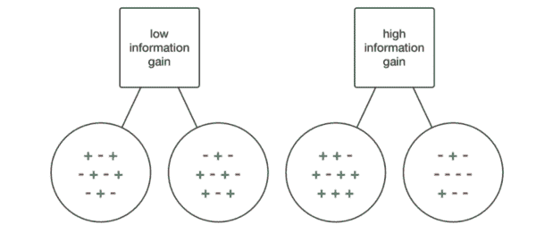

# 机器学习和数据科学的决策树指南

> 原文：[`www.kdnuggets.com/2018/12/guide-decision-trees-machine-learning-data-science.html`](https://www.kdnuggets.com/2018/12/guide-decision-trees-machine-learning-data-science.html)

 评论

**由[George Seif](https://towardsdatascience.com/@george.seif94)提供，人工智能/机器学习工程师**

决策树是一类非常强大的机器学习模型，能够在许多任务中实现高准确性，同时具有很高的可解释性。在机器学习模型领域，决策树的特别之处在于其信息表示的清晰性。决策树通过训练学到的“知识”直接形成了一个层级结构。这个结构以一种易于理解的方式呈现知识，即使是非专家也能轻松理解。

* * *

## 我们的前三大课程推荐

 1\. [谷歌网络安全证书](https://www.kdnuggets.com/google-cybersecurity) - 快速进入网络安全职业生涯。

 2\. [谷歌数据分析专业证书](https://www.kdnuggets.com/google-data-analytics) - 提升你的数据分析技能

 3\. [谷歌 IT 支持专业证书](https://www.kdnuggets.com/google-itsupport) - 支持你的组织的 IT 工作

* * *

### 现实生活中的决策树

你可能在自己的生活中使用过决策树来做出决策。例如，关于你这个周末应该做什么活动的*决定*。这可能取决于你是否想和朋友出去，还是想一个人度过周末；在这两种情况下，你的决定还取决于天气。如果天气晴朗且你的朋友有空，你可能会想去踢足球。如果下雨了，你就会去看电影。如果你的朋友根本没有出现，那么不管天气如何，你都会喜欢玩视频游戏！

这是一个*现实生活中的决策树*的清晰示例。我们构建了一棵树来建模一系列**顺序的、层级的决策**，最终得出一些最终结果。注意，我们还选择了相当“高层次”的决策，以便保持树的简洁。例如，如果我们为天气设定*许多*可能的选项，如 25 度晴天、25 度雨天、26 度晴天、26 度雨天、27 度晴天……等等，我们的树将会非常庞大！**确切**的温度实际上并不太重要，我们只是想知道是否可以在外面活动。

机器学习中的决策树概念是相同的。我们想要建立一个具有一组层次决策的树，最终给出一个结果，即我们的分类或回归预测。决策将被选择，以使树尽可能小，同时目标是实现高分类/回归准确度。

### 机器学习中的决策树

决策树模型的创建包括两个步骤：归纳和剪枝。归纳是指我们实际构建树，即根据数据设置所有的层次决策边界。由于训练决策树的特性，它们可能会严重过拟合。剪枝是从决策树中移除不必要的结构，从而有效降低复杂度，以应对过拟合，同时增加了使其更易于解释的好处。

**归纳**

从高层次来看，决策树的归纳过程包括 4 个主要步骤来构建树：

1.  从你的训练数据集开始，该数据集应包含一些特征变量和分类或回归输出。

1.  确定数据集中用于拆分数据的“最佳特征”；稍后会详细介绍我们如何定义“最佳特征”

1.  将数据拆分为包含该最佳特征的所有可能值的子集。这种拆分基本上定义了树上的一个节点，即每个节点是基于数据中的某个特征的分裂点。

1.  通过使用第 3 步创建的数据子集递归生成新的树节点。我们不断分裂，直到达到一个点，在这个点上我们通过某种度量优化了最大准确度，同时最小化了分裂/节点的数量。

第一步很简单，只需获取你的数据集！

对于第 2 步，选择使用哪个特征和具体的分裂通常使用贪婪算法来最小化成本函数。如果我们稍微考虑一下，构建决策树时进行的分裂等同于划分特征空间。我们将迭代尝试不同的分裂点，然后在最后选择成本最低的一个。当然，我们可以做一些聪明的事情，比如仅在数据集的值范围内进行分裂。这将避免浪费计算资源在测试明显不佳的分裂点上。

对于回归树，我们可以使用简单的平方误差作为我们的成本函数：

其中 Y 是我们的真实值，Y-hat 是我们的预测值；我们对数据集中的所有样本求和，以获取总误差。对于分类，我们使用 *基尼指数函数：*

其中 pk 是特定预测节点中类别 k 的训练实例比例。一个节点*理想情况下*应该有零误差值，这意味着每个分割在 100% 的时间内输出单一类别。这正是我们想要的，因为这样我们一旦到达特定的决策节点，就能知道无论我们在决策边界的哪一侧，我们的输出将是什么。

这种在数据集中每个分割中只有一个类别的概念被称为*信息增益*。请查看下面的示例。

如果我们选择的分割使得每个输出根据输入数据具有类别混合，那么我们实际上并没有*获得*任何信息；我们并不清楚某个特定节点，即特征，是否对分类数据有影响！另一方面，如果我们的分割在每个输出中具有较高的每个类别百分比，那么我们就*获得了*信息，即在特定特征变量上的这种分割方式能给我们特定的输出！

当然，我们可以继续分割，分割，再分割，直到我们的树有成千上万的分支……但这并不是一个好主意！我们的决策树会变得巨大、缓慢，并且过度拟合训练数据集。因此，我们将设置一些预定义的停止准则来停止树的构建。

最常见的停止方法是使用分配给每个叶节点的训练示例的最小计数。如果计数低于某个最小值，则不接受该分割，该节点被视为最终叶节点。如果所有叶节点都变为最终节点，则训练停止。较小的最小计数会给你更精细的分割和潜在的更多信息，但也容易对训练数据发生过拟合。最小计数过大可能会过早停止。因此，最小值通常基于数据集设置，取决于每个类别中预期的示例数量。

**剪枝**

由于训练决策树的性质，它们可能容易发生严重的过拟合。设置每个节点的最小实例数值可能会很具挑战性。大多数情况下，我们可能会选择一个安全的做法，使最小值非常小，导致有很多分割和一个非常大且复杂的树。关键是许多这些分割最终会变得冗余，并且对提高模型的准确性没有帮助。

树剪枝是一种利用这种分割冗余的技术来移除，即*剪枝*，树中不必要的分割。从高层次来看，剪枝将部分树的严格和僵化的决策边界压缩成更平滑、泛化更好的边界，从而有效地减少树的复杂性。决策树的复杂性定义为树中的分割数量。

一个简单但非常有效的修剪方法是检查树中的每个节点，并评估移除该节点对成本函数的影响。如果变化不大，那么就进行修剪吧！

### Scikit Learn 中的一个示例

Scikit Learn 中的分类和回归决策树都非常易于使用，且自带一个类！我们首先加载数据集并初始化我们的分类决策树。然后，运行训练就是一个简单的单行命令！

Scikit Learn 还允许我们使用 graphviz 库来可视化我们的树。它提供了一些选项，可以帮助可视化模型学习到的决策节点和分裂，这对于理解整个过程非常有用！下面我们将根据特征名称对节点进行着色，并显示每个节点的类别和特征信息。

在 Scikit Learn 中，你也可以为决策树模型设置几个参数。以下是一些有趣的参数，可以尝试调整以获得更好的结果：

+   **max_depth:** 决策树的最大深度，我们将在此处停止分裂节点。这类似于控制深度神经网络中的最大层数。较低的深度会使模型更快，但不够准确；较高的深度可以提高准确性，但可能会导致过拟合且可能较慢。

+   **min_samples_split:** 节点分裂所需的最小样本数。我们在上面讨论过决策树的这一方面，以及如何将其设置为更高的值以帮助减轻过拟合。

+   **max_features:** 查找最佳分裂时考虑的特征数量。更多的特征意味着可能有更好的结果，但训练时间也会更长。

+   **min_impurity_split:** 决策树生长过程中的早期停止阈值。节点会在其不纯度高于阈值时进行分裂。这可以用来权衡抗击过拟合（高值，小树）与高准确率（低值，大树）之间的关系。

+   **presort:** 是否预先排序数据以加速在拟合过程中找到最佳分裂。如果我们在每个特征上预先对数据进行排序，我们的训练算法将更容易找到好的分裂值。

### 实际应用决策树的提示

这里列出了一些决策树的优缺点，帮助你决定它是否适合你的问题，以及一些有效应用它们的提示：

**优点**

+   **易于理解和解释。** 在每个节点，我们都能够*准确*地看到我们的模型正在做出什么决策。在实践中，我们能够完全理解准确率和错误来自哪里，模型适合什么类型的数据，以及特征值如何影响输出。Scikit Learn 的可视化工具是可视化和理解决策树的一个极佳选择。

+   **需要很少的数据准备。**许多机器学习模型可能需要大量的数据预处理，如标准化，还可能需要复杂的正则化方案。而决策树在调整少量参数后，开箱即用效果相当好。

+   **使用树进行推断的成本在于训练树时数据点的数量是对数级别的。**这是一大优势，因为这意味着增加更多的数据不会对我们的推断速度产生巨大的影响。

**缺点**

+   由于决策树训练的性质，过拟合很常见。通常建议进行某种类型的降维，例如[PCA](https://towardsdatascience.com/principal-component-analysis-your-tutorial-and-code-9719d3d3f376)，以避免树需要在过多特征上学习分裂。

+   与过拟合情况类似，决策树也容易对数据集中占多数的类别产生偏倚。进行某种形式的[class balancing](https://towardsdatascience.com/handling-imbalanced-datasets-in-deep-learning-f48407a0e758)，如类别权重、采样或专业损失函数，总是个好主意。

### 喜欢学习吗？

在[推特](https://twitter.com/GeorgeSeif94)上关注我，我会发布最新最酷的人工智能、技术和科学内容！

**简介：[George Seif](https://towardsdatascience.com/@george.seif94)** 是认证极客及人工智能/机器学习工程师。

[原文](https://towardsdatascience.com/a-guide-to-decision-trees-for-machine-learning-and-data-science-fe2607241956)。经授权转载。

**相关：**

+   Python 中的 5 种快速且简单的数据可视化方法及代码

+   数据科学家必须了解的 5 种聚类算法

+   使用 Python 提升数据预处理速度 2 到 6 倍

### 更多相关话题

+   [停止学习数据科学去寻找目标，并寻找目标来……](https://www.kdnuggets.com/2021/12/stop-learning-data-science-find-purpose.html)

+   [学习数据科学统计学的顶级资源](https://www.kdnuggets.com/2021/12/springboard-top-resources-learn-data-science-statistics.html)

+   [成功数据科学家的 5 个特征](https://www.kdnuggets.com/2021/12/5-characteristics-successful-data-scientist.html)

+   [每位数据科学家都应该知道的三个 R 库（即使你使用 Python）](https://www.kdnuggets.com/2021/12/three-r-libraries-every-data-scientist-know-even-python.html)

+   [分析一笔 90 亿美元的 AI 失败](https://www.kdnuggets.com/2021/12/9b-ai-failure-examined.html)

+   [是什么让 Python 成为初创公司的理想编程语言](https://www.kdnuggets.com/2021/12/makes-python-ideal-programming-language-startups.html)
