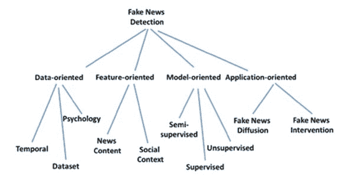

# 假新闻检测快速指南

> 原文：[`www.kdnuggets.com/2017/10/guide-fake-news-detection-social-media.html`](https://www.kdnuggets.com/2017/10/guide-fake-news-detection-social-media.html)

**作者：[Kai Shu](http://www.public.asu.edu/~skai2/) 和 [Huan Liu](http://www.public.asu.edu/~huanliu/)，亚利桑那州立大学**

社交媒体作为新闻消费的工具是把双刃剑。一方面，其低成本、易于访问以及信息的快速传播使得用户能够消费和分享新闻。另一方面，它也可能使“假新闻”迅速传播，即那些包含故意虚假信息的低质量新闻。假新闻的快速传播可能对个人和社会造成灾难性的影响。例如，[在美国 2016 年总统选举期间](https://www.buzzfeed.com/craigsilverman/viral-fake-election-news-outperformed-real-news-on-facebook?utm&utm_term=.xcGkVBNoxk#.wwwqW6rpmq)，最受欢迎的假新闻在 Facebook 上的传播比最受欢迎的真实主流新闻要广泛。因此，社交媒体上的假新闻检测引起了越来越多的研究者和政治家的关注。

社交媒体上的假新闻检测具有独特的特征，并提出了新的挑战。首先，假新闻是故意编写的，目的是误导读者相信虚假信息，这使得基于新闻内容的检测变得困难。因此，我们需要包括辅助信息，如用户在社交媒体上的互动，以帮助将其与真实新闻区分开来。其次，利用这些辅助信息本身并非易事，因为用户与假新闻的社交互动产生的数据是庞大的、不完整的、无结构的且充满噪音的。本指南基于近期的[调查](http://dl.acm.org/citation.cfm?id=3137600) [1]，介绍了社交媒体上假新闻检测的问题、最新的研究成果、数据集以及进一步的方向。接下来，我们将重点介绍本次调查的主要观点。

### 特征描述与检测

图 1 是对社交媒体上假新闻检测的概述，包括两个阶段：特征化和检测。假新闻本身并不是一个新问题，媒体生态从报纸到广播/电视，最近到在线新闻和社交媒体，随着时间的推移发生了变化。从心理学和社会理论的角度描述假新闻对传统媒体的影响。例如，两个主要的心理因素使消费者自然容易受到假新闻的影响：（i）天真现实主义：消费者倾向于相信他们对现实的感知是唯一准确的观点。（ii）确认偏误：消费者更愿意接受确认他们现有观点的信息。另一个例子，社会认同理论和规范影响理论描述了对社会接受的偏好对个人身份至关重要，使人们选择“社会安全”的新闻消费选项，即使所分享的新闻是假新闻。

社交媒体上的假新闻具有独特的特征。例如，恶意账户可以轻松且快速地创建以促进假新闻的传播，例如社交机器人、半机器人用户或网络喷子。此外，用户由于社交媒体主页上新闻源的展示方式而被选择性地接触到某些类型的新闻。因此，社交媒体上的用户往往形成包含志同道合的人的群体，他们的观点容易极端化，形成回音室效应。

**图 1\. 社交媒体上的假新闻检测：从特征化到检测**

上述理论在指导假新闻检测的研究中具有重要价值。现有的假新闻检测算法通常可以分为（i）基于新闻内容和（ii）基于社交背景两类。

+   基于新闻内容的方法侧重于提取假新闻内容中的各种特征，包括基于知识和基于风格的特征。由于假新闻试图传播虚假的声明，基于知识的方法旨在利用外部来源对新闻内容中的声明进行事实核查。此外，假新闻发布者通常有恶意意图传播扭曲和误导性的内容，需要特定的写作风格来吸引和说服广泛的消费者，这在真实新闻文章中并不常见。基于风格的方法试图通过捕捉写作风格中的操控者来检测假新闻。

+   基于社交背景的方法旨在利用用户的社交互动作为辅助信息来帮助检测假新闻。基于立场的方法利用用户对相关帖子内容的观点来推断原始新闻文章的真实性。此外，基于传播的方法推理相关社交媒体帖子的关系，通过在用户、帖子和新闻之间传播可信度值来指导可信度分数的学习。一条新闻的真实性是通过相关社交媒体帖子的可信度值进行聚合的。

### 数据集

尽管可以从不同来源收集在线新闻，但手动确定新闻的真实性是一项具有挑战性的任务，通常需要具有领域专长的注释员仔细分析声明和附加证据、背景以及来自权威来源的报告。由于这些挑战，现有的假新闻公共数据集相对有限。为了促进假新闻检测的研究，本调查[1]提供了一个可用的数据集，名为[FakeNewsNet](https://github.com/KaiDMML/FakeNewsNet)，其中包括具有可靠真实标签的新闻内容和社交背景特征。

### 有前景的未来研究

假新闻检测是社交媒体上一个新兴的研究领域。调查[1] 从数据挖掘的角度讨论了相关研究领域、未解决的问题以及未来的研究方向。如图 2 所示，研究方向从四个角度进行了概述：数据导向、特征导向、模型导向和应用导向。

**图 2\. 假新闻检测的未来方向和未解决的问题**

+   数据导向：关注假新闻数据的不同方面，如基准数据收集、假新闻的心理验证和早期假新闻检测。

+   特征导向：旨在探索从多个数据源（如新闻内容和社交背景）中检测假新闻的有效特征。

+   模型导向：为构建更实用和有效的假新闻检测模型打开了大门，包括监督、半监督和无监督模型。

+   应用导向：涵盖了超越假新闻检测的研究，如假新闻扩散和干预。

[1] Shu, K., Sliva, A., Wang, S., Tang, J. 和 Liu, H., 2017\. [社交媒体上的假新闻检测：数据挖掘视角。ACM SIGKDD Explorations Newsletter, 19(1), 第 22-36 页。](http://dl.acm.org/citation.cfm?id=3137600)

**简介：[Kai Shu](http://www.public.asu.edu/~skai2/)** 是亚利桑那州立大学的研究生助理，他的研究兴趣包括社交媒体挖掘，尤其是信息可信度、假新闻和机器学习。[Huan Liu](http://www.public.asu.edu/~huanliu/) 是亚利桑那州立大学伊拉·A·富尔顿工程学院计算机、信息与决策系统工程学院的教授。

**相关：**

+   数据湖是假新闻吗？

+   机器学习以 88%的准确率发现“假新闻”

+   这里越来越热：数据科学与假新闻的较量

* * *

## 我们的三大课程推荐

 1\. [谷歌网络安全证书](https://www.kdnuggets.com/google-cybersecurity) - 快速进入网络安全职业生涯。

 2\. [谷歌数据分析专业证书](https://www.kdnuggets.com/google-data-analytics) - 提升你的数据分析技能

 3\. [谷歌 IT 支持专业证书](https://www.kdnuggets.com/google-itsupport) - 支持你所在组织的 IT 工作

* * *

### 更多相关主题

+   [快速指南：寻找合适的标注人才](https://www.kdnuggets.com/2022/04/quick-guide-find-right-minds-annotation.html)

+   [假装成功：生成逼真的合成客户数据集](https://www.kdnuggets.com/2022/01/fake-realistic-synthetic-customer-datasets-projects.html)

+   [识别假数据科学家的 20 个问题（附答案）：ChatGPT…](https://www.kdnuggets.com/2023/01/20-questions-detect-fake-data-scientists-chatgpt-1.html)

+   [识别假数据科学家的 20 个问题（附答案）：ChatGPT…](https://www.kdnuggets.com/2023/02/20-questions-detect-fake-data-scientists-chatgpt-2.html)

+   [学习 SAS 的快速数据科学技巧和窍门](https://www.kdnuggets.com/2022/05/sas-quick-data-science-tips-tricks-learn.html)

+   [7 个用于快速数据可视化的 Pandas 绘图函数](https://www.kdnuggets.com/7-pandas-plotting-functions-for-quick-data-visualization)
