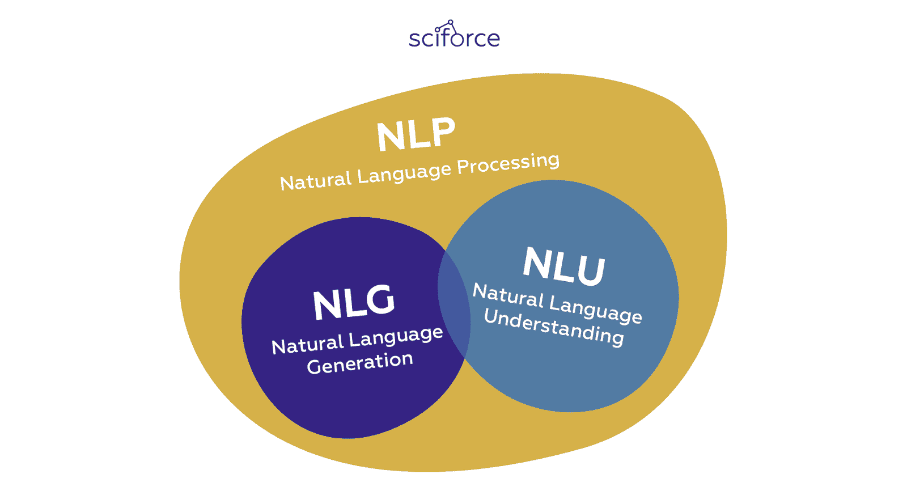
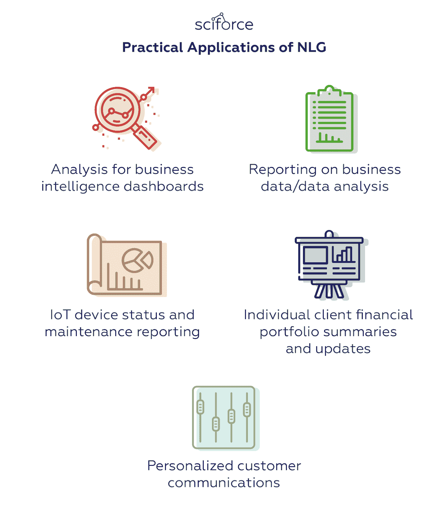
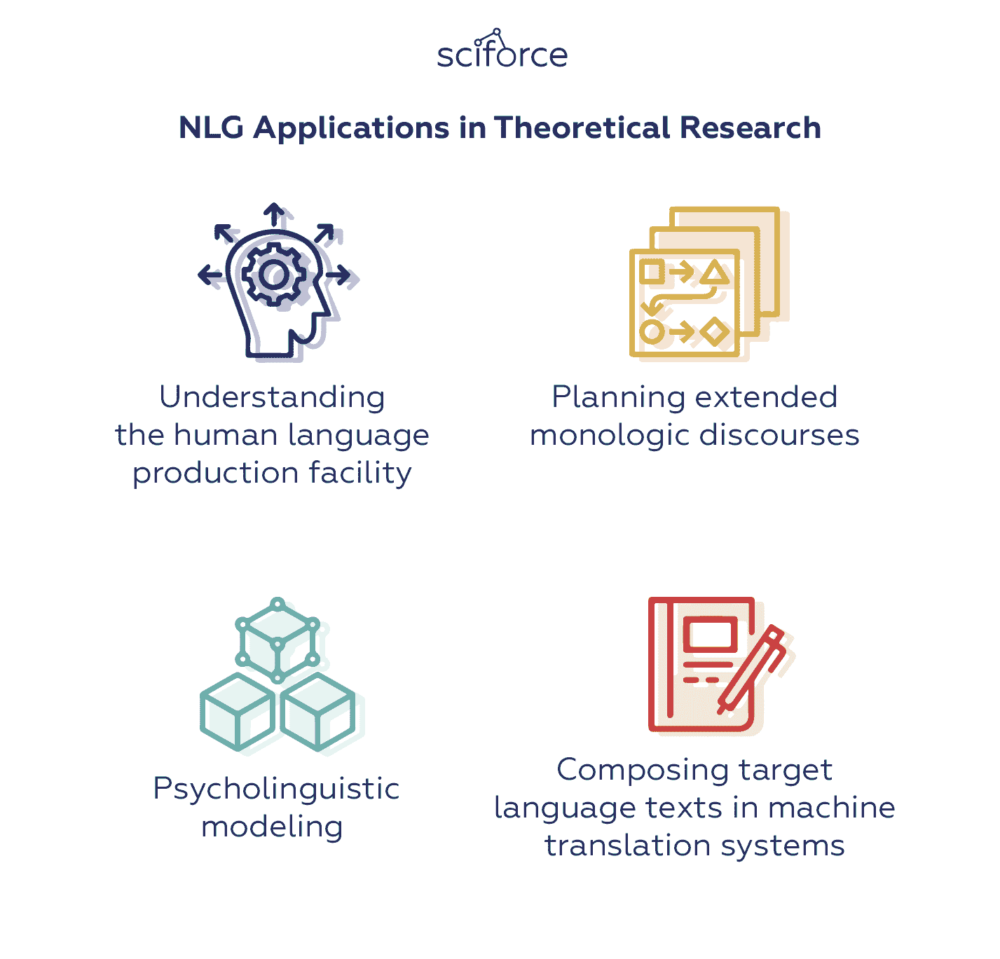
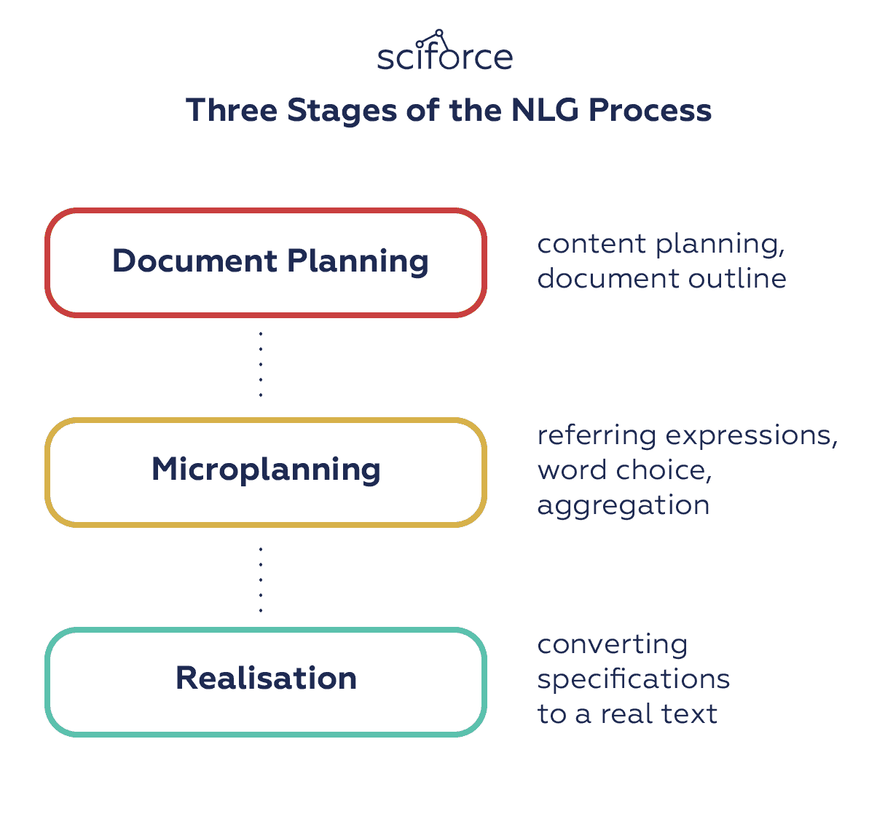
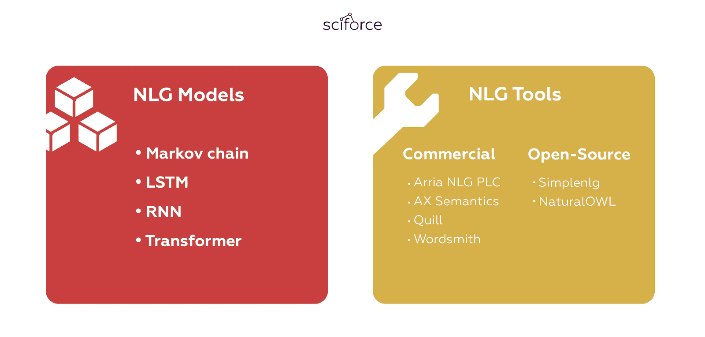

# 《自然语言生成综合指南》

> 原文：[`www.kdnuggets.com/2020/01/guide-natural-language-generation.html`](https://www.kdnuggets.com/2020/01/guide-natural-language-generation.html)

评论

**由 [Sciforce](https://sciforce.solutions) 提供。**

只要人工智能帮助我们从自然语言中获得更多信息，我们就会看到更多在 AI 和语言学交集处出现的任务和领域。在我们之前的一篇文章中，我们讨论了[Natural Language Processing 和 Natural Language Understanding 的区别](https://medium.com/sciforce/nlp-vs-nlu-from-understanding-a-language-to-its-processing-1bf1f62453c1)。然而，这两个领域都有自然语言作为输入。同时，与计算机建立双向通信的需求导致了处理生成（准）自然语言的任务的一个独立子类别的出现。这个子类别被称为自然语言生成，将成为本博客文章的重点。

### 什么是 NLG？

自然语言生成，如[《人工智能：自然语言处理基础》](http://www.techprenuer.com/entrepreneur/artificial-intelligence-natural-language-processing-fundamentals/)所定义，是“以自然语言形式生成有意义的短语和句子的过程。”本质上，它以每秒数千页的速度自动生成描述、总结或解释输入结构化数据的叙述。

然而，虽然 NLG 软件可以写作，但它不能阅读。阅读自然语言并将其非结构化数据转化为计算机可理解的结构化数据的 NLP 部分被称为自然语言理解。

一般而言，NLG（自然语言生成）和 NLU（自然语言理解）是更广泛的 NLP 领域的子部分，该领域包括所有解释或生成自然语言的软件，无论是口头还是书面形式：

+   NLU 负责基于语法、上下文以及意图和实体的理解数据。

+   NLP 将文本转换为结构化数据。

+   NLG 基于结构化数据生成文本。

### NLG 的主要应用

NLG 使数据具有普遍可理解性，使得编写数据驱动的财务报告、产品描述、会议备忘录等变得更加容易和快速。理想情况下，它可以将总结数据的负担从分析师那里转移到自动编写针对受众的报告上。因此，NLG 当前的主要实际应用与写作分析或向客户传达必要信息相关：

*NLG 的实际应用。*

与此同时，NLG 还有更多的理论应用，使其不仅在计算机科学与工程领域，而且在认知科学和心理语言学中成为有价值的工具。这些包括：

*NLG 在理论研究中的应用。*

### NLG 设计与架构的演变

在模仿人类语言的尝试中，NLG 系统使用了不同的方法和技巧来根据观众、背景和叙述目的调整其写作风格、语气和结构。在 2000 年，[Reiter 和 Dale](https://pdfs.semanticscholar.org/728e/18fbf00f5a80e9a070db4f4416d66c7b28f4.pdf) 设计了一个 NLG 架构，将 NLG 过程划分为三个阶段：

1.  **文档规划**：决定要表达的内容，并创建一个概述信息结构的抽象文档。

1.  **微观规划**：生成引用表达、词汇选择和聚合，以充实文档规格。

1.  **实现**：将抽象文档规格转换为真实文本，使用有关语法、形态学等的领域知识。

*NLG 过程的三个阶段。*

这个流程展示了自然语言生成的里程碑。然而，具体步骤和方法，以及所使用的模型，随着技术的发展可能会有显著变化。

语言生成有两种主要方法：使用模板和动态创建文档。虽然只有后者被认为是“真实”的 NLG，但从基础的简单模板到最先进技术的过程中经历了漫长而多阶段的演变，每一种新方法都扩展了功能并增加了语言能力：

简单的填空方法

最古老的方法之一是简单的填空模板系统。在结构预定义且只需少量数据填充的文本中，这种方法可以自动从电子表格行、数据库表条目等中填充这些空白。原则上，你可以变更文本的某些方面：例如，你可以决定是拼写数字还是保留原样，这种方法的使用相当有限，不被认为是“真实”的 NLG。

**脚本或规则生成文本**

基础的填空系统通过脚本语言或使用业务规则扩展了通用编程构造。脚本方法，如[使用网页模板语言](https://en.wikipedia.org/wiki/Web_template_system)，将模板嵌入通用脚本语言中，因此它允许复杂的条件、循环、代码库访问等。业务规则方法，由大多数[文档编排](https://en.wikipedia.org/wiki/Document_composition)工具采用，工作原理类似，但侧重于编写业务规则而非脚本。尽管比简单的填空更强大，这些系统仍然缺乏语言能力，无法可靠地生成复杂、高质量的文本。

**词级语法功能**

模板系统的逻辑发展是添加词级语法功能，以处理形态学、形态音系学和正字法以及处理可能的例外。这些功能使生成语法正确的文本和编写复杂的模板系统变得更加容易。

**动态句子生成**

最终，从基于模板的方法转向动态自然语言生成（NLG），这种方法从句子的意义表示或期望的语言结构动态创建句子。动态创建意味着系统能够在不需要开发人员为每个边界情况显式编写代码的情况下，在不寻常的情况下做出合理的处理。它还允许系统在参考、聚合、排序和连接词等方面以多种方式进行语言上的“优化”。

**动态文档创建**

虽然动态句子生成在某种“微观层面”上工作，但“宏观写作”任务生成与读者相关且有用的文档，并且在叙事上结构良好。如何完成这项任务取决于文本的目标。例如，一篇说服性写作可能基于论证和行为变化的模型，以模仿人类修辞；而一篇总结数据以供商业智能使用的文本可能基于对影响决策的关键因素的分析。

### NLG 模型

即使在 NLG 从模板转向动态句子生成后，这项技术仍然经历了多年的实验才取得令人满意的结果。作为自然语言处理（NLP）的一部分，更多地说作为人工智能（AI）的一部分，自然语言生成依赖于一系列算法，这些算法解决了生成类人文本的某些问题：

**马尔可夫链**

马尔可夫链是用于语言生成的第一个算法之一。该模型通过使用当前词并考虑每个独特词之间的关系来预测句子中的下一个词，从而计算下一个词的概率。事实上，你在早期版本的智能手机键盘上见过它们，当时它们用于生成下一个词的建议。

**递归神经网络（RNN）**

神经网络是尝试模拟人脑运作的模型。RNN 将序列中的每个项通过前馈网络，并使用模型的输出作为下一个序列项的输入，从而允许将前一步的信息存储起来。在每次迭代中，模型将之前遇到的单词存储在其记忆中，并计算下一个单词的概率。对于字典中的每个单词，模型根据前一个单词分配一个概率，选择概率最高的单词并将其存储在记忆中。RNN 的“记忆”使得该模型非常适合语言生成，因为它可以随时记住对话的背景。然而，随着序列长度的增加，RNN 无法存储句子中远处遇到的单词，并且仅根据最近的单词进行预测。由于这一限制，RNN 无法生成连贯的长句子。

**LSTM**

为了解决长程依赖问题，提出了一种名为长短期记忆（LSTM）的 RNN 变体。虽然与 RNN 相似，但 LSTM 模型包括一个四层神经网络。LSTM 包含四个部分：单元、输入门、输出门和遗忘门。这些允许 RNN 通过调整单元的信息流，在任何时间间隔记住或忘记单词。当遇到一个时期时，遗忘门识别到句子的上下文可能发生变化，可以忽略当前单元状态信息。这使得网络能够有选择地跟踪相关信息，同时最小化梯度消失问题，从而使模型能够在更长的时间内记住信息。

尽管如此，由于 LSTM 的记忆容量受限于前一单元到当前单元的复杂序列路径，因此其容量仅限于几百个单词。这种复杂性也导致了高计算需求，使得 LSTM 难以训练或并行化。

**Transformer**

一个相对较新的模型在 2017 年的 Google 论文中首次提出 [“Attention is all you need”](https://papers.nips.cc/paper/7181-attention-is-all-you-need.pdf)，提出了一种称为“自注意力机制”的新方法。Transformer 由一个处理任意长度输入的编码器堆栈和另一组输出生成句子的解码器组成。与 LSTM 相比，Transformer 仅执行少量、恒定的步骤，同时应用直接模拟句子中所有单词之间关系的自注意力机制。与之前的模型不同，Transformer 使用上下文中所有单词的表示，而不必将所有信息压缩到单个固定长度的表示中，从而使系统能够处理更长的句子，而不会导致计算需求急剧增加。

语言生成的一个著名例子是 OpenAI 的 GPT-2 语言模型。该模型通过关注模型中之前见过的与预测下一个词相关的词来学习预测句子中的下一个词。谷歌的最新升级版 Transformers 双向编码器表示（BERT）为各种 NLP 任务提供了最先进的结果。

### NLG 工具

你可以看到，自然语言生成是一个复杂的任务，需要考虑语言的多个方面，包括结构、语法、词汇使用和感知。幸运的是，你可能不会从头开始构建整个 NLG 系统，因为市场上提供了多种现成的工具，包括商业和开源的。

**商业 NLG 工具**

[Arria NLG PLC](https://www.arria.com/) 被认为是全球 NLG 技术和工具的领导者之一，拥有最先进的 NLG 引擎和由 NLG 叙述生成的报告。该公司拥有可通过 Arria NLG 平台使用的专利 NLG 技术。

[AX Semantics:](https://cloud.ax-semantics.com/) 为超过 100 种语言提供电子商务、新闻和数据报告（例如 BI 或财务报告）的 NLG 服务。它是一个开发者友好的产品，利用 AI 和机器学习来训练平台的 NLP 引擎。

[Yseop](https://yseop.com/) 以其在移动、在线或面对面等平台上的智能客户体验而闻名。从 NLG 角度来看，它提供了可以在本地、云端或作为服务消费的 Compose，并且还提供了用于 Excel 和其他分析平台的插件 Savvy。

[Quill](https://narrativescience.com/Platform) 由 Narrative Science 提供，是一个由先进 NLG 技术驱动的 NLG 平台。Quill 通过开发故事、分析并提取所需数据，将数据转换为具有智能的人类叙述。

[Wordsmith](https://automatedinsights.com/wordsmith) 由 Automated Insights 提供，是一个主要在高级模板化方法领域工作的 NLG 引擎。它允许用户将数据转换为任何格式或规模的文本。Wordsmith 还提供了丰富的语言选项用于数据转换。

**开源 NLG 工具**

[Simplenlg](https://github.com/simplenlg/simplenlg) 可能是最广泛使用的开源实现工具，特别是被系统构建者使用。它是由 Arria 创始人编写的开源 Java API。它功能最少，但使用最简单且文档最完善。

[NaturalOWL](https://sourceforge.net/projects/naturalowl/) 是一个开源工具包，用于生成 OWL 类和个体的描述，以将 NLG 框架配置到特定需求，而无需进行大量编程。

### 结论

NLG 功能已成为分析平台试图实现数据分析民主化的事实选择，并帮助任何人理解他们的数据*。* 接近人类叙述的自然语言自动解释了那些可能在表格、图表和图形中丢失的见解，并在数据发现过程中充当助手。此外，NLG 与 NLP 结合是聊天机器人和其他自动化聊天及助手的核心，提供日常支持。

随着自然语言生成（NLG）的不断发展，它将变得更加多样化，并在我们与计算机之间提供自然的有效沟通，这是许多科幻作家在他们的书中梦想的。

[原文](https://medium.com/sciforce/a-comprehensive-guide-to-natural-language-generation-dd63a4b6e548)。经许可转载。

**简介：** [SciForce](https://sciforce.solutions/) 是一家总部位于乌克兰的 IT 公司，专注于基于科学驱动的信息技术的软件解决方案开发。我们在许多关键的 AI 技术领域拥有广泛的专业知识，包括数据挖掘、数字信号处理、自然语言处理、机器学习、图像处理和计算机视觉。

**相关：**

+   [训练神经网络模仿洛夫克拉夫特的写作风格](https://www.kdnuggets.com/2019/07/training-neural-network-write-like-lovecraft.html)

+   [自然语言生成概述——NLG 是否值千言万语？](https://www.kdnuggets.com/2017/05/nlg-natural-language-generation-overview.html)

+   [自然语言处理（NLP）指南](https://www.kdnuggets.com/2019/05/guide-natural-language-processing-nlp.html)

### 更多相关主题

+   [检索增强生成：信息检索与…的结合](https://www.kdnuggets.com/retrieval-augmented-generation-where-information-retrieval-meets-text-generation)

+   [N-gram 语言建模在自然语言处理中的应用](https://www.kdnuggets.com/2022/06/ngram-language-modeling-natural-language-processing.html)

+   [探索 Zephyr 7B：最新大型语言模型的综合指南](https://www.kdnuggets.com/exploring-the-zephyr-7b-a-comprehensive-guide-to-the-latest-large-language-model)

+   [顶级自然语言处理库指南](https://www.kdnuggets.com/2023/04/guide-top-natural-language-processing-libraries.html)

+   [文本到视频生成：一步一步指南](https://www.kdnuggets.com/2023/08/text2video-generation-stepbystep-guide.html)

+   [掌握大型语言模型的全面资源列表](https://www.kdnuggets.com/a-comprehensive-list-of-resources-to-master-large-language-models)
