# 为 Android 准备 OpenCV 的指南

> 原文：[`www.kdnuggets.com/2020/10/guide-preparing-opencv-android.html`](https://www.kdnuggets.com/2020/10/guide-preparing-opencv-android.html)

评论

本教程指导 Android 开发人员为使用流行的 OpenCV（开源计算机视觉）库做准备。通过逐步指南，将该库导入 Android Studio（Android 的官方 IDE）。

安装和设置完成后，可以使用 OpenCV 执行其支持的任何操作，例如目标检测、分割、跟踪等。

* * *

## 我们的前三个课程推荐

 1\. [Google 网络安全证书](https://www.kdnuggets.com/google-cybersecurity) - 快速进入网络安全职业生涯

 2\. [Google 数据分析专业证书](https://www.kdnuggets.com/google-data-analytics) - 提升你的数据分析技能

 3\. [Google IT 支持专业证书](https://www.kdnuggets.com/google-itsupport) - 支持你的组织的 IT

* * *

在本教程的最后，将使用 OpenCV 对图像应用 Canny 滤镜。与此相关的 Android Studio 项目可以在 GitHub 上找到：

[**ahmedfgad/OpenCVAndroid**](https://github.com/ahmedfgad/OpenCVAndroid)

使用 OpenCV 在 Android 设备上。通过在 GitHub 上创建一个帐户来贡献 [ahmedfgad/OpenCVAndroid](https://github.com/ahmedfgad/OpenCVAndroid) 的开发。

### OpenCV 概述

OpenCV 是一个用于对图像执行复杂实时操作的视觉库。它是一个免费、开源的库，最初用 C++ 编写。它包括与 Python、Java 和 MATLAB 的接口。无需编写大量代码即可构建操作，OpenCV 已经支持使用简单的接口构建这样的操作，用户只需编写几行代码。

在讨论如何将 OpenCV 导入 Android 项目之前，首先从构建一个 Android 项目开始，确保 Android 开发环境按预期工作。

本教程将涵盖的要点如下：

+   构建一个 Android Studio 项目

+   运行项目

+   编辑项目以显示 Toast 消息

+   下载 OpenCV

+   在 Android Studio 中导入 OpenCV

+   修复可能的 Gradle 同步错误

+   将 OpenCV 作为依赖项添加

+   添加本地库

+   使用 OpenCV 进行图像滤波

+   概述

### 构建一个 Android Studio 项目

让我们来看看构建一个新的 Android Studio 项目的步骤。第一步是从**文件**菜单中创建一个新项目，如下图所示。

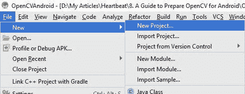

通过选择“**新建项目**”菜单项，将出现一个新窗口，要求输入一些细节（例如应用名称和项目目录）。本教程中将使用的应用名称是**OpenCVAndroid**。


点击**下一步**按钮后，会出现另一个窗口询问目标设备和最低 SDK。你可以选择环境中可用的一个 SDK。如果你想支持更多设备，可以降低最低 SDK。


点击**下一步**，会出现另一个窗口询问是否在项目中创建一个默认活动。有几个不同的选项。如果不创建任何活动，你可以选择左上角的选项“**添加无活动**”。

因为我们要构建一个 Android 应用程序，所以必须有一个 Activity，即使是空的。因此，我选择了“**空活动**”选项。请注意，这个活动并非完全空白，因为它包含一个覆盖整个屏幕的 TextView，稍后运行应用程序时我们会看到。


指定应用程序包含一个活动后，会出现另一个窗口询问**活动名称**。此名称被视为与该活动相关联的 Java 文件的类名。指定适当的名称后，点击**完成**以创建项目。

请注意，你可以勾选“**生成布局文件**”复选框来为活动创建一个布局。你可以选择勾选或取消勾选“向后兼容性”复选框。

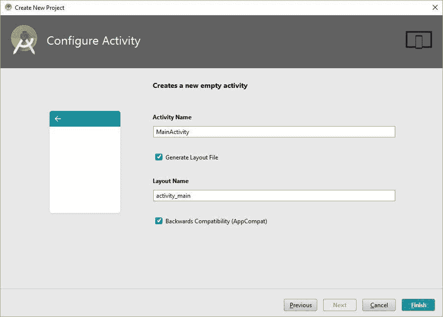

项目创建完成后，你可以选择 Android 项目视图，并会找到一个名为**MainActivity**的 Java 文件。这是一个 .java 扩展名的 Java 文件，但不仅仅在 Android 项目视图中显示。还有一个名为`activity_main.xml`的 XML 布局文件，如下图所示。

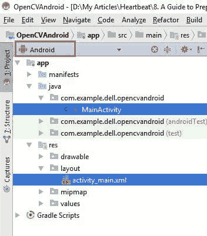

### 运行项目

在不讨论这些文件的实现的情况下，让我们运行项目以确保一切正常。要运行 Android Studio 项目，你需要一个模拟器（虚拟设备）或通过 USB 电缆连接的真实设备。

要运行项目，请从**运行**菜单中选择**运行 'app'**选项。会出现一个窗口询问是否使用模拟器或 USB 设备。我目前没有连接任何 USB 设备，因此选择了可用的模拟器。

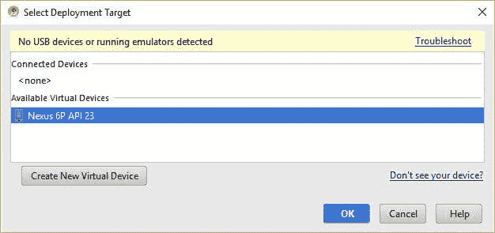

模拟器启动后，应用程序将自动安装并出现在应用程序列表中，如下所示。请注意，应用程序名称“**OpenCV Android**”是我们之前输入的。

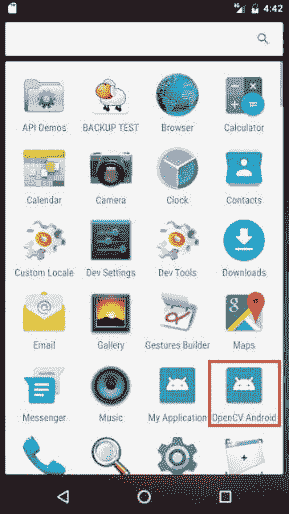

项目运行后，应用程序不仅会安装，还会自动启动。应用程序的界面如下所示。如前所述，活动布局仅包含一个显示“**Hello World!**”的 TextView。

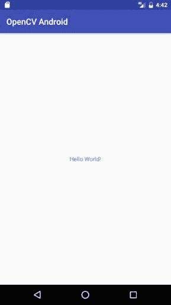

运行项目后，我们知道开发环境工作正常。在项目中导入 OpenCV 之前，最好先熟悉一下项目。因此，我们来查看 `MainActivity.java` 和 `activity_main.xml` 文件的内容，并进行一个简单的编辑。

> 想为你的应用带来新的突破吗？机器学习可以实现强大而高度个性化的移动体验。 [订阅 Fritz AI 新闻通讯以了解更多信息](https://www.fritz.ai/newsletter?utm_campaign=fritzai-newsletter-scale4&utm_source=heartbeat)。

### 编辑项目以显示 Toast 消息

MainActivity.java 文件的内容如下所示。活动名称为 MainActivity，继承自 AppCompatActivity 类。众所周知，Android 活动继承自 Activity 类，但在本项目中，它实际上继承自 AppCompatActivity，因为我们在创建项目时选择了“向后兼容性”选项。

该活动仅有 `onCreate()` 方法，它在活动创建时被调用。它只使用 `setContentView()` 方法来设置活动的 XML 布局，该方法在启动时呈现活动的 UI。

XML 布局的内容如下所示。它简单地创建了一个 `ConstraintLayout` 类型的布局，宽度和高度覆盖设备屏幕。它只有一个子视图，即在构建项目时指定的 `TextView`。`TextView` 的文本设置为“Hello World!”。

为了熟悉项目，我们来做一个简单的编辑，通过添加一个新的按钮视图，该视图在点击时显示 Toast 消息。添加按钮视图的编辑后的布局 XML 文件如下所示。按钮的文本设置为“**显示 Toast 消息**”。点击时，将调用一个名为 `displayToast()` 的回调方法。

`displayToast()` 方法在编辑过的活动 Java 文件中实现，如下所示。它使用 Toast 类来显示 Toast 消息。

再次运行项目并点击按钮时，消息将如下一图所示显示。通过这个步骤，我们确保项目运行正常，同时对主活动及其布局有了一些了解。现在，让我们开始导入 OpenCV 库。

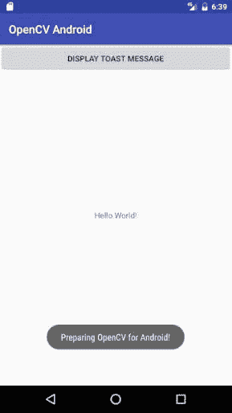

### 下载 OpenCV

下载 OpenCV 时，你可以使用这个链接 [`opencv.org/releases`](https://opencv.org/releases)，它列出了 OpenCV 的各个版本。在页面向下滚动，你可以找到本教程中使用的 OpenCV 3.4.4。如果最新的 4.1.0 版本对你来说是更好的选择，也可以下载。记得下载库的 Android 版本。


你将下载一个 ZIP 文件，需要将其解压。

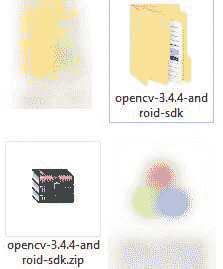

解压缩文件夹的目录结构见下图。我们将使用的两个重要文件夹是 **java** 和 **libs**。这两个文件夹都是 **sdk** 文件夹的子文件夹。

**java** 文件夹包含 OpenCV 的 Java 文件。因为并非所有文件都是用 Java 编写的，有些是用 C++ 编写的，并且仍需要在 Java 中使用，所以还有一个名为 **libs** 的文件夹来存放这些文件。


### 在 Android Studio 中导入 OpenCV

要在 Android Studio 中导入库，进入 **File** 菜单并选择“**Import Module**”，如下图所示。

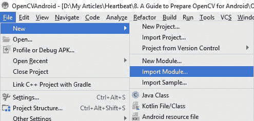

选择后，会出现一个新窗口，询问要导入的模块的路径，如下所示。

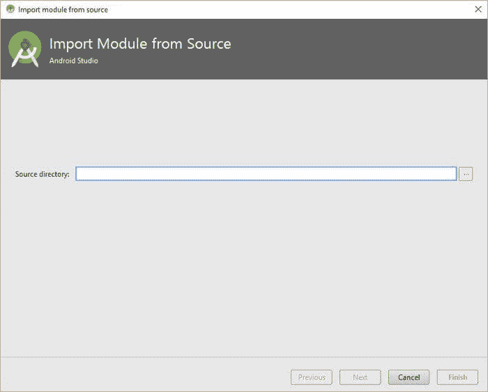

点击右侧“**Source Directory**”旁边的三个点，然后导航到下载的 OpenCV for Android 中 **sdk** 文件夹所在的路径。

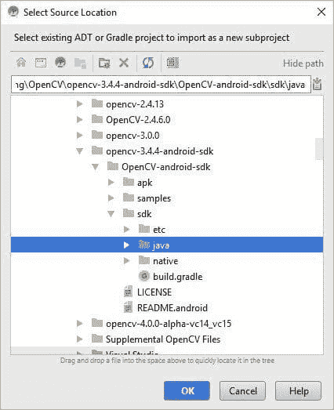

点击 **OK** 后，之前菜单中的“**Source Directory**”将根据选择的路径进行更改，如下图所示。模块名称将更改以反映 Android Studio 检测到 OpenCV。

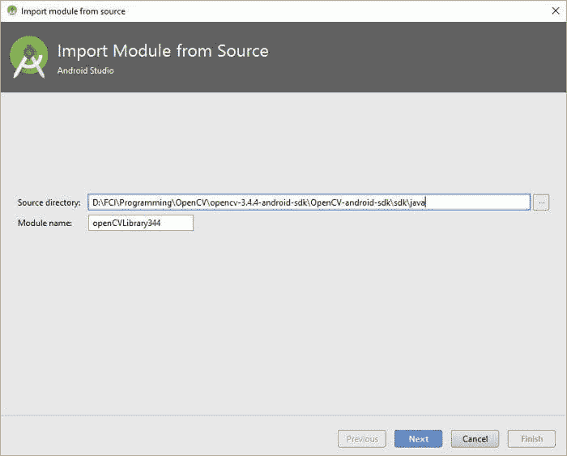

点击 **Next** 进入下一个窗口，在那里你只需点击 **Finish** 以导入库。点击 Finish 后，你需要等待 Gradle Sync 完成。

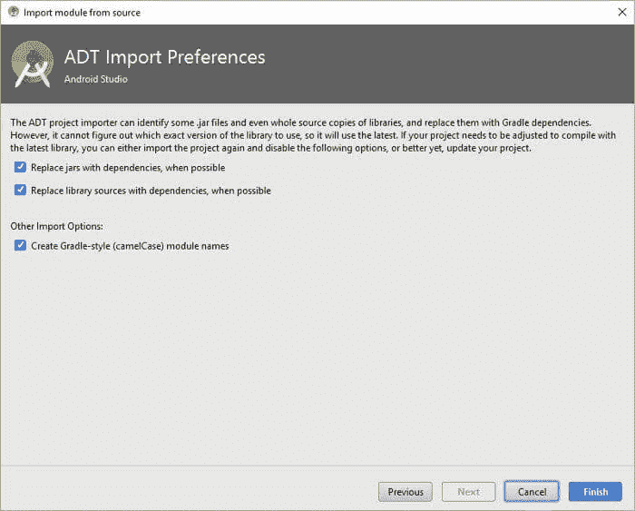

### 修复可能的 Gradle Sync 错误

在使用 Gradle 构建项目时，可能会出现多个错误。这里我们将讨论其中的 3 个。

首先，你可能会遇到 **Gradle Sync** 错误，如下所示。问题在于 OpenCV 使用的 SDK 在环境中未安装。

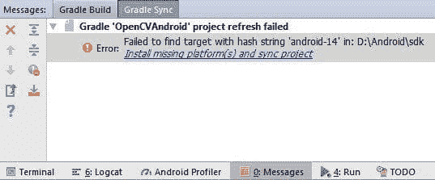

我们可以通过两种方式解决这个问题。第一种是安装 OpenCV 使用的 SDK。第二种方法，在本教程中使用，是将 OpenCV 使用的 SDK 版本更改为已存在的 SDK 之一。

要更改 OpenCV 使用的 SDK，请将项目视图更改为 Project，然后转到导入的 OpenCV 下的 `build.gradle` 文件。不要忘记打开 OpenCV 库下的 `build.gradle` 文件，而不是应用下的。


此文件的内容如下所示。根据 `compileSdkVersion` 字段，它反映了 OpenCV 使用的 SDK 版本为 14 并且尚未安装。如果 SDK 14 已安装，则此错误可能不会出现。

如果没有安装 SDK 14，你可以更改为其他可用的 SDK。我将使用 SDK 21。下面列出了编辑后的 OpenCV 库 `build.gradle` 文件。你可以在进行此编辑后尝试重新同步项目，预期一切会在那之后成功运行。

第二个问题是 OpenCV 库的 `build.gradle` 文件中的第一行可能如下所示。这指的是导入的 OpenCV 是一个应用程序而不是库。我发现这一行存在于 OpenCV 4.1.0 中。

```py
apply **plugin: 'com.android.application'**
```

使用这一行会在构建项目时返回错误。错误信息是：

`无法解析‘**:app@debugUnitTest/compileClasspath’ 的依赖项：无法解析项目 :openCVLibrary433.**`

因为 OpenCV 是作为库导入的，第一行必须是以下内容：

```py
apply **plugin: 'com.android.library'**
```

将第一行更改为上面提到的内容可能还不够。这是因为如果 OpenCV 的 `build.gradle` 文件中的第一行是 `apply plugin: ‘com.android.application’`，则期望找到 `applicationId` 设置为 `org.opencv`。在作为库导入的项目中有这样的字段是一个问题。因此，你需要使用 // 将其格式化为注释，或者直接删除它。

### 添加 OpenCV 作为依赖

尽管在 Android Studio 内部导入了 OpenCV，但在 activity Java 文件中没有检测到 OpenCV。项目不知道 `org.opencv` 是什么。这是因为我们还需要在项目中将库添加为依赖。

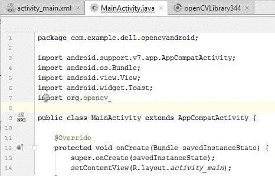

为此，从文件菜单中选择“**项目结构**”菜单项，如下所示。

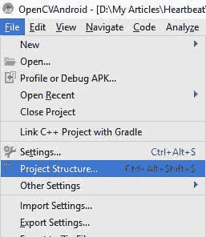

这会打开另一个窗口。在左侧的 **模块** 部分，点击 **app**，然后转到 **依赖**。这会打开依赖窗口。


为了添加新的依赖，点击屏幕右侧的绿色 + 图标，如下所示。会出现一个菜单，我们从中选择“**模块依赖**”选项。


一个新窗口会打开，显示一个模块列表以供选择作为依赖项。我们只有一个 OpenCV 模块，因此只有一个项目可用。选择它并点击 OK。

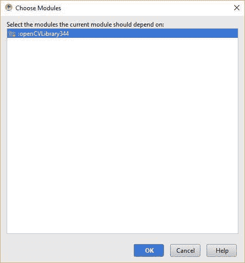

这会带你回到依赖窗口，但 OpenCV 已作为依赖之一添加。点击 OK 确认添加 OpenCV 作为依赖。

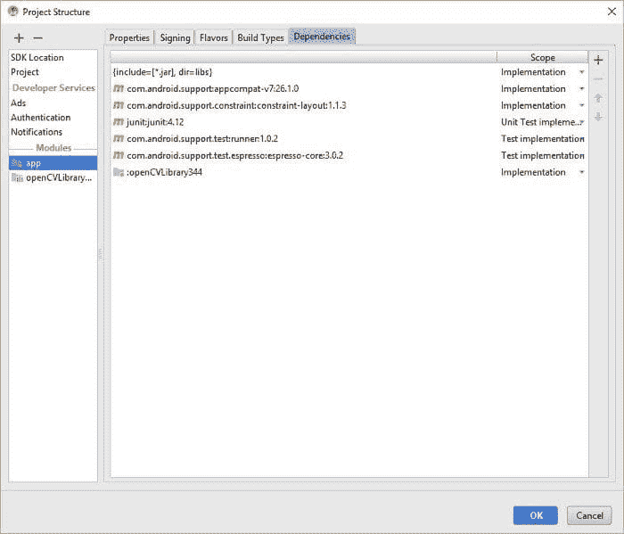

完成后，你会发现 OpenCV 库在 Java 代码中被检测到了。


### 添加本地库

OpenCV 中的一些文件是本地的。这意味着它们不是用 Java 编写的，而是用 C++ 编写的。这些文件可以在**libs**文件夹中找到。下载的 OpenCV 文件的文件夹结构如下，以便你重新记起**libs**文件夹的位置，即**OpenCV/sdk/native/libs**。

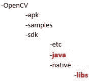

这个文件夹需要复制到项目中的这个目录：OpenCVAndroid/app/src/main/。非常重要的是将复制的文件夹重命名为**jnilibs**。完成后，项目的主文件夹内容如下图所示。完成这些步骤后，OpenCV 库就可以使用了。

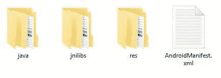

### 使用 OpenCV 进行图像滤镜处理

成功在 Android Studio 中导入 OpenCV 后，本教程的这一部分使用 OpenCV 对图像应用滤镜。[GitHub 项目](https://github.com/ahmedfgad/OpenCVAndroid)包含了已经导入 OpenCV 的 Android Studio 项目，并在点击按钮后对图像应用了 Canny 滤镜。

之前的应用布局将被修改以添加一个 ImageView，具体如下。这不是唯一的更改，因为所使用的布局被更改为**LinearLayout**。该布局的方向为垂直。此外，TextView 不再需要，因此被移除。

显示在 ImageView 上的图像是名为**test**的资源图像。为了将资源图像添加到项目中，只需使用 Android 项目视图，将图像文件拖放到**drawable**文件夹中，如下所示。图像文件名为`test.jpg`。该图像的资源名称**test**来源于文件名。

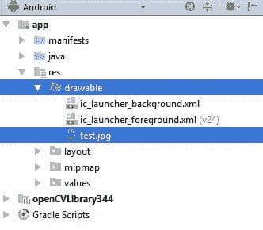

运行修改后的应用程序后的屏幕如下面所示。接下来，我们编写 Java 代码来读取在 ImageView 中显示的资源图像，使用 OpenCV 处理它，然后再次在 ImageView 中显示处理后的图像。


之前，按钮视图在点击时会显示一个 toast 消息。这一次，它将对图像应用 Canny 滤镜。修改后的 Java 代码如下。你只需创建一个名为**test**的 drawable 资源。

点击按钮后，资源图像会被读取为名为 img 的 OpenCV Mat。然后，使用 `Canny()` 方法对 Mat 进行滤镜处理，并将处理后的图像存储到 `img_result` Mat 中。

然后，这个 Mat 会使用 `matToBitmap()` 方法转换为位图图像。最后，使用 `setImageBitmap()` 方法将转换后的位图图像设置为 ImageView 上显示的图像。图像过滤后的结果如下图所示。

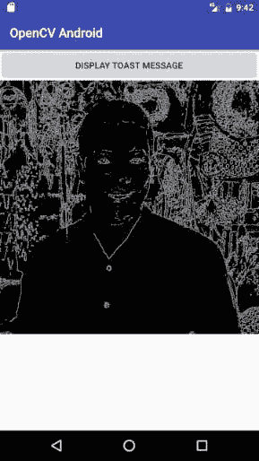

就这些！

### 总结

本教程讨论了在 Android Studio 中使用 OpenCV 的详细步骤。创建了一个 Android Studio 项目，并在确保其正常工作的情况下，开始准备 OpenCV。

为此，我们首先从官方网站下载了 OpenCV。之后，将 OpenCV 作为模块导入 Android Studio 项目，并将其添加为依赖项。接着，我们将**libs**文件夹（在 Android Studio 中）复制到项目中，并将其重命名为**jnilibs**。作为准备 OpenCV 用于 Android Studio 的最终步骤，我们使用`OpenCVLoader`初始化了`onCreate()`方法。

最后，我们确保了 OpenCV 在项目中的正常工作，并用它构建了一个简单的应用程序，在该程序中，通过 Canny 进行图像滤波。

### 联系作者

+   E-mail: ahmed.f.gad@gmail.com

+   LinkedIn: [`linkedin.com/in/ahmedfgad`](https://linkedin.com/in/ahmedfgad)

+   Heartbeat: [`heartbeat.fritz.ai/@ahmedfgad`](https://heartbeat.fritz.ai/@ahmedfgad)

+   KDnuggets: [`www.kdnuggets.com/author/ahmed-gad`](https://www.kdnuggets.com/author/ahmed-gad)

+   TowardsDataScience: [`towardsdatascience.com/@ahmedfgad`](https://towardsdatascience.com/@ahmedfgad)

+   GitHub: [`github.com/ahmedfgad`](https://github.com/ahmedfgad)

**简历: [Ahmed Gad](https://www.linkedin.com/in/ahmedfgad/)** 获得了埃及梅诺菲亚大学计算机与信息学院信息技术学士学位，并以优异成绩毕业。由于在学院排名第一，他在 2015 年被推荐到埃及的一所机构担任教学助理，随后在 2016 年继续担任教学助理及研究员。他当前的研究兴趣包括深度学习、机器学习、人工智能、数字信号处理和计算机视觉。

[原文](https://heartbeat.fritz.ai/a-guide-to-preparing-opencv-for-android-4e9532677809)。转载经许可。

**相关内容:**

+   加速计算机视觉：来自亚马逊的免费课程

+   计算机视觉食谱：最佳实践和示例

+   联邦学习简介

### 更多相关内容

+   [准备数据分析师面试](https://www.kdnuggets.com/2022/08/datacamp-preparing-data-analyst-interview.html)

+   [发现计算机视觉的世界：介绍 MLM 最新的…](https://www.kdnuggets.com/2024/01/mlm-discover-the-world-of-computer-vision-ebook)

+   [初学者的端到端机器学习指南](https://www.kdnuggets.com/2021/12/beginner-guide-end-end-machine-learning.html)

+   [机器学习可视化简单指南](https://www.kdnuggets.com/2022/04/simple-guide-machine-learning-visualisations.html)

+   [正态分布综合指南](https://www.kdnuggets.com/2022/06/comprehensive-guide-normal-distribution.html)

+   [Python 中的地理编码：完整指南](https://www.kdnuggets.com/2022/11/geocoding-python-complete-guide.html)
