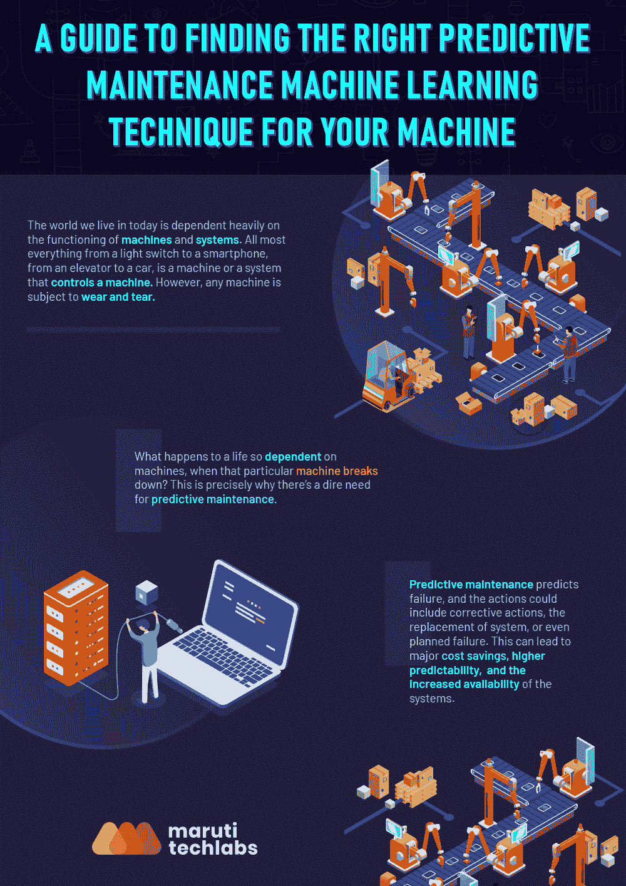
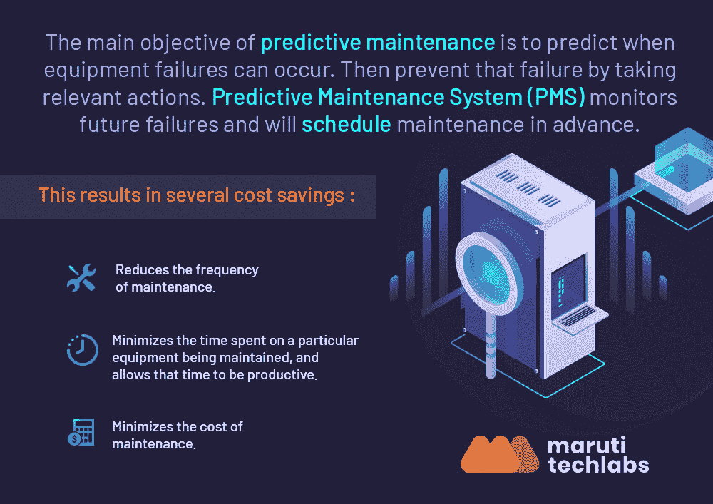

# 预测性维护机器学习技术指南

> 原文：[`www.kdnuggets.com/2021/10/guide-right-predictive-maintenance-machine-learning-techniques.html`](https://www.kdnuggets.com/2021/10/guide-right-predictive-maintenance-machine-learning-techniques.html)

评论

**由 [Maruti Techlabs](https://marutitech.com/) 提供**

仔细考虑的话，你会发现我们今天生活的世界在很大程度上依赖于机器和系统的运行。从电灯开关到智能手机，从电梯到汽车，几乎所有东西都是机器或控制机器的系统。然而，任何机器都会出现磨损。

* * *

## 我们的三大课程推荐

 1\. [谷歌网络安全证书](https://www.kdnuggets.com/google-cybersecurity) - 快速进入网络安全职业生涯。

 2\. [谷歌数据分析专业证书](https://www.kdnuggets.com/google-data-analytics) - 提升你的数据分析技能

 3\. [谷歌 IT 支持专业证书](https://www.kdnuggets.com/google-itsupport) - 支持你所在组织的 IT 工作

* * *

当一个生命如此依赖于机器时，如果那台特定的机器出现故障，会发生什么？这正是为何迫切需要通过[机器学习进行预测性维护](https://marutitech.com/machine-learning-predictive-analytics/)。

我们以出租车公司为例来理解这一点。如果你希望汽车按时运行，并在高峰工作时段不会出现故障，你需要确保所有移动部件得到适当维护。通常，有两种思维方式来消除故障或失败。

你可以选择保守一点，安排定期维护。在这种情况下，你不太可能完全了解机器的生命周期和实际导致故障的因素。由于这个过程不专注于在安排维护之前从机器中提取最大价值，因此成本可能会更高。例如，你可能会在轮胎完全使用之前更换它们，并在发动机油尚未充分使用之前更换它。结果，你将会在维护上花费更多。

第二种思考方式是进行计算并基于预测数据分析做出决策。预测性维护使用机器学习从历史数据中学习，并利用实时数据分析故障模式。由于保守的方法会导致资源浪费，使用机器学习的预测性维护寻求资源的最佳利用，并在故障发生之前进行预测。因此，预测性维护避免了两种极端情况，力求找到完美的中间点。

但是你如何找到完美的中间点？你使用哪种机器学习技术？在这篇文章中，我们将探讨如何找到合适的技术，以成功进行基于机器学习的预测性维护。

### **收集数据**

第一步应该是收集数据。需要随时监控需要预测故障的机器或系统。监控系统生成的数据需要被分类，以理解影响机器的各种条件和因素。例如，为了了解汽车发动机故障，传感器应记录温度、湿度、油位、油密度等。这些信息将为跟踪和预测故障模式及原因提供动力。预测性维护的数据是[时间序列数据](https://en.wikipedia.org/wiki/Time_series)。

在设置传感器监控系统时，数据需要解决以下一些问题：

+   我们需要识别通常发生的故障类型。因此，第一步应该是识别这些故障，然后找到需要预测的故障。

+   接下来，我们需要对故障过程进行特征描述。故障过程是逐渐发生的，例如刹车片的磨损，还是急性问题，例如发动机进水？

+   在下一步中，我们需要确定哪些部件或过程与每种类型的故障相关。需要决定哪些不同的参数可以揭示过程的信息。因此，需要建立监测机制来测量和跟踪每个参数以及相关的部件/过程。

+   通常，机器的使用寿命是以多年为单位。因此，监控数据需要在较长时间内收集，以便正确记录退化过程。

+   通常，建议数据科学家和领域专家共同收集数据。领域专家对于了解机器及相应创建数据收集方案至关重要。同样，数据科学家需要确保收集的数据有用，并尽可能减少数据清理工作。

然而，在现实生活中，这种情况几乎不会发生。大多数组织自行跟踪数据。因此，当数据科学家到达时，已经收集了大量数据，重新开始数据收集过程可能会显著拖延整个过程。

因此，与其基于预先确定的模型收集数据，不如制定一个模型以最佳适应现有数据。

### **预测性维护机器学习技术**

为了制定预测性维护模型，需要考虑一些必要的信息。

+   首要考虑应该是确定模型应该提供什么样的输出。

+   接下来，机器是否拥有足够的历史数据，或者我们是否依赖于静态数据？

+   每个事件都需要被记录、标记和登录。这将有助于快速识别标记，并允许数据科学家在短时间内筛选数据。这些数据将用于了解机器正常运作的指标以及故障的迹象。

+   同样，事件数量与故障之间是否存在直接相关性？是否存在只在过程故障前发生的特定事件？作为提前警告所需的最短时间是多少？

现在我们有了所需的信息，我们将决定哪种建模技术最适合数据集。在决定建模技术时，还会考虑期望的输出和可用条件。可以考虑三种主要的机器学习技术。然后，根据适配情况，可以做出最终决定。

**技术 1 – 回归模型预测剩余使用寿命 (RUL)**

所需数据类型——这种模型需要静态数据和历史数据。每个事件都需要被标记和登录。数据集中包含了每种故障类型的众多事件。这些数据集随后被用于训练模型，以预测可能的故障。

前提条件——假设静态特性可以用来预测故障。

+   这意味着需要同时使用历史数据和静态数据，并且退化过程是渐进的，而不是急性的。

+   模型将专注于一种类型的故障。如果模型要考虑不同类型的故障，则行为将会发生变化。

+   因此，成功率可能会有所不同。因此，最好采用线性方法，并对每种故障类型使用一种模型。每个事件都被标记和登录。

结果——该模型提供的输出是故障事件发生之前剩余的天数。这也被称为[剩余使用寿命 (RUL)](https://www.partneresi.com/resources/glossary/remaining-useful-life-rul)。

### **技术 2 – 分类模型预测预定时间框架内的故障**

创建一个可以准确预测机器寿命的模型可能极具挑战性。然而，实际上，这样的模型并不必要。维护团队只需知道机器是否会在短期内故障。为此，我们可以使用[classification model](https://en.wikipedia.org/wiki/Statistical_classification)预测在接下来的'N'天或周期内的故障（其中 N = 任何数字）。

需要的数据类型 - 该模型还需要历史数据和静态数据。它还将依赖于标记和标签事件。因此，数据特征与技术 1 相同。

先决条件 - 先决条件与技术 1 非常相似。然而，存在以下列出的具体差异：

+   由于我们不是预测确切时间，而是寻找一个时间范围，因此模型不需要假设逐渐退化。

+   与[回归模型](https://en.wikipedia.org/wiki/Regression_analysis)不同，分类模型可以同时处理多种故障类型。唯一的要求是模型被框定为多类问题。

+   需要有标记的数据，但此外，还需要有足够的每种故障事件（和正常事件）实例来训练模型。

### **技术 3 – 标记异常行为**

在前述的两种技术中，使用了历史数据和静态数据来训练模型。这有助于理解正常时间特征与故障事件特征之间的关系。然而，公司愿意消化多少故障事件以收集数据？在关键任务系统的情况下，故障案例是有限的。因此，需要采用不同的策略。

需要的数据类型 - 静态数据和历史数据都可用，但事件没有被标记和记录，或者数据不可用。

先决条件 - 假设可以从数据集中识别正常行为，并且可以区分正常事件与故障事件之间的差异。

### **结论**

本质上，这里没有一种通用策略。每个项目都需要根据实际情况进行处理。第一步应是了解系统、问题、机器/系统周围的条件，然后根据所需结果制定模型。

在[Maruti Techlabs](https://marutitech.com/)，我们在高级预测建模和部署大规模大数据管道方面拥有丰富的经验。凭借一支经验丰富的数据科学和机器学习专业团队，我们为客户设计、实施和工业化机器学习及 AI 解决方案，覆盖众多行业。我们将技术技能与商业建议相结合，帮助企业建立数据驱动的能力。对我们的服务感兴趣？请随时联系或发送邮件至 hello@marutitech.com

**简介: [Maruti Techlabs](https://marutitech.com/)** 旨在通过数字化转型重新定义企业，并成为全球尊敬的企业，推动传统商业解决方案的边界。

[原始](https://marutitech.com/predictive-maintenance-machine-learning-techniques/)。经授权转载。

**相关:**

+   在生产环境中服务 ML 模型：常见模式

+   20 个机器学习项目，让你找到工作

+   构建和运作机器学习模型：成功的三条建议

### 相关主题更多内容

+   [寻找最佳 IDE 软件](https://www.kdnuggets.com/2022/05/finding-best-ide-software.html)

+   [NLP 中不同词嵌入技术的终极指南](https://www.kdnuggets.com/2021/11/guide-word-embedding-techniques-nlp.html)

+   [数据科学中异常检测技术的初学者指南](https://www.kdnuggets.com/2023/05/beginner-guide-anomaly-detection-techniques-data-science.html)

+   [选择合适的机器学习算法的简单指南](https://www.kdnuggets.com/2020/05/guide-choose-right-machine-learning-algorithm.html)

+   [机器学习模型的高级特征选择技术](https://www.kdnuggets.com/2023/06/advanced-feature-selection-techniques-machine-learning-models.html)

+   [每个初学者数据科学家应掌握的 6 种预测模型](https://www.kdnuggets.com/2021/12/6-predictive-models-every-beginner-data-scientist-master.html)
