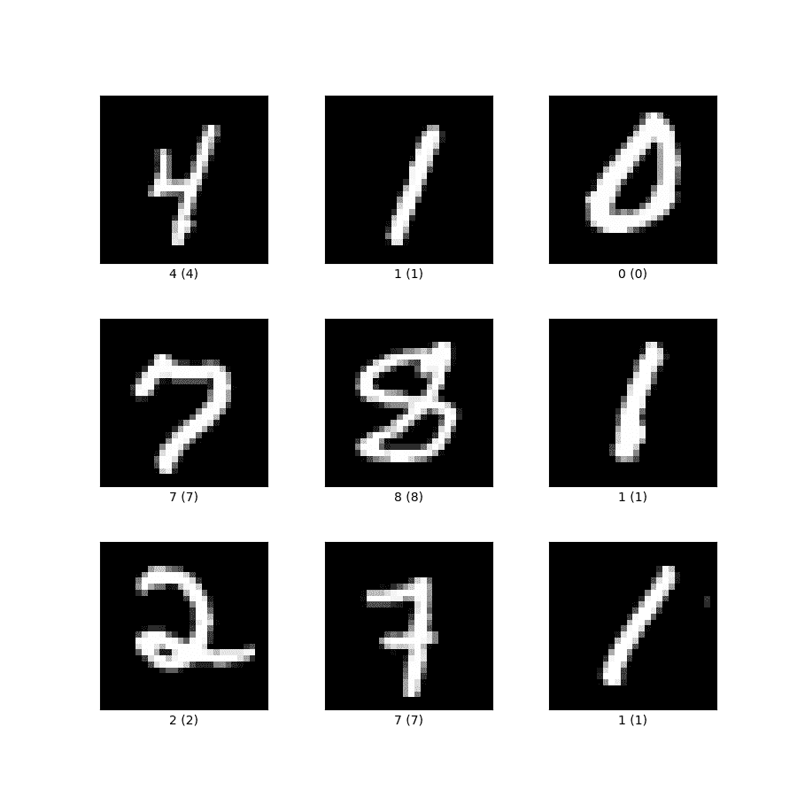

# 使用 Tensorflow 训练图像分类模型的指南

> 原文：[`www.kdnuggets.com/2022/12/guide-train-image-classification-model-tensorflow.html`](https://www.kdnuggets.com/2022/12/guide-train-image-classification-model-tensorflow.html)

人类在很小的时候就学会了识别和标记视觉图像。现在，随着机器学习和深度学习算法的出现，计算机能够大规模且高精度地分类图像。这些先进的算法有许多应用——常见的包括区分健康的肺部扫描、移动设备的人脸识别，或将物体分类为零售商的不同类别。


[人脸识别](https://www.freepik.com/free-vector/man-face-scan-biometric-digital-technology_5597121.htm#query=facial%20recognition&position=1&from_view=search&track=sph)

本文解释了计算机视觉的一个应用，即图像分类，并说明了如何使用 Tensorflow 在小型图像数据集上训练模型。

# 数据集和目标

为了演示的目的，我们将使用包含 0 到 9 数字图像的[MNIST](https://knowyourdata-tfds.withgoogle.com/#tab=STATS&dataset=mnist)数据集。样本图像如下所示：



[Tensorflow-dataset](https://www.tensorflow.org/datasets/catalog/mnist)

训练这个模型的目的是将图像分类到它们各自的标签，即对应的数字等价物。使用一个输入层、一个输出层、两个隐藏层和一个 Dropout 层的深度神经网络架构来训练模型。CNN 或卷积神经网络是较大图像的首选，因为它能够在减少输入大小的同时捕捉相关信息。

# 入门指南

首先，导入所有相关的库，包括 TensorFlow、to_categorical（用于将数值类值转换为类别）、Sequential、Flatten、Dense 和 Dropout，用于构建神经网络架构。如果这些库中的一些对你来说是新的，不用担心。它们将在接下来的部分中进行解释。

# 超参数

以下提示帮助你选择正确的超参数：

+   让我们定义一些超参数作为起点，你可以调整它们以进行不同的实验。我们选择了 128 的迷你批量大小。批量大小可以取任何值，但选择一个 2 的幂作为批量大小在内存使用上更高效，因此是首选。让我们还理解决定适当批量大小的主要原因——过小的批量大小会使收敛过程非常嘈杂，而过大的批量大小可能无法适应你的计算机内存。

+   我们将 epoch 数量设置为 50，以快速训练模型。数据集较小且简单，适合较低的 epoch 数量。

+   接下来，你需要添加隐藏层。我们保留了两个各 128 个神经元的隐藏层——你也可以尝试 64 和 32。对于像 MINST 这样简单的数据集，不推荐使用更高的数字。

+   你可以尝试不同的学习率，如 0.01、0.05 和 0.1。为了演示的目的，保持在 0.01。

+   其他超参数如衰减步数和衰减率分别选择为 2000 和 0.9。它们用于在训练过程中减少学习率。

+   选择 Adamax 作为优化器，尽管你还可以选择其他优化器，如 Adam、RMSProp、SGD 等。你可以阅读更多关于[可用优化器列表](https://www.tensorflow.org/api_docs/python/tf/keras/optimizers)以及它们的区别，以选择适合你解决方案的优化器。

```py
import tensorflow as tf
from tensorflow.keras.utils import to_categorical
from tensorflow.keras.models import Sequential
from tensorflow.keras.layers import Flatten, Dense, Dropout

params = {
    'dropout': 0.25,
    'batch-size': 128,
    'epochs': 50,
    'layer-1-size': 128,
    'layer-2-size': 128,
    'initial-lr': 0.01,
    'decay-steps': 2000,
    'decay-rate': 0.9,
    'optimizer': 'adamax'
}

mnist = tf.keras.datasets.mnist  
num_class = 10

# split between train and test sets
(x_train, y_train), (x_test, y_test) = mnist.load_data()

# reshape and normalize the data
x_train = x_train.reshape(60000, 784).astype("float32")/255
x_test = x_test.reshape(10000, 784).astype("float32")/255

# convert class vectors to binary class matrices
y_train = to_categorical(y_train, num_class)
y_test = to_categorical(y_test, num_class)
```

# 创建训练和测试集

+   TensorFlow 库还包括 MNIST 数据集，你可以通过调用 datasets.mnist，然后在对象上调用 load_data()来分别获取训练（60,000 个样本）和测试（10,000 个样本）数据集。

+   接下来，你需要重新调整和归一化训练和测试图像，其中归一化将图像像素强度限制在 0 到 1 之间。

+   使用之前导入的 to_categorical 方法将训练和测试标签转换为类别。这对于向 TensorFlow 框架传达输出标签即 0 到 9 是类别而不是数值性质至关重要。

# 设计神经网络架构

理解如何设计神经网络架构的细节非常重要。

+   通过添加 Flatten 来定义 DNN（深度神经网络）结构，将 2D 图像矩阵转换为向量。输入神经元对应于这些向量中的数字。

+   接下来，使用 Dense()方法添加两个隐藏的全连接层，并从之前定义的“params”字典中提取超参数。我们将这些层的激活函数设置为“relu”，即修正线性单元，它是神经网络隐藏层中最常用的激活函数之一。

+   接下来使用 Dropout 方法添加 dropout 层。它用于在训练神经网络时避免过拟合。一个过拟合的模型倾向于准确记住训练集，而无法对未见过的数据集进行泛化。

+   输出层是我们网络中的最后一层，使用 Dense()方法定义。需要注意的是，输出层有 10 个神经元，分别对应于类别（数字）的数量。

```py
# Model Definition
# Get parameters from logged hyperparameters
model = Sequential([
  Flatten(input_shape=(784, )),
  Dense(params('layer-1-size'), activation='relu'),
  Dense(params('layer-2-size'), activation='relu'),
  Dropout(params('dropout')),
  Dense(10)
  ])

lr_schedule = 
    tf.keras.optimizers.schedules.ExponentialDecay(
    initial_learning_rate=experiment.get_parameter('initial-lr'),
    decay_steps=experiment.get_parameter('decay-steps'),
    decay_rate=experiment.get_parameter('decay-rate')
    )

loss_fn = tf.keras.losses.CategoricalCrossentropy(from_logits=True)

model.compile(optimizer='adamax', 
              loss=loss_fn,
              metrics=['accuracy'])

model.fit(x_train, y_train,
    batch_size=experiment.get_parameter('batch-size'),
    epochs=experiment.get_parameter('epochs'),
    validation_data=(x_test, y_test),)

score = model.evaluate(x_test, y_test)

# Log Model
model.save('tf-mnist-comet.h5')
```

# 训练时间

现在我们已经定义了架构，让我们用给定的训练数据来编译和训练神经网络。

+   定义一个学习率调度器，使用 ExponentialDecay（指数衰减学习率），并以初始学习率、衰减步数和衰减率作为参数。

+   定义损失函数为 CategoricalCrossentropy（用于多类分类）。

+   通过将优化器（adamax）、损失函数和指标（选择准确率，因为所有类别同等重要且均匀分布）作为参数传递来编译模型。

+   通过调用 fit 方法，传入 x_train、y_train、batch_size、epochs 和 validation_data 来拟合模型。

+   调用模型对象上的 evaluate 方法，以获取模型在未见数据集上的表现分数。

+   你可以使用 save 方法将模型对象保存以供生产使用。

这篇文章解释了训练深度神经网络进行图像分类任务的基础知识，并且是熟悉使用神经网络进行图像分类任务的良好起点。它详细阐述了选择正确参数和架构的一般方法和理由。

**[Vidhi Chugh](https://vidhi-chugh.medium.com/)** 是一位 AI 策略师和数字化转型领导者，她在产品、科学和工程的交汇处工作，致力于构建可扩展的机器学习系统。她是获奖的创新领袖、作者和国际演讲者，致力于使机器学习民主化，并让每个人都能参与这一转型。

### 了解更多关于此主题的信息

+   [理解分类指标：评估模型准确性的指南](https://www.kdnuggets.com/understanding-classification-metrics-your-guide-to-assessing-model-accuracy)

+   [使用卷积神经网络（CNNs）进行图像分类](https://www.kdnuggets.com/2022/05/image-classification-convolutional-neural-networks-cnns.html)

+   [如何从零开始构建和训练 Transformer 模型](https://www.kdnuggets.com/how-to-build-and-train-a-transformer-model-from-scratch-with-hugging-face-transformers)

+   [Segment Anything Model: 图像分割的基础模型](https://www.kdnuggets.com/2023/07/segment-anything-model-foundation-model-image-segmentation.html)

+   [为什么我们永远需要人类来训练 AI — 有时甚至是实时的](https://www.kdnuggets.com/2021/12/why-we-need-humans-training-ai.html)

+   [分类的机器学习算法](https://www.kdnuggets.com/2022/03/machine-learning-algorithms-classification.html)
