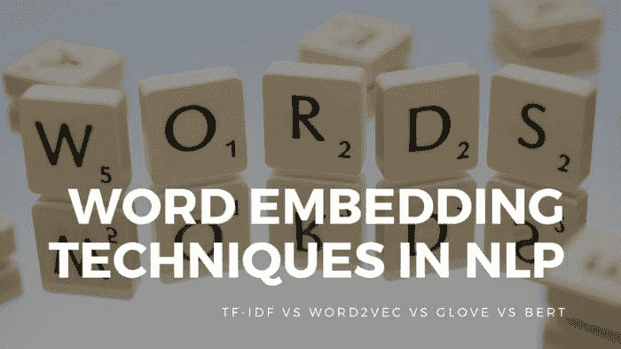
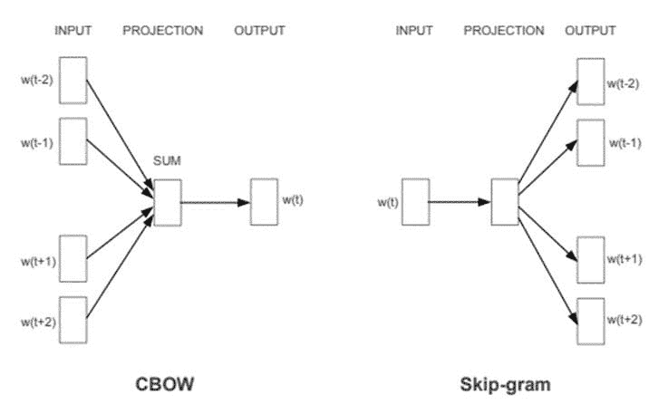
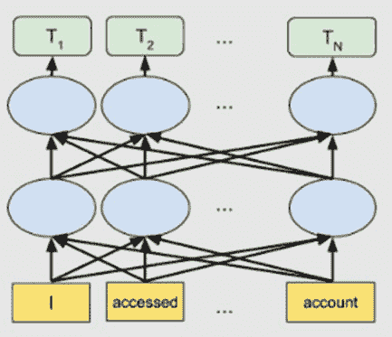

# NLP 中不同词嵌入技术的终极指南

> 原文：[`www.kdnuggets.com/2021/11/guide-word-embedding-techniques-nlp.html`](https://www.kdnuggets.com/2021/11/guide-word-embedding-techniques-nlp.html)

> * * *
> 
> ## 我们的前三大课程推荐
> ## 
>  1\. [谷歌网络安全证书](https://www.kdnuggets.com/google-cybersecurity) - 快速进入网络安全职业生涯。
> 
>  2\. [谷歌数据分析专业证书](https://www.kdnuggets.com/google-data-analytics) - 提升您的数据分析技能
> 
>  3\. [谷歌 IT 支持专业证书](https://www.kdnuggets.com/google-itsupport) - 支持您的组织 IT
> 
> * * *
> 
> “你可以通过一个词所处的环境来了解它！”
> 
> —约翰·鲁珀特·费斯

如果计算机能开始理解莎士比亚的作品？或者像 J.K. 罗琳那样写小说？这在几年前是不可想象的。近年来，[自然语言处理](https://www.ibm.com/cloud/learn/natural-language-processing)（NLP）和[自然语言生成](https://www.techopedia.com/definition/33012/natural-language-generation-nlg)（NLG）的最新进展使计算机在理解基于文本的内容方面的能力大大提升。

为了理解和生成文本，基于 NLP 的系统必须能够识别单词、语法以及大量的语言细微差别。对于计算机来说，这比说起来要困难得多，因为它们只能理解数字。

为了弥补这一差距，自然语言处理（NLP）专家开发了一种称为*词嵌入*的技术，将单词转换为其数值表示。一旦转换完成，自然语言处理算法可以轻松处理这些学习到的表示，以处理文本信息。

词嵌入将单词映射为实值数值向量。它通过对序列（或句子）中的每个单词进行标记化，并将其转换为向量空间来实现。词嵌入旨在捕捉文本序列中单词的语义意义。它为具有相似含义的单词分配类似的数值表示。

让我们来看看 NLP 中一些最有前景的词嵌入技术。

# TF-IDF — 词频-逆文档频率

TF-IDF 是一种基于统计度量的机器学习（ML）算法，用于找出文本中单词的相关性。文本可以是一个文档或多个文档（语料库）。它是两种指标的结合：词频（TF）和逆文档频率（IDF）。

TF 分数是基于文档中单词的频率。通过计算单词在文档中出现的次数来确定 TF。TF 的计算方法是将单词（i）出现的次数除以文档（j）中的总单词数（N）。

*TF (i) = log (frequency (i,j)) / log (N (j))*

IDF 分数计算词语的稀有性。这一点很重要，因为 TF 会给出现频率较高的词语更多的权重。然而，在语料库中很少使用的词语可能包含重要的信息。IDF 捕捉到这些信息。它可以通过将文档总数（N）除以包含该词语的文档数量（i）来计算。

*IDF (i) = log (N (d) / frequency (d,i))*

在上述公式中使用 *log* 来减弱 TF 和 IDF 大分数的影响。最终的 TF-IDF 分数通过将 TF 和 IDF 分数相乘来计算。

TF-IDF 算法用于解决简单的 ML 和 NLP 问题。它更适合用于信息检索、关键词提取、停用词（如 ‘a’，‘the’，‘are’，‘is’）移除以及基本的 [文本分析](https://algoscale.com/data-analytics/text-analytics/)。它无法高效捕捉词语序列的语义意义。

# Word2Vec — 捕捉语义信息

由 Tomas Mikolov 和 Google 的其他研究人员于 2013 年开发的 [Word2Vec](https://arxiv.org/abs/1301.3781) 是一种用于解决高级 NLP 问题的词嵌入技术。它可以遍历大量的文本语料库来学习词语之间的关联或依赖关系。

Word2Vec 通过使用 [*余弦相似度*](https://www.machinelearningplus.com/nlp/cosine-similarity/) 度量来发现词语之间的相似性。如果余弦角度为 1，意味着词语重叠。如果余弦角度为 90，则意味着词语是独立的或没有上下文相似性。它为相似的词语分配相似的向量表示。

Word2Vec 提供了两种基于 [神经网络](https://www.ibm.com/cloud/learn/neural-networks) 的变体：连续词袋模型（CBOW）和 Skip-gram。在 CBOW 中，神经网络模型以各种词语作为输入，预测与输入词语上下文紧密相关的目标词语。另一方面，Skip-gram 架构以一个词语作为输入，预测与之紧密相关的上下文词语。

CBOW 速度较快，并为常见词语找到更好的数值表示，而 Skip Gram 能有效地表示稀有词语。Word2Vec 模型擅长捕捉词语之间的语义关系。例如，国家与其首都之间的关系，如巴黎是法国的首都，柏林是德国的首都。它最适合执行 [语义分析](https://www.expert.ai/blog/natural-language-process-semantic-analysis-definition/)，这在推荐系统和知识发现中有应用。

CBOW & Skip-gram 架构。图片来源： [Word2Vec 论文](https://arxiv.org/abs/1301.3781)。

# GloVe — 全局词向量表示

由 Jeffery Pennington 及斯坦福大学的其他研究人员开发的，[GloVe](https://nlp.stanford.edu/pubs/glove.pdf)扩展了 Word2Vec 的工作，通过计算全球[词-词共现矩阵](https://medium.com/swlh/co-occurrence-matrix-9cacc5dd396e)来捕捉文本语料库中的全球上下文信息。

Word2Vec 仅捕捉词汇的局部上下文。在训练过程中，它仅考虑邻近的词来捕捉上下文。GloVe 考虑整个语料库，并创建一个大矩阵，可以捕捉语料库中词汇的共现。

GloVe 结合了两种词向量学习方法的优点：矩阵分解方法，如[潜在语义分析](https://blog.marketmuse.com/glossary/latent-semantic-analysis-definition/)（LSA）和局部上下文窗口方法，如 Skip-gram。GloVe 技术具有更简单的[最小二乘](https://www.investopedia.com/terms/l/least-squares-method.asp)成本或误差函数，从而降低了模型训练的计算成本。生成的词嵌入在某些方面有所不同且有所改进。

GloVe 在词汇类比和[命名实体识别](https://www.expert.ai/blog/entity-extraction-work/)问题上表现显著更好。在某些任务中，它优于 Word2Vec，并在其他任务中与之竞争。然而，两种技术在捕捉语料库中的语义信息方面都表现良好。

GloVe 词向量捕捉到语义相似的词。图片来源：[斯坦福 GloVe](https://nlp.stanford.edu/projects/glove/)。

# BERT—来自 transformers 的双向编码器表示

[由 Google 于 2019 年介绍](https://arxiv.org/abs/1810.04805)，[BERT](https://ai.googleblog.com/2018/11/open-sourcing-bert-state-of-art-pre.html)属于一种基于 NLP 的语言算法类别，称为[transformers](https://ai.googleblog.com/2017/08/transformer-novel-neural-network.html)。BERT 是一个大规模预训练的深度双向编码器基础的 transformer 模型，有两个变体。BERT-Base 有 1.1 亿个参数，而 BERT-Large 有 3.4 亿个参数。

在生成词嵌入时，BERT 依赖于[*注意机制*](https://www.analyticsvidhya.com/blog/2019/11/comprehensive-guide-attention-mechanism-deep-learning/)。它生成高质量的上下文感知或上下文化的词嵌入。在训练过程中，嵌入通过每一层 BERT 编码器进行细化。对于每个词，注意机制根据左侧和右侧的词捕捉词汇关联。词嵌入也进行位置编码，以跟踪句子中每个词的模式或位置。

BERT 比上述讨论的任何技术都更先进。它通过在大规模词汇语料库和维基百科数据集上进行预训练，生成了更好的词嵌入。BERT 可以通过在任务特定数据集上微调嵌入来进一步提升。

然而，BERT 最适合语言翻译任务。它已经针对许多其他应用和领域进行了优化。

双向 BERT 架构。图片来源：[Google AI Blog](https://ai.googleblog.com/2018/11/open-sourcing-bert-state-of-art-pre.html)。

# 结论

随着自然语言处理（NLP）的进步，词嵌入技术也在不断改进。有许多 NLP 任务并不需要高级的嵌入技术。许多任务使用简单的词嵌入技术同样可以表现良好。选择词嵌入技术必须基于细致的实验和任务特定的需求。微调词嵌入模型可以显著提高准确性。

在本文中，我们对各种词嵌入算法进行了高层次的概述。让我们总结如下：

| **词嵌入技术** | **主要特点** | **应用场景** |
| --- | --- | --- |
| TF-IDF | 统计方法用于捕捉词语相对于文本语料库的相关性。它不捕捉语义词语关联。 | 更适合信息检索和文档中的关键词提取。 |
| Word2Vec | 基于神经网络的 CBOW 和 Skip-gram 架构，更擅长捕捉语义信息。 | 对语义分析任务有用。 |
| GloVe | 基于全局词对共现的矩阵分解方法。它解决了 Word2Vec 的局部上下文限制。 | 在词语类比和命名实体识别任务中表现更好。在一些语义分析任务中与 Word2Vec 的结果相当，而在其他任务中则更优。 |
| BERT | 基于 Transformer 的注意力机制，用于捕捉高质量的上下文信息。 | 语言翻译、问答系统。部署在 Google 搜索引擎中以理解搜索查询。 |

## 参考文献

1.  [`www.ibm.com/cloud/learn/natural-language-processing`](https://www.ibm.com/cloud/learn/natural-language-processing)

1.  [`www.techopedia.com/definition/33012/natural-language-generation-nlg`](https://www.techopedia.com/definition/33012/natural-language-generation-nlg)

1.  [`arxiv.org/abs/1301.3781`](https://arxiv.org/abs/1301.3781)

1.  [`www.machinelearningplus.com/nlp/cosine-similarity/`](https://www.machinelearningplus.com/nlp/cosine-similarity/)

1.  [`www.ibm.com/cloud/learn/neural-networks`](https://www.ibm.com/cloud/learn/neural-networks)

1.  [`www.expert.ai/blog/natural-language-process-semantic-analysis-definition/`](https://www.expert.ai/blog/natural-language-process-semantic-analysis-definition/)

1.  [`nlp.stanford.edu/pubs/glove.pdf`](https://nlp.stanford.edu/pubs/glove.pdf)

1.  [`medium.com/swlh/co-occurrence-matrix-9cacc5dd396e`](https://medium.com/swlh/co-occurrence-matrix-9cacc5dd396e)

1.  [`blog.marketmuse.com/glossary/latent-semantic-analysis-definition/`](https://blog.marketmuse.com/glossary/latent-semantic-analysis-definition/)

1.  [`www.investopedia.com/terms/l/least-squares-method.asp`](https://www.investopedia.com/terms/l/least-squares-method.asp)

1.  [`www.expert.ai/blog/entity-extraction-work/`](https://www.expert.ai/blog/entity-extraction-work/)

1.  [`ai.googleblog.com/2018/11/open-sourcing-bert-state-of-art-pre.html`](https://ai.googleblog.com/2018/11/open-sourcing-bert-state-of-art-pre.html)

1.  [`arxiv.org/abs/1810.04805`](https://arxiv.org/abs/1810.04805)

1.  [`ai.googleblog.com/2017/08/transformer-novel-neural-network.html`](https://ai.googleblog.com/2017/08/transformer-novel-neural-network.html)

1.  [`www.analyticsvidhya.com/blog/2019/11/comprehensive-guide-attention-mechanism-deep-learning/`](https://www.analyticsvidhya.com/blog/2019/11/comprehensive-guide-attention-mechanism-deep-learning/)

**[Neeraj Agarwal](https://www.linkedin.com/in/neeagl/)** 是 Algoscale 的创始人，Algoscale 是一家数据咨询公司，涵盖数据工程、应用 AI、数据科学和产品工程。他在该领域拥有超过 9 年的经验，并帮助了从初创企业到财富 100 强公司等各种组织，处理和存储大量原始数据，以将其转化为可操作的见解，帮助做出更好的决策并加快业务价值的实现。

### 相关主题更多信息

+   [现实世界中 NLP 应用的范围：一种不同的…](https://www.kdnuggets.com/2022/03/different-solution-problem-range-nlp-applications-real-world.html)

+   [5 种不同的 Python 数据加载方式](https://www.kdnuggets.com/2020/08/5-different-ways-load-data-python.html)

+   [AI 生成的体育精彩片段：不同的方法](https://www.kdnuggets.com/2022/03/aigenerated-sports-highlights-different-approaches.html)

+   [数据挖掘与机器学习有何不同？](https://www.kdnuggets.com/2022/06/data-mining-different-machine-learning.html)

+   [了解不同数据可视化的工作原理](https://www.kdnuggets.com/2022/09/datacamp-learn-different-data-visualizations-work.html)

+   [Baize: 一个开源聊天模型（但与众不同？）](https://www.kdnuggets.com/2023/04/baize-opensource-chat-model-different.html)
