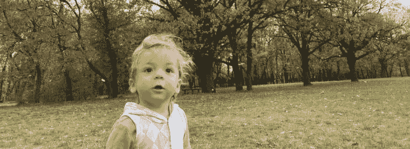
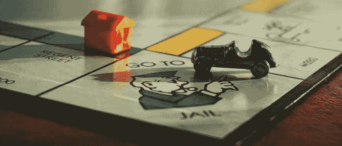
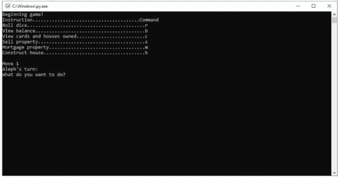
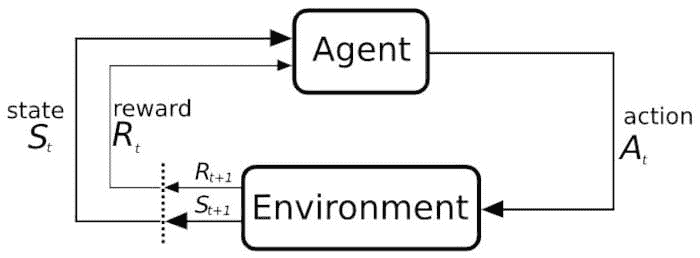

# 实践强化学习课程，第一部分

> 原文：[`www.kdnuggets.com/2021/12/hands-on-reinforcement-learning-course-part-1.html`](https://www.kdnuggets.com/2021/12/hands-on-reinforcement-learning-course-part-1.html)

评论

**由 [Pau Labarta Bajo](https://www.linkedin.com/in/pau-labarta-bajo-4432074b/)，数学家和数据科学家**。

* * *

## 我们的前三个课程推荐

 1\. [Google 网络安全证书](https://www.kdnuggets.com/google-cybersecurity) - 快速进入网络安全职业生涯。

 2\. [Google 数据分析专业证书](https://www.kdnuggets.com/google-data-analytics) - 提升你的数据分析技能

 3\. [Google IT 支持专业证书](https://www.kdnuggets.com/google-itsupport) - 支持你的组织进行 IT 工作

* * *

本部分涵盖了你从基础到前沿强化学习（RL）所需的最低概念和理论，逐步进行，包含 Python 代码示例和教程。在接下来的每一章中，我们将解决一个不同难度的问题。

最终，最复杂的 RL 问题涉及到强化学习算法、优化和深度学习的混合。你不需要了解深度学习（DL）才能跟上本课程。我会给你足够的背景知识，让你熟悉 DL 的理念，并理解它如何成为现代强化学习的关键组成部分。

在这一节课中，我们将通过示例、零数学和一些 Python 代码来讲解强化学习的基本原理。

## 1\. 什么是强化学习问题？

强化学习（RL）是机器学习（ML）的一个领域，涉及那些

> 一个智能的**代理**需要通过反复试验来学习如何在**环境**内部采取**行动**，以最大化**累积奖励**。

强化学习是最接近人类和动物学习方式的机器学习类型。

什么是代理？什么是环境？代理可以采取哪些行动？奖励是什么？为什么说累积奖励？

如果你正在问自己这些问题，你就走在正确的道路上。

我刚才给出的定义引入了一些你可能不熟悉的术语。实际上，它们故意模糊不清。这种泛化使得强化学习（RL）能够应用于看似不同的各种学习问题。这就是数学建模的哲学，它是 RL 的根本。

让我们来看几个学习问题，并看看它们如何使用 RL 视角。

### 示例 1：学习走路

作为一位最近开始学步的婴儿的父亲，我忍不住问自己，*他是怎么学会的？*

*Kai 和 Pau。*

作为一名机器学习工程师，我幻想着通过软件和硬件来理解和复制这种令人难以置信的学习曲线。

让我们尝试使用强化学习的要素来建模这个学习问题：

+   **代理**是我的儿子 Kai。他想站起来走路。在这个时间点，他的肌肉足够强壮，有可能做到这一点。他面临的学习问题是：如何逐步调整他的身体位置，包括腿部、腰部、背部和手臂的多个角度，以平衡他的身体并防止摔倒。

*Sai hi to Kai!*

+   **环境**是指他周围的物理世界，包括物理定律。其中最重要的定律是重力。没有重力，学习走路的问题会发生剧变，甚至变得无关紧要：在一个你可以简单地飞翔的世界里，你为什么还想走路呢？另一个在这个学习问题中重要的定律是牛顿的第三定律，用简单的话来说就是如果你摔到地板上，地板会以相同的力量反弹到你身上。哎呀！

+   **动作**是所有更新的身体角度，这些角度决定了他在开始追逐物体时的身体位置和速度。当然，他可以同时做其他事情，比如模仿牛的声音，但这些可能并没有帮助他实现目标。我们在我们的框架中忽略这些动作。增加不必要的动作不会改变建模步骤，但会使后来解决问题变得更困难。一个重要（也是显而易见）的备注是，Kai 不需要学习牛顿的物理学就能站起来走路。他将通过观察**环境**的**状态**、采取行动并从环境中收集反馈来学习。他不需要学习环境模型来实现他的目标。

+   他所获得的**奖励**是来自大脑的刺激，使他感到快乐或痛苦。他在摔倒在地板上的时候会体验到负面奖励，即身体的疼痛，可能还伴随着挫败感。另一方面，还有一些事情对他的幸福感产生积极贡献，比如快速到达目的地的喜悦，或者当我们对每一次尝试和微小进步说“干得好！”或“好极了！”时，来自我妻子 Jagoda 和我外部的刺激。

***关于奖励的更多信息***

奖励是一个信号，告诉 Kai 他所做的事情对他的学习是好还是坏。随着他采取新的行动并体验到痛苦或快乐，他开始调整他的行为以获取更多的积极反馈，减少负面反馈。换句话说，他在学习。

一些行动在开始时可能对婴儿很有吸引力，比如尝试跑步以获得兴奋感。然而，他很快学会了在一些（或大多数）情况下，最终摔倒并经历长时间的痛苦和眼泪。这就是为什么智能代理会最大化**累计奖励**而不是边际奖励。他们用长期奖励来换取短期奖励。一个能够立即获得奖励，但会让我的身体处于快要摔倒的位置的行动，并不是最优的。

巨大的快乐之后伴随更大的痛苦不是长期幸福的秘诀。这是婴儿比我们成人更容易学到的事情。

奖励的频率和强度对帮助代理学习至关重要。非常不频繁（稀疏）的反馈意味着更困难的学习。想一想，如果你不知道你做的事是好是坏，你怎么能学习？这就是为什么一些 RL 问题比其他问题更难的主要原因之一。

奖励塑形是许多现实世界 RL 问题中的一个艰难建模决策。

### 示例 2：像专家一样学习玩《垄断》

小时候，我花了很多时间和朋友和亲戚一起玩《垄断》。嗯，谁没有呢？这是一款结合了运气（你掷骰子）和策略的刺激游戏。

《垄断》是一款适合两到八名玩家的房地产棋盘游戏。你掷两个骰子来在棋盘上移动，购买和交易属性，并用房屋和酒店来发展它们。你从对手那里收取租金，目标是让他们破产。

*照片由 [Suzy Hazelwood](https://www.pexels.com/@suzyhazelwood?utm_content=attributionCopyText&utm_medium=referral&utm_source=pexels) 提供，来自 [Pexels](https://www.pexels.com/photo/miniature-toy-car-on-monopoly-board-game-1422673/?utm_content=attributionCopyText&utm_medium=referral&utm_source=pexels)。*

如果你对这个游戏如此着迷，以至于想找到智能的玩法，你可以使用一些强化学习的方法。

4 个 RL 成分是什么？

+   **代理**是你，那个想在《垄断》中获胜的人。

+   你的**行动**就是你在下面这个截图中看到的：

*《垄断》的动作空间。感谢 [aleph aseffa](https://github.com/aleph-aseffa/monopoly)。*

+   **环境**是游戏的当前状态，包括每个玩家拥有的属性列表、位置和现金金额。还有对手的策略，这些是你无法预测并且超出你控制范围的。

+   **奖励**为 0，除非在你的最后一次移动中，如果你赢得比赛，则为 +1，如果破产，则为 -1。这种奖励设定是合理的，但使问题难以解决。正如我们之前所说，更稀疏的奖励意味着更难解决。因此，还有 [其他方式](http://doc.gold.ac.uk/aisb50/AISB50-S02/AISB50-S2-Bailis-paper.pdf) 来建模奖励，这些方法噪声更大但稀疏性更低。

当你在《大富翁》中与另一个人对战时，你不知道他或她会怎么打。你可以做的就是与自己对战。随着你打得越来越好，你的对手也会变强（因为就是你自己），这迫使你提升游戏水平以继续获胜。你可以看到这种正反馈循环。

这个技巧被称为自我对战。它为我们提供了一条在不依赖专家玩家外部建议的情况下引导智能的路径。自我对战是[AlphaGo](https://deepmind.com/research/case-studies/alphago-the-story-so-far)和[AlphaGo Zero](https://deepmind.com/blog/article/alphago-zero-starting-scratch)这两个 DeepMind 开发的围棋模型之间的主要区别，这两个模型在围棋游戏中的表现超过了任何人类。

### 示例 3：学习驾驶

几十年内（可能更短），机器将会驾驶我们的汽车、卡车和公交车。

*照片由[Ruiyang Zhang](https://www.pexels.com/@ruiyang-zhang-915467?utm_content=attributionCopyText&utm_medium=referral&utm_source=pexels)拍摄，来源于[Pexels](https://www.pexels.com/photo/time-lapse-photo-of-cars-in-asphalt-road-3717291/?utm_content=attributionCopyText&utm_medium=referral&utm_source=pexels)。*

不过，怎么做呢？

学习驾驶汽车并不容易。司机的目标很明确：是让她自己和车上任何乘客都能舒适地从 A 点到达 B 点。

驾驶中有许多外部因素使得驾驶变得具有挑战性，包括：

+   其他司机的行为

+   交通标志

+   行人行为

+   道路状况

+   天气条件

+   …甚至燃料优化（谁想为此多花钱呢？）

我们如何用强化学习来解决这个问题呢？

+   **智能体**是希望从 A 点舒适到达 B 点的司机。

+   司机观察到的环境**状态**包括很多方面，包括汽车的位置、速度和加速度，所有其他车辆、乘客、道路条件或交通标志。将这样一个庞大的输入向量转化为适当的动作是具有挑战性的，正如你所能想象的那样。

+   **动作**基本上有三种：方向盘的转动、油门的强度和刹车的强度。

+   每次动作后的**奖励**是你在驾驶时需要平衡的不同方面的加权总和。距离 B 点的减少带来正奖励，而增加则带来负奖励。为了确保不发生碰撞，过于接近（甚至碰撞）其他车辆或行人应该有一个非常大的负奖励。此外，为了鼓励平稳驾驶，速度或方向的剧烈变化会导致负奖励。

经过这三个示例后，我希望以下关于强化学习（RL）元素及其相互作用的表示能够让你理解：

*强化学习概述。感谢[维基百科](https://commons.wikimedia.org/wiki/File:Markov_diagram_v2.svg)。*

现在我们理解了如何表述一个强化学习问题，我们需要解决它。

但是怎么做呢？

## 2\. 策略和价值函数

### 策略

代理根据环境的当前状态选择她认为最好的动作。这是代理的策略，通常称为代理的 **策略**。

> **策略** 是一个从状态到动作的学习映射。
> 
> *解决强化学习问题意味着找到最佳可能的策略。*

策略是**确定性的**，当它们将每个状态映射到一个动作时，

或**随机**的，当它们将每个状态映射到所有可能动作的概率分布时。

*随机* 是你在机器学习中经常看到和听到的一个词，它本质上意味着 *不确定* 或 *随机*。在不确定性很高的环境中，例如掷骰子的 Monopoly 游戏，随机策略比确定性策略更好。

实际上存在几种方法来计算这个最优策略。这些被称为 **策略优化方法**。

### 价值函数

有时，根据问题的不同，可以尝试找到与最优策略相关的**价值函数**，而不是直接寻找最优策略。

> 但是，什么是价值函数？在此之前，价值在这个上下文中是什么意思？
> 
> **价值** 是与环境中每个状态 **s** 相关的一个数字，用于估计代理处于状态 **s** 的好坏。
> 
> 这是代理在状态 **s** 下开始并根据策略 **π** 选择动作时获得的累积奖励。
> 
> 价值函数是一个从状态到值的学习映射。

策略的价值函数通常表示为

价值函数也可以将 (动作, 状态) 对映射到值。在这种情况下，它们被称为 *q-值* 函数。

最优价值函数（或 q-值函数）满足一个数学方程，称为 **贝尔曼方程**。

这个方程式很有用，因为它可以转化为一个迭代过程来寻找最优价值函数。

*但是，为什么价值函数有用？* 因为你可以从最优 q-值函数推断出最优策略。

*如何？* 最优策略是在每个状态 **s** 下，代理选择最大化 q-值函数的动作 **a**。

因此，你可以在最优策略和最优 q-函数之间跳转，反之亦然。

有几种 RL 算法专注于寻找最优 q-值函数。这些被称为 **Q-学习方法**。

### 强化学习算法的分类

有许多不同的 RL 算法。有些尝试直接寻找最优策略，有些寻找 q 值函数，还有些同时寻找两者。

强化学习算法的分类是多样的，有些让人有些畏惧。

关于 RL 算法，没有*一刀切*的方法。你需要每次解决 RL 问题时实验几种算法，看看哪种适合你的情况。

当你跟随本课程时，你将实现这些算法中的几个，并获得每种情况中什么效果最佳的洞察。

## 3\. 如何生成训练数据？

强化学习代理非常需要数据。

*[Karsten Winegeart 拍摄](https://unsplash.com/photos/pQVecS8pBNY)*

要解决 RL 问题，你需要大量数据。

克服这一障碍的一种方法是使用**模拟环境**。编写模拟环境的引擎通常比解决 RL 问题需要更多的工作。此外，不同引擎实现之间的差异可能会使算法之间的比较变得毫无意义。

这就是 OpenAI 团队在 2016 年发布[Gym 工具包](https://gym.openai.com/)的原因。OpenAI 的 gym 为不同问题的环境集合提供了一个标准化的 API，包括

+   经典的 Atari 游戏，

+   机器人手臂

+   或者着陆月球（嗯，简化版）

还有一些专有环境，如[MuJoCo](https://www.endtoend.ai/envs/gym/mujoco/)（[最近被 DeepMind 收购](https://venturebeat.com/2021/10/18/deepmind-acquires-and-open-sources-robotics-simulator-mujoco/)）。MuJoCo 是一个可以在 3D 环境中解决连续控制任务的环境，例如学习行走。

OpenAI Gym 还定义了一个标准 API 来构建环境，允许第三方（比如你）创建并将你的环境提供给其他人。

如果你对自动驾驶汽车感兴趣，那么你应该看看 CARLA，最受欢迎的开放城市驾驶模拟器。

## 4\. Python 样板代码

你可能在想：

*我们到目前为止所涵盖的内容很有趣，但我怎么在 Python 中实际编写这些呢？*

我完全同意你的观点

让我们看看这些在 Python 中是什么样的。

你在这段代码中发现了什么不清楚的地方吗？

第 23 行怎么样？这个 epsilon 是什么？

不要惊慌。我之前没有提到这一点，但我不会让你没有解释。

Epsilon 是一个关键参数，用于确保我们的代理在得出每个状态中最佳行动的明确结论之前，足够地探索环境。

这是一个介于 0 和 1 之间的值，它表示代理选择随机行动而不是她认为最佳行动的概率。

探索新策略与坚持已知策略之间的权衡被称为**探索-利用问题**。这是 RL 问题的关键成分，也是 RL 问题与监督机器学习问题的区别所在。

从技术上讲，我们希望代理找到全局最优解，而不是局部最优解。

最佳实践是从一个较大的值开始训练（例如 50%），并在每个回合后逐渐减少。这样，代理在开始时会进行大量探索，并在逐步完善策略时减少探索。

## 5\. 总结与作业

这一部分的关键要点是：

+   每个强化学习问题都有一个（或多个）代理、环境、动作、状态和奖励。

+   代理顺序地采取行动，目标是最大化总奖励。为此，它需要找到最优策略。

+   价值函数很有用，因为它们为我们提供了一种寻找最优策略的替代路径。

+   实践中，你需要尝试不同的强化学习算法来解决你的问题，看看哪种方法最有效。

+   强化学习代理需要大量的训练数据来进行学习。OpenAI gym 是一个很好的工具，用于重用和创建你的环境。

+   探索与利用的平衡在训练强化学习代理时是必要的，以确保代理不会陷入局部最优解。

一个没有一点作业的课程不会算是课程。

我希望你选择一个你感兴趣的实际问题，并且你可以使用强化学习进行建模和解决。

定义代理（agent）、动作、状态和奖励是什么。

随时可以通过电子邮件联系我，plabartabajo@gmail.com，告知你的问题，我可以给你反馈。

[原文](http://datamachines.xyz/2021/11/17/hands-on-reinforcement-learning-course-part-1/)。经授权转载。

### 了解更多相关话题

+   [动手强化学习课程第三部分：SARSA](https://www.kdnuggets.com/2022/01/handson-reinforcement-learning-course-part-3-sarsa.html)

+   [动手强化学习课程，第二部分](https://www.kdnuggets.com/2021/12/hands-on-reinforcement-learning-part-2.html)

+   [HuggingFace 推出了免费的深度强化学习课程](https://www.kdnuggets.com/2022/05/huggingface-launched-free-deep-reinforcement-learning-course.html)

+   [动手监督学习：线性回归](https://www.kdnuggets.com/handson-with-supervised-learning-linear-regression)

+   [动手无监督学习：K 均值聚类](https://www.kdnuggets.com/handson-with-unsupervised-learning-kmeans-clustering)

+   [生成式 AI 与大型语言模型：动手训练](https://www.kdnuggets.com/2023/07/generative-ai-large-language-models-handson-training.html)
