# 动手强化学习课程，第二部分

> 原文：[`www.kdnuggets.com/2021/12/hands-on-reinforcement-learning-part-2.html`](https://www.kdnuggets.com/2021/12/hands-on-reinforcement-learning-part-2.html)

评论

**由 [Pau Labarta Bajo](https://www.linkedin.com/in/pau-labarta-bajo-4432074b/)，数学家和数据科学家**。

*威尼斯的出租车，来自 [Helena Jankovičová Kováčová](https://www.pexels.com/@helen1?utm_content=attributionCopyText&utm_medium=referral&utm_source=pexels) 的 [Pexels](https://www.pexels.com/photo/blue-and-black-boat-on-dock-5870314/?utm_content=attributionCopyText&utm_medium=referral&utm_source=pexels)。*

这是我的动手强化学习课程的第二部分，它将带你从零到英雄。今天我们将学习 Q-learning，这是一种诞生于 90 年代的经典 RL 算法。

如果你错过了**[第一部分](https://www.kdnuggets.com/2021/12/hands-on-reinforcement-learning-course-part-1.html)**，请先阅读它，以掌握强化学习的术语和基础知识。

今天我们将解决第一个学习问题……

我们将训练一个代理来驾驶出租车！

好吧，这是一个简化版本的出租车环境，但总的来说就是一个出租车。

我们将使用 Q-learning，这是最早且最常用的 RL 算法之一。

当然，还会用到 Python。

本课程的所有代码都在 [这个 Github 仓库](https://github.com/Paulescu/hands-on-rl)中。克隆它以跟随今天的问题。

### 1\. 出租车驾驶问题

我们将教一个代理使用强化学习来驾驶出租车。

在现实世界中驾驶出租车是一项非常复杂的任务。因此，我们将在一个简化的环境中工作，该环境捕捉到一个优秀出租车司机需要做的三个基本方面：

+   接载乘客并将他们送到指定的目的地。

+   安全驾驶，避免碰撞。

+   尽可能缩短时间将他们送达。

我们将使用来自 OpenAI Gym 的一个环境，称为 [Taxi-v3](https://gym.openai.com/envs/Taxi-v3/) 环境。

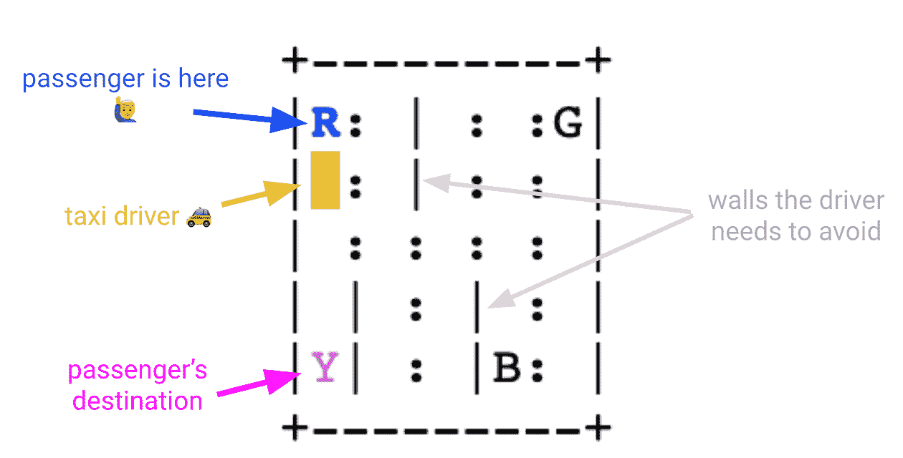

在网格世界中有四个指定位置，分别用 R(红色)、G(绿色)、Y(黄色) 和 B(蓝色) 标识。

当回合开始时，出租车从一个随机的方格出发，乘客位于随机的位置（R、G、Y 或 B）。

出租车驱动到乘客的位置，接载乘客，驾车到乘客的目的地（四个指定位置之一），然后将乘客放下。在此过程中，我们的出租车司机需要小心驾驶，以避免撞到标记为**|**的墙壁。一旦乘客被放下，当前回合结束。

这就是我们今天要构建的 Q-learning 代理的驾驶方式：

在我们到达之前，让我们了解一下这个环境中的动作、状态和奖励。

### 2\. 环境、动作、状态、奖励

[**notebooks/00_environment.ipynb**](https://github.com/Paulescu/hands-on-rl/blob/main/01_taxi/notebooks/00_environment.ipynb)

让我们首先加载环境：

代理在每一步可以选择的 **动作** 是什么？

+   0 向下行驶

+   1 向上行驶

+   2 向右行驶

+   3 向左行驶

+   4 载客

+   5 让乘客下车

那 **状态** 呢？

+   25 个可能的出租车位置，因为世界是一个 5×5 的网格。

+   5 个可能的乘客位置，分别是 R、G、Y、B，加上乘客在出租车中的情况。

+   4 个目的地

这给我们提供了 25 x 5 x 4 = 500 个状态。

那 **奖励** 呢？

+   **-1** 每步的默认奖励。

    *为什么是 -1，而不是简单的 0？* 因为我们希望通过惩罚每一步多余的时间来鼓励代理尽快完成。这是你对出租车司机的期望，不是吗？

+   **+20** 奖励用于将乘客送到正确的目的地。

+   **-10** 奖励用于在错误的位置执行接送操作。

你可以从 *env.P* 中读取奖励和环境转换 *(state, action) → next_state*。

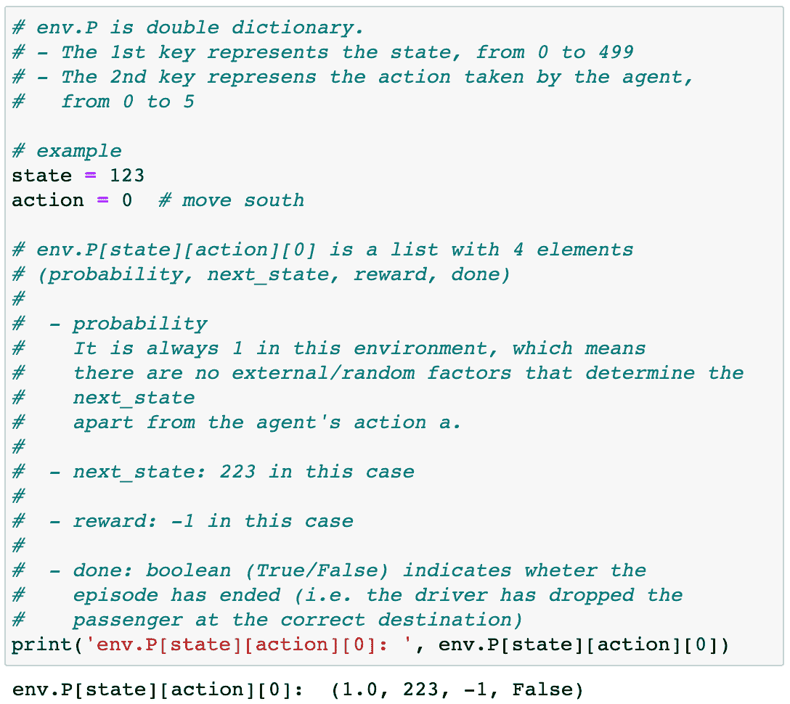

顺便说一下，你可以在每个状态下渲染环境，以重新检查这些 env.P 向量是否有意义：

从 *state=123* 开始：

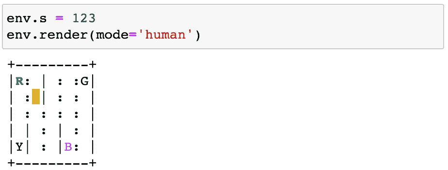

代理向南移动 action=0 到达状态=223：

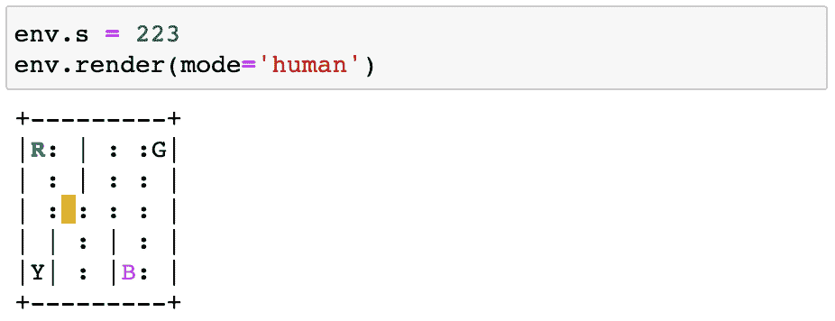

奖励是 -1，因为既没有回合结束，也没有司机错误地接送乘客。

### 3. 随机代理基线

[**notebooks/01_random_agent_baseline.ipynb**](https://github.com/Paulescu/hands-on-rl/blob/main/01_taxi/notebooks/01_random_agent_baseline.ipynb)

在你开始实现任何复杂算法之前，你应该始终建立一个基线模型。

这个建议不仅适用于强化学习问题，也适用于一般的机器学习问题。

直接跳入复杂/高级算法是非常诱人的，但除非你真的有经验，否则你会失败得很惨。

让我们使用一个随机代理作为基线模型。

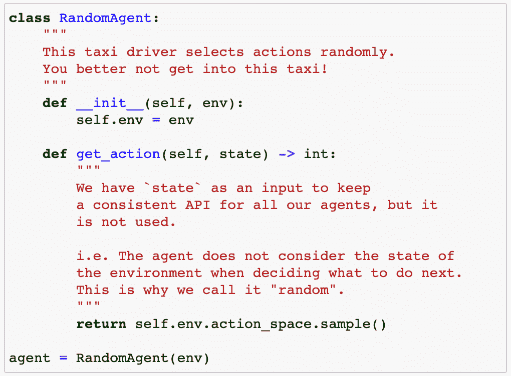

我们可以看到该代理在给定初始状态=198 时的表现：

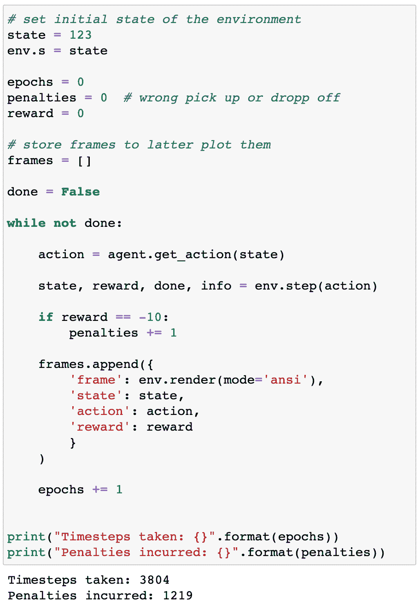

3,804 步是很多的！

请在此视频中自行观看：

为了获得更具代表性的性能衡量，我们可以重复相同的评估循环 n=100 次，每次从一个随机状态开始。

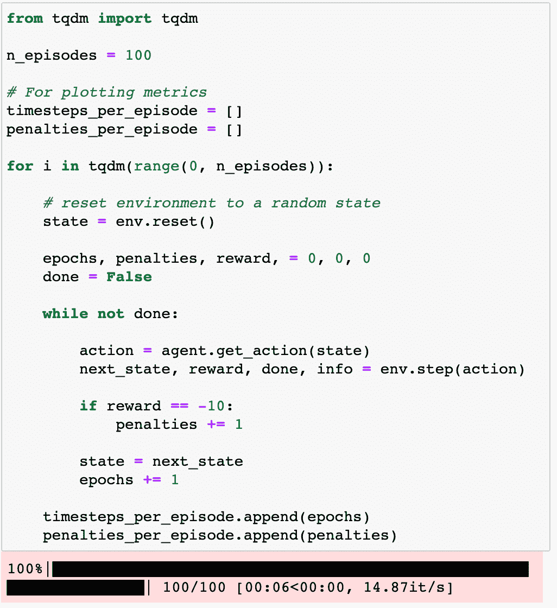

如果你绘制 *timesteps_per_episode* 和 *penalties_per_episode*，你可以观察到它们都不会随着代理完成更多的回合而减少。换句话说，代理没有学到任何东西。

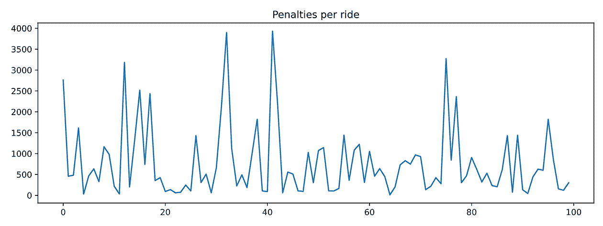

如果你想了解性能的总结统计数据，你可以计算平均值：

实现能学习的智能体是强化学习的目标，也是本课程的目标。

让我们使用 Q-learning 实现第一个“智能”智能体，Q-learning 是最早和最常用的 RL 算法之一。

### 4\. Q-learning 智能体

[**notebooks/02_q_agent.ipynb**](https://github.com/Paulescu/hands-on-rl/blob/main/01_taxi/notebooks/02_q_agent.ipynb)

[Q-learning](https://www.gatsby.ucl.ac.uk/~dayan/papers/cjch.pdf)（由 [Chris Walkins](http://www.cs.rhul.ac.uk/~chrisw/) 和 [Peter Dayan](https://en.wikipedia.org/wiki/Peter_Dayan) 提出）是一个用于寻找最优 q 值函数的算法。

正如我们在 [第一部分](https://www.kdnuggets.com/2021/12/hands-on-reinforcement-learning-course-part-1.html) 中所说，q 值函数 **Q(s, a)** 与策略 **π** 相关，表示当智能体在状态 **s** 时采取动作 **a** 并随后遵循策略 **π** 时，智能体期望获得的总奖励。

最优 q 值函数 **Q*(s, a)** 是与最优策略 **π*** 相关的 q 值函数。

如果你知道 **Q*(s, a)**，你可以推断 π*：即选择下一个动作，使其在当前状态 s 下最大化 Q*(s, a)。

Q-learning 是一个迭代算法，用于逐步计算更好地接近最优 q 值函数 **Q*(s, a)** 的近似值，从一个任意初始猜测 **Q⁰(s, a)** 开始。

在像 Taxi-v3 这样的有限状态和动作数量的表格环境中，q 函数实际上是一个矩阵。它有与状态数量相同的行和与动作数量相同的列，即 500 x 6。

好的，*那么你是如何从 Q⁰(s, a) 计算下一个近似 Q¹(s, a) 的？*

这是 Q-learning 中的关键公式：

当我们的 q-agent 在环境中导航并观察到下一个状态 ***s’*** 和奖励 ***r*** 时，你会使用这个公式来更新你的 q 值矩阵。

*在这个公式中，学习率**????**是什么？*

**学习率**（如同机器学习中的常规做法）是一个小数字，用来控制对 q 函数的更新幅度。你需要调整它，因为值过大会导致训练不稳定，而值过小可能不足以摆脱局部最小值。

*而这个折扣因子****????****呢？*

**折扣因子** 是一个介于 0 和 1 之间的（超）参数，用于决定我们的智能体对未来远期奖励的关注程度相对于即时奖励的程度。

+   当 ????=0 时，智能体只关注最大化即时奖励。正如生活中所发生的那样，最大化即时奖励并不是实现最佳长期结果的最佳方法。RL 智能体也会出现这种情况。

+   当 ????=1 时，智能体基于所有未来奖励的总和来评估每一个动作。在这种情况下，智能体对即时奖励和未来奖励赋予相等的权重。

折扣因子通常是一个中间值，例如 0.6。

总结一下，如果你

+   训练足够长时间

+   使用一个合适的学习率和折扣因子

+   并且智能体充分探索状态空间

+   并且你用 Q-learning 公式更新 q 值矩阵，

你的初始近似值最终会收敛到最优 q 矩阵。瞧！

那么，让我们实现一个 Q-agent 的 Python 类吧。

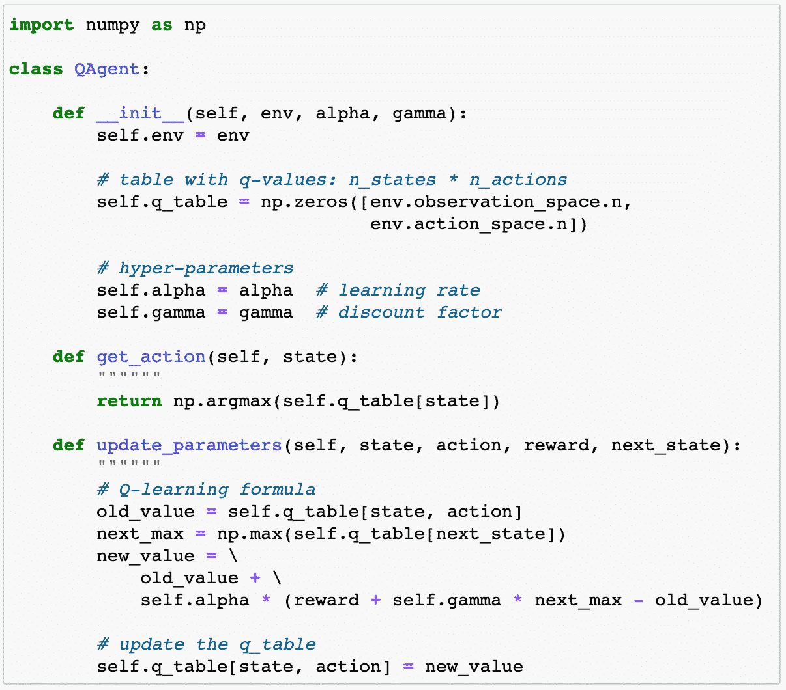

它的 API 与上面的 *RandomAgent* 相同，但多了一个方法 *update_parameters()*。这个方法接受过渡向量（*state*，*action*，*reward*，*next_state*）并使用上述 Q-learning 公式更新 q 值矩阵近似 *self.q_table*。

现在，我们需要将这个智能体插入到训练循环中，并每次智能体收集到新经验时调用它的 update_parameters() 方法。

此外，请记住我们需要确保智能体充分探索状态空间。记得我们在 [part 1](https://towardsdatascience.com/hands-on-reinforcement-learning-course-part-1-269b50e39d08) 中讨论的探索-利用参数吗？这就是 epsilon 参数介入的地方。

让我们训练智能体 *n_episodes =* 10,000 次，并使用 *epsilon* = 10%：

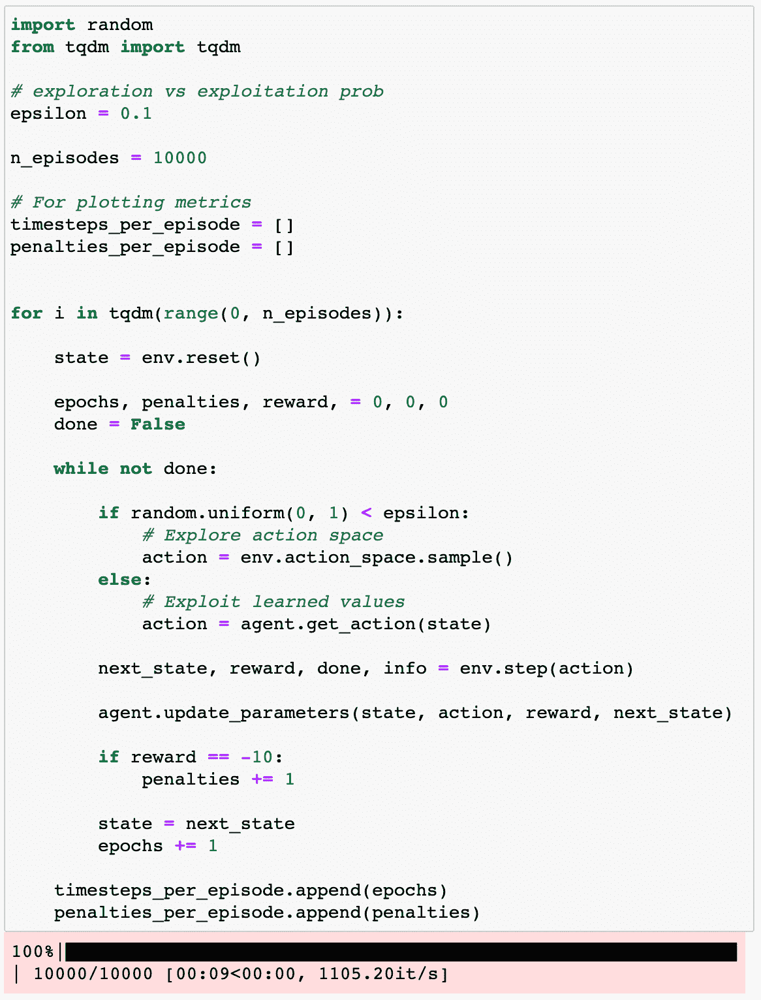

并绘制 *timesteps_per_episode* 和 *penalties_per_episode*：

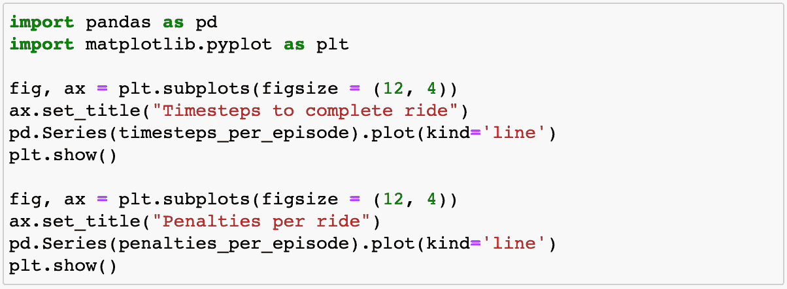

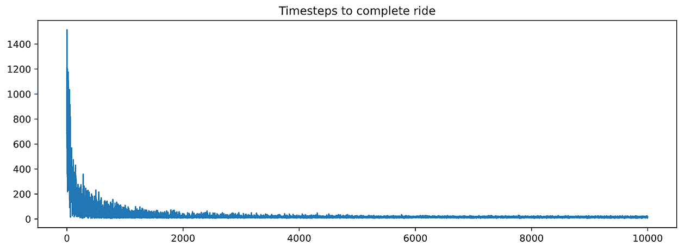

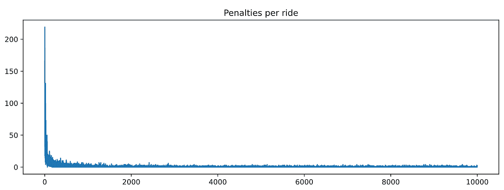

很好！这些图形比 *RandomAgent* 的图形好得多。两个指标随着训练的进行而下降，这意味着我们的智能体正在学习。

我们实际上可以看到智能体从相同的状态 = 123 开始驾驶，正如我们在 *RandomAgent* 中使用的那样。

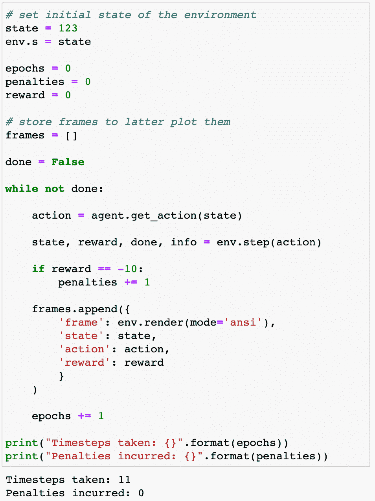

我们的 Q-agent 表现不错！

如果你想比较具体的数字，你可以评估 q-agent 在 100 次随机回合中的表现，并计算平均时间戳和惩罚次数。

***关于 epsilon-贪婪策略的简介***

当你评估智能体时，仍然建议使用一个正的 epsilon 值，而不是 epsilon = 0。

*为什么呢？难道我们的智能体已经完全训练好了吗？我们为什么需要在选择下一个动作时保留这种随机性？*

原因是为了防止过拟合。

即使在如此小的状态空间中，如 Taxi-v3（即 500 x 6），在训练过程中，我们的智能体可能没有访问到足够的某些状态。因此，在这些状态中的表现可能不是 100% 最优，导致智能体陷入一个几乎无限的次优动作循环中。如果 epsilon 是一个较小的正数（例如 5%），我们可以帮助智能体摆脱这些次优动作的无限循环。

通过在评估时使用较小的 epsilon，我们采用了所谓的 **epsilon-贪婪策略**。

让我们使用 *epsilon* = 0.05 对训练好的智能体进行评估，*n_episodes* = 100。观察训练循环几乎与上面的训练循环完全相同，但没有调用 *update_parameters()*：

这些数字比*RandomAgent*要好得多。

我们可以说我们的代理已经学会了驾驶出租车！

Q 学习为我们提供了一种计算最佳 q 值的方法。但*超参数*alpha、gamma 和 epsilon 呢？

我为你选择了它们，虽然有些随意。但在实际中，你需要为你的 RL 问题调整这些参数。

让我们探讨它们对学习的影响，以更好地理解发生了什么。

### 5. 超参数调整

[**notebooks/03_q_agent_hyperparameters_analysis.ipynb**](https://github.com/Paulescu/hands-on-rl/blob/main/01_taxi/notebooks/03_q_agent_hyperparameters_analysis.ipynb)

让我们使用不同的*alpha*（学习率）和*gamma*（折扣因子）来训练我们的 q-agent。至于*epsilon*，我们保持在 10%。

为了保持代码整洁，我将 q-agent 的定义封装在[src/q_agent.py](https://github.com/Paulescu/hands-on-rl/blob/50c61a385bbd511a6250407ffb1fcb59fbfb983f/01_taxi/src/q_agent.py#L4)中，将训练循环封装在[src/loops.py](https://github.com/Paulescu/hands-on-rl/blob/50c61a385bbd511a6250407ffb1fcb59fbfb983f/01_taxi/src/loops.py#L9)中的*train()*函数中。

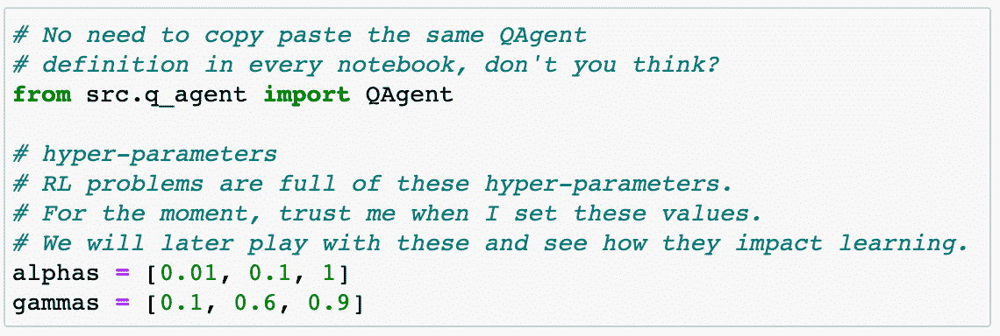

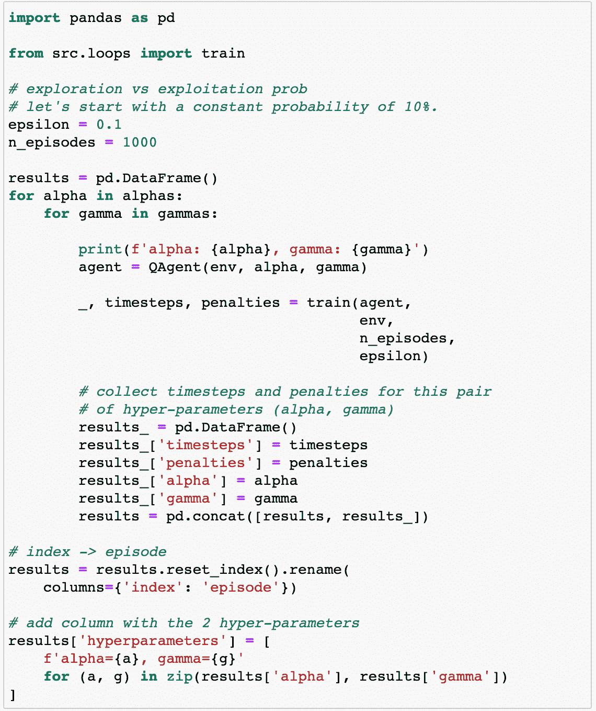

让我们绘制每种超参数组合的*timesteps*每集数。

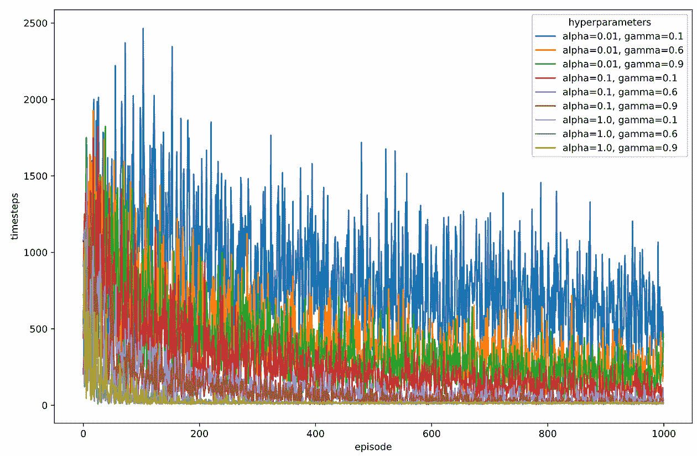

图表看起来很有艺术感，但有点过于嘈杂。

不过，你可以观察到，当*alpha* = 0.01 时，学习速度较慢。*alpha*（学习率）控制我们在每次迭代中更新 q 值的程度。值过小会导致学习速度变慢。

让我们丢弃*alpha* = 0.01，并对每种超参数组合进行 10 次训练。我们将这 10 次训练中每集数 1 到 1000 的*timesteps*取平均值。

我在[src/loops.py](https://github.com/Paulescu/hands-on-rl/blob/50c61a385bbd511a6250407ffb1fcb59fbfb983f/01_taxi/src/loops.py#L121)中创建了函数[train_many_runs()](https://github.com/Paulescu/hands-on-rl/blob/50c61a385bbd511a6250407ffb1fcb59fbfb983f/01_taxi/src/loops.py#L121)，以保持笔记本代码的整洁。

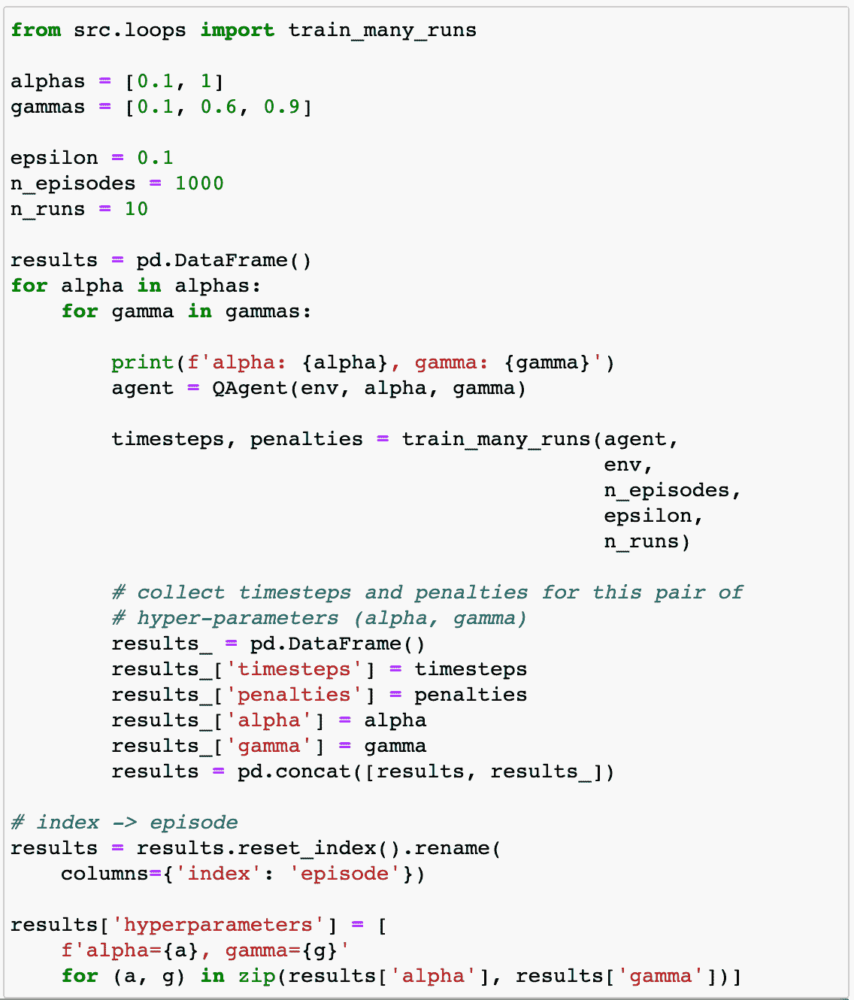

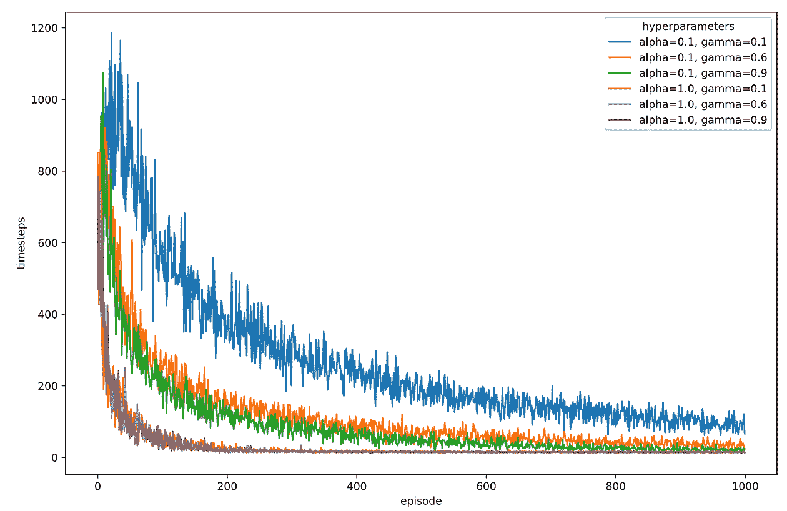

看起来*alpha* = 1.0 是效果最好的值，而 gamma 似乎影响较小。

恭喜！你已经调整了本课程中的第一个学习率。

调整超参数可能耗时且乏味。有一些优秀的库可以自动化我们刚刚执行的手动过程，比如[Optuna](https://optuna.org/)，但这是我们在课程后面会深入探讨的内容。暂时，享受我们刚刚发现的训练加速吧。

等等，那我让你相信的*epsilon = 10%*呢？

当前的 10%值是最佳的吗？

让我们自己检查一下。

我们采用了找到的最佳*alpha*和*gamma*，即，

+   alpha = 1.0

+   `gamma = 0.9`（我们也可以选择 `0.1` 或 `0.6`）

并使用不同的 epsilon 值进行训练 = [0.01, 0.1, 0.9]

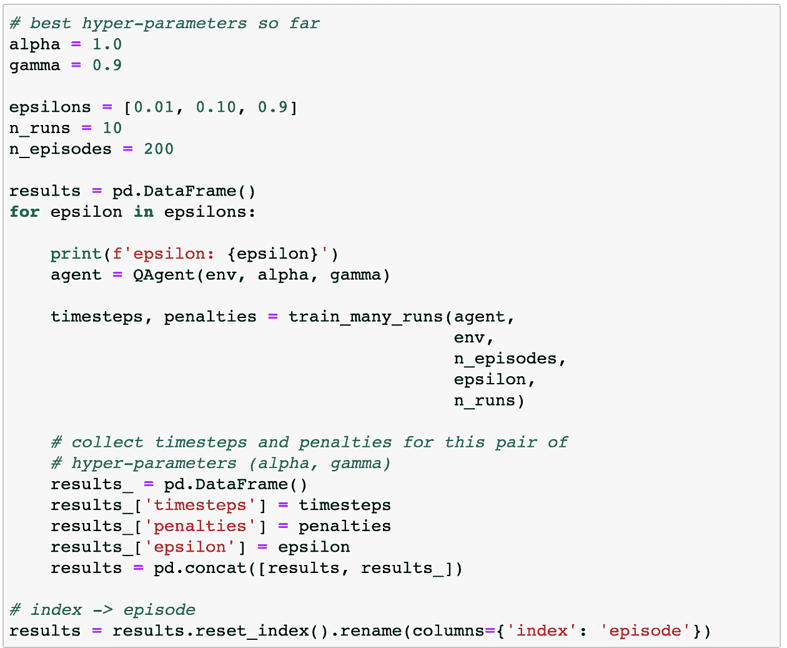

并绘制出结果中的 `timesteps` 和 `penalties` 曲线：

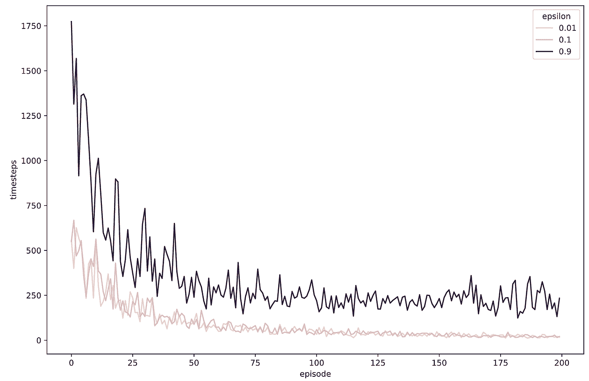

正如你所看到的，`epsilon = 0.01` 和 `epsilon = 0.1` 似乎都表现得非常好，因为它们在探索和利用之间达到了正确的平衡。

另一方面，`epsilon = 0.9` 是一个过大的值，会导致训练过程中的“过多”随机性，并阻止我们的 q 矩阵收敛到最佳状态。观察一下性能如何在每回合约 `250 timesteps` 处达到平稳。

一般来说，选择 `epsilon` 超参数的最佳策略是 **渐进式 epsilon 衰减**。也就是说，在训练的开始阶段，当代理对其 q 值估计非常不确定时，最好访问尽可能多的状态，而为此，大的 `epsilon` 是非常有用的（例如，50%）。

随着训练的进行，代理逐渐完善其 q 值估计，探索的必要性就减少了。相反，通过降低 `epsilon`，代理可以学会完善和微调 q 值，使其更快地收敛到最佳值。过大的 `epsilon` 可能会导致收敛问题，就像我们看到的 `epsilon = 0.9` 一样。

我们将在课程中调整 epsilon 值，因此目前我不会过多坚持。再次，享受我们今天所做的事情。这是非常值得的。

*B-R-A-V-O!（图片来自作者）。*

### 复习

祝贺你（可能）解决了你的第一个强化学习问题。

这些是我希望你仔细思考的关键学习点：

+   强化学习问题的难度与可能的动作和状态的数量直接相关。 `Taxi-v3` 是一个表格环境（即有限数量的状态和动作），所以它比较简单。

+   Q-learning 是一种在表格环境中表现优秀的学习算法。

+   无论你使用什么强化学习算法，都需要调整超参数以确保你的代理学习到最佳策略。

+   调整超参数是一个耗时的过程，但对于确保我们的代理能学习是必要的。随着课程的进展，我们会在这方面做得更好。

### 作业

[**notebooks/04_homework.ipynb**](https://github.com/Paulescu/hands-on-rl/blob/main/01_taxi/notebooks/04_homework.ipynb)

这是我希望你做的事情：

1.  [将 Git 仓库克隆](https://github.com/Paulescu/hands-on-rl) 到你的本地机器上。

1.  [设置](https://github.com/Paulescu/hands-on-rl/tree/main/01_taxi#quick-setup) 这个课程的环境 01_taxi。

1.  打开 [01_taxi/otebooks/04_homework.ipynb](https://github.com/Paulescu/hands-on-rl/blob/main/01_taxi/notebooks/04_homework.ipynb) 并尝试完成这两个挑战。

我称这些为挑战（而不是练习），因为它们并不容易。我希望你能尝试这些挑战，动手实践，并（也许）成功。

在第一个挑战中，我敢打赌你会更新`train()`函数`src/loops.py`以接受一个依赖于回合的 epsilon。

在第二个挑战中，我希望你提升你的 Python 技能，并实现并行处理以加速超参数实验。

如往常一样，如果你遇到困难并需要反馈，请发邮件给我，邮箱是 plabartabajo@gmail.com。

我会非常乐意帮助你。

如果你想获取课程更新，请订阅[**datamachines**](https://datamachines.xyz/subscribe/)通讯。

[原始](http://datamachines.xyz/2021/12/06/hands-on-reinforcement-learning-course-part-2/)。经许可转载。

* * *

## 我们的前三个课程推荐

 1\. [Google 网络安全证书](https://www.kdnuggets.com/google-cybersecurity) - 快速开启网络安全职业之路。

 2\. [Google 数据分析专业证书](https://www.kdnuggets.com/google-data-analytics) - 提升你的数据分析技能

 3\. [Google IT 支持专业证书](https://www.kdnuggets.com/google-itsupport) - 支持你的组织 IT

* * *

### 更多相关内容

+   [实际操作强化学习课程第三部分：SARSA](https://www.kdnuggets.com/2022/01/handson-reinforcement-learning-course-part-3-sarsa.html)

+   [实际操作强化学习课程，第一部分](https://www.kdnuggets.com/2021/12/hands-on-reinforcement-learning-course-part-1.html)

+   [HuggingFace 推出了免费的深度强化学习课程](https://www.kdnuggets.com/2022/05/huggingface-launched-free-deep-reinforcement-learning-course.html)

+   [实际操作监督学习：线性回归](https://www.kdnuggets.com/handson-with-supervised-learning-linear-regression)

+   [实际操作无监督学习：K 均值聚类](https://www.kdnuggets.com/handson-with-unsupervised-learning-kmeans-clustering)

+   [大型语言模型的生成式 AI：实践培训](https://www.kdnuggets.com/2023/07/generative-ai-large-language-models-handson-training.html)
