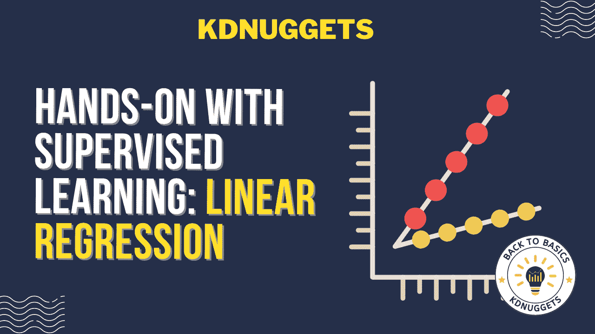
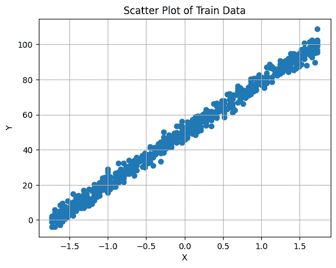

# 实践监督学习：线性回归

> 原文：[`www.kdnuggets.com/handson-with-supervised-learning-linear-regression`](https://www.kdnuggets.com/handson-with-supervised-learning-linear-regression)



作者提供的图像

# 基本概述

* * *

## 我们的前三大课程推荐

 1\. [谷歌网络安全证书](https://www.kdnuggets.com/google-cybersecurity) - 快速进入网络安全职业的快车道。

 2\. [谷歌数据分析专业证书](https://www.kdnuggets.com/google-data-analytics) - 提升你的数据分析能力

 3\. [谷歌 IT 支持专业证书](https://www.kdnuggets.com/google-itsupport) - 支持你的组织的 IT 需求

* * *

线性回归是基本的监督机器学习算法，用于根据输入特征预测连续目标变量。顾名思义，它假设因变量和自变量之间的关系是线性的。因此，如果我们尝试绘制因变量 Y 对自变量 X 的图，我们将得到一条直线。该直线的方程可以表示为：


其中，

+   **Y**   预测输出。

+   **X** =  输入特征或多元线性回归中的特征矩阵

+   **b0** = 截距（直线与 Y 轴的交点）。

+   **b1** =  确定直线陡峭度的斜率或系数。

线性回归的核心思想在于找到最佳拟合线，以使实际值与预测值之间的误差最小。它通过估计 b0 和 b1 的值来实现这一点。然后我们利用这条直线进行预测。

# 使用 Scikit-Learn 的实现

你现在已经理解了线性回归的理论，但为了进一步巩固我们的理解，接下来我们将使用 Python 中的流行机器学习库 Scikit-learn 构建一个简单的线性回归模型。请继续关注，以便更好地理解。

## 1\. 导入必要的库

首先，你需要导入所需的库。

```py
import os
import pandas as pd
import numpy as np
import matplotlib.pyplot as plt
from sklearn.linear_model import LinearRegression
from sklearn.preprocessing import StandardScaler
from sklearn.metrics import mean_squared_error
```

## 2\. 分析数据集

你可以在 [这里](https://www.kaggle.com/datasets/andonians/random-linear-regression) 找到数据集。它包含了用于训练和测试的独立 CSV 文件。我们先展示一下数据集，并在继续之前进行分析。

```py
# Load the training and test datasets from CSV files
train = pd.read_csv('train.csv')
test = pd.read_csv('test.csv')

# Display the first few rows of the training dataset to understand its structure
print(train.head())
```

**输出：**


train.head()

数据集包含两个变量，我们想根据 x 的值预测 y。

```py
# Check information about the training and test datasets, such as data types and missing values
print(train.info())
print(test.info())
```

**输出：**

```py
 <class>RangeIndex: 700 entries, 0 to 699
Data columns (total 2 columns):
 #   Column  Non-Null Count  Dtype  
---  ------  --------------  -----  
 0   x       700 non-null    float64
 1   y       699 non-null    float64
dtypes: float64(2)
memory usage: 11.1 KB

 <class>RangeIndex: 300 entries, 0 to 299
Data columns (total 2 columns):
 #   Column  Non-Null Count  Dtype  
---  ------  --------------  -----  
 0   x       300 non-null    int64  
 1   y       300 non-null    float64
dtypes: float64(1), int64(1)
memory usage: 4.8 KB</class></class>
```

上述输出显示我们在训练数据集中有一个缺失值，可以通过以下命令移除：

```py
train = train.dropna()
```

同时，检查你的数据集中是否包含重复项，并在将其输入模型之前将其删除。

```py
duplicates_exist = train.duplicated().any()
print(duplicates_exist)
```

**输出：**

```py
False
```

## 2\. 预处理数据集

现在，通过以下代码准备训练和测试数据及目标：

```py
#Extracting x and y columns for train and test dataset
X_train = train['x']
y_train = train['y']
X_test = test['x']
y_test = test['y']
print(X_train.shape)
print(X_test.shape)
```

**输出：**

```py
(699, )
(300, )
```

你可以看到我们有一个一维数组。虽然你可以用一维数组与一些机器学习模型，但这不是最常见的做法，并且可能会导致意外的行为。因此，我们将其重塑为 (699,1) 和 (300,1)，以明确指定每个数据点有一个标签。

```py
X_train = X_train.values.reshape(-1, 1)
X_test = X_test.values.reshape(-1,1)
```

当特征处于不同的尺度上时，一些特征可能会主导模型的学习过程，导致结果不正确或次优。为此，我们进行标准化，使得我们的特征均值为 0，标准差为 1。

之前：

```py
print(X_train.min(),X_train.max())
```

输出：

```py
(0.0, 100.0)
```

标准化：

```py
scaler = StandardScaler()
scaler.fit(X_train)
X_train = scaler.transform(X_train)
X_test = scaler.transform(X_test)
print((X_train.min(),X_train.max())
```

输出：

```py
(-1.72857469859145, 1.7275858114641094)
```

我们现在已经完成了基本的数据预处理步骤，我们的数据已经准备好用于训练。

## 4\. 可视化数据集

首先可视化目标变量与特征之间的关系是很重要的。你可以通过绘制散点图来实现：

```py
# Create a scatter plot
plt.scatter(X_train, y_train)
plt.xlabel('X')
plt.ylabel('Y')
plt.title('Scatter Plot of Train Data')
plt.grid(True)  # Enable grid
plt.show() 
```



图片由作者提供

## 5\. 创建并训练模型

我们现在将创建一个 Linear Regression 模型的实例，并尝试将其拟合到我们的训练数据集中。它找到最适合你数据的线性方程的系数（斜率）。然后使用这条线进行预测。此步骤的代码如下：

```py
# Create a Linear Regression model
model = LinearRegression()

# Fit the model to the training data 
model.fit(X_train, y_train)

# Use the trained model to predict the target values for the test data
predictions = model.predict(X_test)

# Calculate the mean squared error (MSE) as the evaluation metric to assess model performance
mse = mean_squared_error(y_test, predictions)
print(f'Mean squared error is: {mse:.4f}')
```

输出：

```py
Mean squared error is: 9.4329
```

## 6\. 可视化回归线

我们可以使用以下命令绘制回归线：

```py
# Plot the regression line
plt.plot(X_test, predictions, color='red', linewidth=2, label='Regression Line')

plt.xlabel('X')
plt.ylabel('Y')
plt.title('Linear Regression Model')
plt.legend()
plt.grid(True)
plt.show()
```

输出：


图片由作者提供

# 结论

完成了！你现在已经成功地使用 Scikit-learn 实现了一个基本的线性回归模型。你在这里获得的技能可以扩展到处理具有更多特征的复杂数据集。这是一个值得在空闲时间探索的挑战，它打开了数据驱动问题解决和创新的激动人心的世界的大门。

**[Kanwal Mehreen](https://www.linkedin.com/in/kanwal-mehreen1)** 是一位有志的软件开发者，对数据科学和人工智能在医学中的应用充满兴趣。Kanwal 被选为 2022 年 APAC 区域的 Google Generation Scholar。Kanwal 喜欢通过撰写关于热门话题的文章来分享技术知识，并对提高女性在技术行业中的代表性充满热情。

### 更多相关主题

+   [机器学习中使用的主要监督学习算法](https://www.kdnuggets.com/2022/06/primary-supervised-learning-algorithms-used-machine-learning.html)

+   [KDnuggets 新闻，6 月 22 日：主要的监督学习算法……](https://www.kdnuggets.com/2022/n25.html)

+   [比较线性回归与逻辑回归](https://www.kdnuggets.com/2022/11/comparing-linear-logistic-regression.html)

+   [3 个理由说明为什么你应该使用线性回归模型而不是…](https://www.kdnuggets.com/2021/08/3-reasons-linear-regression-instead-neural-networks.html)

+   [线性回归与逻辑回归：简明解释](https://www.kdnuggets.com/2022/03/linear-logistic-regression-succinct-explanation.html)

+   [KDnuggets 新闻 22:n12，3 月 23 日：最佳数据科学书籍…](https://www.kdnuggets.com/2022/n12.html)
