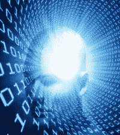
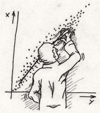

# 招聘数据科学家：需要关注什么？

> 原文：[`www.kdnuggets.com/2014/09/hiring-data-scientist-what-to-look-for.html`](https://www.kdnuggets.com/2014/09/hiring-data-scientist-what-to-look-for.html)

客座帖子由 Bart Baesens、Richard Weber、Cristián Bravo 提供，2014 年 9 月 9 日

如今，大数据和分析无处不在。IBM 预测，我们每天生成 2.5 亿亿字节的数据。这意味着全球 90%的数据是在过去两年内创建的。Gartner 预测，到 2015 年，85%的财富 500 强公司将无法利用大数据获得竞争优势，大约将创造 440 万个与大数据相关的工作岗位。

尽管这些估算不应被绝对解读，但它们强烈表明了大数据的普遍性以及对分析技能和资源的需求，因为随着数据的积累，以最佳方式管理和分析这些数据资源成为创造竞争优势和战略杠杆的关键成功因素。为应对这些挑战，公司正在招聘数据科学家。然而，在行业中，对什么构成一个优秀的数据科学家存在强烈的误解和分歧。以下是构成优秀数据科学家的关键特征：

**数据科学家应当是一个出色的程序员！**

根据定义，数据科学家与数据打交道。这涉及许多活动，如数据采样和预处理、模型估算和后处理（例如敏感性分析、模型部署、回测、模型验证）。尽管如今市场上有许多用户友好的软件工具可以自动化这些过程，但每次分析都需要量身定制的步骤来应对特定业务问题的特点。为了成功完成这些步骤，需要进行编程。因此，一个优秀的数据科学家应具备扎实的编程技能，例如 R、Python、SAS 等。编程语言本身并不是那么重要，只要他/她熟悉编程的基本概念，并知道如何利用这些概念自动化重复任务或执行特定的例程。

**数据科学家应具备扎实的定量技能！**

显然，数据科学家应具备扎实的统计学、机器学习和/或数据挖掘背景。这些不同学科之间的区别越来越模糊，实际上并不那么重要。它们都提供了一套定量技术来分析数据，并在特定背景下（如风险管理、欺诈检测、市场分析等）发现与业务相关的模式。数据科学家应该了解何时以及如何应用哪种技术。他/她不应过于关注底层数学（如优化）细节，而应对某项技术解决的分析问题以及其结果的解释有良好的理解。在这方面，计算机科学和商业/工业工程的工程师培训应致力于综合的、多学科的视角，培养既能运用技术又具备将新项目实现的商业头脑的近期毕业生。

在这种情况下，另一个重要的方面是花足够的时间来验证所获得的分析结果，以避免被称为数据修饰和/或数据折磨的情况，其中数据被（故意）误表示和/或过多关注于讨论虚假的相关性。在选择最佳的定量技术时，数据科学家应考虑业务问题的具体性。分析模型的典型要求包括：可操作性（分析模型在多大程度上解决了业务问题？），性能（分析模型的统计表现如何？），可解释性（分析模型是否容易向决策者解释？），操作效率（建立、评估和监控分析模型需要多少努力？），合规性（模型是否符合规定？）以及经济成本（建立、运行和维护模型的成本是多少？）。基于这些要求的综合考虑，数据科学家应能够选择最佳的分析技术来解决业务问题。

**数据科学家应该在沟通和可视化技能上表现出色！**

不管喜欢与否，分析都是一项技术性工作。目前，分析模型与业务用户之间存在巨大差距。要弥合这一差距，沟通和 可视化工具至关重要！因此，数据科学家应该知道如何使用例如交通灯方法、OLAP（联机分析处理）工具、If-then 业务规则等，以用户友好的方式表示分析模型及其附带的统计数据和报告。他/她应该能够传达适量的信息，而不会陷入复杂的（例如统计）细节中，这会阻碍模型的成功部署。这样，业务用户将更好地理解其（大）数据中的特征和行为，从而改善他们对分析模型的态度和接受度。教育机构必须学会平衡，因为许多学位课程会使学生偏向于过多的分析知识或过多的实践知识。

**数据科学家应该具有扎实的业务理解能力！**

虽然这可能显而易见，但我们已经见证了（过多的）数据科学项目失败的原因是相关分析师未能理解所面临的业务问题。这里的“业务”指的是相关的应用领域，例如在实际业务背景下的客户流失预测或信用评分，或者如果分析的数据来自这些领域，则可能是天文学或医学。

**数据科学家应该具有创造力！**

数据科学家至少需要在两个层面上展现创造力。首先，在技术层面上，创造性在特征选择、数据转换和清洗方面至关重要。这些标准知识发现过程的步骤必须根据每个特定应用进行调整，而“正确的猜测”往往能带来巨大的不同。其次，大数据和分析是一个快速发展的领域！新问题、新技术及其相关挑战不断出现。数据科学家需要跟上这些新技术，并具备足够的创造力来发掘它们带来的新商机。

**结论：**

我们提供了在招聘数据科学家时需要注意的特征的简要概述。总之，考虑到大数据和分析的多学科性质，数据科学家应该具备一系列技能：编程、量化建模、沟通和可视化、业务理解以及创造力！下图展示了如何表示这样的个人档案。 图：数据科学家的档案。

**作者：**

[**巴特·贝森斯**](http://be.linkedin.com/pub/bart-baesens/3/bb8/403) 是 KU Leuven（比利时）的教授，同时也是南安普顿大学（英国）的讲师。他在大数据和分析领域进行了广泛的研究。他的研究成果已发表在著名的国际期刊上，并在国际顶级会议上展示。他还著有以下书籍：[*信用风险管理：基本概念*](https://www.amazon.com/Credit-Risk-Management-Basic-Concepts/dp/0199545111/)，以及 [*大数据世界中的分析*](https://www.amazon.com/Analytics-Big-Data-World-Applications/dp/1118892704)，由 Wiley 于 2014 年出版。他的研究总结见于 [www.dataminingapps.com](http://www.dataminingapps.com/)。他还定期辅导、咨询并提供有关分析策略的咨询支持。

[**理查德·韦伯**](http://cl.linkedin.com/pub/richard-weber/0/528/243) 是智利大学（智利）的教授，教授数据挖掘和运营管理课程，包括本科、研究生课程以及高管教育。他的研究兴趣包括数据挖掘、相关的方法学发展，以及在金融、市场营销和安全相关领域的应用。他的工作成果已发表在领先的科学期刊上。

[**克里斯蒂安·布拉沃**](http://cl.linkedin.com/in/cristianbravor) 是智利塔尔卡大学的讲师，目前在 KU Leuven（比利时）担任访问研究员。他是一名工业工程师，拥有运营研究硕士学位和智利大学的工程系统博士学位。他曾担任智利大学金融中心的研究主任，并在多个数据挖掘和运筹学期刊上发表过文章。他的研究兴趣涵盖信用风险，特别是应用于微型企业，以及该领域的数据挖掘模型。

**相关：**

+   大数据引领高薪技能

+   数据科学家是适合你的职业路径吗？坦诚建议

+   **迈克尔·奥康奈尔**，TIBCO 首席数据科学家，谈如何在大数据领域领导

* * *

## 我们的前三个课程推荐

 1\. [Google 网络安全证书](https://www.kdnuggets.com/google-cybersecurity) - 快速进入网络安全职业道路

 2\. [Google 数据分析专业证书](https://www.kdnuggets.com/google-data-analytics) - 提升你的数据分析技能

 3\. [Google IT 支持专业证书](https://www.kdnuggets.com/google-itsupport) - 支持你的组织的 IT

* * *

### 更多相关话题

+   [招聘经理寻找的数据科学家应具备的品质](https://www.kdnuggets.com/2022/04/qualities-hiring-managers-looking-data-scientists.html)

+   [2022 年招聘数据科学家的顶尖行业和雇主](https://www.kdnuggets.com/2022/06/top-industries-employers-hiring-data-scientists-2022.html)

+   [KDnuggets™ 新闻 22:n03, 1 月 19 日：深入探讨 13 种数据…](https://www.kdnuggets.com/2022/n03.html)

+   [深入探讨 13 种数据科学家角色及其职责](https://www.kdnuggets.com/2022/01/deep-look-13-data-scientist-roles-responsibilities.html)

+   [高保真合成数据：数据工程师与数据科学家都适用](https://www.kdnuggets.com/2022/tonic-high-fidelity-synthetic-data-engineers-scientists-alike.html)

+   [我们不需要数据科学家，我们需要数据工程师](https://www.kdnuggets.com/2021/02/dont-need-data-scientists-need-data-engineers.html)
