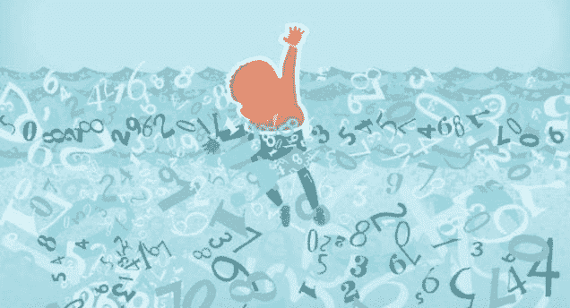

# 让我们诚实面对：我们正被数据淹没

> 原文：[`www.kdnuggets.com/2020/09/honest-drowning-data.html`](https://www.kdnuggets.com/2020/09/honest-drowning-data.html)

评论

**作者：[Jonathan Martini](https://www.linkedin.com/in/jonathanmartini/)，[PixelTItan](https://pixeltitan.ai/)首席技术官**

[图片来源](https://www.vizion.com/blog/data-overload-when-it-all-becomes-too-much/)

* * *

## 我们的前三名课程推荐

 1\. [谷歌网络安全证书](https://www.kdnuggets.com/google-cybersecurity) - 快速进入网络安全职业生涯。

 2\. [谷歌数据分析专业证书](https://www.kdnuggets.com/google-data-analytics) - 提升你的数据分析能力

 3\. [谷歌 IT 支持专业证书](https://www.kdnuggets.com/google-itsupport) - 支持你所在组织的 IT 需求

* * *

智能设备的兴起、信息流的不断复杂化，以及记录、处理和解读所有这些信息的工具的激增，让我们处于“跟上”可能是我们能期待的最佳状态。技术存在继承性问题，因此在我们创新时，往往引入比实际需要更多的复杂性。随着系统的演变，我们这些帮助设计它们的人不断权衡技术债务的“必要性”。通过首先简要回顾，了解限制和影响我们现状的力量，可能有助于理解未来的选项。

### **我们是如何到达这里的**

在数据演变的最初大约 30 年里，世界是结构化的，关系数据库是常态，工程师需要了解的语言集有限（主要以 SQL 为主）。与数据库交互所需的工具效率高，数据大多较为干净。以仪表盘形式生成的报告相对容易解读，并且提供了有意义的衡量标准作为决策依据。随着统计分析和数据挖掘在 1990 年代的兴起，这些结果变得更加深刻。

随着 1990 年代的结束，我们见证了互联网的崛起，随之而来的是一种新的数据类型：非结构化数据。之前的结构化内容系统，凭借其成熟的分析工具和相对容易理解且定义明确的数据类型仍然存在。但非结构化数据需要一种新的处理方式，并且为那些懂得如何使用它的人提供了新的洞察机会。网络使用创造了一个不断上传到社交媒体网站的媒体流。我们看到了传感器和智能设备网络的初步形成（这些设备后来被称为物联网），每天都在生成越来越多的数据。处理和理解这些数据的新方式是必要的。旧有系统和工具进化为新的系统，以跟上步伐，而能够驾驭这些系统的人便成为了我们现在所称的数据科学家。我们还见证了长期存储从物理服务器和数据仓库转向云存储，导致我们的行业从以数据中心为重点演变为在各种云解决方案和服务中日益多样化。

在 2010 年代，我们继续看到非结构化数据的指数级增长，随着移动设备变得越来越普及。随着这些设备的普及，我们看到了地理空间数据存储的增加，以及来自设备的行为数据的加入到非结构化数据中。此外，“智能设备”的日益普及进一步加速了数据的生成和存储需求的增加。

### **当前状态**

对于许多处理技术基础设施和/或服务的高级领导者来说，系统结构的详细视图可能长达数十页，并包括多个供应商和服务提供商之间的依赖关系。它还会（在大多数情况下）包括处理他们所处理的每类数据的单独程序和流程，并且必须考虑对这些数据适用的任何法规和法律。此外，这些程序需要每个操作链步骤的专家。无论是分析师和数据科学家清洗数据以获得有价值的洞察，还是工程师整合不同的系统使它们能够相互通信，每个角色都既对所处的整体系统有所贡献，又受到其限制。

随着系统的发展，它必然会带来三个主要问题。首先，数据往往会闲置，除非有明确需求。其次，为了管理这些闲置的数据集，公司必须雇佣更多的人来满足系统产生的需求。无论是分析师和数据科学家，还是设计*新*系统的工程师，以自动化当前由人员执行的流程。将新系统添加到工作流程中会导致需要设计次级系统，以便将这些自动化过程的输出重新引入当前的数据流。第三，接受前两个问题会以复合率不断增长，只要数据源继续输出越来越多的新信息。

### **它可能的样子**

如果我们从零开始，了解当前世界的状态以及数据的生成方式，我们是否还会继续使用现在的系统？为了被大多数大型数据创造者和消费者视为“理想”解决方案，理想的数据流需要具备什么？

从高层次来看，我们需要遵守六个基本原则：

1.  由数据处理效率驱动

1.  数据类型无关（结构化与非结构化，以及处理语言）

1.  人类互动应尽可能简单和最小化

1.  可扩展性和适应性驱动架构决策

1.  安全性和隐私应成为整个系统的基础

1.  从财务上讲，它必须比当前的现状成本更低

如果我们设想一个围绕这六个指导原则设计的系统，它对现代企业来说会是什么样子，并且它们现在会有什么优势？首先，它们将具备将工作组重新调整到人类创造力和输入能够带来更大价值的业务领域的灵活性。这可能会导致探索新的业务线或服务，这些在以前可能由于成本问题不可行，或者由于旧系统的限制而无法执行。此外，对非结构化数据的方法的重新构想可能会揭示我们当前无所作为的现有数据的新用例。

不时地客观审视我们做事的*方式和原因*可以带来有价值的见解。我们站在计算、技术及其融入日常生活的漫长演变的终点。未来我们如何使用我们不断创建的数据仍有待观察，但我们确实有两点绝对确定：

1.  我们将继续以比现在高得多的速度创建数据

1.  如果不对处理我们创建的数据的系统进行新的方法改进，我们最终将无法看到数据告诉我们的全部范围

**简历：[Jonathan Martini](https://www.linkedin.com/in/jonathanmartini/)** 是 **[PixelTItan](https://pixeltitan.ai/)** 的首席技术官。PixelTitan 是一家新创公司，致力于解决非结构化数据的难题。由一群在活动、摄影和技术领域经验丰富的专业人士创办，PixelTitan 的独特专利待审技术使公司能够处理数据定义，而不是直接处理数据本身，这意味着 PixelTitan 不受文件类型或文件大小的限制，能够提供满足 AI 需求的数据集。

**相关：**

+   数据分析中的 5 大趋势

+   向大数据提出的 3 个关键数据科学问题

+   我们如何更好地解决分析问题？

### 更多相关主题

+   [开源向量数据库的诚实比较](https://www.kdnuggets.com/an-honest-comparison-of-open-source-vector-databases)

+   [数据科学职位标题导航：数据分析师 vs. 数据科学家…](https://www.kdnuggets.com/navigating-data-science-job-titles-data-analyst-vs-data-scientist-vs-data-engineer)

+   [数据科学家、数据工程师及其他数据职业解析](https://www.kdnuggets.com/2021/05/data-scientist-data-engineer-data-careers-explained.html)

+   [高保真合成数据适用于数据工程师和数据科学家](https://www.kdnuggets.com/2022/tonic-high-fidelity-synthetic-data-engineers-scientists-alike.html)

+   [数据科学家 vs 数据分析师 vs 数据工程师](https://www.kdnuggets.com/2022/01/data-scientist-data-analyst-data-engineer.html)

+   [数据仓库 vs. 数据湖 vs. 数据集市：需要帮助决定吗？](https://www.kdnuggets.com/data-warehouses-vs-data-lakes-vs-data-marts-need-help-deciding)
