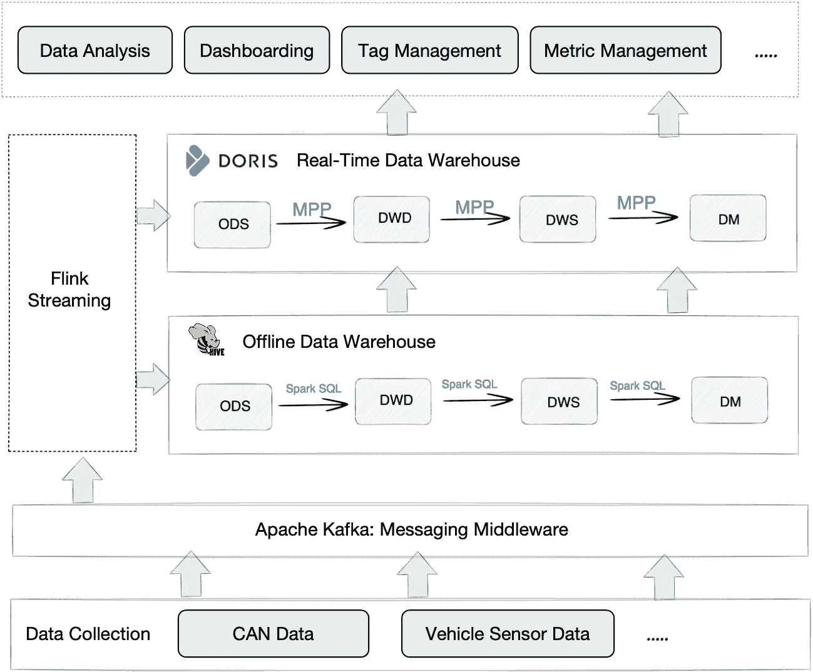
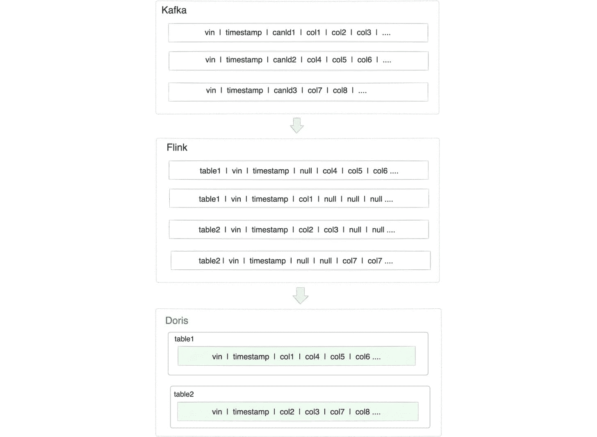
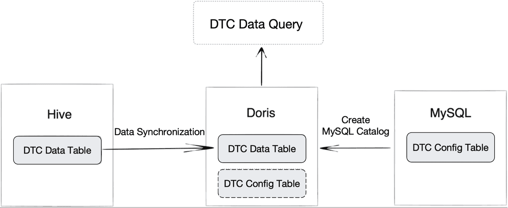

# 大数据如何实时拯救生命：IoV 数据分析帮助预防事故

> 原文：[`www.kdnuggets.com/how-big-data-is-saving-lives-in-real-time-iov-data-analytics-helps-prevent-accidents`](https://www.kdnuggets.com/how-big-data-is-saving-lives-in-real-time-iov-data-analytics-helps-prevent-accidents)

图片来源：[罗伯托·尼克松](https://www.pexels.com/photo/person-sitting-inside-car-2526127/)

车联网（IoV）是汽车工业与物联网（IoT）结合的产物。预计 IoV 数据将越来越大，特别是随着电动车成为汽车市场的新增长引擎。问题是：你的数据平台是否准备好了？这篇文章展示了一个适用于 IoV 的 OLAP 解决方案的样子。

* * *

## 我们的前三大课程推荐

 1\. [谷歌网络安全证书](https://www.kdnuggets.com/google-cybersecurity) - 快速进入网络安全职业生涯

 2\. [谷歌数据分析专业证书](https://www.kdnuggets.com/google-data-analytics) - 提升你的数据分析技能

 3\. [谷歌 IT 支持专业证书](https://www.kdnuggets.com/google-itsupport) - 支持你的组织 IT 需求

* * *

# IoV 数据有什么特别之处？

IoV 的理念很直观：创建一个网络，使车辆能够彼此之间或与城市基础设施共享信息。常常被解释不足的是每辆车内部的网络。每辆车上都有一个称为控制器局域网（CAN）的系统，它作为电子控制系统的通信中心。对于在道路上行驶的汽车来说，CAN 是安全和功能的保障，因为它负责：

+   **车辆系统监控**：CAN 是车辆系统的脉搏。例如，传感器将检测到的温度、压力或位置发送到 CAN；控制器通过 CAN 向执行器发出指令（如调整阀门或驱动电机）。

+   **实时反馈**：通过 CAN，传感器将速度、转向角度和刹车状态发送到控制器，控制器及时调整车辆以确保安全。

+   **数据共享与协调**：CAN 允许各种设备之间的数据交换（如状态和指令），使整个系统更加高效和性能优越。

+   **网络管理与故障排除**：CAN 监视系统中的设备和组件。它识别、配置并监控设备以进行维护和故障排除。

由于 CAN 的繁忙，你可以想象每天通过 CAN 传输的数据规模。在本篇文章中，我们谈论的是一家连接了 400 万辆车的汽车制造商，每天需要处理 1000 亿条 CAN 数据。

# IoV 数据处理

将这些巨大的数据规模转化为指导产品开发、生产和销售的有价值信息是关键部分。像大多数数据分析工作负载一样，这归结于数据写入和计算，这也是存在挑战的地方：

+   **大规模数据写入**：传感器在汽车的各个地方都有：车门、座椅、刹车灯……此外，许多传感器会收集多个信号。400 万辆车累计的数据吞吐量达到数百万 TPS，这意味着每天有数十 TB 的数据。随着汽车销售的增加，这个数字还在增长。

+   **实时分析**：这也许是“时间就是生命”最好的体现。汽车制造商收集来自车辆的实时数据，以识别潜在故障，并在损害发生之前修复它们。

+   **低成本计算和存储**：谈论巨大的数据规模时，很难不提到其成本。低成本使得大数据处理具有可持续性。

# 从 Apache Hive 到 Apache Doris：向实时分析的过渡

就像罗马不是一天建成的，一个实时数据处理平台也不是一蹴而就的。汽车制造商曾经依赖批量分析引擎（Apache Hive）和一些流处理框架和引擎（Apache Flink，Apache Kafka）的组合，以获得接近实时的数据分析性能。直到实时成为问题，他们才意识到实时的必要性。

## 接近实时数据分析平台

这曾经对他们有效：

来自 CAN 和车辆传感器的数据通过 4G 网络上传到云网关，云网关将数据写入 Kafka。然后，Flink 处理这些数据并将其转发到 Hive。在 Hive 中经过几个数据仓库层后，汇总的数据被导出到 MySQL。最后，Hive 和 MySQL 将数据提供给应用层，用于数据分析、仪表盘等。

由于 Hive 主要设计用于批处理而非实时分析，你可以看出它在这种用例中的不匹配。

+   **数据写入**：由于数据规模巨大，从 Flink 到 Hive 的数据摄取时间明显较长。此外，Hive 仅支持按分区粒度更新数据，这对于某些情况来说是不够的。

+   **数据分析**：基于 Hive 的分析解决方案带来了高查询延迟，这是一个多因素问题。首先，Hive 在处理 1 亿行的大表时比预期要慢。其次，在 Hive 中，数据通过 Spark SQL 从一层提取到另一层，这可能需要一些时间。第三，由于 Hive 需要与 MySQL 配合以满足应用需求，Hive 和 MySQL 之间的数据传输也增加了查询延迟。

## 实时数据分析平台

当他们在场景中加入实时分析引擎时，会发生这样的情况：

与旧的基于 Hive 的平台相比，这个新平台在以下三方面更为高效：

+   **数据写入**：将数据导入到[Apache Doris](https://doris.apache.org/)非常快捷和简单，无需复杂的配置和额外组件的引入。它支持多种数据导入方式。例如，在这种情况下，数据通过[Stream Load](https://doris.apache.org/docs/data-operate/import/import-way/stream-load-manual)从 Kafka 写入 Doris，通过[Broker Load](https://doris.apache.org/docs/data-operate/import/import-way/broker-load-manual)从 Hive 写入 Doris。

+   **数据分析**：以实例展示 Apache Doris 的查询速度，它可以在几秒钟内返回一个包含 1000 万行的结果集。此外，它还可以作为一个[统一查询网关](https://doris.apache.org/docs/lakehouse/multi-catalog/)，快速访问外部数据（Hive, MySQL, Iceberg 等），使分析师无需在多个组件之间切换。

+   **计算和存储成本**：Apache Doris 使用 Z-Standard 算法，可以实现 3~5 倍的数据压缩比。这就是它如何帮助降低数据计算和存储成本的原因。此外，压缩可以仅在 Doris 中完成，因此不会消耗 Flink 的资源。

一个好的实时分析解决方案不仅关注数据处理速度，还考虑到整个数据管道的每一步，并使每一步都顺畅。以下是两个例子：

### 1\. CAN 数据的排列

在 Kafka 中，CAN 数据按 CAN ID 的维度进行排列。然而，为了数据分析，分析师需要比较来自不同车辆的信号，这意味着需要将不同 CAN ID 的数据连接到一个平面表中，并按时间戳对齐。从这个平面表中，他们可以派生出不同的表以用于不同的分析目的。这种转换是通过 Spark SQL 实现的，在旧的基于 Hive 的架构中，处理时间较长，而且 SQL 语句维护成本高。此外，数据是以每天批量更新的，这意味着他们只能获取前一天的数据。

在 Apache Doris 中，他们只需要使用[聚合键模型](https://doris.apache.org/docs/data-table/data-model#aggregate-model)构建表，指定 VIN（车辆识别码）和时间戳作为聚合键，并通过 REPLACE_IF_NOT_NULL 定义其他数据字段。使用 Doris，他们不需要处理 SQL 语句或平面表，而是能够从实时数据中提取实时见解。

### 3\. DTC 数据查询

所有 CAN 数据中，DTC（诊断故障代码）值得高度关注和单独存储，因为它告诉你汽车出了什么问题。每天，制造商接收大约 10 亿条 DTC 信息。为了从 DTC 中捕获拯救生命的信息，数据工程师需要将 DTC 数据与 MySQL 中的 DTC 配置表关联起来。

他们过去的做法是每天将 DTC 数据写入 Kafka，在 Flink 中处理，并将结果存储在 Hive 中。这样，DTC 数据和 DTC 配置表被存储在两个不同的组件中。这造成了一个困境：一个有 10 亿行的 DTC 表很难写入 MySQL，而从 Hive 查询则很慢。由于 DTC 配置表也在不断更新，工程师只能定期将其某个版本导入 Hive。这意味着他们无法总是将 DTC 数据与最新的 DTC 配置相关联。

如前所述，Apache Doris 可以作为统一的查询网关。这得益于其[多目录](https://doris.apache.org/docs/lakehouse/multi-catalog/)功能。他们将 DTC 数据从 Hive 导入 Doris，然后在 Doris 中创建一个 MySQL 目录，以映射到 MySQL 中的 DTC 配置表。当所有这些完成后，他们可以简单地在 Doris 中联接这两张表，并获得实时查询响应。

# 结论

这是一个实际的物联网实时分析解决方案。它针对非常大规模的数据设计，目前支持一个每天接收 100 亿行新数据的汽车制造商，以改善驾驶安全和体验。

构建适合您使用案例的数据平台并不容易，希望这篇文章能帮助您构建自己的分析解决方案。

****[Zaki Lu](https://www.linkedin.com/in/zaki-lu-99a06b148/)**** 是前百度产品经理，现在是 Apache Doris 开源社区的 DevRel。

### 更多相关主题

+   [今天 90%的代码是为了防止失败，而这本身就是一个问题](https://www.kdnuggets.com/2022/07/90-today-code-written-prevent-failure-problem.html)

+   [金融中的 Python：在 Jupyter Notebook 中实时数据流](https://www.kdnuggets.com/python-in-finance-real-time-data-streaming-within-jupyter-notebook)

+   [为何我们永远需要人类来训练 AI——有时需要实时训练](https://www.kdnuggets.com/2021/12/why-we-need-humans-training-ai.html)

+   [实时 AI 与机器学习的特征存储](https://www.kdnuggets.com/2022/03/feature-stores-realtime-ai-machine-learning.html)

+   [AI 的实时翻译](https://www.kdnuggets.com/2022/07/realtime-translations-ai.html)

+   [如何使用图数据库构建实时推荐引擎](https://www.kdnuggets.com/2023/08/build-realtime-recommendation-engine-graph-databases.html)
