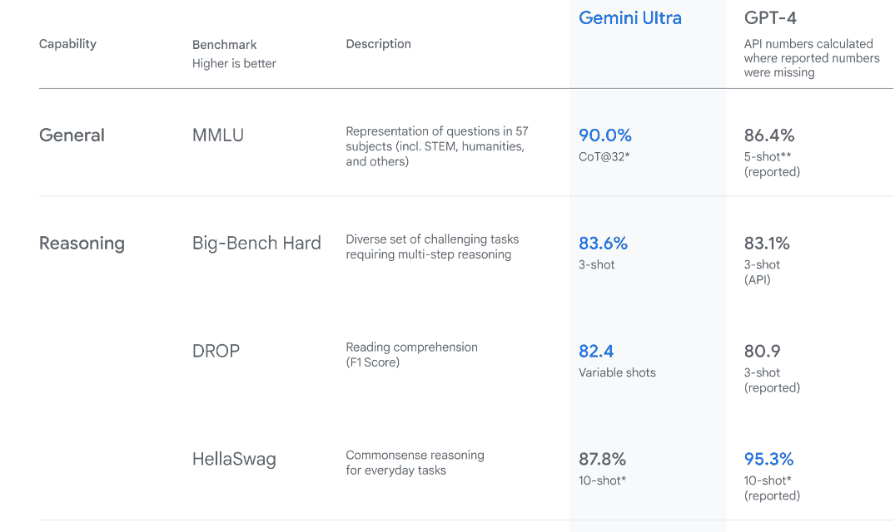
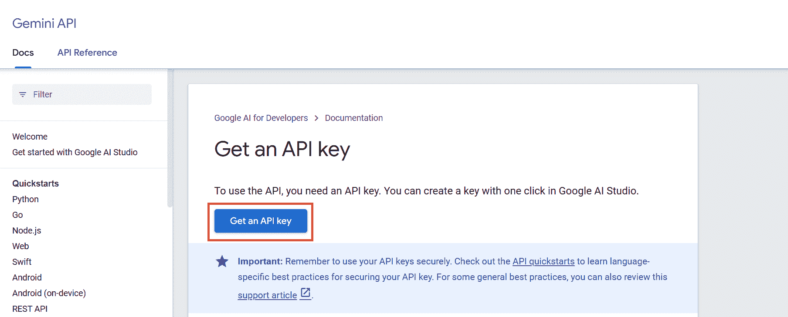
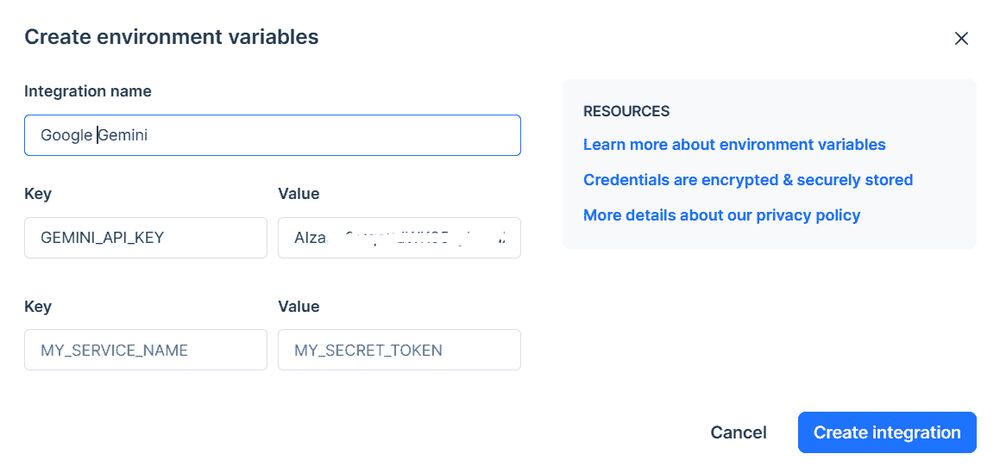
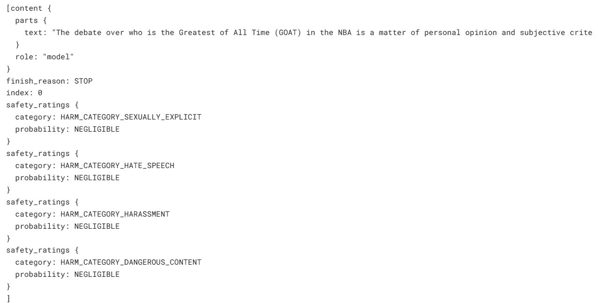
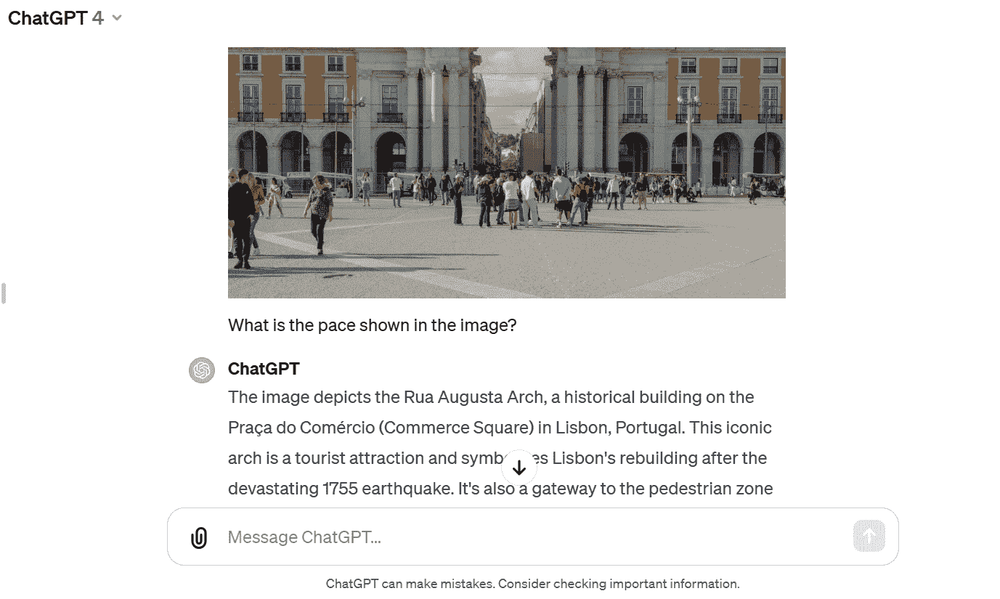
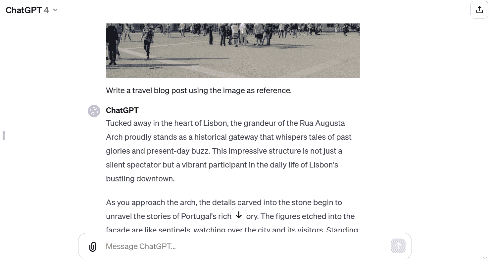
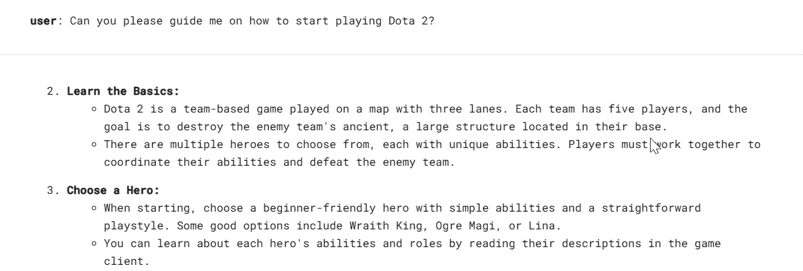

# 如何免费访问和使用 Gemini API

> 原文：[`www.kdnuggets.com/how-to-access-and-use-gemini-api-for-free`](https://www.kdnuggets.com/how-to-access-and-use-gemini-api-for-free)


作者提供的图片

Gemini 是 Google 开发的新模型，Bard 也开始重新可用。借助 Gemini，现在可以通过提供图像、音频和文本来获得几乎完美的查询答案。

* * *

## 我们的前三名课程推荐

 1\. [Google 网络安全证书](https://www.kdnuggets.com/google-cybersecurity) - 快速进入网络安全职业。

 2\. [Google 数据分析专业证书](https://www.kdnuggets.com/google-data-analytics) - 提升您的数据分析技能

 3\. [Google IT 支持专业证书](https://www.kdnuggets.com/google-itsupport) - 支持您的组织 IT

* * *

在本教程中，我们将学习 Gemini API 及其在您的计算机上的设置方法。我们还将探索各种 Python API 功能，包括文本生成和图像理解。

# 介绍 Gemini AI 模型

[Gemini](https://www.google.com/url?q=https://blog.google/technology/ai/google-gemini-ai/%23introducing-gemini&sa=D&source=editors&ust=1702928279671913&usg=AOvVaw3sXLHGX0QJRUSslBADx8XB) 是由 Google 各团队（包括 Google Research 和 Google DeepMind）合作开发的全新 AI 模型。它专门设计为多模态，即能够理解和处理文本、代码、音频、图像和视频等不同类型的数据。

Gemini 是迄今为止 Google 开发的最先进、最大型的 AI 模型。它被设计得非常灵活，因此可以高效地在各种系统上运行，从数据中心到移动设备。这意味着它有潜力彻底改变企业和开发者构建和扩展 AI 应用程序的方式。

以下是为不同使用场景设计的三种 Gemini 模型版本：

+   **Gemini Ultra:** 最大和最先进的 AI，能够执行复杂任务。

+   **Gemini Pro:** 一种平衡的模型，具有良好的性能和可扩展性。

+   **Gemini Nano:** 最适合移动设备使用。



图片来源于 [介绍 Gemini](https://www.google.com/url?q=https://blog.google/technology/ai/google-gemini-ai/%23performance&sa=D&source=editors&ust=1702928279673520&usg=AOvVaw0ubnWtpo19mhdYvbLKd1Jm)

Gemini Ultra 具有最先进的性能，在多个指标上超过了 GPT-4。它是第一个在大规模多任务语言理解基准上超过人类专家的模型，该基准测试全球知识和 57 个不同主题的解决问题能力。这展示了它先进的理解和解决问题的能力。

# 设置

要使用 API，我们首先需要获得一个 API 密钥，可以从这里获取：https://ai.google.dev/tutorials/setup



之后点击“获取 API 密钥”按钮，然后点击“在新项目中创建 API 密钥”。


复制 API 密钥并将其设置为环境变量。我们使用 Deepnote，并且很容易将密钥命名为“GEMINI_API_KEY”。只需转到集成部分，向下滚动并选择环境变量。



在下一步中，我们将使用 PIP 安装 Python API：

```py
pip install -q -U google-generativeai
```

之后，我们将 API 密钥设置到 Google 的 GenAI，并启动实例。

```py
import google.generativeai as genai
import os

gemini_api_key = os.environ["GEMINI_API_KEY"]
genai.configure(api_key = gemini_api_key)
```

# 使用 Gemini Pro

设置 API 密钥后，使用 Gemini Pro 模型生成内容非常简单。向`generate_content`函数提供提示并以 Markdown 显示输出。

```py
from IPython.display import Markdown

model = genai.GenerativeModel('gemini-pro')
response = model.generate_content("Who is the GOAT in the NBA?")

Markdown(response.text)
```

这很令人惊叹，但我不同意这个列表。然而，我理解这完全是个人喜好问题。


Gemini 可以为单个提示生成多个响应，称为候选项。你可以选择最合适的一个。在我们的例子中，我们只有一个响应。

```py
response.candidates
```



让我们让它用 Python 编写一个简单的游戏。

```py
response = model.generate_content("Build a simple game in Python")

Markdown(response.text)
```

结果简单明了。大多数 LLM 开始解释 Python 代码，而不是编写它。


# 配置响应

你可以使用`generation_config`参数来定制你的响应。我们将候选数限制为 1，添加了停止词“space”，并设置了最大令牌和温度。

```py
response = model.generate_content(
    'Write a short story about aliens.',
    generation_config=genai.types.GenerationConfig(
        candidate_count=1,
        stop_sequences=['space'],
        max_output_tokens=200,
        temperature=0.7)
)

Markdown(response.text)
```

如你所见，响应在“space”这个词之前停止了。真是令人惊叹。


# 流式响应

你也可以使用`stream`参数来流式传输响应。它类似于 Anthropic 和 OpenAI API，但更快。

```py
model = genai.GenerativeModel('gemini-pro')
response = model.generate_content("Write a Julia function for cleaning the data.", stream=True)

for chunk in response:
    print(chunk.text)
```


# 使用 Gemini Pro Vision

在本节中，我们将加载 [Masood Aslami 的](https://www.google.com/url?q=https://www.pexels.com/photo/historical-arch-on-city-square-17165178/&sa=D&source=editors&ust=1702928279680636&usg=AOvVaw3rYreQ3Wheo4Kdc-lrqrBN) 照片，并用它来测试 Gemini Pro Vision 的多模态性。

将图像加载到 `PIL` 中并显示。

```py
import PIL.Image

img = PIL.Image.open('images/photo-1.jpg')

img
```

我们有一张高质量的 Rua Augusta Arch 照片。


让我们加载 Gemini Pro Vision 模型，并提供图像。

```py
model = genai.GenerativeModel('gemini-pro-vision')

response = model.generate_content(img)

Markdown(response.text)
```

该模型准确识别了宫殿，并提供了有关其历史和建筑的额外信息。


让我们将相同的图像提供给 GPT-4 并询问它有关图像的信息。两个模型提供的回答几乎相似。但我更喜欢 GPT-4 的回应。



我们现在将文本和图像提供给 API。我们已请视觉模型使用该图像作为参考写一篇旅游博客。

```py
response = model.generate_content(["Write a travel blog post using the image as reference.", img])

Markdown(response.text)
```

它为我提供了一个简短的博客。我原本期望更长的格式。


与 GPT-4 相比，**Gemini Pro Vision** 模型在生成长格式博客时遇到了困难。



# 聊天对话会话

我们可以设置模型进行往返聊天会话。这样，模型可以记住上下文并利用之前的对话进行回应。

在我们的例子中，我们已经开始了聊天会话，并请模型帮助我入门 Dota 2 游戏。

```py
model = genai.GenerativeModel('gemini-pro')

chat = model.start_chat(history=[])

chat.send_message("Can you please guide me on how to start playing Dota 2?")

chat.history
```

如你所见，`chat` 对象正在保存用户和模型聊天的历史记录。


我们还可以以 Markdown 风格显示它们。

```py
for message in chat.history:
    display(Markdown(f'**{message.role}**: {message.parts[0].text}'))
```


让我们提出跟进问题。

```py
chat.send_message("Which Dota 2 heroes should I start with?")

for message in chat.history:
    display(Markdown(f'**{message.role}**: {message.parts[0].text}'))
```

我们可以向下滚动并查看与模型的整个会话。



# 使用嵌入

嵌入模型在上下文感知应用中越来越受欢迎。**Gemini embedding-001** 模型允许将单词、句子或整个文档表示为密集向量，这些向量编码了语义意义。这种向量表示使得通过比较相应的嵌入向量来轻松比较不同文本片段之间的相似性成为可能。

我们可以将内容提供给 `embed_content` 并将文本转换为嵌入。就是这么简单。

```py
output = genai.embed_content(
    model="models/embedding-001",
    content="Can you please guide me on how to start playing Dota 2?",
    task_type="retrieval_document",
    title="Embedding of Dota 2 question")

print(output['embedding'][0:10])
```

```py
[0.060604308, -0.023885584, -0.007826327, -0.070592545, 0.021225851, 0.043229062, 0.06876691, 0.049298503, 0.039964676, 0.08291664]
```

我们可以通过将字符串列表传递给 'content' 参数，将多个文本块转换为嵌入。

```py
output = genai.embed_content(
    model="models/embedding-001",
    content=[
        "Can you please guide me on how to start playing Dota 2?",
        "Which Dota 2 heroes should I start with?",
    ],
    task_type="retrieval_document",
    title="Embedding of Dota 2 question")

for emb in output['embedding']:
    print(emb[:10])
```

```py
[0.060604308, -0.023885584, -0.007826327, -0.070592545, 0.021225851, 0.043229062, 0.06876691, 0.049298503, 0.039964676, 0.08291664]

[0.04775657, -0.044990525, -0.014886052, -0.08473655, 0.04060122, 0.035374347, 0.031866882, 0.071754575, 0.042207796, 0.04577447]
```

如果您无法重现相同的结果，请查看我的[Deepnote 工作空间](https://www.google.com/url?q=https://deepnote.com/workspace/abid-5efa63e7-7029-4c3e-996f-40e8f1acba6f/project/How-to-Access-and-Use-Gemini-API-55818013-847a-46c6-ac51-9c814955f5cd/notebook/Notebook%25201-af572259a2374c39a21eb31a63dc23a7&sa=D&source=editors&ust=1702928279692090&usg=AOvVaw1X3t5ErX91gPhkC6UcqvfW)。

# 结论

在这个入门教程中，我们没有涵盖许多高级功能。您可以通过访问[Gemini API：Python 快速入门](https://www.google.com/url?q=https://ai.google.dev/tutorials/python_quickstart%23generate_text_from_text_inputs&sa=D&source=editors&ust=1702928279692923&usg=AOvVaw3qwfMggQe6PvEDm5hWt7as)来了解更多有关 Gemini API 的信息。

在本教程中，我们学习了 Gemini 及如何访问 Python API 生成响应。特别是，我们了解了文本生成、视觉理解、流媒体、对话历史、自定义输出和嵌入。然而，这只是 Gemini 可以做的一小部分。

请随时与我分享您使用自由 Gemini API 构建的内容。可能性是无限的。

[](https://www.polywork.com/kingabzpro)****[阿比德·阿里·阿万](https://www.polywork.com/kingabzpro)****（[@1abidaliawan](https://www.linkedin.com/in/1abidaliawan)）是一位认证数据科学家专业人士，喜欢构建机器学习模型。目前，他专注于内容创作，并撰写关于机器学习和数据科学技术的技术博客。阿比德拥有技术管理硕士学位和电信工程学士学位。他的愿景是利用图神经网络为遭受心理疾病困扰的学生构建 AI 产品。

### 更多关于此主题的信息

+   [免费 ChatGPT 课程：使用 OpenAI API 编写 5 个项目](https://www.kdnuggets.com/2023/05/free-chatgpt-course-openai-api-code-5-projects.html)

+   [ODSC East 2022 提供的 15 个热门 MLOps 讨论免费获取](https://www.kdnuggets.com/2022/04/odsc-15-trending-mlops-talks-access-free-odsc-east-2022.html)

+   [通过免费访问 DataCamp 来提升您的数据技能](https://www.kdnuggets.com/2022/07/datacamp-hone-data-skills-free-access-datacamp.html)

+   [免费访问 GPT-4 的 3 种方法](https://www.kdnuggets.com/2023/05/3-ways-access-gpt4-free.html)

+   [免费使用 Claude AI 的 3 种方法](https://www.kdnuggets.com/2023/06/3-ways-access-claude-ai-free.html)

+   [365 Data Science 提供免费课程访问直到 11 月 20 日](https://www.kdnuggets.com/2023/11/365datascience-offers-free-course-access-nov-20)
