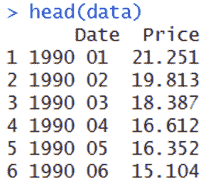
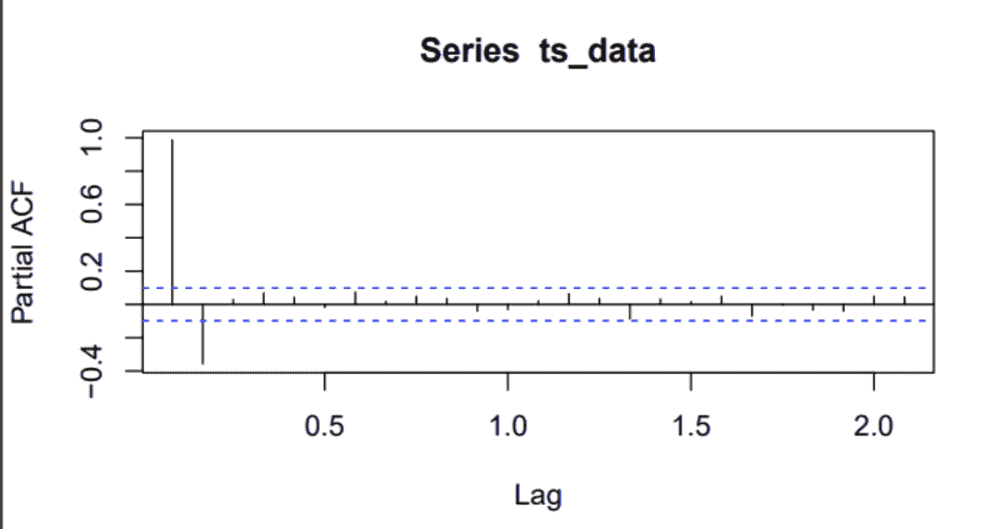
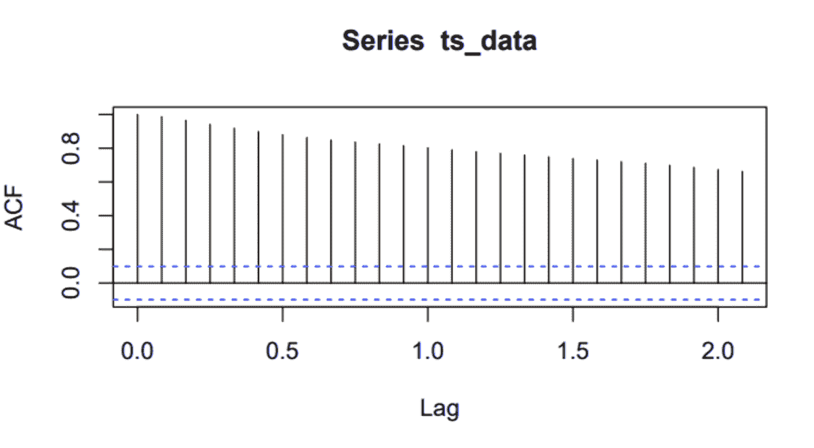
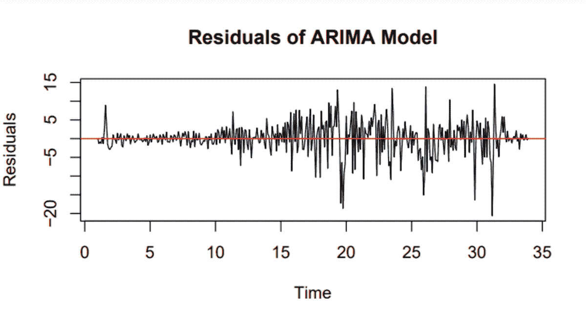

# 如何进行 R 中的时间序列分析

> 原文：[`www.kdnuggets.com/how-to-conduct-time-series-analysis-in-r`](https://www.kdnuggets.com/how-to-conduct-time-series-analysis-in-r)


图片来源：编辑 | Ideogram

时间序列分析研究随时间收集的数据点。它帮助识别趋势和模式。这种分析在经济学、金融学和环境科学中很有用。R 是进行时间序列分析的热门工具，因为它具有强大的包和功能。在这篇文章中，我们将探讨如何使用 R 进行时间序列分析。

* * *

## 我们的前三大课程推荐

 1\. [Google 网络安全证书](https://www.kdnuggets.com/google-cybersecurity) - 快速进入网络安全职业轨道。

 2\. [Google 数据分析专业证书](https://www.kdnuggets.com/google-data-analytics) - 提升你的数据分析技能

 3\. [Google IT 支持专业证书](https://www.kdnuggets.com/google-itsupport) - 支持你的组织的 IT 工作

* * *

## 加载库

时间序列分析的第一步是加载必要的库。**'forecast'**库提供时间序列预测功能。**'tseries'**库提供统计检验和时间序列分析工具。

```py
library(forecast)
library(tseries)
```

## 导入时间序列数据

将时间序列数据从 CSV 文件导入 R。在这个示例中，我们使用用于金融分析的数据集。它跟踪价格随时间的变动。

```py
data <- read.csv ("timeseries.csv", header = TRUE)
head(data) 
```



## 创建时间序列对象

使用**'ts'**函数将数据转换为时间序列对象。这个函数将你的数据转换为时间序列格式。

```py
ts_data <- ts(data$Price) 
```

## 绘制时间序列图

可视化时间序列数据。这有助于识别趋势、季节性和异常值。趋势显示数据的长期增长或下降。季节性揭示在固定间隔重复的规律性模式。异常值突出显示从正常模式中突出的异常值。

```py
plot(ts_data) 
```


## ARIMA 模型

ARIMA 模型用于预测时间序列数据。它结合了三个组件：自回归（AR）、差分（I）和移动平均（MA）。**'auto.arima'**函数根据数据自动选择最佳的 ARIMA 模型。

```py
fit <- auto.arima(ts_data) 
```

## 自相关函数（ACF）

自相关函数（ACF）测量时间序列与其过去值的相关性。它帮助识别数据中的模式和滞后。它显示在不同时间滞后的相关性。ACF 图有助于确定移动平均（MA）阶数（**'q'**）。

```py
acf(ts_data) 
```



## 偏自相关函数（PACF）

偏自相关函数（PACF）测量时间序列与其过去值之间的相关性。它排除了中间滞后的影响，有助于识别不同滞后的直接关系的强度。PACF 图显示了这些不同时间滞后的相关性。PACF 图有助于确定自回归（AR）阶数 (**'p'**）。

```py
pacf(ts_data) 
```



## Ljung-Box 检验

Ljung-Box 检验用于检查时间序列模型残差中的自相关。它测试残差是否是随机的，并在多个滞后期上测试自相关。低 p 值表明存在显著的自相关，这意味着模型可能不适合。

```py
Box.test(fit$residuals, lag = 20, type = "Ljung-Box") 
```


## 残差分析

残差分析检查时间序列模型中观测值与预测值之间的差异。这有助于检验模型是否拟合数据良好。

```py
plot (fit$residuals, main="Residuals of ARIMA Model", ylab="Residuals")
abline(h=0, col="red") 
```



## 预测

预测涉及基于历史数据预测未来值。使用**'forecast'**生成这些预测。

```py
forecast_result <- forecast (fit) 
```

## 预测可视化

使用历史数据可视化预测值以进行比较。**'autoplot'**函数有助于创建这些可视化图。

```py
autoplot(forecast_result) 
```


## 模型准确性

使用**'accuracy'**函数评估拟合模型的准确性。它提供了如平均绝对误差（MAE）和均方根误差（RMSE）等性能指标。

```py
accuracy(fit) 
```


## 总结

R 中的时间序列分析从加载数据和创建时间序列对象开始。接下来，进行探索性分析以查找趋势和模式。拟合 ARIMA 模型以预测未来值。诊断模型并可视化结果。这一过程有助于利用历史数据做出明智的决策。

**[Jayita Gulati](https://www.linkedin.com/in/jayitagulati1998/)** 是一位机器学习爱好者和技术作家，因对构建机器学习模型的热情而驱动。她持有利物浦大学计算机科学硕士学位。

### 更多相关主题

+   [市场数据与新闻：时间序列分析](https://www.kdnuggets.com/2022/06/market-data-news-time-series-analysis.html)

+   [无代码时间序列分析与 KNIME](https://www.kdnuggets.com/2022/10/packt-codeless-time-series-analysis-knime.html)

+   [创建时间序列比率分析仪表板](https://www.kdnuggets.com/2023/06/wolfer-create-time-series-ratio-analysis-dashboard.html)

+   [时间序列分析：Python 中的 ARIMA 模型](https://www.kdnuggets.com/2023/08/times-series-analysis-arima-models-python.html)

+   [KDnuggets 新闻，6 月 29 日：数据科学的 20 个基本 Linux 命令……](https://www.kdnuggets.com/2022/n26.html)

+   [避免时间序列预测中的这些错误](https://www.kdnuggets.com/2021/12/avoid-mistakes-time-series-forecasting.html)
