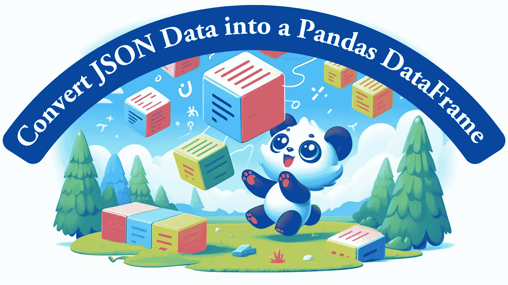

# 如何将 JSON 数据转换为 Pandas DataFrame

> 原文：[`www.kdnuggets.com/how-to-convert-json-data-into-a-dataframe-with-pandas`](https://www.kdnuggets.com/how-to-convert-json-data-into-a-dataframe-with-pandas)



图片由作者提供 | DALLE-3 和 Canva

如果你曾经有机会处理数据，你可能会遇到将 JSON 文件（即 JavaScript 对象表示法的缩写）加载到 Pandas DataFrame 中以便进一步分析的需求。JSON 文件以一种人类易读且计算机易懂的格式存储数据。然而，JSON 文件有时可能会复杂且难以浏览。因此，我们将其加载到像 DataFrames 这样的更结构化的格式中——这种格式像电子表格一样有行和列。

* * *

## 我们的前三个课程推荐

 1\. [Google Cybersecurity Certificate](https://www.kdnuggets.com/google-cybersecurity) - 快速进入网络安全职业生涯。

 2\. [Google Data Analytics Professional Certificate](https://www.kdnuggets.com/google-data-analytics) - 提升你的数据分析能力

 3\. [Google IT Support Professional Certificate](https://www.kdnuggets.com/google-itsupport) - 支持你所在组织的 IT

* * *

我将展示两种将 JSON 数据转换为 Pandas DataFrame 的不同方法。在讨论这些方法之前，让我们假设一个示例的嵌套 JSON 文件，整个文章中我将使用这个文件作为示例。

```py
{
"books": [
{
"title": "One Hundred Years of Solitude",
"author": "Gabriel Garcia Marquez",
"reviews": [
{
"reviewer": {
"name": "Kanwal Mehreen",
"location": "Islamabad, Pakistan"
},
"rating": 4.5,
"comments": "Magical and completely breathtaking!"
},
{
"reviewer": {
"name": "Isabella Martinez",
"location": "Bogotá, Colombia"
},
"rating": 4.7,
"comments": "A marvelous journey through a world of magic."
}
]
},
{
"title": "Things Fall Apart",
"author": "Chinua Achebe",
"reviews": [
{
"reviewer": {
"name": "Zara Khan",
"location": "Lagos, Nigeria"
},
"rating": 4.9,
"comments": "Things Fall Apart is the best of contemporary African literature."
}]}]} 
```

上述 JSON 数据表示一本书的列表，每本书都有一个标题、作者和一系列评论。每条评论又有一个评论者（包括姓名和位置）、评分和评论。

## 方法 1：使用 `json.load()` 和 `pd.DataFrame()` 函数

最简单且直接的方法是使用内置的 `json.load()` 函数来解析我们的 JSON 数据。这将把数据转换为一个 Python 字典，然后我们可以直接从这个 Python 数据结构创建 DataFrame。然而，它有一个问题 - 只能处理单层嵌套数据。因此，对于上述情况，如果仅使用这些步骤和这段代码：

```py
import json
import pandas as pd

#Load the JSON data

with open('books.json','r') as f:
data = json.load(f)

#Create a DataFrame from the JSON data

df = pd.DataFrame(data['books'])

df
```

你的输出可能如下所示：

**输出：**


在评论列中，你可以看到整个字典。因此，如果你希望输出显示正确，你必须手动处理嵌套结构。这可以通过以下方法完成：

```py
#Create a DataFrame from the nested JSON data

df = pd.DataFrame([
{
'title': book['title'],
'author': book['author'],
'reviewer_name': review['reviewer']['name'],
'reviewer_location': review['reviewer']['location'],
'rating': review['rating'],
'comments': review['comments']
}
for book in data['books']
for review in book['reviews']
]) 
```

**更新后的输出：**


在这里，我们使用列表推导式创建一个平坦的字典列表，其中每个字典包含书籍信息和相应的评论。然后，我们使用此数据创建 Pandas DataFrame。

但这种方法的问题在于，它需要更多的手动工作来管理 JSON 数据的嵌套结构。那么，现在怎么办？我们还有其他选项吗？

完全正确！我的意思是，来吧。考虑到我们已经进入 21 世纪，面对没有解决方案的问题似乎不切实际。让我们看看另一种方法。

## 方法 2（推荐）：使用`json_normalize()`函数

Pandas 库中的`json_normalize()`函数是管理嵌套 JSON 数据的更好方法。它会自动将 JSON 数据的嵌套结构展平，从而创建一个 DataFrame。让我们看一下代码：

```py
import pandas as pd
import json

#Load the JSON data

with open('books.json', 'r') as f:
data = json.load(f)

#Create the DataFrame using `json_normalize()`

df = pd.json_normalize(
data=data['books'],
meta=['title', 'author'],
record_path='reviews',
errors='raise'
)

df 
```

**输出：**


`json_normalize()`函数接受以下参数：

+   **数据：** 输入数据，可以是字典的列表或单个字典。在这种情况下，它是从 JSON 文件加载的数据字典。

+   **record_path：** JSON 数据中要规范化的记录路径。在这种情况下，它是'reviews'键。

+   **元数据：** 需要包括在从 JSON 文档规范化输出中的附加字段。在这种情况下，我们使用了'title'和'author'字段。请注意，元数据中的列通常出现在最后。这就是该函数的工作方式。就分析而言，这并不重要，但出于某种神奇的原因，你希望这些列出现在前面。抱歉，你得手动处理它们。

+   **错误：** 错误处理策略，可以是'ignore'、'raise'或'warn'。我们将其设置为'res'，因此如果在规范化过程中出现任何错误，它将引发异常。

## 总结

这两种方法各有优缺点，选择哪种方法取决于 JSON 数据的结构和复杂性。如果 JSON 数据有非常嵌套的结构，`json_normalize()`函数可能是最合适的选择，因为它可以自动处理嵌套数据。如果 JSON 数据相对简单和扁平，`pd.read_json()`函数可能是最简单直接的方法。

处理大型 JSON 文件时，考虑内存使用和性能至关重要，因为将整个文件加载到内存中可能行不通。因此，你可能需要考虑其他选项，如流式传输数据、延迟加载或使用更节省内存的格式，如 Parquet。

**[](https://www.linkedin.com/in/kanwal-mehreen1/)**[Kanwal Mehreen](https://www.linkedin.com/in/kanwal-mehreen1/)**** Kanwal 是一位机器学习工程师和技术作家，对数据科学以及人工智能与医学的交叉领域充满深厚的热情。她共同编写了电子书《利用 ChatGPT 提高生产力》。作为 2022 年亚太地区 Google Generation Scholar，她倡导多样性和学术卓越。她还被认定为 Teradata 技术多样性学者、Mitacs Globalink 研究学者和哈佛 WeCode 学者。Kanwal 是变革的热心倡导者，她创办了 FEMCodes，以赋能女性进入 STEM 领域。

### 更多相关主题

+   [将 Python 字典转换为 JSON：初学者教程](https://www.kdnuggets.com/convert-python-dict-to-json-a-tutorial-for-beginners)

+   [如何使用 ChatGPT 将文本转换为 PowerPoint 演示文稿](https://www.kdnuggets.com/2023/08/chatgpt-convert-text-powerpoint-presentation.html)

+   [Pandas 与 Polars：Python 数据框库的比较分析](https://www.kdnuggets.com/pandas-vs-polars-a-comparative-analysis-of-python-dataframe-libraries)

+   [如何在 Pandas 中对数据框列实现复杂的过滤器](https://www.kdnuggets.com/how-to-implement-complex-filters-on-dataframe-columns-with-pandas)

+   [如何在几秒钟内处理包含百万行的数据框](https://www.kdnuggets.com/2022/01/process-dataframe-millions-rows-seconds.html)

+   [如何将 RGB 图像转换为灰度图像](https://www.kdnuggets.com/2019/12/convert-rgb-image-grayscale.html)
