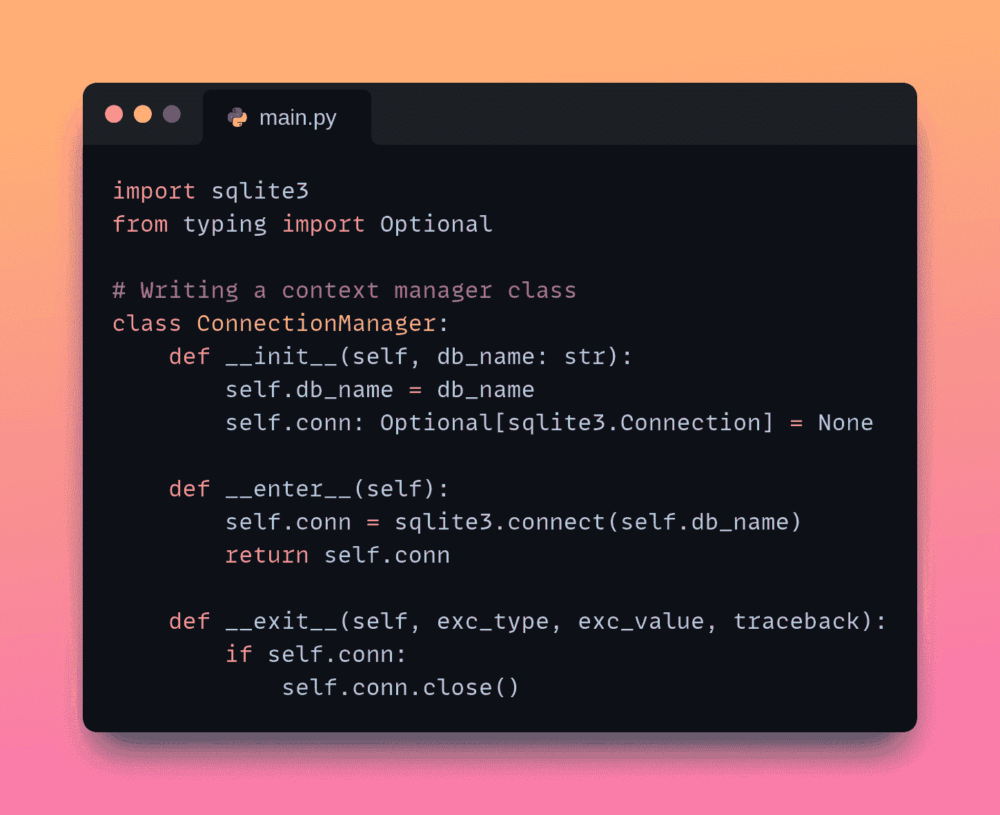

# 如何创建自定义上下文管理器

> 原文：[`www.kdnuggets.com/how-to-create-custom-context-managers-in-python`](https://www.kdnuggets.com/how-to-create-custom-context-managers-in-python)



作者提供的图片

Python 中的上下文管理器让你更高效地使用资源——即使在处理资源时出现错误，也能方便地进行资源的设置和拆卸。在关于[编写高效的 Python 代码](https://www.kdnuggets.com/how-to-write-efficient-python-code-a-tutorial-for-beginners)的教程中，我介绍了上下文管理器是什么以及它们的帮助作用。而在[Python 上下文管理器的三个有趣用途](https://www.kdnuggets.com/3-interesting-uses-of-python-context-managers)中，我讨论了上下文管理器在管理子进程、数据库连接等方面的应用。

在本教程中，你将学习如何创建自定义上下文管理器。我们将回顾上下文管理器是如何工作的，然后看看你可以用什么方法编写自己的上下文管理器。让我们开始吧。

## Python 中的上下文管理器是什么？

Python 中的上下文管理器是对象，它们使得在受控的代码块中管理资源（如文件操作、数据库连接或网络套接字）成为可能。它们确保资源在代码块执行前得到正确初始化，并在执行后自动清理，无论代码块是正常完成还是抛出异常。

一般来说，Python 中的上下文管理器具有以下两个特殊方法：`__enter__()`和`__exit__()`。这些方法定义了在进入和退出上下文时上下文管理器的行为。

### 上下文管理器是如何工作的？

在 Python 中处理资源时，你必须考虑设置资源、预见错误、实现异常处理，并最终释放资源。为此，你可能会使用类似这样的`try-except-finally`块：

```py
try: 
    # Setting up the resource
    # Working with the resource
except ErrorType:
    # Handle exceptions
finally:
    # Free up the resource 
```

从本质上讲，我们尝试配置并使用资源，除了在过程中可能出现的任何错误，最后释放资源。`finally` 块总是会执行，无论操作是否成功。但借助上下文管理器和`with`语句，你可以拥有可重用的`try-except-finally`块。

现在让我们来探讨一下上下文管理器的工作原理。

**进入阶段（`__enter__()`方法）**：

当遇到`with`语句时，将调用上下文管理器的`__enter__()`方法。这个方法负责初始化和设置资源，例如打开文件、建立数据库连接等。`__enter__()`返回的值（如果有的话）将在`as`关键字后提供给上下文块。

**执行代码块**：

一旦资源设置完成（在`__enter__()`执行后），与`with`语句关联的代码块将被执行。这是你希望在资源上执行的操作。

**退出阶段（`__exit__()` 方法）**：

在代码块执行完成后——无论是正常完成还是由于异常——上下文管理器的 `__exit__()` 方法会被调用。`__exit__()` 方法处理清理任务，例如关闭资源。如果代码块内发生异常，异常的信息（类型、值、回溯）会传递给 `__exit__()` 方法进行错误处理。

总结：

+   上下文管理器提供了一种有效管理资源的方式，通过确保资源得到正确初始化和清理。

+   我们使用 `with` 语句来定义一个资源管理的上下文。

+   `__enter__()` 方法初始化资源，而 `__exit__()` 方法在上下文块完成后清理资源。

既然我们知道了上下文管理器的工作原理，让我们继续编写一个自定义上下文管理器，用于处理数据库连接。

## 在 Python 中创建自定义上下文管理器

你可以使用以下两种方法中的一种在 Python 中编写自定义上下文管理器：

1.  编写一个包含 `__enter__()` 和 `__exit__()` 方法的类。

1.  使用 `contextlib` 模块，该模块提供了 `contextmanager` 装饰器来使用生成器函数编写上下文管理器。

### 1. 编写一个包含 `__enter__()` 和 `__exit__()` 方法的类

你可以定义一个实现两个特殊方法的类：`__enter__()` 和 `__exit__()`，它们分别控制资源的设置和清理。这里我们编写了一个 `ConnectionManager` 类，用于建立与 SQLite 数据库的连接，并关闭数据库连接：

```py
import sqlite3
from typing import Optional

# Writing a context manager class
class ConnectionManager:
    def __init__(self, db_name: str):
        self.db_name = db_name
        self.conn: Optional[sqlite3.Connection] = None

    def __enter__(self):
        self.conn = sqlite3.connect(self.db_name)
        return self.conn

    def __exit__(self, exc_type, exc_value, traceback):
        if self.conn:
        self.conn.close() 
```

让我们来详细了解 `ConnectionManager` 是如何工作的：

+   当执行进入 `with` 语句的上下文时，会调用 `__enter__()` 方法。它负责设置上下文，在这种情况下就是连接到数据库。它返回需要管理的资源：数据库连接。注意，我们使用了来自 [typing 模块](https://docs.python.org/3/library/typing.html) 的 `Optional` 类型来表示连接对象 `conn`。当值可以是两种类型之一时，我们使用 `Optional`：这里是一个有效的连接对象或 None。

+   `__exit__()` 方法：当执行离开 `with` 语句的上下文时会调用此方法。它处理关闭连接的清理操作。参数 `exc_type`、`exc_value` 和 `traceback` 用于处理 `with` 块内的异常。这些参数可以用来判断上下文是否由于异常而退出。

现在让我们在 `with` 语句中使用 `ConnectionManager`。我们做如下操作：

+   尝试连接到数据库

+   创建一个游标来运行查询

+   创建一个表并插入记录

+   查询数据库表并检索查询结果

```py
db_name = "library.db"

# Using ConnectionManager context manager directly
with ConnectionManager(db_name) as conn:
	cursor = conn.cursor()

	# Create a books table if it doesn't exist
	cursor.execute("""
    	CREATE TABLE IF NOT EXISTS books (
        	id INTEGER PRIMARY KEY,
        	title TEXT,
        	author TEXT,
        	publication_year INTEGER
    	)
	""")

	# Insert sample book records
	books_data = [
    	("The Great Gatsby", "F. Scott Fitzgerald", 1925),
    	("To Kill a Mockingbird", "Harper Lee", 1960),
    	("1984", "George Orwell", 1949),
    	("Pride and Prejudice", "Jane Austen", 1813)
	]
	cursor.executemany("INSERT INTO books (title, author, publication_year) VALUES (?, ?, ?)", books_data)
	conn.commit()

	# Retrieve and print all book records
	cursor.execute("SELECT * FROM books")
	records = cursor.fetchall()
	print("Library Catalog:")
	for record in records:
    	    book_id, title, author, publication_year = record
    	    print(f"Book ID: {book_id}, Title: {title}, Author: {author}, Year: {publication_year}")
            cursor.close()
```

运行上述代码应给出以下输出：

```py
Output >>>

Library Catalog:
Book ID: 1, Title: The Great Gatsby, Author: F. Scott Fitzgerald, Year: 1925
Book ID: 2, Title: To Kill a Mockingbird, Author: Harper Lee, Year: 1960
Book ID: 3, Title: 1984, Author: George Orwell, Year: 1949
Book ID: 4, Title: Pride and Prejudice, Author: Jane Austen, Year: 1813 
```

### 2. 使用来自 `contextlib` 的 `@contextmanager` 装饰器

`contextlib`模块提供了`@contextmanager`装饰器，可以用来将生成器函数定义为上下文管理器。以下是我们如何在数据库连接示例中做到这一点：

```py
# Writing a generator function with the `@contextmanager` decorator
import sqlite3
from contextlib import contextmanager

@contextmanager
def database_connection(db_name: str):
    conn = sqlite3.connect(db_name)
    try:
        yield conn  # Provide the connection to the 'with' block
    finally:
        conn.close()  # Close the connection upon exiting the 'with' block 
```

这是`database_connection`函数的工作原理：

+   `database_connection` 函数首先建立连接，然后`yield`语句将连接提供给`with`语句块中的代码。请注意，由于`yield`本身对异常并不免疫，我们将其包装在`try`块中。

+   `finally`块确保连接始终关闭，无论是否引发异常，确保没有资源泄漏。

就像之前做的那样，让我们在`with`语句中使用这个：

```py
db_name = "library.db"

# Using database_connection context manager directly
with database_connection(db_name) as conn:
	cursor = conn.cursor()

	# Insert a set of book records
	more_books_data = [
    	("The Catcher in the Rye", "J.D. Salinger", 1951),
    	("To the Lighthouse", "Virginia Woolf", 1927),
    	("Dune", "Frank Herbert", 1965),
    	("Slaughterhouse-Five", "Kurt Vonnegut", 1969)
	]
	cursor.executemany("INSERT INTO books (title, author, publication_year) VALUES (?, ?, ?)", more_books_data)
	conn.commit()

	# Retrieve and print all book records
	cursor.execute("SELECT * FROM books")
	records = cursor.fetchall()
	print("Updated Library Catalog:")
	for record in records:
    	    book_id, title, author, publication_year = record
    	    print(f"Book ID: {book_id}, Title: {title}, Author: {author}, Year: {publication_year}")
        cursor.close()
```

我们连接到数据库，插入更多记录，查询数据库，并获取查询结果。以下是输出：

```py
Output >>>

Updated Library Catalog:
Book ID: 1, Title: The Great Gatsby, Author: F. Scott Fitzgerald, Year: 1925
Book ID: 2, Title: To Kill a Mockingbird, Author: Harper Lee, Year: 1960
Book ID: 3, Title: 1984, Author: George Orwell, Year: 1949
Book ID: 4, Title: Pride and Prejudice, Author: Jane Austen, Year: 1813
Book ID: 5, Title: The Catcher in the Rye, Author: J.D. Salinger, Year: 1951
Book ID: 6, Title: To the Lighthouse, Author: Virginia Woolf, Year: 1927
Book ID: 7, Title: Dune, Author: Frank Herbert, Year: 1965
Book ID: 8, Title: Slaughterhouse-Five, Author: Kurt Vonnegut, Year: 1969 
```

请注意，我们打开和关闭了游标对象。因此，你也可以在`with`语句中使用游标对象。我建议将其作为一个快速练习来尝试一下！

## 总结

就这样。我希望你学会了如何创建自己的自定义上下文管理器。我们看了两种方法：使用具有`__enter__()`和`__exit()__`方法的类，以及使用用`@contextmanager`装饰的生成器函数。

使用上下文管理器时，你可以清楚地看到以下优势：

+   资源的设置和拆解会自动管理，最大限度减少资源泄漏。

+   代码更简洁，更易于维护。

+   在处理资源时，异常处理更为干净。

与往常一样，你可以 [在 GitHub 上找到代码](https://github.com/balapriyac/python-basics/blob/main/custom_context_manager/main.py)。继续编码！

**[](https://twitter.com/balawc27)**[Bala Priya C](https://www.kdnuggets.com/wp-content/uploads/bala-priya-author-image-update-230821.jpg)**** 是一位来自印度的开发者和技术作家。她喜欢在数学、编程、数据科学和内容创作的交汇处工作。她的兴趣和专长包括 DevOps、数据科学和自然语言处理。她喜欢阅读、写作、编码和喝咖啡！目前，她正在通过撰写教程、操作指南、评论文章等，学习和分享她的知识。Bala 还创建了引人入胜的资源概述和编码教程。

* * *

## 我们的前三个课程推荐

 1\. [谷歌网络安全证书](https://www.kdnuggets.com/google-cybersecurity) - 快速进入网络安全职业生涯。

 2\. [谷歌数据分析专业证书](https://www.kdnuggets.com/google-data-analytics) - 提升你的数据分析水平

 3\. [谷歌 IT 支持专业证书](https://www.kdnuggets.com/google-itsupport) - 支持你的组织的 IT 工作

* * *

### 了解更多相关主题

+   [Python 上下文管理器的 3 个有趣用法](https://www.kdnuggets.com/3-interesting-uses-of-python-context-managers)

+   [上下文、一致性和协作对数据科学成功至关重要](https://www.kdnuggets.com/2022/01/context-consistency-collaboration-essential-data-science-success.html)

+   [招聘经理在数据科学家身上寻找的品质](https://www.kdnuggets.com/2022/04/qualities-hiring-managers-looking-data-scientists.html)

+   [介绍 OpenChat：一个免费且简单的平台，用于构建自定义聊天机器人](https://www.kdnuggets.com/2023/06/introducing-openchat-free-simple-platform-building-custom-chatbots-minutes.html)

+   [通过自定义指令将 ChatGPT 调整为符合你的需求](https://www.kdnuggets.com/2023/08/tailor-chatgpt-fit-needs-custom-instructions.html)

+   [使用 Python 和 Dash 创建仪表板](https://www.kdnuggets.com/2023/08/create-dashboard-python-dash.html)
