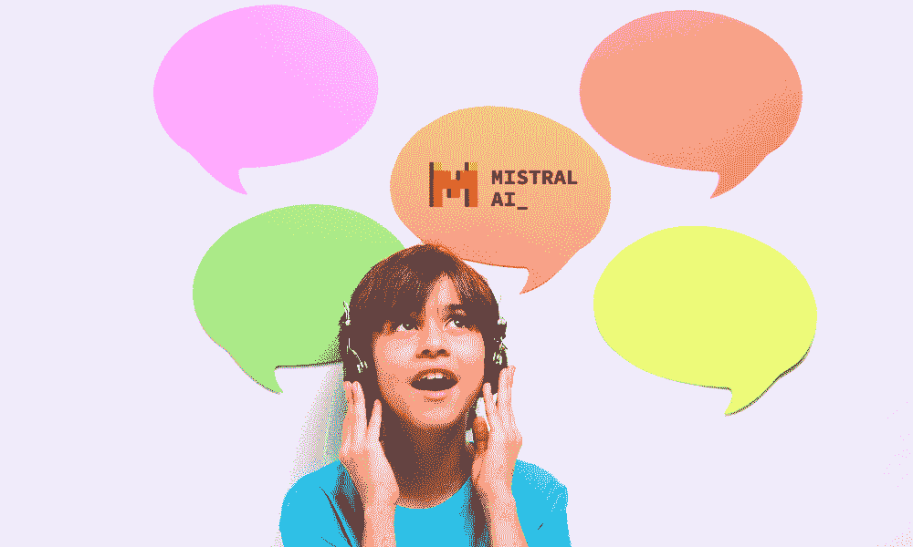

# 如何使用 Hugging Face AutoTrain 微调 Mistral AI 7B LLM

> 原文：[`www.kdnuggets.com/how-to-finetune-mistral-ai-7b-llm-with-hugging-face-autotrain`](https://www.kdnuggets.com/how-to-finetune-mistral-ai-7b-llm-with-hugging-face-autotrain)



图片由编辑提供

随着全球 LLM 研究的进展，许多模型变得更加易于获取。一个小而强大的开源模型是 [Mistral AI 7B LLM](https://mistral.ai/)。该模型在多个用例上展现出适应性，在所有基准测试中表现优于 LlaMA 2 13B，采用了 [滑动窗口注意力（SWA）](https://arxiv.org/pdf/1904.10509.pdf) 机制，并且易于部署。

* * *

## 我们的三大课程推荐

 1\. [Google 网络安全证书](https://www.kdnuggets.com/google-cybersecurity) - 快速进入网络安全职业生涯。

 2\. [Google 数据分析专业证书](https://www.kdnuggets.com/google-data-analytics) - 提升你的数据分析技能

 3\. [Google IT 支持专业证书](https://www.kdnuggets.com/google-itsupport) - 支持你的组织 IT

* * *

Mistral 7 B 的整体性能基准见下图。


Mistral 7B 性能基准（[江等（2023）](https://arxiv.org/pdf/2310.06825.pdf)）

Mistral 7B 模型也可在 [HuggingFace](https://huggingface.co/mistralai/Mistral-7B-Instruct-v0.1) 中找到。通过这个模型，我们可以使用 Hugging Face AutoTrain 针对我们的用例对模型进行微调。[Hugging Face 的 AutoTrain](https://huggingface.co/docs/autotrain/v0.6.10/index) 是一个无需编码的平台，配有 Python API，我们可以使用它轻松微调任何可用的 LLM 模型。

本教程将教我们如何使用 Hugging Face AutoTrain 微调 Mistral AI 7B LLM。它是如何工作的？让我们深入了解。

# 环境和数据集准备

要使用 Python API 微调 LLM，我们需要安装 Python 包，你可以使用以下代码运行。

```py
pip install -U autotrain-advanced
```

此外，我们将使用来自 [HuggingFace](https://huggingface.co/datasets/tatsu-lab/alpaca) 的 Alpaca 样本数据集，该数据集需要通过数据集包获取，并使用 transformers 包来操作 Hugging Face 模型。

```py
pip install datasets transformers
```

接下来，我们必须为微调 Mistral 7B 模型格式化数据。一般来说，Mistral 发布了两个基础模型：[Mistral 7B v0.1](https://docs.mistral.ai/llm/mistral-v0.1) 和 [Mistral 7B Instruct v0.1](https://docs.mistral.ai/llm/mistral-instruct-v0.1)。Mistral 7B v0.1 是基础模型，而 Mistral 7B Instruct v0.1 是为对话和问答微调过的 Mistral 7B v0.1 模型。

我们需要一个包含文本列的 CSV 文件来进行 Hugging Face AutoTrain 微调。不过，在微调过程中，我们将使用不同的文本格式用于基础和指令模型。

首先，让我们查看用于示例的数据集。

```py
from datasets import load_dataset
import pandas as pd

# Load the dataset
train= load_dataset("tatsu-lab/alpaca",split='train[:10%]')
train = pd.DataFrame(train)
```

上述代码将会抽取实际数据的百分之十的样本。我们在这个教程中只需要这么多，因为训练更大数据会花费更长时间。我们的数据样本如下图所示。


作者提供的图片

数据集已经包含了我们需要微调 LLM 模型的文本列格式。因此，我们无需执行任何操作。不过，如果你有其他需要格式化的数据集，我会提供代码。

```py
def text_formatting(data):

    # If the input column is not empty
    if data['input']:

        text = f"""Below is an instruction that describes a task, paired with an input that provides further context. Write a response that appropriately completes the request.\n\n### Instruction:\n{data["instruction"]} \n\n### Input:\n{data["input"]}\n\n### Response:\n{data["output"]}"""

    else:

        text = f"""Below is an instruction that describes a task. Write a response that appropriately completes the request.\n\n### Instruction:\n{data["instruction"]}\n\n### Response:\n{data["output"]}""" 

    return text

train['text'] = train.apply(text_formatting, axis =1)
```

对于 Hugging Face AutoTrain，我们需要将数据保存为 CSV 格式，可以使用以下代码来保存数据。

```py
train.to_csv('train.csv', index = False)
```

然后，将 CSV 结果移动到一个名为 data 的文件夹中。这就是为微调 Mistral 7B v0.1 准备数据集所需的全部操作。

如果你想为对话和问答微调 Mistral 7B Instruct v0.1，我们需要按照 Mistral 提供的聊天模板格式进行操作，如下方代码块所示。

```py
<s>[INST] Instruction [/INST] Model answer</s>[INST] Follow-up instruction [/INST]
```

如果我们使用之前的示例数据集，我们需要重新格式化文本列。我们将只使用没有输入的聊天模型数据。

```py
train_chat = train[train['input'] == ''].reset_index(drop = True).copy()
```

然后，我们可以使用以下代码重新格式化数据。

```py
def chat_formatting(data):

  text = f"<s>[INST] {data['instruction']} [/INST] {data['output']} </s>"

  return text

train_chat['text'] = train_chat.apply(chat_formatting, axis =1)
train_chat.to_csv('train_chat.csv', index =False)
```

我们将得到一个适合微调 Mistral 7B Instruct v0.1 模型的数据集。


作者提供的图片

准备好所有设置后，我们现在可以启动 AutoTrain 来微调我们的 Mistral 模型。

# 训练和微调

让我们设置 Hugging Face AutoTrain 环境来微调 Mistral 模型。首先，运行以下命令来进行 AutoTrain 设置。

```py
!autotrain setup
```

接下来，我们需要提供 AutoTrain 运行所需的信息。在这个教程中，我们使用 Mistral 7B Instruct v0.1。

```py
project_name = 'my_autotrain_llm'
model_name = 'mistralai/Mistral-7B-Instruct-v0.1'
```

如果你想将模型推送到仓库，我们将添加 Hugging Face 信息。

```py
push_to_hub = False
hf_token = "YOUR HF TOKEN"
repo_id = "username/repo_name"
```

最后，我们将在下面的变量中初始化模型参数信息。你可以修改它们来查看结果是否良好。

```py
learning_rate = 2e-4
num_epochs = 4
batch_size = 1
block_size = 1024
trainer = "sft"
warmup_ratio = 0.1
weight_decay = 0.01
gradient_accumulation = 4
use_fp16 = True
use_peft = True
use_int4 = True
lora_r = 16
lora_alpha = 32
lora_dropout = 0.045
```

我们可以调整许多参数，但在本文中不会讨论它们。一些改进 LLM 微调的技巧包括使用较低的学习率以保持预先学习的表示，避免过拟合通过调整周期数，使用较大的批量大小以提高稳定性，或者在有内存问题时调整梯度累积。

当所有信息准备好后，我们将设置环境以接受之前设置的所有信息。

```py
import os
os.environ["PROJECT_NAME"] = project_name
os.environ["MODEL_NAME"] = model_name
os.environ["PUSH_TO_HUB"] = str(push_to_hub)
os.environ["HF_TOKEN"] = hf_token
os.environ["REPO_ID"] = repo_id
os.environ["LEARNING_RATE"] = str(learning_rate)
os.environ["NUM_EPOCHS"] = str(num_epochs)
os.environ["BATCH_SIZE"] = str(batch_size)
os.environ["BLOCK_SIZE"] = str(block_size)
os.environ["WARMUP_RATIO"] = str(warmup_ratio)
os.environ["WEIGHT_DECAY"] = str(weight_decay)
os.environ["GRADIENT_ACCUMULATION"] = str(gradient_accumulation)
os.environ["USE_FP16"] = str(use_fp16)
os.environ["USE_PEFT"] = str(use_peft)
os.environ["USE_INT4"] = str(use_int4)
os.environ["LORA_R"] = str(lora_r)
os.environ["LORA_ALPHA"] = str(lora_alpha)
os.environ["LORA_DROPOUT"] = str(lora_dropout)
```

我们将使用以下命令在笔记本中运行 AutoTrain。

```py
!autotrain llm \
--train \
--model ${MODEL_NAME} \
--project-name ${PROJECT_NAME} \
--data-path data/ \
--text-column text \
--lr ${LEARNING_RATE} \
--batch-size ${BATCH_SIZE} \
--epochs ${NUM_EPOCHS} \
--block-size ${BLOCK_SIZE} \
--warmup-ratio ${WARMUP_RATIO} \
--lora-r ${LORA_R} \
--lora-alpha ${LORA_ALPHA} \
--lora-dropout ${LORA_DROPOUT} \
--weight-decay ${WEIGHT_DECAY} \
--gradient-accumulation ${GRADIENT_ACCUMULATION} \
$( [[ "$USE_FP16" == "True" ]] && echo "--fp16" ) \
$( [[ "$USE_PEFT" == "True" ]] && echo "--use-peft" ) \
$( [[ "$USE_INT4" == "True" ]] && echo "--use-int4" ) \
$( [[ "$PUSH_TO_HUB" == "True" ]] && echo "--push-to-hub --token ${HF_TOKEN} --repo-id ${REPO_ID}" )
```

如果微调过程成功，我们将拥有一个新的微调模型目录。我们将使用这个目录来测试我们新微调的模型。

```py
from transformers import AutoModelForCausalLM, AutoTokenizer

model_path = "my_autotrain_llm"
tokenizer = AutoTokenizer.from_pretrained(model_path)
model = AutoModelForCausalLM.from_pretrained(model_path)
```

模型和分词器准备好后，我们会用一个示例输入测试模型。

```py
input_text = "Give three tips for staying healthy."
input_ids = tokenizer.encode(input_text, return_tensors="pt")
output = model.generate(input_ids, max_new_tokens = 200)
predicted_text = tokenizer.decode(output[0], skip_special_tokens=True)
print(predicted_text)
```

**输出：**

给出三条保持健康的建议。

1.  均衡饮食：确保饮食中包含大量水果、蔬菜、瘦蛋白和全谷物。这将帮助你获得保持健康和充满活力所需的营养。

1.  定期锻炼：每天至少进行 30 分钟的中等强度运动，如快走或骑车。这将帮助你维持健康的体重，降低慢性疾病的风险，并改善整体身体和心理健康。

1.  充足的睡眠：每晚目标睡眠 7-9 小时。这将帮助你在白天感到更有休息感和警觉性，同时有助于维持健康的体重并降低慢性疾病的风险。

模型的输出与我们的训练数据的实际输出接近，如下图所示。

1.  均衡饮食，并确保包含大量水果和蔬菜。

1.  定期锻炼以保持身体活跃和强壮。

1.  充足的睡眠并保持一致的作息时间。

Mistral 模型确实因其体积小而强大，简单的微调已经显示出良好的结果。尝试你的数据集，以查看它是否适合你的工作。

# 结论

Mistral AI 7B 系列模型是一个强大的 LLM 模型，性能优于 LLaMA，并具有出色的适应性。由于该模型在 Hugging Face 上可用，我们可以使用 HuggingFace AutoTrain 来微调模型。目前，Hugging Face 上有两个可微调的模型：Mistral 7B v0.1 作为基础模型，以及 Mistral 7B Instruct v0.1 用于对话和问答。即使经过快速训练，微调结果也表现出良好的前景。

**[](https://www.linkedin.com/in/cornellius-yudha-wijaya/)**[Cornellius Yudha Wijaya](https://www.linkedin.com/in/cornellius-yudha-wijaya/)** 是数据科学助理经理和数据撰写员。在全职工作于 Allianz Indonesia 的同时，他喜欢通过社交媒体和写作媒体分享 Python 和数据技巧。Cornellius 在各种 AI 和机器学习主题上进行写作。

### 相关话题

+   [Mistral 7B-V0.2: 微调 Mistral 的新开源 LLM 与…](https://www.kdnuggets.com/mistral-7b-v02-fine-tuning-mistral-new-open-source-llm-with-hugging-face)

+   [如何使用 Hugging Face AutoTrain 微调 LLM](https://www.kdnuggets.com/how-to-use-hugging-face-autotrain-to-finetune-llms)

+   [Web LLM: 将 LLM 聊天机器人带到浏览器](https://www.kdnuggets.com/2023/05/webllm-bring-llm-chatbots-browser.html)

+   [十大机器学习演示：Hugging Face Spaces 版](https://www.kdnuggets.com/2022/05/top-10-machine-learning-demos-hugging-face-spaces-edition.html)

+   [一个为客户数据建模开发 Hugging Face 的社区](https://www.kdnuggets.com/2022/08/objectiv-community-developing-hugging-face-customer-data-modeling.html)

+   [用 Hugging Face 和 Gradio 在 5 分钟内构建 AI 聊天机器人](https://www.kdnuggets.com/2023/06/build-ai-chatbot-5-minutes-hugging-face-gradio.html)
