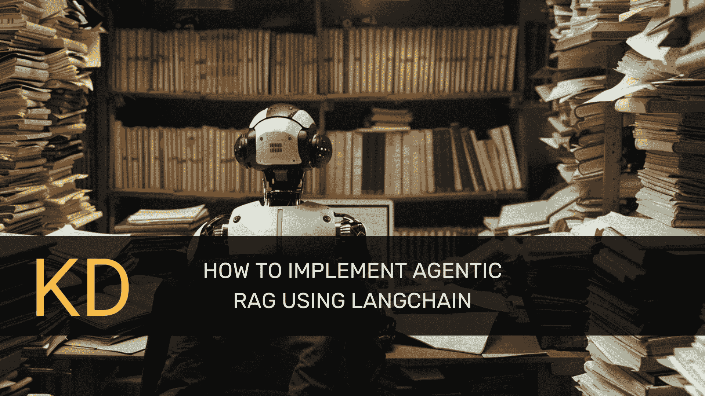
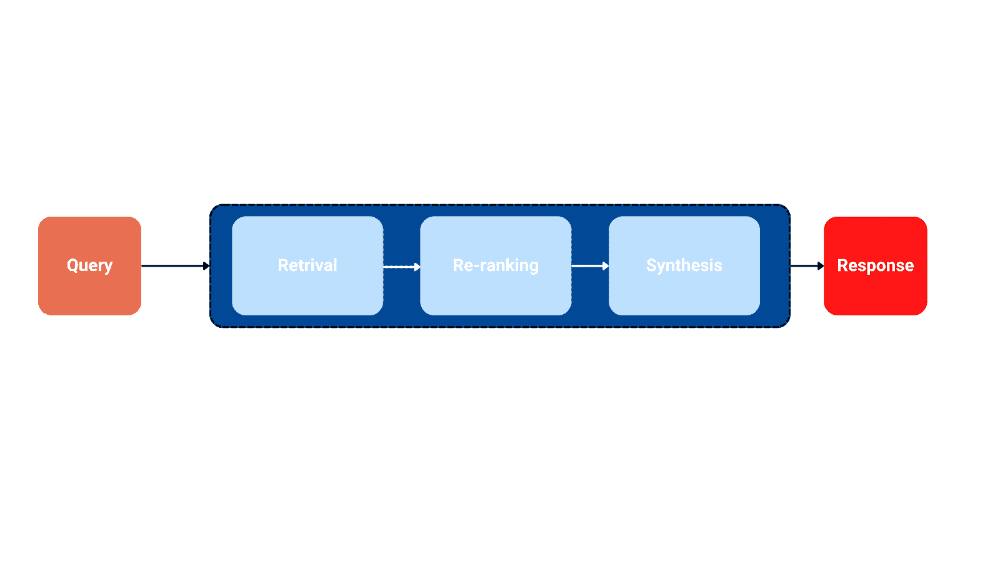
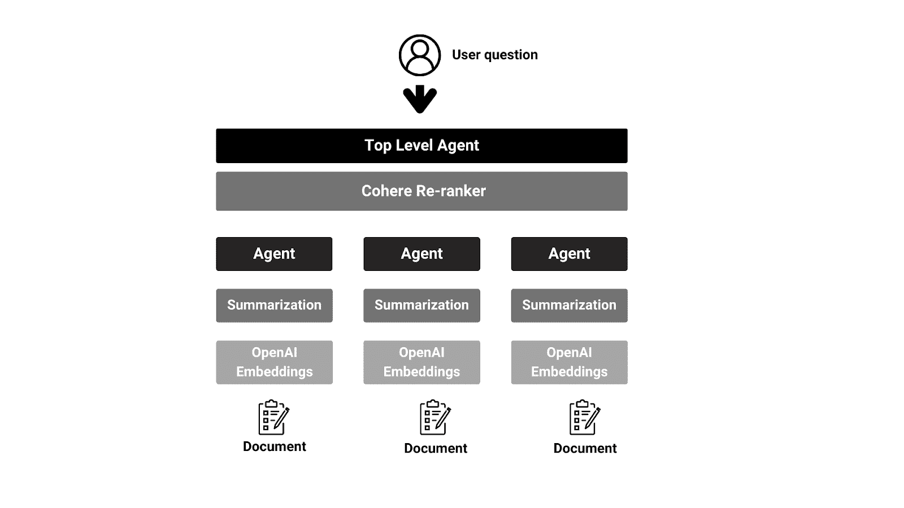

# 如何使用 LangChain 实现 Agentic RAG：第一部分

> 原文：[`www.kdnuggets.com/how-to-implement-agentic-rag-using-langchain-part-1`](https://www.kdnuggets.com/how-to-implement-agentic-rag-using-langchain-part-1)

想象一下在没有食谱的情况下尝试烤蛋糕。你可能会记住一些细节，但很可能会遗漏一些关键的东西。这类似于传统的大型语言模型（LLMs）的功能，它们很出色，但有时缺乏特定的、最新的信息。

* * *

## 我们的前三个课程推荐

 1\. [谷歌网络安全证书](https://www.kdnuggets.com/google-cybersecurity) - 快速入门网络安全职业。

 2\. [谷歌数据分析专业证书](https://www.kdnuggets.com/google-data-analytics) - 提升您的数据分析技能

 3\. [谷歌 IT 支持专业证书](https://www.kdnuggets.com/google-itsupport) - 支持您的组织 IT

* * *

[Naive RAG](https://arxiv.org/pdf/2312.10997) 范式代表了最早的方法论，在 ChatGPT 广泛采用后不久就获得了关注。这种方法遵循传统流程，包括索引、检索和生成，通常被称为“检索-阅读”框架。

下图展示了一个 Naive RAG 流程：

该图显示了从查询到检索和响应的 Naive RAG 流程 | 作者提供的图片

使用 LangChain 实现 Agentic RAG 将这一过程提升到了一个新的层次。与简单的 RAG 方法不同，Agentic RAG 引入了“代理”的概念，这些代理可以主动与检索系统互动，以提高生成输出的质量。

首先，让我们定义一下 Agentic RAG 是什么。

## 什么是 Agentic RAG？

Agentic RAG（基于代理的检索增强生成）是一种创新的方法，用于跨多个文档回答问题。与仅依赖大型语言模型的传统方法不同，Agentic RAG 利用智能代理，这些代理能够规划、推理和随时间学习。

这些代理负责比较文档、总结特定文档和评估总结。这为问题回答提供了更灵活和动态的框架，因为这些代理协作完成复杂的任务。

Agentic RAG 的关键组成部分包括：

+   **Document Agents**：负责在指定文档内进行问题回答和总结。

+   **Meta-Agent**：负责监督文档代理并协调他们的工作。

这种层次结构允许代理 RAG 利用单个文档代理和元代理的优势，从而在需要战略规划和细致决策的任务中增强能力。

该图示例了从顶级代理到下属文档代理的不同层次 | 来源：[LlamaIndex](https://www.llamaindex.ai/blog/agentic-rag-with-llamaindex-2721b8a49ff6)

## 使用代理 RAG 的好处

在检索增强生成（RAG）中使用基于代理的实现提供了多种好处，包括任务专业化、并行处理、可扩展性、灵活性和容错性。详细说明如下：

1.  **任务专业化**：基于代理的 RAG 允许不同代理之间的任务专业化。每个代理可以专注于任务的特定方面，如文档检索、总结或问题回答。这种专业化通过确保每个代理都适合其指定角色，从而提高了效率和准确性。

1.  **并行处理**：基于代理的 RAG 系统中的代理可以并行工作，同时处理任务的不同方面。这种并行处理能力导致响应时间更快，整体性能更佳，特别是在处理大型数据集或复杂任务时。

1.  **可扩展性**：基于代理的 RAG 架构具有固有的可扩展性。可以根据需要将新代理添加到系统中，使其能够处理增加的工作负载或适应额外的功能，而无需对整体架构进行重大更改。这种可扩展性确保系统可以随时间增长并适应变化的需求。

1.  **灵活性**：这些系统在任务分配和资源管理方面提供了灵活性。代理可以根据工作负荷、优先级或具体要求动态分配任务，从而实现高效的资源利用，并适应不同的工作负荷或用户需求。

1.  **容错性**：基于代理的 RAG 架构具有固有的容错性。如果一个代理失败或不可用，其他代理可以继续独立执行其任务，从而降低系统停机或数据丢失的风险。这种容错性提高了系统的可靠性和健壮性，确保在面对故障或中断时服务不中断。

现在我们已经了解了它是什么，在下一部分中，我们将实施代理 RAG。

****[Shittu Olumide](https://www.linkedin.com/in/olumide-shittu/)**** 是一位软件工程师和技术作家，热衷于利用前沿技术来撰写引人入胜的叙事，对细节有敏锐的观察力，并擅长简化复杂概念。你还可以在[Twitter](https://twitter.com/Shittu_Olumide_)上找到 Shittu。

### 更多相关主题

+   [如何让大型语言模型与您的软件良好协作…](https://www.kdnuggets.com/how-to-make-large-language-models-play-nice-with-your-software-using-langchain)

+   [在数据隐私方面学习如何实施技术隐私解决方案…](https://www.kdnuggets.com/2022/04/manning-data-privacy-learn-implement-technical-privacy-solutions-tools-scale.html)

+   [学习如何设计、测量和实施可信的 A/B 测试…](https://www.kdnuggets.com/2023/01/sphere-design-measure-implement-trustworthy-ab-tests-ronny-kohavi.html)

+   [如何用医疗数据实现联邦学习项目](https://www.kdnuggets.com/2023/02/implement-federated-learning-project-healthcare-data.html)

+   [使用 HuggingFace 实现的简单端到端项目](https://www.kdnuggets.com/a-simple-to-implement-end-to-end-project-with-huggingface)

+   [LangChain 正在评估的 6 个 LLM 问题](https://www.kdnuggets.com/6-problems-of-llms-that-langchain-is-trying-to-assess)
