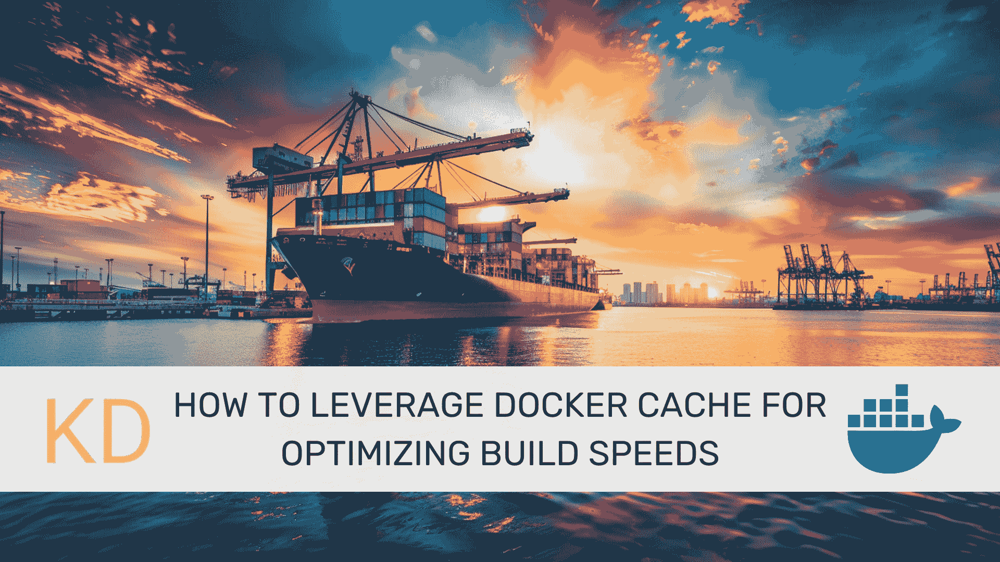
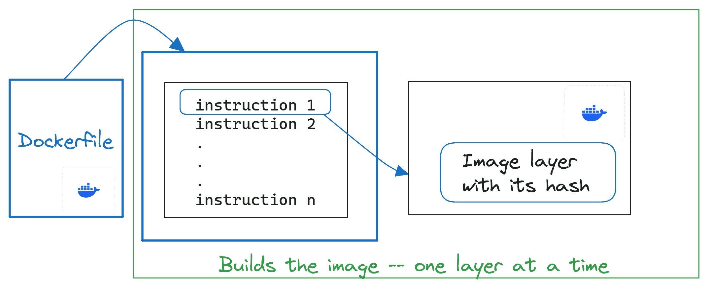
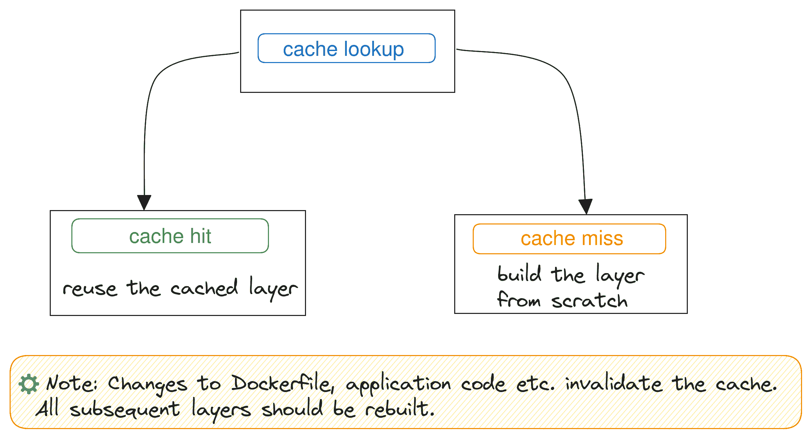

# 如何利用 Docker 缓存优化构建速度

> 原文：[`www.kdnuggets.com/how-to-leverage-docker-cache-for-optimizing-build-speeds`](https://www.kdnuggets.com/how-to-leverage-docker-cache-for-optimizing-build-speeds)



图片由编辑提供 | Midjourney & Canva

利用 Docker 缓存可以显著加快构建速度，通过重用之前构建的层来实现。让我们深入了解如何优化 Dockerfile，以便充分利用 Docker 的层缓存机制。

* * *

## 我们的前三名课程推荐

 1\. [谷歌网络安全证书](https://www.kdnuggets.com/google-cybersecurity) - 快速进入网络安全职业的捷径。

 2\. [谷歌数据分析专业证书](https://www.kdnuggets.com/google-data-analytics) - 提升您的数据分析能力

 3\. [谷歌 IT 支持专业证书](https://www.kdnuggets.com/google-itsupport) - 支持您的组织在 IT 领域

* * *

## 前提条件

在开始之前：

+   你应该已经安装了 Docker。如果还没有，[获取 Docker](https://docs.docker.com/get-docker/)。

+   你应该对基本的 Docker 概念、创建 Dockerfile 和常用的 Docker 命令有所了解。

## Docker 构建缓存如何工作

Docker 镜像是分层构建的，其中 Dockerfile 中的每条指令都会创建一个新层。例如，`FROM`、`RUN`、`COPY` 和 `ADD` 等指令都会在生成的镜像中创建一个新层。

Docker 使用内容可寻址存储机制来管理镜像层。每一层都由 Docker 根据层的内容计算出的**唯一哈希**来标识。Docker 比较这些哈希值，以确定是否可以从缓存中重用某一层。



构建 Docker 镜像 | 图片由作者提供

当 Docker 构建镜像时，它会遍历 Dockerfile 中的每条指令，并执行缓存查找以查看是否可以重用之前构建的层。



重新使用或从头开始构建 | 图片由作者提供

使用缓存的决策基于多个因素：

+   **基础镜像**：如果基础镜像（`FROM` 指令）发生了变化，Docker 将使所有后续层的缓存失效。

+   **指令**：Docker 检查每条指令的确切内容。如果指令与之前执行过的相同，可以使用缓存。

+   **文件和目录**：对于涉及文件的指令，如 `COPY` 和 `ADD`，Docker 会检查文件的内容。如果文件没有变化，可以使用缓存。

+   **构建上下文**：Docker 在决定是否使用缓存时，还会考虑构建上下文（发送到 Docker 守护进程的文件和目录）。

### 理解缓存失效

某些更改可能会使缓存失效，导致 Docker 从头开始重建该层：

+   **Dockerfile 的修改**：如果 Dockerfile 中的指令发生变化，Docker 会使该指令及所有后续指令的缓存失效。

+   **源文件的更改**：如果涉及到 `COPY` 或 `ADD` 指令的文件或目录发生变化，**Docker 会使这些层和后续层的缓存失效**。

总结一下，这里是你需要知道的关于 Docker 构建缓存的信息：

+   Docker 逐层构建镜像。如果某一层没有变化，Docker 可以重用该层的缓存版本。

+   如果某层发生变化，所有后续层都会重建。因此，将不常更改的指令（如基础镜像、依赖安装、初始化脚本）放在 Dockerfile 中较早的位置可以帮助最大化缓存命中。

## 利用 Docker 构建缓存的最佳实践

为了利用 Docker 构建缓存，你可以以最大化缓存命中的方式构建你的 Dockerfile。以下是一些提示：

+   **按更改频率排序指令**：将不常更改的指令放在 Dockerfile 的更高位置。将经常更改的指令，例如 `COPY` 或 `ADD` 应用代码的指令放在 Dockerfile 的末尾。

+   **将依赖与应用代码分开**：将安装依赖的指令与复制源代码的指令分开。这样，只有在依赖发生变化时才会重新安装依赖。

接下来，让我们来看几个例子。

## 示例：利用构建缓存的 Dockerfile

1. 这是一个用于设置 PostgreSQL 实例并包含一些初始化脚本的 Dockerfile 示例。此示例侧重于优化层缓存：

```py
# Use the official PostgreSQL image as a base
FROM postgres:latest

# Environment variables for PostgreSQL
ENV POSTGRES_DB=mydatabase
ENV POSTGRES_USER=myuser
ENV POSTGRES_PASSWORD=mypassword

# Set the working directory
WORKDIR /docker-entrypoint-initdb.d

# Copy the initialization SQL scripts
COPY init.sql /docker-entrypoint-initdb.d/

# Expose PostgreSQL port
EXPOSE 5432 
```

基础镜像层通常不常更改。环境变量不太可能经常更改，因此尽早设置它们有助于重用后续层的缓存。注意，我们在应用代码之前复制初始化脚本。这是因为在经常更改的文件之前复制不常更改的文件有助于利用缓存。

2. 这是另一个容器化 Python 应用的 Dockerfile 示例：

```py
# Use the official lightweight Python 3.11-slim image
FROM python:3.11-slim

# Set the working directory
WORKDIR /app

# Install dependencies
COPY requirements.txt requirements.txt
RUN pip install --no-cache-dir -r requirements.txt

# Copy the contents of the current directory into the container
COPY . .

# Expose the port on which the app runs
EXPOSE 5000

# Run the application
CMD ["python3", "app.py"] 
```

在安装依赖后复制其余的应用代码可以确保应用代码的更改不会使依赖层的缓存失效。这最大化了缓存层的重用，从而加快了构建速度。

通过理解和利用 Docker 的缓存机制，你可以为更快的构建和更高效的镜像创建构建你的 Dockerfile。

## 附加资源

通过以下链接了解更多关于缓存的信息：

+   [Docker 构建缓存](https://docs.docker.com/build/cache/)

+   [使用构建缓存](https://docs.docker.com/guides/docker-concepts/building-images/using-the-build-cache/)

**[](https://twitter.com/balawc27)**[Bala Priya C](https://www.kdnuggets.com/wp-content/uploads/bala-priya-author-image-update-230821.jpg)**** 是来自印度的开发者和技术作家。她喜欢在数学、编程、数据科学和内容创作的交叉点上工作。她的兴趣和专长领域包括 DevOps、数据科学和自然语言处理。她喜欢阅读、写作、编程和咖啡！目前，她正在通过撰写教程、操作指南、观点文章等方式学习并与开发者社区分享她的知识。Bala 还创建了引人入胜的资源概述和编码教程。

### 更多相关话题

+   [如何更好地利用数据科学促进业务增长](https://www.kdnuggets.com/2022/08/better-leverage-data-science-business-growth.html)

+   [使用 RAPIDS cuDF 充分利用 GPU 进行特征工程](https://www.kdnuggets.com/2023/06/rapids-cudf-leverage-gpu-feature-engineering.html)

+   [用遗传算法优化基因](https://www.kdnuggets.com/2022/04/optimizing-genes-genetic-algorithm.html)

+   [优化 Python 代码性能：深入了解 Python 性能分析工具](https://www.kdnuggets.com/2023/02/optimizing-python-code-performance-deep-dive-python-profilers.html)

+   [优化数据存储：探索 SQL 中的数据类型和规范化](https://www.kdnuggets.com/optimizing-data-storage-exploring-data-types-and-normalization-in-sql)

+   [优化数据分析：在 Databricks 中集成 GitHub Copilot](https://www.kdnuggets.com/optimizing-data-analytics-integrating-github-copilot-in-databricks)
