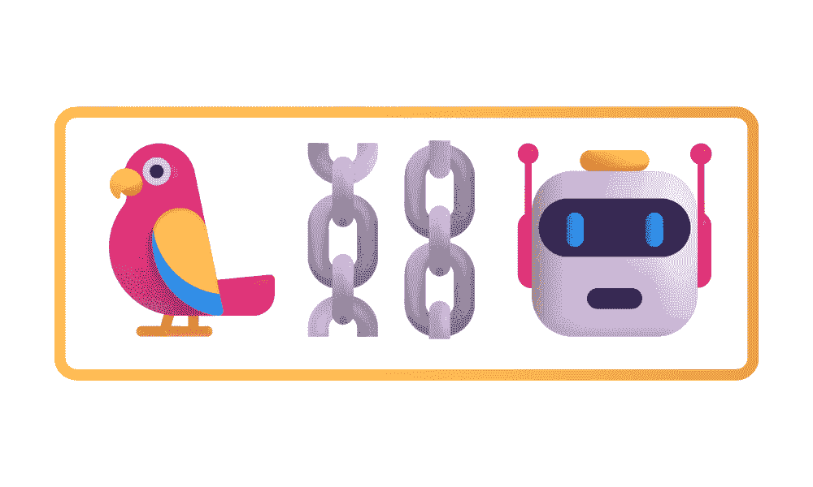
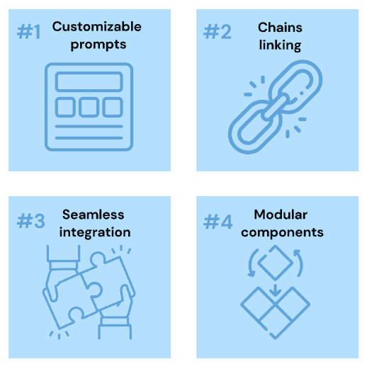

# 如何使用 LangChain 让大型语言模型与您的软件良好配合

> 原文：[`www.kdnuggets.com/how-to-make-large-language-models-play-nice-with-your-software-using-langchain`](https://www.kdnuggets.com/how-to-make-large-language-models-play-nice-with-your-software-using-langchain)



编辑提供的图片

像 OpenAI 的 GPT-3、Google 的 BERT 和 Meta 的 LLaMA 这样的**大型语言模型**正在以其生成各种文本的能力革新多个领域——从营销文案和数据科学脚本到诗歌。

* * *

## 我们的三大课程推荐

 1\. [Google 网络安全证书](https://www.kdnuggets.com/google-cybersecurity) - 快速进入网络安全职业生涯。

 2\. [Google 数据分析专业证书](https://www.kdnuggets.com/google-data-analytics) - 提升你的数据分析能力

 3\. [Google IT 支持专业证书](https://www.kdnuggets.com/google-itsupport) - 支持你的组织 IT

* * *

尽管 ChatGPT 的直观界面已经在大多数人设备上普及，但在多种软件集成中使用 LLMs 仍有广阔的未开发潜力。

主要问题是什么？

大多数应用程序需要与 LLMs 进行更流畅和本地化的沟通。

而这正是 LangChain 发挥作用的地方！

如果你对生成式 AI 和 LLMs 感兴趣，这个教程是为你量身定制的。

那么…让我们开始吧！

# LLM 是什么？

如果你最近一直在过着与世隔绝的生活，还没有获得任何新闻，我将简要介绍一下**大型语言模型（LLMs）**。

LLM（大型语言模型）是一个复杂的人工智能系统，旨在模拟类似人类的文本理解和生成。通过在大量数据集上进行训练，这些模型能够辨别复杂的模式、理解语言的细微差别，并生成连贯的输出。

如果你想知道如何与这些 AI 驱动的模型互动，主要有两种方法：

1.  最常见和直接的方法是与模型对话或聊天。这涉及到编写提示，将其发送到 AI 驱动的模型，并以文本格式的输出作为响应。

1.  另一种方法是将文本转换为数值数组。这一过程涉及为 AI 编写一个提示并返回一个数值数组。这就是通常所称的“嵌入”。它在向量数据库和语义搜索中最近经历了激增。

正是这两个主要问题是 LangChain 试图解决的。如果你对与 LLMs 互动的主要问题感兴趣，可以在这里查看这篇文章。

# LangChain 及其基础知识

LangChain 是一个围绕 LLM 构建的开源框架。它提供了一整套工具、组件和接口，简化了 LLM 驱动应用的架构。

使用 LangChain，与语言模型互动、链接各种组件以及整合如 API 和数据库等资源变得轻而易举。这个直观的框架大大简化了 LLM 应用开发的过程。

LangChain 的核心思想是将不同的组件或模块，即链条，连接在一起，创造出更复杂的 LLM 驱动的解决方案。

以下是 LangChain 的一些突出功能：

1.  可自定义的提示模板用于标准化我们的互动。

1.  针对复杂用例的链条链接组件。

1.  与领先语言模型的无缝集成，包括 OpenAI 的 GPTs 和 HuggingFace Hub 上的模型。

1.  模块化组件支持混合搭配的方式来评估任何特定问题或任务。



图片由作者提供

LangChain 的特点在于其对适应性和模块化设计的关注。

LangChain 的主要思想是将自然语言处理过程拆分成单独的部分，让开发者根据需求自定义工作流。

这种多样性使 LangChain 成为在不同情况和行业中构建 AI 解决方案的首选。

其中一些最重要的组件是……


图片由作者提供

## 1\. LLM

LLM 是利用大量训练数据理解和生成类人文本的核心组件。它们是 LangChain 内许多操作的核心，提供了必要的语言处理能力来分析、解释和回应文本输入。

**用途：** 为聊天机器人提供动力，为各种应用生成类人文本，辅助信息检索，并执行其他语言处理任务。

## 2\. 提示模板

提示是与 LLM 互动的基础，当处理特定任务时，它们的结构往往类似。提示模板，即预设的可跨链条使用的提示，通过添加特定值来标准化“提示”。这增强了任何 LLM 的适应性和定制性。

**用途：** 标准化与 LLM 的互动过程。

## 3\. 输出解析器

输出解析器是将链条前一个阶段的原始输出转换为结构化格式的组件。这些结构化数据可以在后续阶段更有效地使用，或作为最终用户的回应。

**用途：** 例如，在聊天机器人中，输出解析器可能会从语言模型中获取原始文本响应，提取关键信息，并将其格式化为结构化回复。

## 4\. 组件和链条

在 LangChain 中，每个组件作为负责语言处理序列中特定任务的模块。这些组件可以连接起来形成*链*以定制工作流程。

**用法：** 在特定聊天机器人中生成情感检测和响应生成链。

## 5\. 内存

在 LangChain 中，内存指的是一个组件，它为工作流中的信息提供存储和检索机制。这个组件允许暂时或持久地存储数据，其他组件在与 LLM 交互时可以访问和操作这些数据。

**用法：** 这在需要在不同处理阶段保留数据的场景中很有用，例如，在聊天机器人中存储对话历史，以提供上下文感知的响应。

## 6\. 代理

代理是能够基于其处理的数据采取行动的自主组件。它们可以与其他组件、外部系统或用户交互，在 LangChain 工作流中执行特定任务。

**用法：** 例如，一个代理可能会处理用户交互、处理传入的请求，并协调数据在链中的流动，以生成适当的响应。

## 7\. 索引和检索器

索引和检索器在高效管理和访问数据方面发挥着关键作用。索引是包含模型训练数据的信息和元数据的数据结构。另一方面，检索器是与这些索引交互的机制，根据指定的标准提取相关数据，并通过提供相关上下文，使模型能够更好地回复。

**用法：** 它们在从大型数据集中快速获取相关数据或文档方面发挥重要作用，这对于信息检索或问答任务至关重要。

## 8\. 文档转换器

在 LangChain 中，文档转换器是专门设计用于以适合进一步分析或处理的方式处理和转换文档的组件。这些转换可能包括文本规范化、特征提取或将文本转换为不同格式等任务。

**用法：** 为后续处理阶段准备文本数据，例如机器学习模型的分析或高效检索的索引。

## 9\. 嵌入模型

它们用于将文本数据转换为高维空间中的数值向量。这些模型捕捉了词语和短语之间的语义关系，实现机器可读的表示。它们构成了 LangChain 生态系统中各种下游自然语言处理（NLP）任务的基础。

**用法：** 通过提供文本的数值表示，促进语义搜索、相似性比较和其他机器学习任务。

## 10\. 向量存储

一种数据库系统，专门存储和搜索通过嵌入分析的数值表示的文本数据。VectorStore 作为这些嵌入的存储设施。

**用法：** 允许基于语义相似性进行高效搜索。

# 设置和第一个示例

## 使用 PIP 安装

我们首先要确保环境中已安装 LangChain。

```py
pip install langchain
```

## 环境设置

使用 LangChain 通常意味着与多种模型提供者、数据存储、API 以及其他组件进行集成。正如你已经知道的那样，与任何集成一样，提供相关且正确的 API 密钥对 LangChain 的操作至关重要。

想象一下我们要使用我们的 OpenAI API。我们可以通过两种方式轻松实现这一点：

1.  将密钥设置为环境变量

```py
OPENAI_API_KEY="..."
```

或者

```py
import os

os.environ['OPENAI_API_KEY'] = “...”
```

如果你选择不建立环境变量，你可以在初始化 OpenAI LLM 类时通过名为 openai_api_key 的参数直接提供密钥：

1.  直接在相关类中设置密钥。

```py
from langchain.llms import OpenAI

llm = OpenAI(openai_api_key="...")
```

# LangChain 的实际应用

## 在 LLM 之间切换变得非常简单

LangChain 提供了一个 LLM 类，使我们可以与不同的语言模型提供者（如 OpenAI 和 Hugging Face）进行交互。

开始使用任何 LLM 都相当容易，因为任何 LLM 最基本、最容易实现的功能就是生成文本。

然而，同时向不同的 LLM 提问相同的提示并不是那么容易。

这就是 LangChain 发挥作用的地方……

回到任何 LLM 最简单的功能，我们可以轻松地使用 LangChain 构建一个应用程序，该应用程序获取一个字符串提示，并返回我们指定 LLM 的输出。

代码由作者提供

我们可以仅用几行代码，使用相同的提示并获取两个不同模型的响应！

代码由作者提供

令人印象深刻……对吧？

## 使用提示模板为我们的提示赋予结构

语言模型（LLMs）常见的问题是它们无法升级复杂的应用程序。LangChain 通过提供简化创建提示过程的解决方案来解决这一问题，这通常比定义任务更为复杂，因为它需要概述 AI 的角色并确保事实准确性。这一过程的一个重要部分涉及重复的模板文本。LangChain 通过提供提示模板来缓解这一点，提示模板自动包含模板文本，从而简化提示创建，并确保不同任务之间的一致性。

代码由作者提供

## 使用输出解析器获取结构化响应

在基于聊天的互动中，模型的输出仅仅是文本。然而，在软件应用中，拥有结构化的输出更为理想，因为这允许进一步的编程操作。例如，在生成数据集时，希望以 CSV 或 JSON 等特定格式接收响应。假设可以设计一个提示以引导 AI 提供一致且格式合适的响应，那么就需要工具来管理这种输出。LangChain 通过提供输出解析器工具来满足这一需求，从而有效处理和利用结构化输出。

代码由作者提供

你可以在我的 [GitHub](https://github.com/rfeers/LangChain/blob/main/1_Main_Basics_of_LangChain.ipynb) 上查看完整的代码。

# 结论

不久前，ChatGPT 的先进能力让我们惊叹。然而，技术环境不断变化，如今像 LangChain 这样的工具触手可及，让我们可以在个人电脑上仅需几小时便能打造出色的原型。

LangChain，一个免费的 Python 平台，为用户提供了开发由 LLMs（语言模型）驱动的应用程序的手段。该平台提供了对各种基础模型的灵活接口，简化了提示处理，并作为连接点整合了提示模板、更多 LLMs、外部信息和其他资源（通过代理），根据当前文档。

想象一下聊天机器人、数字助理、语言翻译工具和情感分析工具；所有这些启用 LLM 的应用程序都可以通过 LangChain 实现。开发者利用这个平台来打造量身定制的语言模型解决方案，以满足不同的需求。

随着自然语言处理的视野扩展和应用的加深，它的应用领域似乎无穷无尽。

**[](https://www.linkedin.com/in/josep-ferrer-sanchez/)**[Josep Ferrer](https://www.linkedin.com/in/josep-ferrer-sanchez)** 是一位来自巴塞罗那的分析工程师。他毕业于物理工程专业，目前在数据科学领域专注于人类流动性应用。他还是一位兼职内容创作者，专注于数据科学和技术。Josep 撰写有关人工智能的内容，涵盖该领域的持续爆炸应用。

### 更多相关话题

+   [使用大型语言模型时优化性能和成本的策略](https://www.kdnuggets.com/strategies-for-optimizing-performance-and-costs-when-using-large-language-models-in-the-cloud)

+   [顶级开源大型语言模型](https://www.kdnuggets.com/2022/09/john-snow-top-open-source-large-language-models.html)

+   [更多关于大型语言模型的免费课程](https://www.kdnuggets.com/2023/06/free-courses-large-language-models.html)

+   [了解大型语言模型](https://www.kdnuggets.com/2023/03/learn-large-language-models.html)

+   [介绍 John Snow Labs 的医疗保健专用大型语言模型](https://www.kdnuggets.com/2023/04/john-snow-introducing-healthcare-specific-large-language-models-john-snow-labs.html)

+   [大型语言模型是什么？它们如何工作？](https://www.kdnuggets.com/2023/05/large-language-models-work.html)
