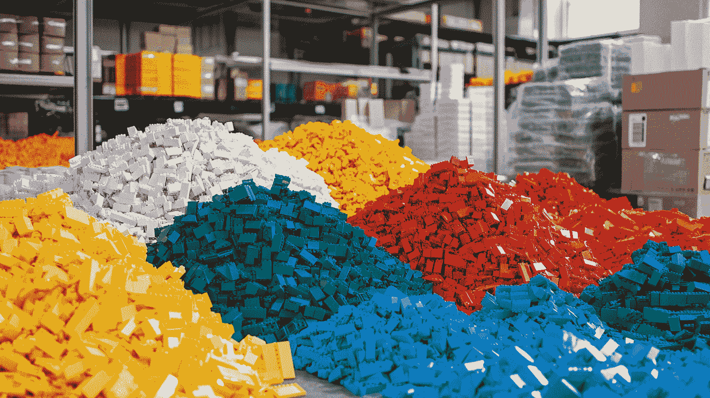

# 如何有效管理 Pandas 中的分类数据

> 原文：[`www.kdnuggets.com/how-to-manage-categorical-data-effectively-with-pandas`](https://www.kdnuggets.com/how-to-manage-categorical-data-effectively-with-pandas)



让我们尝试了解 Pandas 中的分类数据。

## 准备

* * *

## 我们的前三个课程推荐

 1\. [Google 网络安全证书](https://www.kdnuggets.com/google-cybersecurity) - 快速进入网络安全职业的捷径。

 2\. [Google 数据分析专业证书](https://www.kdnuggets.com/google-data-analytics) - 提升你的数据分析技能

 3\. [Google IT 支持专业证书](https://www.kdnuggets.com/google-itsupport) - 支持你所在的组织 IT

* * *

在开始之前，我们需要安装 Pandas 和 Numpy 包。你可以用以下代码安装它们：

```py
pip install pandas numpy
```

安装好包后，让我们进入文章的主要部分。

## 在 Pandas 中管理分类数据

分类数据是 Pandas 中的一种数据类型，表示特定（固定）数量的类别或不同值。与 Pandas 中的字符串或对象数据类型不同，分类数据在 Pandas 中的存储方式也有所不同。

分类数据更节省内存，因为分类数据中的值只存储一次。相比之下，对象数据类型会将每个值存储为单独的字符串，这需要更多的内存。

让我们通过一个例子来试用分类数据。下面是如何用 Pandas 初始化分类数据。

```py
import pandas as pd

df = pd.DataFrame({
    'fruits': pd.Categorical(['apple', 'kiwi', 'watermelon', 'kiwi', 'apple', 'kiwi']),
    'size': pd.Categorical(['small', 'large', 'large', 'small', 'large', 'small'])
})
df.info()
```

输出：

```py
RangeIndex: 6 entries, 0 to 5
Data columns (total 2 columns):
 #   Column  Non-Null Count  Dtype   
---  ------  --------------  -----   
 0   fruits  6 non-null      category
 1   size    6 non-null      category
dtypes: category(2)
memory usage: 396.0 bytes
```

你可以看到列“水果”的数据类型，大小是一个类别，而不是我们通常看到的对象。

我们可以尝试用以下代码比较分类数据和对象数据类型的内存使用情况：

```py
import numpy as np

n = 100000

df_object = pd.DataFrame({
    'fruit': np.random.choice(['apple', 'banana', 'orange'], size=n)
})

print('Memory usage with object type:')
print(df_object['fruit'].memory_usage(deep=True))

df_category = pd.DataFrame({
    'fruit': pd.Categorical(np.random.choice(['apple', 'banana', 'orange'], size=n))
})

print('Memory usage with categorical type:')
print(df_category['fruit'].memory_usage(deep=True))
```

输出：

```py
Memory usage with object type:
6267209
Memory usage with categorical type:
100424
```

你可以看到，对象类型比分类数据类型消耗的内存要多得多，尤其是当样本更多时。

接下来，我们将探讨分类数据类型可以使用的独特方法。例如，你可以获取类别：

```py
df['fruits'].cat.categories
```

输出：

```py
Index(['apple', 'kiwi', 'watermelon'], dtype='object')
```

此外，我们还可以重命名类别：

```py
df['fruits'] = df['fruits'].cat.rename_categories(['fruit_apple', 'fruit_banana', 'fruit_orange'])
print(df['fruits'].cat.categories)
```

输出：

```py
Index(['fruit_apple', 'fruit_banana', 'fruit_orange'], dtype='object')
```

分类数据类型还可以引入序数值，我们可以比较类别。

```py
df['size'] = pd.Categorical(df['size'], categories=['small', 'medium', 'large'], ordered=True)
df['size'] < 'large' 
```

输出：

```py
0     True
1    False
2    False
3     True
4    False
5     True
Name: size, dtype: bool
```

掌握分类数据类型将为你的数据分析提供优势。

## 附加资源

+   [如何处理机器学习中的分类数据](https://www.kdnuggets.com/2021/05/deal-with-categorical-data-machine-learning.html)

+   [如何用 Scikit-learn 编码分类变量](https://www.statology.org/how-encode-categorical-variables-scikit-learn/)

+   [如何用分类数据进行特征选择](https://machinelearningmastery.com/feature-selection-with-categorical-data/)

**[](https://www.linkedin.com/in/cornellius-yudha-wijaya/)**[Cornellius Yudha Wijaya](https://www.linkedin.com/in/cornellius-yudha-wijaya/)**** 是一位数据科学助理经理和数据撰写者。在全职工作于 Allianz Indonesia 的同时，他喜欢通过社交媒体和写作媒体分享 Python 和数据技巧。Cornellius 涉及多种人工智能和机器学习主题的写作。

### 更多相关主题

+   [如何有效使用 Docker 标签管理镜像版本](https://www.kdnuggets.com/how-to-use-docker-tags-to-manage-image-versions-effectively)

+   [如何处理机器学习中的分类数据](https://www.kdnuggets.com/2021/05/deal-with-categorical-data-machine-learning.html)

+   [如何有效使用 Pandas GroupBy](https://www.kdnuggets.com/2023/01/effectively-pandas-groupby.html)

+   [使用 MultiLabelBinarizer 对分类特征进行编码](https://www.kdnuggets.com/2023/01/encoding-categorical-features-multilabelbinarizer.html)

+   [数据分析：四种数据分析方法及其如何…](https://www.kdnuggets.com/2023/04/data-analytics-four-approaches-analyzing-data-effectively.html)

+   [数据可视化：有效呈现复杂信息](https://www.kdnuggets.com/data-visualization-presenting-complex-information-effectively)
