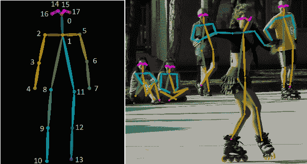
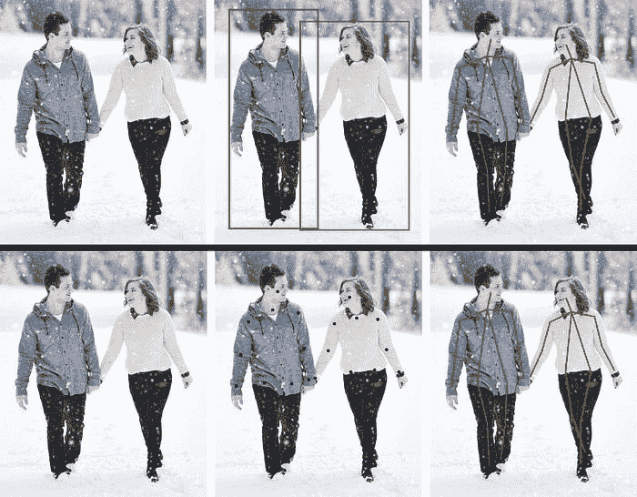
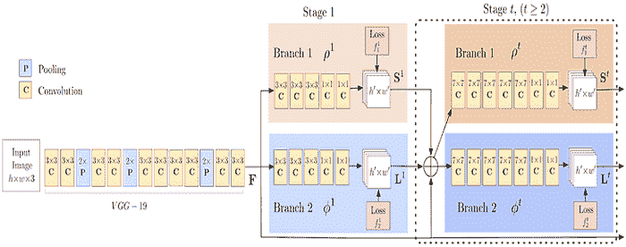
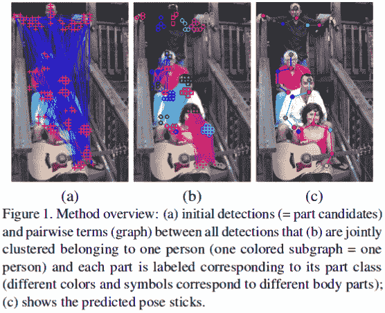
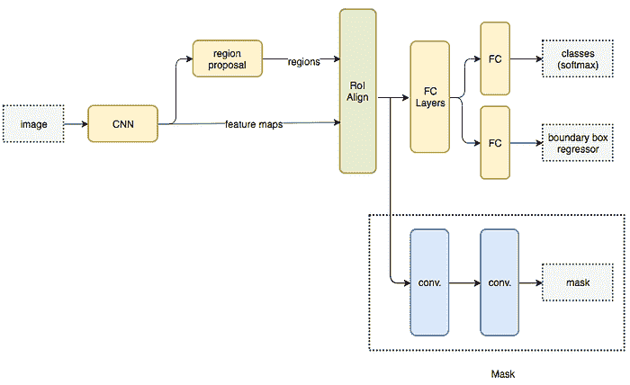
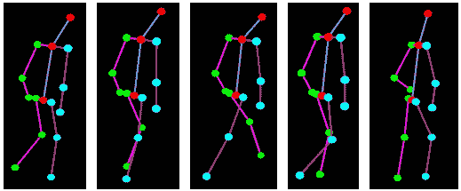
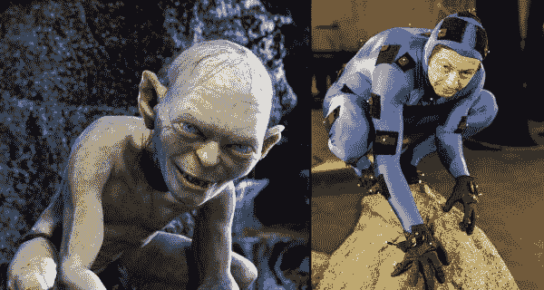
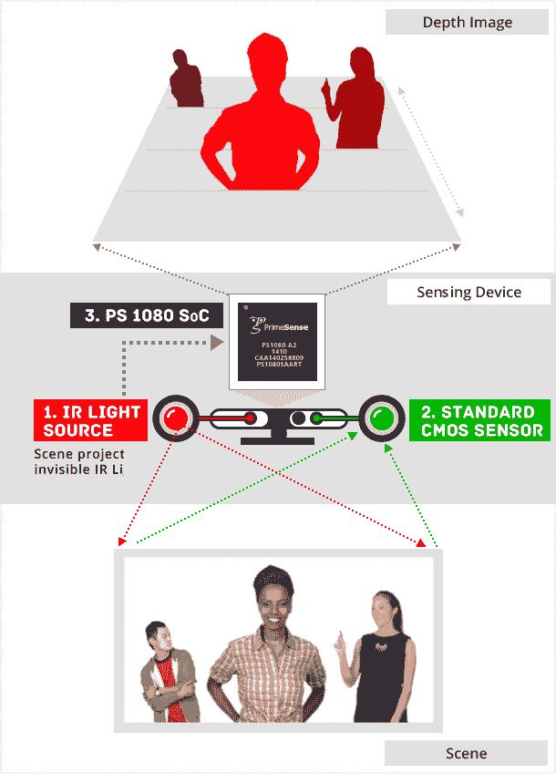

# 使用深度学习的人体姿势估计概述

> 原文：[`www.kdnuggets.com/2019/06/human-pose-estimation-deep-learning.html`](https://www.kdnuggets.com/2019/06/human-pose-estimation-deep-learning.html)

 评论

**作者：[Bharath Raj](https://www.linkedin.com/in/bharathrajn/)，助理工程师，以及[Yoni Osin](https://www.linkedin.com/in/yoni-osin-41791aa5/)，BeyondMinds 研发副总裁**

人体姿势骨架以图形格式表示一个人的朝向。实际上，它是一组可以连接的坐标，用来描述一个人的姿势。骨架中的每个坐标称为一个部分（或关节，或关键点）。两个部分之间的有效连接称为一对（或肢体）。请注意，并非所有部分组合都会形成有效的对。下方展示了一个示例人体姿势骨架。

 左：COCO 关键点格式的人体姿势骨架。右：渲染的人体姿势骨架。 ([来源](https://github.com/CMU-Perceptual-Computing-Lab/openpose))

* * *

## 我们的前三个课程推荐

 1\. [Google 网络安全证书](https://www.kdnuggets.com/google-cybersecurity) - 快速进入网络安全职业的轨道。

 2\. [Google 数据分析专业证书](https://www.kdnuggets.com/google-data-analytics) - 提升你的数据分析技能

 3\. [Google IT 支持专业证书](https://www.kdnuggets.com/google-itsupport) - 支持你的组织 IT

* * *

了解一个人的朝向为多个现实生活中的应用打开了大门，其中一些在本博客的末尾讨论。多年来，提出了几种人体姿势估计的方法。最早（也是最慢）的方法通常估计图像中一个人的姿势，而图像中最初只有一个人。这些方法通常首先识别单独的部分，然后通过形成它们之间的连接来创建姿势。

自然地，这些方法在现实生活中的许多场景中并不是特别有用，因为这些图像包含多个个体。

### 多人姿势估计

多人姿势估计比单人情况更复杂，因为图像中的人物位置和数量未知。通常，我们可以使用两种方法之一来解决上述问题：

+   简单的方法是首先整合一个人员检测器，然后估计每个人的部分，最后计算每个人的姿势。这种方法称为**自上而下**方法。

+   另一种方法是检测图像中的所有部分（即每个人的部分），然后将属于不同人的部分进行关联/分组。这种方法称为**自下而上**方法。

上：典型的自上而下方法。下：典型的自下而上方法。 ([图片来源](https://unsplash.com/photos/XuN44TajBGo?utm_source=unsplash&utm_medium=referral&utm_content=creditCopyText))

通常，自上而下的方法比自下而上方法更易于实现，因为添加一个人体检测器比添加关联/分组算法要简单得多。很难判断哪种方法的整体性能更好，因为这实际上取决于人体检测器和关联/分组算法中的哪个更好。

在这篇博客中，我们将重点讨论使用深度学习技术进行多人的人体姿态估计。在接下来的部分，我们将回顾一些流行的自上而下和自下而上的方法。

### 深度学习方法

**1\. OpenPose**

[OpenPose](https://arxiv.org/pdf/1812.08008.pdf) 是最受欢迎的自下而上的多人体姿态估计方法之一，部分原因在于他们的[GitHub](https://github.com/CMU-Perceptual-Computing-Lab/openpose) 实现文档详细。

与许多自下而上的方法一样，OpenPose 首先检测图像中每个人的部件（关键点），然后将这些部件分配给不同的个体。下图显示了 OpenPose 模型的架构。

OpenPose 架构的流程图。 ([来源](https://arxiv.org/pdf/1611.08050.pdf))

OpenPose 网络首先使用前几层（上述流程图中的 VGG-19）从图像中提取特征。然后，这些特征被输入到两个并行的卷积层分支中。第一个分支预测一组 18 个置信度图，每个图表示人体姿态骨架的某个特定部位。第二个分支预测一组 38 个部件关联字段（PAFs），表示部件之间的关联程度。

 使用 OpenPose 进行人体姿态估计的步骤。 ([来源](https://arxiv.org/pdf/1812.08008.pdf))

使用后续阶段来细化每个分支的预测。使用部件置信度图，在部件对之间形成二分图（如上图所示）。使用 PAF 值，剪除二分图中较弱的链接。通过这些步骤，可以估计人体姿态骨架并分配给图像中的每个人。有关算法的更详细解释，请参考他们的[论文](https://arxiv.org/pdf/1812.08008.pdf)以及这篇[博客文章](https://arvrjourney.com/human-pose-estimation-using-openpose-with-tensorflow-part-2-e78ab9104fc8)。

**2\. DeepCut**

[DeepCut](https://arxiv.org/abs/1511.06645) 是一种自下而上的多人体姿态估计方法。作者通过定义以下问题来解决这一任务：

1.  生成一组`**D**`身体部位候选。这个集合代表图像中每个人的所有可能的身体部位位置。从上述身体部位候选集合中选择一个子集。

1.  用`**C**`个身体部位类别中的一个标记每个选定的身体部位。身体部位类别代表部位类型，如“手臂”、“腿”、“躯干”等。

1.  将属于同一人的身体部位进行分割。

方法的图示表示。([来源](https://arxiv.org/pdf/1511.06645.pdf))

上述问题通过将其建模为一个[整数线性规划](https://en.wikipedia.org/wiki/Integer_programming)（ILP）问题来共同解决。该模型通过考虑下图中所述的二元随机变量三元组`**(x, y, z)**`来建立。

二元随机变量的域。([来源](https://arxiv.org/pdf/1511.06645.pdf))

考虑来自身体部位候选集合`D`的两个身体部位候选`d`和`d'`，以及来自类别集合`C`的类别`c`和`c'`。这些身体部位候选通过[Faster RCNN](https://arxiv.org/abs/1506.01497)或密集卷积神经网络获得。现在，我们可以开发以下一组语句。

+   如果`x(d,c) = 1`，则表示身体部位候选`d`属于类别`c`。

+   此外，`y(d,d') = 1`表示身体部位候选`d`和`d'`属于同一个人。

+   他们还定义了`z(d,d’,c,c’) = x(d,c) * x(d’,c’) * y(d,d’)`。如果上述值为 1，则表示身体部位候选`d`属于类别`c`，身体部位候选`d'`属于类别`c'`，并且身体部位候选`d,d’`属于同一个人。

最后一条语句可以用来将属于不同人的姿态进行分割。显然，上述语句可以用`(x,y,z)`的线性方程来表示。通过这种方式，设置了整数线性规划（ILP），可以估计多个人的姿态。有关确切的方程组和更详细的分析，请查看他们的论文[这里](https://arxiv.org/pdf/1511.06645.pdf)。

**3\. RMPE (AlphaPose)**

[RMPE](https://arxiv.org/abs/1612.00137)是一个流行的自上而下的姿态估计方法。作者认为，自上而下的方法通常依赖于人体检测器的准确性，因为姿态估计是在人体所在的区域进行的。因此，定位误差和重复的边界框预测可能导致姿态提取算法表现不佳。

重复预测的效果（左）和低置信度边界框（右）。([来源](https://arxiv.org/pdf/1612.00137.pdf))

为了解决这个问题，作者提出使用对称空间变换网络 (SSTN) 从不准确的边界框中提取高质量的单人区域。一个单人姿态估计器 (SPPE) 被用在这个提取的区域中，以估计该人的姿态骨架。一个空间去变换网络 (SDTN) 被用来将估计的人体姿态重新映射到原始图像坐标系统。最后，使用一种参数化姿态非极大值抑制 (NMS) 技术来处理冗余姿态推断的问题。

此外，作者引入了一种姿态引导提议生成器，以增强训练样本，从而更好地训练 SPPE 和 SSTN 网络。RMPE 的显著特点是该技术可以扩展到任何组合的人体检测算法和 SPPE。

**4\. Mask RCNN**

[Mask RCNN](https://arxiv.org/abs/1703.06870) 是一种用于执行语义和实例分割的流行架构。该模型并行预测图像中各种对象的边界框位置以及语义分割的掩码。基本架构可以很容易地扩展到人体姿态估计。

描述 Mask RCNN 架构的流程图。 ([来源](https://medium.com/@jonathan_hui/image-segmentation-with-mask-r-cnn-ebe6d793272))

基本架构首先使用 CNN 从图像中提取特征图。这些特征图被区域提议网络 (RPN) 用来获取对象存在的边界框候选。边界框候选从 CNN 提取的特征图中选择一个区域（区域）。由于边界框候选可能有各种尺寸，因此使用称为 RoIAlign 的层来减少提取特征的大小，使其都具有统一的尺寸。现在，这个提取的特征被传入 CNN 的并行分支，以最终预测边界框和分割掩码。

让我们专注于执行分割的分支。假设我们图像中的一个对象可以属于 K 类中的一个。分割分支输出`**K**`个大小为`**m x m**`的二进制掩码，其中每个二进制掩码仅表示属于该类的所有对象。通过将每种关键点建模为一个独特的类别，并将其视为一个分割问题，我们可以提取图像中每个人的关键点。

同时，目标检测算法可以被训练来识别人员的位置。通过结合人员的位置以及其关键点集，我们获得图像中每个人的姿态骨架。

这种方法几乎类似于自上而下的方法，但人员检测阶段与部件检测阶段是并行执行的。换句话说，关键点检测阶段和人员检测阶段是相互独立的。

**5\. 其他方法**

多人类姿态估计是一个庞大的领域，拥有大量的解决方法。为了简洁起见，这里仅解释了一些方法。要了解更详尽的方法列表，您可以查看以下链接：

+   [绝妙的人体姿态估计](https://github.com/cbsudux/awesome-human-pose-estimation)

+   [带代码的论文](https://paperswithcode.com/sota/multi-person-pose-estimation-on-mpii-multi)

### 应用

姿态估计在众多领域中都有应用，以下列出了一些。

**1\. 活动识别**

跟踪一个人姿态的变化也可以用于活动、手势和步态识别。这些有很多应用场景，包括：

+   检测一个人是否跌倒或生病的应用。

+   可以自主教授正确锻炼方案、运动技巧和舞蹈活动的应用。

+   可以理解全身手语的应用程序。（例如：机场跑道信号，交通警察信号等）。

+   可以增强安全和监控的应用程序。

追踪人的步态对于安全和监控目的很有用。（[图片来源](http://www.ee.oulu.fi/~gyzhao/research/gait_recognition.htm)）

**2\. 动作捕捉与增强现实**

人体姿态估计的一个有趣应用是 CGI 应用。可以在人的身上叠加图形、风格、精美效果、设备和艺术品，如果能够估计他们的人体姿态。通过跟踪这些姿态的变化，渲染的图形可以“自然地适应”随着人的动作。

CGI 渲染示例。（[来源](https://i.kym-cdn.com/photos/images/facebook/001/012/571/0a4.jpg)）

一个良好的视觉示例可以通过 [Animoji](https://www.wired.com/story/all-the-face-tracking-tech-behind-apples-animoji/) 来看到。尽管上述技术仅追踪了面部结构，但这个想法可以推导到人的关键点上。相同的概念可以用来渲染可以模仿一个人动作的增强现实 (AR) 元素。

**3\. 训练机器人**

机器人可以通过跟随执行动作的人体姿态骨架的轨迹来代替手动编程来跟随轨迹。人类教练只需演示相同动作，就可以有效地教机器人某些动作。机器人随后可以计算如何移动其关节来执行相同的动作。

**4\. 控制台的动作追踪**

姿态估计的一个有趣应用是跟踪人类对象的运动以进行互动游戏。Kinect 通常使用 3D 姿态估计（使用红外传感器数据）来跟踪人类玩家的动作，并利用这些数据渲染虚拟角色的动作。

Kinect 传感器在工作中。（[来源](https://appleinsider.com/articles/14/07/11/apples-secret-plans-for-primesense-3d-tech-hinted-at-by-new-itseez3d-ipad-app)）

### 结论

在人类姿态估计领域取得了巨大进展，这使我们能够更好地服务于其可能应用的各种场景。此外，诸如姿态跟踪等相关领域的研究可以大大提升其在多个领域的生产性应用。本文博客中列出的概念并不详尽，而是力图介绍这些算法的一些流行变体及其实际应用。

[Bharath Raj](https://www.linkedin.com/in/bharathrajn/) 是 Siemens PLM Software 的一名助理工程师。他喜欢尝试机器学习和计算机视觉概念。你可以在 [这里](https://thatbrguy.github.io) 查看他的项目。

[Yoni Osin](https://www.linkedin.com/in/yoni-osin-41791aa5/) 是 BeyondMinds 的研发副总裁

[原文](https://medium.com/beyondminds/an-overview-of-human-pose-estimation-with-deep-learning-d49eb656739b)。经许可转载。

**相关：**

+   如何在计算机视觉中实现一切

+   使用 Tensorflow 对象检测进行像素级分类

+   在 Tensorflow 中实现 CNN 进行人类活动识别

### 更多相关内容

+   [深度学习与人类认知能力之间的差距](https://www.kdnuggets.com/2022/10/gap-deep-learning-human-cognitive-abilities.html)

+   [缩小人类理解与机器学习之间的差距：……](https://www.kdnuggets.com/2023/06/closing-gap-human-understanding-machine-learning-explainable-ai-solution.html)

+   [R 与 Python（再论）：从人因角度看](https://www.kdnuggets.com/2022/01/r-python-human-factor-perspective.html)

+   [超越人类界限：超级智能的崛起](https://www.kdnuggets.com/beyond-human-boundaries-the-rise-of-superintelligence)

+   [自然语言处理：用 AI 架起人类沟通的桥梁](https://www.kdnuggets.com/natural-language-processing-bridging-human-communication-with-ai)

+   [超越编码：人类触感为何重要](https://www.kdnuggets.com/beyond-coding-why-the-human-touch-matters)
