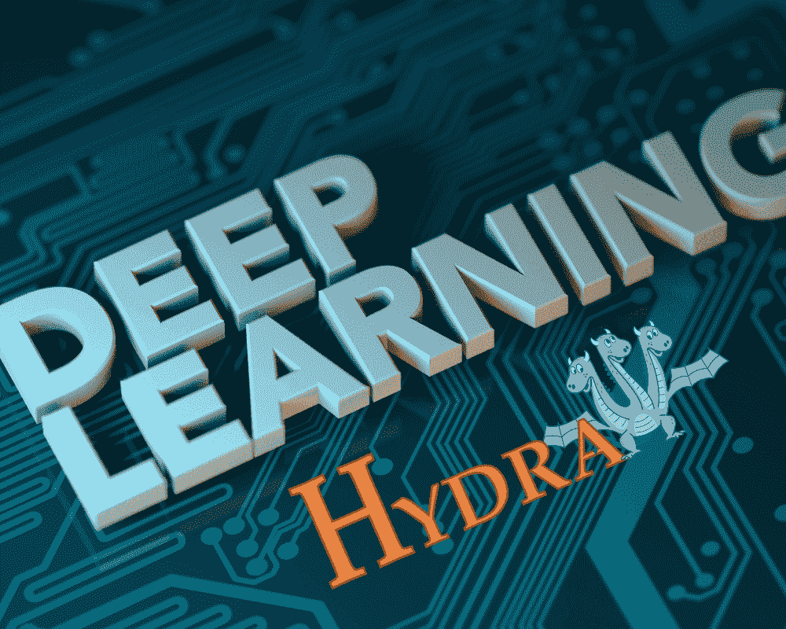
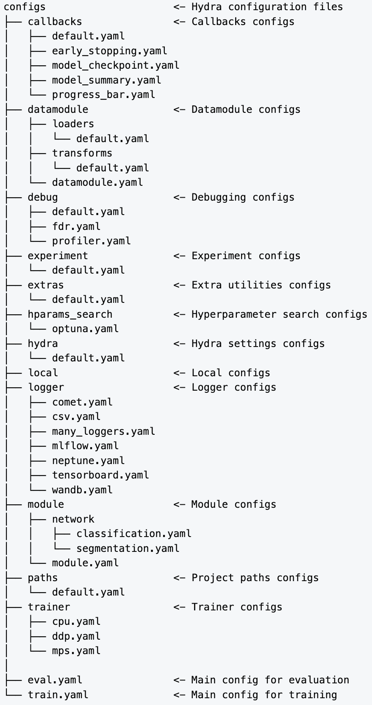

# Hydra 配置用于深度学习实验

> 原文：[`www.kdnuggets.com/2023/03/hydra-configs-deep-learning-experiments.html`](https://www.kdnuggets.com/2023/03/hydra-configs-deep-learning-experiments.html)

图片来源：编辑

# 介绍

* * *

## 我们的三大课程推荐

 1\. [Google 网络安全证书](https://www.kdnuggets.com/google-cybersecurity) - 快速进入网络安全职业生涯。

 2\. [Google 数据分析专业证书](https://www.kdnuggets.com/google-data-analytics) - 提升你的数据分析技能

 3\. [Google IT 支持专业证书](https://www.kdnuggets.com/google-itsupport) - 支持你的组织的 IT 需求

* * *

[Hydra](https://github.com/facebookresearch/hydra) 库提供了一个灵活高效的配置管理系统，支持通过组合和重写配置文件以及命令行动态创建层次化配置。

这个强大的工具提供了一种简单而高效的方式来管理和组织各种配置，构建复杂的多层配置结构，没有任何限制，这在机器学习项目中至关重要。

所有这些功能使你能够轻松切换任何参数，并尝试不同的配置，而无需手动更新代码。通过以灵活和模块化的方式定义参数，迭代新的机器学习模型并更快地比较不同的方法变得更加容易，这可以节省时间和资源，并使开发过程更加高效。

Hydra 可以作为深度学习管道中的核心组件（你可以在 [这里](https://github.com/gorodnitskiy/yet-another-lightning-hydra-template) 找到我的训练管道模板示例），它将协调所有内部模块。

# 如何使用 Hydra 运行深度学习管道

`hydra.main` 装饰器用于在启动管道时加载 Hydra 配置。在这里，配置通过 Hydra 语法解析器进行解析、合并、组合，并传递给管道主函数。

此外，它还可以通过 Hydra [Compose API](https://hydra.cc/docs/advanced/compose_api) 完成，使用 `initialize`、`initialize_config_module` 或 `initialize_config_dir`，而不是 `hydra.main` 装饰器：

# 使用 Hydra 实例化对象

如果配置中包含 `_target_` 键和类或函数名称（例如 `torchmetrics.Accuracy`），则可以从配置实例化对象。此外，配置可能包含其他参数，这些参数应该传递给对象实例化。Hydra 提供了 `hydra.utils.instantiate()` 函数（及其别名 `hydra.utils.call()`）用于实例化对象和调用类或函数。建议使用 `instantiate` 创建对象，使用 `call` 调用函数。

基于此配置，你可以简单地进行实例化：

+   通过 `loss = hydra.utils.instantiate(config.loss)` 获取 loss

+   通过 `metric = hydra.utils.instantiate(config.metric)` 获取 metric

此外，它支持多种策略来转换配置参数：`none`、`partial`、`object` 和 `all`。`_convert_` 属性用于管理此选项。你可以在 [这里](https://hydra.cc/docs/advanced/instantiate_objects/overview/#parameter-conversion-strategies) 找到更多细节。

此外，它还提供了 [部分实例化](https://hydra.cc/docs/advanced/instantiate_objects/overview/#partial-instantiation)，这对于函数实例化或递归对象实例化非常有用。

# 命令行操作

Hydra 提供了命令行操作来覆盖配置参数：

+   可以通过传递不同的值来替换现有的配置值。

+   可以使用 `+` 操作符添加配置中不存在的新配置值。

+   如果配置中已有值，可以使用 `++` 操作符覆盖。如果值不存在于配置中，将会被添加。

# 额外的开箱即用功能

它还支持各种令人兴奋的功能，例如：

+   [结构化配置](https://hydra.cc/docs/tutorials/structured_config/schema/) 具有扩展的可用原始类型列表、嵌套结构、包含原始值的容器、默认值、从下往上的值覆盖等更多功能。这提供了广泛的可能性来以多种不同形式组织配置。

+   `hydra/job_logging` 和 `hydra/hydra_logging` 的彩色日志。

+   无需任何额外代码的超参数搜索器：[Optuna](https://hydra.cc/docs/plugins/optuna_sweeper/)、[Nevergrad](https://hydra.cc/docs/plugins/nevergrad_sweeper/)、[Ax](https://hydra.cc/docs/plugins/ax_sweeper/)。

+   [自定义插件](https://hydra.cc/docs/advanced/plugins/develop/)

# 自定义配置解析器

Hydra 通过 [OmegaConf](https://omegaconf.readthedocs.io/) 库提供了扩展其功能的机会。它允许将自定义可执行表达式添加到配置中。`OmegaConf.register_new_resolver()` 函数用于注册这样的解析器。

默认情况下，OmegaConf 支持以下解析器：

+   `oc.env`：返回环境变量的值

+   `oc.create`：可用于动态生成配置节点

+   `oc.deprecated`：可用于将配置节点标记为已弃用

+   `oc.decode`：使用给定的编解码器解码字符串

+   `oc.select`：提供一个默认值，以防主插值键未找到，或选择其他非法插值键或处理缺失值

+   `oc.dict.{keys,value}`：类似于普通 Python 字典中的 dict.keys 和 dict.values 方法

更多细节请查看[这里](https://omegaconf.readthedocs.io/en/2.1_branch/custom_resolvers.html#built-in-resolvers)。

因此，它是一个强大的工具，可以添加任何自定义解析器。例如，在多个地方的配置中重复编写损失或指标名称可能是乏味且耗时的，比如`early_stopping`配置、`model_checkpoint`配置、包含调度器参数的配置或其他地方。通过添加自定义解析器，将`__loss__`和`__metric__`名称替换为实际的损失或指标名称，可以解决这个问题，这些名称会传递给配置并由 Hydra 实例化。

注意：你需要在`hydra.main`或[Compose API](https://hydra.cc/docs/advanced/compose_api)调用之前注册自定义解析器。否则，Hydra 配置解析器将无法应用它。

在[我的快速深度学习实验模板](https://github.com/gorodnitskiy/yet-another-lightning-hydra-template)中，它被实现为一个装饰器`[utils.register_custom_resolvers](https://github.com/gorodnitskiy/yet-another-lightning-hydra-template/blob/936e99fd6c9d033b4f407b96370fd64656566874/src/utils/utils.py#L328)`，允许在一个地方注册所有自定义解析器。它支持 Hydra 的主要命令行标志，这些标志是覆盖配置路径、名称或目录所必需的。默认情况下，它允许通过以下语法将`__loss__`替换为`loss.__class__.__name__`，将`__metric__`替换为`metric.__class__.__name__`：`${replace:"__metric__/valid"}`。在`${replace:"..."}`中使用引号来定义内部值，以避免与 Hydra 配置解析器的语法问题。

有关`utils.register_custom_resolvers`的更多细节，请查看[这里](https://github.com/gorodnitskiy/yet-another-lightning-hydra-template/blob/936e99fd6c9d033b4f407b96370fd64656566874/src/utils/utils.py#L328)。你可以轻松扩展它以满足其他需求。

# 简化复杂模块配置

这个强大的工具显著简化了复杂管道的开发和配置，例如：

+   实例化具有任何自定义逻辑的模块，例如：

    +   通过 Hydra 递归地实例化整个模块及其内部所有子模块。

    +   主模块和一些内部子模块可以由 Hydra 初始化，其余部分则需手动初始化。

    +   手动初始化主模块和所有子模块。

+   将动态结构（如数据增强）打包到配置中，你可以轻松设置任何`transforms`类、参数或适用顺序。参见基于[albumentations](https://albumentations.ai)库的可能实现示例`[TransformsWrapper](https://github.com/gorodnitskiy/yet-another-lightning-hydra-template/blob/main/src/datamodules/components/transforms.py)`，它可以轻松地为任何额外增强包进行修改。配置示例：

+   创建复杂的多层配置结构。[这里](https://github.com/gorodnitskiy/yet-another-lightning-hydra-template/tree/main/configs) 是配置组织的概要：

+   还有许多其他功能……它的限制非常少，因此你可以在项目中实现任何自定义逻辑。

# 最后的想法

Hydra 为可扩展的配置管理系统铺平了道路，使你能够扩展工作流程的效率，同时保持对配置的灵活更改能力。能够轻松切换不同的配置，简单地重新组合并尝试不同的方法，而无需手动更新代码，是解决机器学习问题（尤其是深度学习相关任务）时使用此系统的关键优势，因为在这些任务中，额外的灵活性至关重要。

**[亚历山大·戈罗德尼茨基](http://linkedin.com/in/gorodnitskiy/)** 是一位机器学习工程师，具备深厚的机器学习、计算机视觉和分析知识。我拥有超过 3 年的经验，专注于使用机器学习创建和改进产品。

### 更多相关话题

+   [机器学习实验的版本控制与跟踪](https://www.kdnuggets.com/2021/12/versioning-machine-learning-experiments-tracking.html)

+   [如何设计数据收集实验](https://www.kdnuggets.com/2022/04/design-experiments-data-collection.html)

+   [学习数据科学、机器学习和深度学习的实用计划](https://www.kdnuggets.com/2023/01/mwiti-solid-plan-learning-data-science-machine-learning-deep-learning.html)

+   [人工智能、分析、机器学习、数据科学、深度学习…](https://www.kdnuggets.com/2021/12/developments-predictions-ai-machine-learning-data-science-research.html)

+   [15 本免费的机器学习和深度学习书籍](https://www.kdnuggets.com/2022/10/15-free-machine-learning-deep-learning-books.html)

+   [KDnuggets 新闻，11 月 2 日：数据科学的当前状态…](https://www.kdnuggets.com/2022/n43.html)
