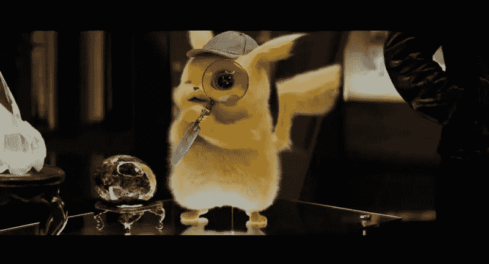
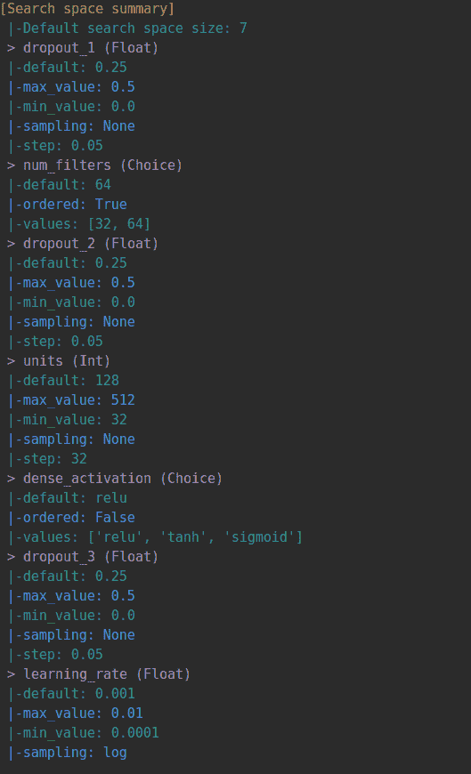

# 实践超参数调整与 Keras Tuner

> 原文：[`www.kdnuggets.com/2020/02/hyperparameter-tuning-keras-tuner.html`](https://www.kdnuggets.com/2020/02/hyperparameter-tuning-keras-tuner.html)

评论

**作者：[Julie Prost](https://www.linkedin.com/in/julie-prost-a169b1129/)，Sicara 的数据科学家**

本文将解释如何使用 Keras Tuner 和 Tensorflow 2.0 自动进行超参数调整，以提高计算机视觉问题的准确性。



现在，你的模型正在运行并产生第一组结果。然而，它们远未达到你期望的最佳结果。你错过了一个关键步骤：超参数调整！

在这篇文章中，我们将逐步通过整个超参数调整流程。完整的代码可以在[Github](https://github.com/JulieProst/keras-tuner-tutorial)上找到。

### 什么是超参数调整以及为什么你应该关注

机器学习模型有两种类型的参数：

+   可训练参数是在训练过程中由算法学习的。例如，神经网络的权重就是可训练参数。

+   超参数需要在启动学习过程之前设置。学习率或密集层中的单元数量就是超参数。

即使是小型模型，超参数也可能非常多。调整它们可能是一个真正的脑筋急转弯，但值得挑战：一个好的超参数组合可以大幅提高模型的性能。在这里，我们将看到，在一个简单的 CNN 模型中，它可以帮助你在测试集上提高 10%的准确率！

幸运的是，现有的开源库可以自动为你执行这一步骤！

### Tensorflow 2.0 和 Keras Tuner

[Tensorflow](https://www.tensorflow.org/)是一个广泛使用的开源机器学习库。2019 年 9 月，[Tensorflow 2.0 发布了](https://blog.tensorflow.org/2019/09/tensorflow-20-is-now-available.html)，带来了重大的改进，特别是在用户友好性方面。随着这个新版本的发布，[Keras](https://keras.io/)，一个高级 Python 深度学习 API，成为了 Tensorflow 的主要 API。

不久之后，Keras 团队发布了[Keras Tuner](https://keras-team.github.io/keras-tuner/)，这是一个可以轻松进行超参数调整的库，适用于 Tensorflow 2.0。本文将展示如何在目标分类应用中使用它，并包括对库中不同超参数调整方法的比较。

> Keras Tuner 现在已经脱离了 beta 版本！v1 已在 PyPI 发布。[`t.co/riqnIr4auA`](https://t.co/riqnIr4auA)
> 
> 功能全面、可扩展、易于使用的 Keras 及其以外的超参数调整。[pic.twitter.com/zUDISXPdBw](https://t.co/zUDISXPdBw)
> 
> — François Chollet (@fchollet) [2019 年 10 月 31 日](https://twitter.com/fchollet/status/1189992078991708160?ref_src=twsrc%5Etfw)

### 使用 Keras Tuner 进行超参数调整

在深入代码之前，先了解一下 Keras Tuner 的理论。它是如何工作的？


使用 Keras Tuner 进行超参数调优过程

首先，定义一个调优器。它的作用是确定应该测试哪些超参数组合。库的搜索功能执行迭代循环，评估一定数量的超参数组合。评估通过计算训练模型在保留的验证集上的准确性来进行。

最后，可以在保留的测试集上测试验证准确性方面最佳的超参数组合。

### 入门

开始吧！通过这个教程，你将拥有一个端到端的流程来调整一个简单卷积网络的超参数，以进行 CIFAR10 数据集上的物体分类。

**安装步骤**

首先，从终端安装 Keras Tuner：

```py
pip install keras-tuner
```

现在，你可以打开你最喜欢的 IDE/文本编辑器，开始编写 Python 脚本以完成剩下的教程！

**数据集**


CIFAR10 随机样本。 [数据集](https://www.cs.toronto.edu/~kriz/cifar.html) 由 60000 张图像组成，这些图像属于 10 个对象类别中的一个。

本教程使用 CIFAR10 数据集。CIFAR10 是计算机视觉中的常见基准数据集。它包含 10 个类别，并且相对较小，共有 60000 张图像。这个大小允许相对较短的训练时间，我们将利用这一点来进行多次超参数调优迭代。

加载和预处理数据：

调优器期望输入为浮点数，而除以 255 是数据归一化步骤。

### 模型定义

在这里，我们将尝试一个简单的卷积模型，将每个图像分类为 10 个可用类别中的一个。


简单 CNN 表示，来自这个优秀的 [关于 CNN 的博客文章](https://towardsdatascience.com/a-comprehensive-guide-to-convolutional-neural-networks-the-eli5-way-3bd2b1164a53)

每个输入图像将经过两个卷积块（2 个卷积层后跟一个池化层）和一个用于正则化的 dropout 层。最后，每个输出被展平并经过一个密集层，将图像分类为 10 个类别中的一个。

在 Keras 中，这个模型可以如下定义：

### 搜索空间定义

要进行超参数调优，我们需要定义搜索空间，即哪些超参数需要优化以及在什么范围内。在这里，对于这个相对较小的模型，已经有 6 个超参数可以调整：

+   三个 dropout 层的丢弃率

+   卷积层的滤波器数量

+   密集层的单元数

+   它的激活函数

在 Keras Tuner 中，超参数有类型（可能是 Float、Int、Boolean 和 Choice）和唯一名称。然后，需要设置一组选项来帮助引导搜索：

+   Float 和 Int 类型的最小值、最大值和默认值

+   Choice 类型的可能值集合

+   可选地，可以选择线性、对数或反对数的采样方法。设置此参数允许添加您对调节参数的先验知识。我们将在下一节中看到如何利用它来调整学习率。

+   可选地，设置步长值，即两个超参数值之间的最小步长。

例如，要设置超参数“滤波器数量”，可以使用：

密集层有两个超参数，即单元数和激活函数：

### 模型编译

然后让我们进入模型编译步骤，在这里还存在其他超参数。编译步骤是定义优化器、损失函数和指标的地方。在这里，我们将使用分类熵作为损失函数，准确率作为指标。对于优化器，有不同的选项可供选择。我们将使用流行的 [Adam](https://keras.io/optimizers/)。

在这里，学习率（表示学习算法的进展速度）通常是一个重要的超参数。通常，学习率是在对数尺度上选择的。这些先验知识可以通过设置采样方法来纳入搜索中：

### Keras Tuner Hypermodels

为了将整个超参数搜索空间整合在一起并执行超参数调优，Keras Tuners 使用 `HyperModel` 实例。Hypermodels 是库中引入的可重用类对象，定义如下：

该库已经提供了两个现成的计算机视觉超模型：HyperResNet 和 HyperXception。

### 选择调优器

Keras Tuner 提供了主要的超参数调优方法：随机搜索、Hyperband 和贝叶斯优化。

在本教程中，我们将重点关注随机搜索和 Hyperband。我们不会深入理论，但如果您想了解更多关于随机搜索和贝叶斯优化的信息，我写了一篇文章：[贝叶斯优化超参数调优](https://www.sicara.ai/blog/2019-14-07-determine-network-hyper-parameters-with-bayesian-optimization)。至于 [Hyperband](https://arxiv.org/abs/1603.06560)，其主要思想是优化随机搜索的搜索时间。

对于每个调优器，可以定义一个种子参数以确保实验的可重复性：`SEED = 1`。

### Random Search

执行超参数调优的最直观方法是随机抽样超参数组合并进行测试。这正是 RandomSearch 调优器所做的！

目标是要优化的函数。调优器根据其值推断这是一个最大化问题还是最小化问题。

然后，`max_trials` 变量表示调优器将测试的超参数组合的数量，而 `execution_per_trial` 变量是每次试验中应该构建和拟合的模型数量，以保证鲁棒性。下一节将解释如何设置这些参数。

### Hyperband

Hyperband 是随机搜索的优化版本，它使用早停法来加快超参数调整过程。其主要思想是为少量轮数训练大量模型，并仅继续训练在验证集上表现最佳的模型。max_epochs 变量是模型可以训练的最大轮数。

### 调优器的超参数？


你可能会想知道这个过程的实际效果，因为不同调优器还需要设置多个参数：

但这里的问题与确定超参数稍有不同。实际上，这些设置主要依赖于你的计算时间和资源。你可以进行的试验次数越多，效果越好！关于训练轮数，最好知道你的模型需要多少轮才能收敛。你还可以使用早停法来防止过拟合。

### 超参数调整

一旦模型和调优器设置好，任务摘要就可以轻松获得：



搜索空间摘要输出

调优可以开始了！

搜索功能以训练数据和验证拆分作为输入来执行超参数组合评估。epochs 参数在随机搜索和贝叶斯优化中用于定义每个超参数组合的训练轮数。

最后，搜索结果可以总结并如下使用：

### 结果

你可以在 [Github](https://github.com/JulieProst/keras-tuner-tutorial) 上找到这篇文章的代码。以下结果是在 RTX 2080 GPU 上运行后获得的：


Keras Tuner 结果。最差基准：使用随机搜索的一组超参数中表现最差的模型。默认基准：通过将所有超参数设置为默认值获得。

这些结果远未达到 [最先进模型在 CIFAR10 数据集上](https://paperswithcode.com/sota/image-classification-on-cifar-10) 达到的 99.3% 准确率，但对于如此简单的网络结构来说也不算太差。你可以看到基准模型和调优模型之间的显著改进，其中随机搜索和第一个基准之间的准确率提升超过 10%。

总的来说，Keras Tuner 库是一个不错且易于学习的选项，用于为你的 Keras 和 TensorFlow 2.0 模型进行超参数调整。你需要工作的主要步骤是将模型调整为适应超模型格式。实际上，库中目前提供的标准超模型较少。

补充文档和教程可以在 [Keras Tuner 的网站](https://keras-team.github.io/keras-tuner/) 和他们的 [Github 仓库](https://github.com/keras-team/keras-tuner) 上找到！

**简介：[朱莉·普罗斯特](https://www.linkedin.com/in/julie-prost-a169b1129/)** ([**@JPro20**](https://twitter.com/JPro20)) 是 Sicara 的数据科学家。

[原文](https://www.sicara.ai/blog/hyperparameter-tuning-keras-tuner)。转载经许可。

**相关：**

+   自动化机器学习项目实施复杂性

+   高级 Keras — 构建复杂的自定义损失和指标

+   卷积神经网络：使用 TensorFlow 和 Keras 的 Python 教程

* * *

## 我们的前三名课程推荐

 1\. [谷歌网络安全证书](https://www.kdnuggets.com/google-cybersecurity) - 快速开启网络安全职业生涯。

 2\. [谷歌数据分析专业证书](https://www.kdnuggets.com/google-data-analytics) - 提升你的数据分析水平

 3\. [谷歌 IT 支持专业证书](https://www.kdnuggets.com/google-itsupport) - 支持你的组织 IT

* * *

### 了解更多相关主题

+   [使用 Grid Search 和 Random Search 进行超参数调优](https://www.kdnuggets.com/2022/10/hyperparameter-tuning-grid-search-random-search-python.html)

+   [超参数调优：GridSearchCV 和 RandomizedSearchCV 解析](https://www.kdnuggets.com/hyperparameter-tuning-gridsearchcv-and-randomizedsearchcv-explained)

+   [使用 TensorFlow 和 Keras 构建和训练你的第一个神经网络](https://www.kdnuggets.com/2023/05/building-training-first-neural-network-tensorflow-keras.html)

+   [Keras 3.0：你需要知道的一切](https://www.kdnuggets.com/2023/07/keras-30-everything-need-know.html)

+   [超参数优化：十大 Python 库](https://www.kdnuggets.com/2023/01/hyperparameter-optimization-10-top-python-libraries.html)

+   [动手强化学习课程第三部分：SARSA](https://www.kdnuggets.com/2022/01/handson-reinforcement-learning-course-part-3-sarsa.html)
