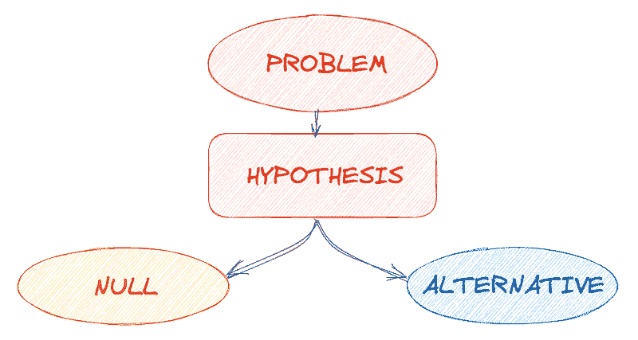
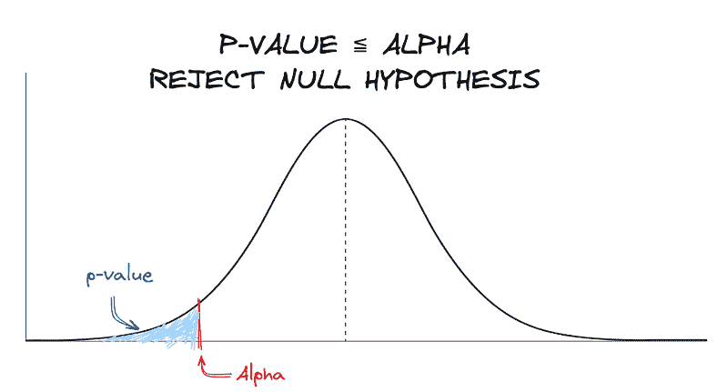
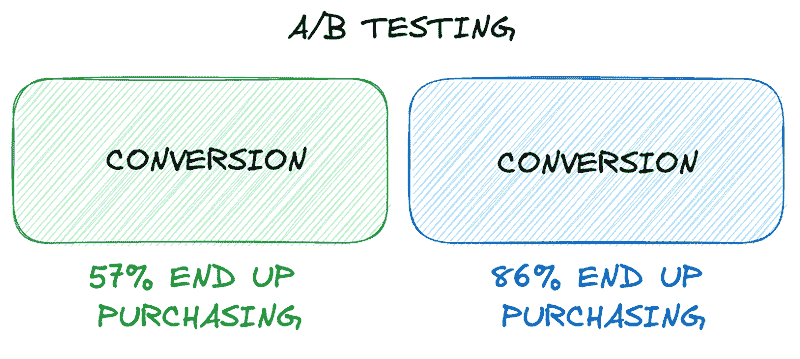

# 假设检验和 A/B 测试

> 原文：[`www.kdnuggets.com/hypothesis-testing-and-ab-testing`](https://www.kdnuggets.com/hypothesis-testing-and-ab-testing)

图片来源：编辑

在数据至上的时代，企业和组织不断寻找利用数据力量的方法。

* * *

## 我们的前 3 名课程推荐

 1\. [Google 网络安全证书](https://www.kdnuggets.com/google-cybersecurity) - 快速进入网络安全职业生涯。

 2\. [Google 数据分析专业证书](https://www.kdnuggets.com/google-data-analytics) - 提升您的数据分析水平

 3\. [Google IT 支持专业证书](https://www.kdnuggets.com/google-itsupport) - 支持您组织的 IT 工作

* * *

从你在亚马逊上推荐的产品到你在社交媒体上看到的内容，这背后都有一套精密的方法。

这些决策的核心是什么？

A/B 测试和假设检验。

*但它们是什么？为什么在我们以数据为中心的世界中如此关键？*

让我们一起发现一切吧！

# 屏幕背后的魔法

统计分析的一个重要目标是发现数据中的模式，并将这些模式应用于现实世界。

这就是机器学习发挥关键作用的地方！

机器学习通常被描述为在数据中寻找模式并将其应用于数据集的过程。凭借这一新能力，世界上的许多过程和决策变得极其数据驱动。

每次你浏览亚马逊并获得产品推荐，或者当你在社交媒体动态上看到定制内容时，都没有什么魔法。

这是复杂的数据分析和模式识别的结果。

许多因素可以决定一个人**是否喜欢**成为**购买者**。这些因素包括之前的搜索、用户的人口统计信息，甚至是一天中的时间和按钮的颜色。

这正是通过分析数据中的模式所能发现的。

像亚马逊或 Netflix 这样的公司建立了复杂的推荐系统，分析用户行为中的模式，如查看的产品、喜欢的项目和购买记录。

但由于数据通常会受到噪声和随机波动的影响，这些公司如何确保他们看到的模式是真实的呢？

*答案在于假设检验。*

# 假设检验：验证数据中的模式

假设检验是一种统计方法，用于确定某一假设成立的可能性。

简单来说，它是一种验证数据中观察到的模式是否真实存在或只是偶然结果的方法。

这个过程通常包括：

## #1\. 发展假设

这涉及到提出一个**零假设**，它被假设为真实的，通常是假设观察结果是随机的，还有一个**替代假设**，这是研究者希望证明的。

作者提供的图片

## #2\. 选择检验统计量

这是用来确定零假设真值的方法和价值。

## #3\. 计算 p 值

这是一个检验统计量至少与观察到的统计量一样显著的概率，假设零假设为真。简单来说，就是在相应的检验统计量右侧的概率。

p 值的主要好处在于可以在任何所需的显著性水平 alpha 下进行检验，通过将这个概率直接与 alpha 比较，这也是假设检验的最终步骤。

Alpha 指的是对结果的信心程度。这意味着 alpha 为 5% 意味着有 95% 的置信度。只有当 p 值小于或等于 alpha 时，才保留零假设。

*通常，较低的 p 值更受欢迎。*

作者提供的图片

## #4\. 得出结论

根据 p 值和选定的显著性水平 alpha，决定接受或拒绝零假设。

例如，如果一家公司想确定更改购买按钮的颜色是否会影响销售，假设检验可以提供一个结构化的方法来做出明智的决策。

# A/B 测试：实际应用

A/B 测试是假设检验的实际应用。这是一种用于比较产品或特性两个版本的方法，以确定哪个版本表现更好。

这涉及到同时向不同用户段展示两个变体，然后使用成功和跟踪指标来确定哪个变体更成功。

每一份用户看到的内容都需要被细化以实现其最大潜力。A/B 测试在这些平台上的过程与假设检验相似。

所以……让我们想象一下，我们是一家社交媒体平台，我们想了解用户在使用绿色或蓝色按钮时是否更容易参与。

作者提供的图片

这涉及到：

1.  **初步研究：** 了解当前情况并确定需要测试的特性。在我们的案例中是按钮颜色。

1.  **假设制定：** 如果没有这些，测试活动将没有方向。使用蓝色时，用户更有可能参与。

1.  **随机分配：** 测试特性的变体会随机分配给用户。我们将用户分成两个不同的随机组。

1.  **结果收集与分析：** 测试后，收集结果，进行分析，并部署成功的变体。

# 实际的 A/B 测试商业案例

保持我们是一家社交媒体公司的想法，我们可以尝试描述一个真实案例。

**目标：** 提高平台上的用户参与度。

**衡量指标：** 平均在平台上花费的时间。这也可以是其他相关的指标，如分享的帖子数量或点赞数。

## #步骤 1：识别变化

社交媒体公司假设，如果他们重新设计分享按钮，使其更突出和更易于找到，更多用户将分享帖子，从而提高参与度。

## #步骤 2：创建两个版本

+   **版本 A（原始）：** 平台当前的设计，分享按钮保持不变。

+   **版本 B（替代）：** 相同的平台，但分享按钮经过重新设计，更加突出。

## #步骤 3：划分受众

公司随机将其用户基础分成两组：

+   50% 的用户将看到版本 A。

+   50% 的用户将看到版本 B。

## #步骤 4：进行测试

公司在预定的时间段内进行测试，例如 30 天。在此期间，他们收集两个组的用户参与指标数据。

## #步骤 5：分析结果

测试期结束后，公司分析数据：

+   版本 B 组在平台上花费的平均时间是否增加？

## #步骤 6：做出决定

一旦我们收集到所有数据，就有两个主要的选择：

+   如果版本 B 在参与度方面超过了版本 A，公司决定将新的分享按钮设计推广给所有用户。

+   如果没有显著差异或版本 A 表现更好，公司决定保留原始设计并**重新思考他们的方法。**

## #步骤 7：迭代

始终记住，迭代是关键！

公司不会止步于此。他们现在可以测试其他元素，以不断优化参与度。

> *确保组别随机选择且唯一的区别是正在测试的变更是至关重要的。这可以确保观察到的参与差异确实是由于变更而非其他外部因素。*

# 推断统计学：超越单纯的差异

虽然仅仅比较两组的表现似乎很直接，但推断统计学如假设检验提供了更结构化的方法。

例如，在测试一种新的培训方法是否提高送货司机的表现时，仅仅比较培训前后的表现可能会由于外部因素如天气条件而产生误导。

通过使用 A/B 测试，这些外部因素可以被隔离，从而确保观察到的差异确实是由于处理措施所致。

# 导航数据驱动的环境

在今天这个决策越来越依赖数据的世界里，像 A/B 测试和假设检验这样的工具是不可或缺的。它们提供了科学的决策方法，确保企业和组织不仅仅依靠直觉，而是基于实证证据。

随着我们生成更多的数据以及技术的发展，这些工具的重要性将只会越来越突出。

请始终记住，在浩瀚的数据海洋中，不仅仅是收集信息，还要学习如何处理这些信息并加以利用。

借助假设检验和 A/B 测试，我们拥有了有效导航这些数据领域的指南针。

**欢迎来到数据驱动决策的迷人世界！**

**[Josep Ferrer](https://www.linkedin.com/in/josep-ferrer-sanchez)** 是一位来自巴塞罗那的分析工程师。他毕业于物理工程专业，目前从事与人类移动相关的数据科学领域工作。他还是一名兼职内容创作者，专注于数据科学和技术。你可以通过 [LinkedIn](https://www.linkedin.com/in/josep-ferrer-sanchez/)、[Twitter](https://twitter.com/rfeers) 或 [Medium](https://medium.com/@rfeers) 联系他。

### 主题扩展

+   [假设检验详解](https://www.kdnuggets.com/2021/09/hypothesis-testing-explained.html)

+   [数据科学中的假设检验](https://www.kdnuggets.com/2023/02/hypothesis-testing-data-science.html)

+   [数据科学面试中的 24 道 A/B 测试面试题及……](https://www.kdnuggets.com/2022/09/24-ab-testing-interview-questions-data-science-interviews-crack.html)

+   [机器学习中的训练数据与测试数据的区别](https://www.kdnuggets.com/2022/08/difference-training-testing-data-machine-learning.html)

+   [机器学习中的有效测试](https://www.kdnuggets.com/2022/01/effective-testing-machine-learning.html)

+   [使用 DeepChecks 的机器学习测试入门指南](https://www.kdnuggets.com/beginners-guide-to-machine-learning-testing-with-deepchecks)
