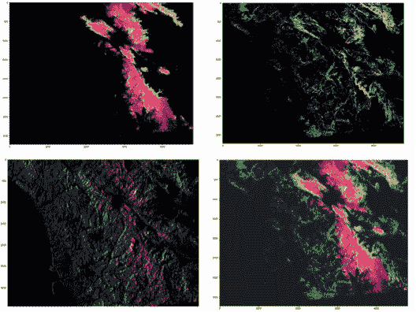

# Python 中的基本图像处理，第二部分

> 原文：[`www.kdnuggets.com/2018/07/image-data-analysis-numpy-opencv-p2.html`](https://www.kdnuggets.com/2018/07/image-data-analysis-numpy-opencv-p2.html)

 评论

本博客是[使用 Numpy 和 OpenCV 进行基本图像数据分析 – 第一部分](https://www.kdnuggets.com/2018/07/basic-image-data-analysis-numpy-opencv-p1.html)的续篇。

### **使用逻辑运算符处理像素值**

我们可以使用**逻辑运算符**创建一个相同大小的布尔 ndarray。然而，这不会创建任何新数组，而是简单地将**True**返回给它的主变量。例如：假设我们想过滤掉一些低值像素或高值像素（或任何条件）在 RGB 图像中，转换 RGB 为灰度图像确实是很好的，但现在我们不会进行这个转换，而是处理彩色图像。

* * *

## 我们的三大课程推荐

 1\. [谷歌网络安全证书](https://www.kdnuggets.com/google-cybersecurity) - 快速进入网络安全职业轨道。

 2\. [谷歌数据分析专业证书](https://www.kdnuggets.com/google-data-analytics) - 提升你的数据分析技能

 3\. [谷歌 IT 支持专业证书](https://www.kdnuggets.com/google-itsupport) - 支持你的组织的 IT 需求

* * *

首先加载一张图像并在屏幕上显示它。

```py
pic=imageio.imread('F:/demo_1.jpg')

plt.figure(figsize=(10,10))

plt.imshow(pic)

plt.show()
```


好的，让我们考虑这张转储图像。现在，对于任何情况，我们想过滤掉所有低于假设值 20 的像素值。为此，我们将使用逻辑运算符来完成这个任务，并返回所有索引的 True 值。

```py

low_pixel=pic<20 

*# to ensure of it let's check if all values 
in low_pixel are True or not* iflow_pixel.any()==True:
print(low_pixel.shape)

(1079, 1293, 3)

```

如前所述，主变量，这个名字传统上并不常用，但我使用它是因为它的行为。它只保存 True 值而无其他内容。因此，如果我们查看 low_pixel 和 pic 的形状，我们会发现它们的形状是相同的。

```py
print(pic.shape)
(1079,1293,3)

print(low_pixel.shape) 
(1079,1293,3)
```

我们使用全局比较运算符生成了低值滤波器，用于所有小于 200 的值。然而，我们可以使用这个 low_pixel 数组作为索引，将这些低值设置为一些特定值，这些值可能高于或低于之前的像素值。

```py
*# randomly choose a value* 

importrandom 

*# load the original image*

pic=imageio.imread('F:/demo_1.jpg') 

*# set value randomly range from 25 to 225 - 
these value also randomly chosen*pic[low_pixel]=random.randint(25,225) 

*# display the image*

plt.figure(figsize=(10,10))

plt.imshow(pic)plt.show()
 
```

### **遮罩**

图像遮罩是一种图像处理技术，用于去除那些边缘模糊、透明或有毛发部分的背景。

现在，我们将创建一个圆盘形状的遮罩。首先，我们将测量图像中心到每个边界像素的距离。然后，我们取一个合适的半径值，使用逻辑运算符创建一个圆盘。操作相当简单，让我们看看代码。

```py
if__name__=='__main__': 
*# load the image* pic=imageio.imread('F:/demo_1.jpg') 
*# separate the row and column values* total_row,total_col,layers=pic.shape 
'''   Create vector. 
Ogrid is a compact method of creating a multidimensional-
ndarray operations in single lines.   
for ex: 
>>>ogrid[0:5,0:5]   
output: 
[array([[0],[1],[2],[3],[4]]), 
array([[0, 1, 2, 3, 4]])]    
'''
x,y=np.ogrid[:total_row,:total_col] 
*# get the center values of the image* cen_x,cen_y=total_row/2,total_col/2  
'''   
Measure distance value from center to each border pixel.   
To make it easy, we can think it's like, we draw a line from center-   
to each edge pixel value --> s**2 = (Y-y)**2 + (X-x)**2    '''
distance_from_the_center=np.sqrt((x-cen_x)**2+(y-cen_y)**2) 
*# Select convenient radius value* radius=(total_row/2) 
*# Using logical operator '>'* '''   logical operator to do this task which will 
return as a value    of True for all the index according to the 
given condition   '''
circular_pic=distance_from_the_center>radius 
'''
let assign value zero for all pixel value that outside 
the circular disc.   All the pixel value outside the circular 
disc, will be black now.   
'''
pic[circular_pic]=0
plt.figure(figsize=(10,10))
plt.imshow(pic)
plt.show()
 
```

### **卫星图像处理**

在 edX 的一个 MOOC 课程中，我们介绍了一些卫星图像及其处理系统。这当然非常有用。然而，让我们对它进行一些分析任务。

```py
*# load the image* pic=imageio.imread('F:\satimg.jpg')
plt.figure(figsize=(10,10))
plt.imshow(pic)
plt.show()
 
```

让我们来看一下它的一些基本信息。

```py
print(f'Shape of the image {pic.shape}')

print(f'hieght {pic.shape[0]} pixels')

print(f'width {pic.shape[1]} pixels') 

Shapeoftheimage(3725,4797,3)

height 3725 pixels

width 4797 pixels 
```

现在，这张图像有些有趣的地方。与许多其他可视化一样，每个 RGB 层中的颜色都有其含义。例如，红色的强度将指示像素中地理数据点的高度。蓝色的强度将指示方位的测量值，而绿色将指示坡度。这些颜色有助于更快速、更有效地传达信息，而不是展示数字。

+   红色像素表示：**高度**

+   蓝色像素表示：**方位**

+   绿色像素表示：**坡度**

仅凭观察这张色彩丰富的图像，经过训练的眼睛已经能分辨出高度、坡度和方位。因此，将更多含义赋予这些颜色，以指示更科学的内容就是这个想法。

### **检测每个通道的高像素**

```py
*# Only Red Pixel value , higher than 180*

pic=imageio.imread('F:\satimg.jpg')

red_mask=pic[:,:,0]<180 

pic[red_mask]=0

plt.figure(figsize=(15,15))

plt.imshow(pic) 

*# Only Green Pixel value , higher than 180*

pic=imageio.imread('F:\satimg.jpg')

green_mask=pic[:,:,1]<180 

pic[green_mask]=0

plt.figure(figsize=(15,15))

plt.imshow(pic) 

*# Only Blue Pixel value , higher than 180*

pic=imageio.imread('F:\satimg.jpg')

blue_mask=pic[:,:,2]<180 

pic[blue_mask]=0

plt.figure(figsize=(15,15))

plt.imshow(pic) 

*# Composite mask using logical_and*

pic=imageio.imread('F:\satimg.jpg')

final_mask=np.logical_and(red_mask,green_mask,blue_mask)

pic[final_mask]=40

plt.figure(figsize=(15,15))

plt.imshow(pic)
```



**简介：** [Mohammed Innat](https://twitter.com/innat_2k14)目前是电子与通信专业的大四本科生。他热衷于将机器学习和数据科学知识应用于医疗保健和犯罪预测领域，在这些领域可以在医疗部门和安全部门工程中找到更好的解决方案。*

**相关：**

+   [使用 Tensorflow 目标检测和 OpenCV 分析足球比赛](https://www.kdnuggets.com/2018/07/analyze-soccer-game-using-tensorflow-object-detection-opencv.html)

+   [2018 年数据科学顶级 20 个 Python 库](https://www.kdnuggets.com/2018/06/top-20-python-libraries-data-science-2018.html)

+   [DIY 深度学习项目](https://www.kdnuggets.com/2018/06/diy-deep-learning-projects.html)

### 更多相关主题

+   [用于图像识别和自然语言处理的迁移学习](https://www.kdnuggets.com/2022/01/transfer-learning-image-recognition-natural-language-processing.html)

+   [用于图像处理的 NumPy](https://www.kdnuggets.com/numpy-for-image-processing)

+   [让智能文档处理更智能：第一部分](https://www.kdnuggets.com/2023/02/making-intelligent-document-processing-smarter-part-1.html)

+   [它活过来了！用 Python 和一些便宜的部件构建你的第一个机器人](https://www.kdnuggets.com/2023/06/manning-build-first-robots-python-cheap-basic-components.html)

+   [数据科学的 8 个基本统计概念](https://www.kdnuggets.com/2020/06/8-basic-statistics-concepts.html)

+   [数据科学初学者的 20 条基本 Linux 命令](https://www.kdnuggets.com/2022/06/20-basic-linux-commands-data-science-beginners.html)
