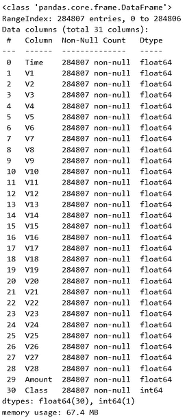

# 如何处理不平衡分类问题，而无需重新平衡数据

> 原文：[`www.kdnuggets.com/2021/09/imbalanced-classification-without-re-balancing-data.html`](https://www.kdnuggets.com/2021/09/imbalanced-classification-without-re-balancing-data.html)

评论

**作者：[David B Rosen (PhD)](http://linkedin.com/in/rosen1)，IBM 全球融资自动化信用审批首席数据科学家**


照片由[Elena Mozhvilo](https://unsplash.com/@miracleday?utm_source=medium&utm_medium=referral)提供，来源于[Unsplash](https://unsplash.com/?utm_source=medium&utm_medium=referral)

在机器学习中，当用数据构建分类模型时，如果某一类别的实例远多于另一类别，初始默认分类器通常是不令人满意的，因为它几乎将所有情况都分类为多数类。许多文章展示了如何使用过采样（例如*SMOTE*）或有时是欠采样，或者简单地使用基于类别的样本加权来重新训练模型以“重新平衡”数据，但这并非总是必要的。在这里，我们的目标是展示在**不**平衡数据或重新训练模型的情况下，你可以做到多少。

我们通过简单地调整“类 1”阈值来实现这一点，当模型预测的“类 1”概率高于该阈值时，而不是天真地使用默认分类规则（即选择预测最可能的类别，概率阈值为 0.5）。我们将看到这如何让你灵活地在假阳性和假阴性分类之间进行所需的权衡，同时避免由于重新平衡数据而产生的问题。

我们将使用来自 Kaggle 的[信用卡欺诈识别数据集](https://www.kaggle.com/mlg-ulb/creditcardfraud)进行说明。数据集的每一行代表一次信用卡交易，其中目标变量 Class==0 表示*合法*交易，而 Class==1 表示交易被认定为*欺诈*。总共有 284,807 笔交易，其中仅有 492 笔（0.173%）为欺诈——确实非常不平衡。

我们将使用一个*梯度提升*分类器，因为这些分类器通常能取得较好的结果。具体来说，我们使用 Scikit-Learn 的新 HistGradientBoostingClassifier，因为当数据集较大时，它比原始的 GradientBoostingClassifier 快得多。

首先，让我们导入一些库并读取数据集。

```py
import numpy as np
import pandas as pd
from sklearn import model_selection, metrics
from sklearn.experimental import enable_hist_gradient_boosting
from sklearn.ensemble import HistGradientBoostingClassifier
df=pd.read_csv('creditcard.csv')
df.info()
```



V1 至 V28（来自主成分分析）和交易金额是特征，这些特征都是数值型的，并且没有缺失数据。因为我们只使用树基分类器，所以我们不需要对特征进行标准化或归一化。

现在我们将数据拆分为训练集和测试集后训练模型。这在我的笔记本电脑上花费了大约半分钟的时间。我们使用 n_iter_no_change 来提前停止训练，如果在验证子集上的表现因过拟合开始恶化。我单独进行了少量超参数调优，以选择 learning_rate 和 max_leaf_nodes，但这不是本文的重点。

```py
Xtrain, Xtest, ytrain, ytest = model_selection.train_test_split(
        df.loc[:,'V1':'Amount'], df.Class,  stratify=df.Class, 
        test_size=0.3, random_state=42)
gbc=HistGradientBoostingClassifier(learning_rate=0.01, 
        max_iter=2000, max_leaf_nodes=6, validation_fraction=0.2, 
        n_iter_no_change=15, random_state=42).fit(Xtrain,ytrain)
```

现在我们将此模型应用于测试数据，作为默认的*硬分类器*，对每个交易进行 0 或 1 的预测。我们实际上将决策阈值 0.5 应用于模型的连续*概率预测*，作为一个*软分类器*。当概率预测超过 0.5 时，我们标记为“1”，当低于 0.5 时，我们标记为“0”。

我们还打印了*混淆矩阵*以显示结果，将第 1 类（欺诈）视为*“正类”*，这是惯例，因为它是较少见的类别。混淆矩阵显示了真正例、假正例、假负例和真负例的数量。*标准化混淆矩阵*率（例如 FNR = 假负率）作为百分比包括在括号中。

```py
hardpredtst=gbc.predict(Xtest)
def conf_matrix(y,pred):
    ((tn, fp), (fn, tp)) = metrics.confusion_matrix(y, pred)
    ((tnr,fpr),(fnr,tpr))= metrics.confusion_matrix(y, pred, 
            normalize='true')
    return pd.DataFrame([[f'TN = {tn} (TNR = {tnr:1.2%})', 
                                f'FP = {fp} (FPR = {fpr:1.2%})'], 
                         [f'FN = {fn} (FNR = {fnr:1.2%})', 
                                f'TP = {tp} (TPR = {tpr:1.2%})']],
            index=['True 0(Legit)', 'True 1(Fraud)'], 
            columns=['Pred 0(Approve as Legit)', 
                            'Pred 1(Deny as Fraud)'])
conf_matrix(ytest,hardpredtst)
```


我们看到，第 1 类（即上面显示的**敏感性**或**真正例率**TPR）的召回率仅为 71.62%，这意味着 71.62%的真实欺诈行为被正确识别为欺诈并因此被拒绝。因此，28.38%的真实欺诈行为不幸被错误地批准为合法交易。

特别是在数据不平衡的情况下（或一般来说，当假正例和假负例可能有不同后果时），重要的是不要局限于使用默认的隐式分类决策阈值 0.5，如我们上面使用“.predict( )”时所做的那样。我们希望提高第 1 类的召回率（TPR），以减少欺诈损失（减少假负例）。为此，我们可以降低阈值，当我们预测的概率高于该阈值时，我们标记为“第 1 类”。这样，我们可以在更广泛的预测概率范围内标记为“第 1 类”。这种策略称为*阈值移动*。

最终，决定减少这些假负例的程度是一个商业决策，因为作为权衡，假正例（真正的合法交易被错误地拒绝为欺诈）的数量会随着我们调整模型的概率预测阈值（从“.predict_proba( )”而不是“.predict( )”中获得）而不可避免地增加。

为了阐明这一权衡并帮助我们选择阈值，我们绘制了假正例率和假负例率与阈值的关系图。这是*接收者操作特征*（ROC）曲线的一种变体，但重点在于阈值。

```py
predtst=gbc.predict_proba(Xtest)[:,1]
fpr, tpr, thresholds = metrics.roc_curve(ytest, predtst)
dfplot=pd.DataFrame({'Threshold':thresholds, 
        'False Positive Rate':fpr, 
        'False Negative Rate': 1.-tpr})
ax=dfplot.plot(x='Threshold', y=['False Positive Rate',
        'False Negative Rate'], figsize=(10,6))
ax.plot([0.00035,0.00035],[0,0.1]) #mark example thresh.
ax.set_xbound(0,0.0008); ax.set_ybound(0,0.3) #zoom in
```


尽管存在一些选择最佳阈值的经验法则或建议指标，但最终完全依赖于假阴性与假阳性对业务的成本。例如，查看上面的图，我们可能会选择应用阈值 0.00035（已添加垂直绿色线）如以下所示。

```py
hardpredtst_tuned_thresh = np.where(predtst >= 0.00035, 1, 0)
conf_matrix(ytest, hardpredtst_tuned_thresh)
```


我们已将假阴性率从 28.38%降低到 9.46%（即识别并拒绝了 90.54%的真实欺诈行为，作为我们新的召回率或敏感度或真正阳性率或 TPR），同时假阳性率（FPR）从 0.01%增加到 5.75%（即仍批准了 94.25%的合法交易）。对于我们来说，拒绝约 6%的合法交易作为仅批准不到 10%的欺诈交易的代价可能是值得的，这一代价相比使用默认硬分类器（隐含分类决策阈值为 0.5）时非常昂贵的 28%的欺诈交易。

## 不平衡数据的平衡理由

避免“平衡”不平衡训练数据的一个原因是，这些方法会偏向/扭曲训练模型的概率预测，使这些预测变得*误校准*，通过系统性地提高模型对原始少数类的预测概率，因此被简化为仅仅是相对的*序数判别分数*或*决策函数*或*置信度分数*，而不是在原始（“不平衡”）训练和测试集以及分类器可能对其进行预测的未来数据中潜在准确的预测类别概率。如果确实需要这种训练*重新平衡*，但仍希望获得数值准确的概率预测，则必须*重新校准*预测概率至具有原始/不平衡类别比例的数据集。或者，您可以对平衡模型的预测概率应用修正 — 请参见[平衡即不平衡](https://towardsdatascience.com/balancing-is-unbalancing-5f517936f626)和[此回复](https://medium.com/@aliosia/let-me-explain-with-an-example-assume-p-y-0-1-22a6fde4bfd3)。

通过过采样（与依赖类实例加权不同，这种方法没有这个问题）来平衡数据的另一个问题是它会使天真的交叉验证产生偏差，可能导致在交叉验证中无法检测到的过度拟合。在交叉验证中，每次数据被划分为一个“折”子集时，一个折中的实例可能是另一个折中实例的重复或生成的。因此，折并不完全独立，如交叉验证所假设的——存在数据“泄漏”或“渗漏”。例如，请参见[不平衡数据集的交叉验证](https://medium.com/lumiata/cross-validation-for-imbalanced-datasets-9d203ba47e8)，该文描述了如何在这种情况下正确地重新实现交叉验证。然而，在 scikit-learn 中，至少对于通过实例复制（不一定是 SMOTE）进行的过采样情况，这可以通过使用*model_selection.GroupKFold*进行交叉验证来解决，该方法根据一个选定的组标识符对实例进行分组，该标识符对给定实例的所有重复项具有相同的值——请参见[我的回复](https://dabruro.medium.com/to-panos-v-s-question-how-to-implement-this-with-a-gridsearchcv-though-2ab2437784c3)以了解对上述文章的回应。

## 结论

我们可以尝试使用原始模型（在原始的“失衡”数据集上训练），并简单绘制假阳性和假阴性之间的权衡，来选择一个可能产生理想业务结果的阈值，而不是天真地或隐式地应用默认的 0.5 阈值，或立即使用重新平衡的训练数据进行重新训练。

***如果您有任何问题或意见，请留下回复。***

## 编辑：为什么重新平衡训练数据即使唯一的实际“问题”是默认的 0.5 阈值不合适，也能“有效”？

您的模型产生的平均概率预测将近似于训练实例中属于类别 1 的比例，因为这是目标类别变量的实际平均值（其值为 0 和 1）。回归中也是如此：目标变量的平均预测值预计将近似于目标变量的平均实际值。当数据严重失衡且类别 1 是少数类时，这种平均概率预测将远低于 0.5，而且绝大多数类别 1 的概率预测将低于 0.5，因此被归类为类别 0（多数类）。如果您重新平衡训练数据，平均预测概率将增加到 0.5，因此许多实例将会*高于*默认阈值 0.5，同时也会有许多低于该阈值的预测——预测类别将更为平衡。因此，与其降低阈值以使概率预测更常高于该值并给出类别 1（少数类），重新平衡会增加预测概率，使得概率预测更常高于默认阈值 0.5 并给出类别 1。

如果您想要获得类似（但不完全相同）的结果，而不实际重新平衡或重新加权数据，您可以尝试将阈值设置为模型预测类别 1 的平均值或中位数。但当然，这并不一定是为您的特定业务问题提供最佳假阳性和假阴性平衡的阈值，也不会通过重新平衡数据和使用 0.5 的阈值来实现。

可能存在一些情况和模型，其中重新平衡数据将实质性地改进模型，而不仅仅是将平均预测概率移至默认阈值 0.5。但是，仅仅因为模型在使用默认阈值 0.5 时大多数时间选择了多数类，并不能支持重新平衡数据将实现超出使平均概率预测等于阈值的任何主张。如果您希望平均概率预测等于阈值，您可以简单地将阈值设置为平均概率预测，而不必修改或重新加权训练数据以扭曲概率预测。

## 编辑：关于置信度评分与概率预测的说明

如果你的分类器没有 `predict_proba` 方法，例如支持向量分类器，你也可以使用它的 `decision_function` 方法来代替，生成一个*序数判别分数*或*置信度分数*模型输出，即使它*不能*解释为 0 到 1 之间的*概率预测*，也可以以相同的方式进行阈值处理。根据特定分类器模型如何计算两个类别的置信度分数，有时*可能*需要，而不是将阈值直接应用于类别 1 的置信度分数（如上所述，因为类别 0 的预测概率仅为类别 1 的概率减去 1），而是将阈值应用于类别 0 和类别 1 之间的*差异*，默认阈值为 0，假设假阳性的成本与假阴性的成本相同。本文假设是一个二分类问题。

**个人简介: [David B Rosen (PhD)](http://linkedin.com/in/rosen1)** 是 IBM 全球融资部门自动化信用审批的首席数据科学家。可以在 [dabruro.medium.com](https://dabruro.medium.com/) 找到更多 David 的文章。

[原文](https://towardsdatascience.com/how-to-deal-with-imbalanced-classification-without-re-balancing-the-data-8a3c02353fe3)。经许可转载。

**相关:**

+   处理不平衡数据集的 5 种最有用的技术

+   处理机器学习中的不平衡数据

+   重采样不平衡数据及其局限性

* * *

## 我们的前三个课程推荐

 1\. [Google 网络安全证书](https://www.kdnuggets.com/google-cybersecurity) - 快速进入网络安全职业生涯。

 2\. [Google 数据分析专业证书](https://www.kdnuggets.com/google-data-analytics) - 提升你的数据分析技能

 3\. [Google IT 支持专业证书](https://www.kdnuggets.com/google-itsupport) - 支持组织的信息技术

* * *

### 更多相关内容

+   [KDnuggets 新闻，8 月 31 日: 完整的数据科学学习路线图…](https://www.kdnuggets.com/2022/n35.html)

+   [处理不平衡数据的 7 种技术](https://www.kdnuggets.com/2017/06/7-techniques-handle-imbalanced-data.html)

+   [克服实际场景中的不平衡数据挑战](https://www.kdnuggets.com/2023/07/overcoming-imbalanced-data-challenges-realworld-scenarios.html)

+   [无监督解耦表示学习中的类别…](https://www.kdnuggets.com/2023/01/unsupervised-disentangled-representation-learning-class-imbalanced-dataset-elastic-infogan.html)

+   [如何处理机器学习中的分类数据](https://www.kdnuggets.com/2021/05/deal-with-categorical-data-machine-learning.html)

+   [应对机器学习中数据不足的 5 种方法](https://www.kdnuggets.com/2019/06/5-ways-lack-data-machine-learning.html)
