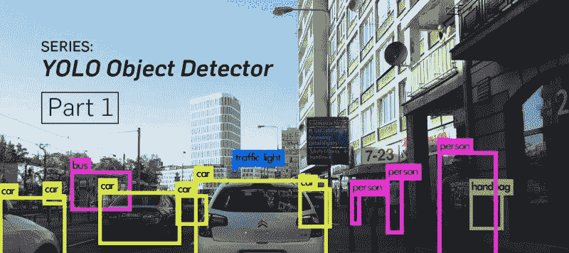
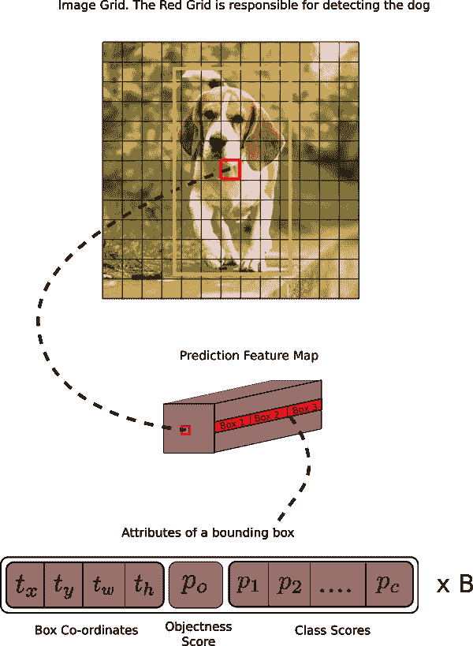
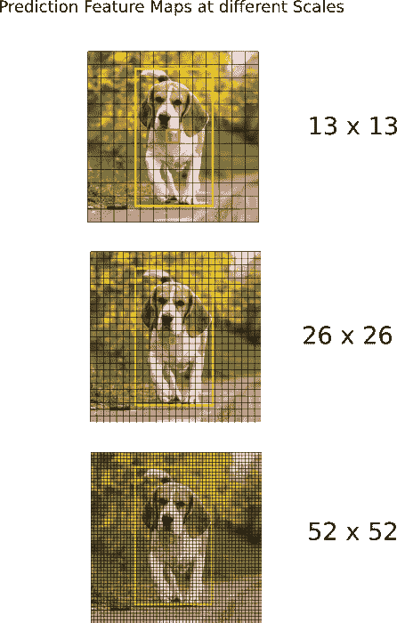

# 如何从头开始在 PyTorch 中实现 YOLO (v3) 物体检测器：第一部分

> 原文：[`www.kdnuggets.com/2018/05/implement-yolo-v3-object-detector-pytorch-part-1.html`](https://www.kdnuggets.com/2018/05/implement-yolo-v3-object-detector-pytorch-part-1.html)

评论

**作者 [Ayoosh Kathuria](https://www.linkedin.com/in/ayoosh-kathuria-44a319132/)，研究实习生**

* * *

## 我们的前三大课程推荐

 1\. [Google 网络安全证书](https://www.kdnuggets.com/google-cybersecurity) - 快速开启网络安全职业生涯。

 2\. [Google 数据分析专业证书](https://www.kdnuggets.com/google-data-analytics) - 提升你的数据分析能力

 3\. [Google IT 支持专业证书](https://www.kdnuggets.com/google-itsupport) - 支持你的组织的 IT 工作

* * *

物体检测是一个从深度学习的最新发展中获益匪浅的领域。近年来，人们开发了许多物体检测算法，其中包括 YOLO、SSD、Mask RCNN 和 RetinaNet。

在过去的几个月里，我一直在研究实验室中改进物体检测。这段经历最重要的收获之一就是意识到学习物体检测的最佳方式是从零开始自己实现算法。这正是我们在本教程中要做的。

我们将使用 PyTorch 实现基于 YOLO v3 的物体检测器，它是现有的更快的物体检测算法之一。

本教程的代码设计用于 Python 3.5 和 PyTorch **0.4**。完整代码可以在这个 [Github 仓库](https://github.com/ayooshkathuria/YOLO_v3_tutorial_from_scratch) 中找到。

本教程分为 5 部分：

1.  第一部分（此部分）：了解 YOLO 的工作原理

1.  [第二部分：创建网络架构的层](https://blog.paperspace.com/how-to-implement-a-yolo-v3-object-detector-from-scratch-in-pytorch-part-2/)

1.  [第三部分：实现网络的前向传递](https://blog.paperspace.com/how-to-implement-a-yolo-v3-object-detector-from-scratch-in-pytorch-part-3/)

1.  [第四部分：物体性评分阈值和非极大值抑制](https://blog.paperspace.com/how-to-implement-a-yolo-v3-object-detector-from-scratch-in-pytorch-part-4/)

1.  [第五部分：设计输入和输出管道](https://blog.paperspace.com/how-to-implement-a-yolo-v3-object-detector-from-scratch-in-pytorch-part-5/)

**前提条件**

+   你应该了解卷积神经网络的工作原理。这还包括对残差块、跳跃连接和上采样的知识。

+   什么是物体检测、边界框回归、IoU 和非极大值抑制。

+   基本的 PyTorch 使用。你应该能够轻松创建简单的神经网络。

我在帖子末尾提供了链接，以防你在任何方面遇到困难。

**什么是 YOLO？**

YOLO 代表“你只看一次”（You Only Look Once）。它是一个目标检测器，利用深度卷积神经网络学到的特征来检测对象。在我们动手编码之前，我们必须了解 YOLO 是如何工作的。

**全卷积神经网络**

YOLO 仅使用卷积层，使其成为一个全卷积网络（FCN）。它有 75 层卷积层，配有跳跃连接和上采样层。没有使用池化，使用步幅为 2 的卷积层来对特征图进行降采样。这有助于防止通常归因于池化的低级特征丢失。

作为一个全卷积网络（FCN），YOLO 对输入图像的大小是不变的。然而，实际上，由于各种问题，我们可能希望坚持使用固定的输入大小，这些问题只有在实现算法时才会显现出来。

其中一个主要问题是，如果我们想批量处理图像（批量图像可以通过 GPU 并行处理，从而提高速度），我们需要所有图像具有固定的高度和宽度。这是为了将多个图像合并成一个大批量（将多个 PyTorch 张量合并成一个）。

网络通过一个称为**步幅**（stride）的因子对图像进行降采样。例如，如果网络的步幅是 32，那么一个 416 x 416 的输入图像将得到一个 13 x 13 的输出。通常，网络中任何层的***步幅*是指该层的输出比网络输入图像要小的因子。**

**解读输出结果**

通常情况下（如所有目标检测器一样），卷积层学到的特征会传递给一个分类器/回归器，该分类器/回归器进行检测预测（边界框的坐标、类别标签等）。

在 YOLO 中，预测是通过使用 1 x 1 卷积的卷积层完成的。

现在，首先要注意的是我们的**输出是一个特征图**。由于我们使用了 1 x 1 的卷积，预测图的大小与之前的特征图完全一致。在 YOLO v3（及其后代）中，解释这个预测图的方式是每个单元可以预测固定数量的边界框。

> 尽管在特征图中描述单位的技术术语是*神经元*，但在我们的上下文中称之为细胞会更加直观。

**在深度方面，特征图中有（B x (5 + C)）个条目。** B 代表每个单元格可以预测的边界框数量。根据论文，这些 B 个边界框中的每一个可能专注于检测某种特定类型的对象。每个边界框具有*5 + C*个属性，描述中心坐标、尺寸、目标分数和每个边界框的*C*类置信度。YOLO v3 为每个单元格预测 3 个边界框。

**你期望特征图的每个单元格通过其边界框中的一个来预测一个对象，如果对象的中心落在该单元格的感受野中。**（感受野是单元格可见的输入图像区域。有关卷积神经网络的进一步说明，请参见链接）。

这与 YOLO 的训练方式有关，其中只有一个边界框负责检测任何给定的对象。首先，我们必须确定这个边界框属于哪个单元格。

为此，我们将**输入**图像划分为与最终特征图大小相同的网格。

让我们考虑下面的一个例子，其中输入图像为 416 x 416，网络的步幅为 32。如前所述，特征图的尺寸将为 13 x 13。然后我们将输入图像划分为 13 x 13 个单元格。

然后，包含对象的真实框中心的单元格（*在输入图像上*）被选择为负责预测该对象的单元格。在图像中，它是标记为红色的单元格，包含真实框的中心（标记为黄色）。

现在，红色单元格是网格中第 7 行第 7 列的单元格。我们将第 7 行第 7 列的单元格**在特征图上**（特征图上对应的单元格）分配为负责检测狗的单元格。

现在，这个单元格可以预测三个边界框。哪个将被分配给狗的真实标签？为了理解这一点，我们必须深入了解锚点的概念。

> *注意，我们在这里讨论的单元格是预测特征图上的单元格。我们将**输入图像**划分为网格，仅仅是为了确定**预测特征图**的哪个单元格负责预测。*

**锚点框**

预测边界框的宽度和高度可能是有意义的，但在实践中，这会导致训练期间梯度不稳定。相反，大多数现代目标检测器预测对数空间变换，或简单地说是相对于预定义默认边界框的偏移，称为**锚点**。

然后，这些变换应用于锚点框以获得预测。YOLO v3 具有三个锚点，这导致每个单元格预测三个边界框。

回到我们之前的问题，负责检测狗的边界框将是与真实框的 IoU 最高的锚点对应的那个。

**做出预测**

以下公式描述了网络输出如何转化为边界框预测。

*bx, by, bw, bh* 是我们预测的 x, y 中心坐标、宽度和高度。*tx, ty, tw, th* 是网络输出的内容。*cx* 和 *cy* 是网格的左上角坐标。*pw* 和 *ph* 是框的锚点维度。

**中心坐标**

注意，我们将中心坐标预测通过了一个 sigmoid 函数。这强制输出值在 0 和 1 之间。为什么会这样？请耐心等待。

通常，YOLO 不预测边界框中心的绝对坐标。它预测的是偏移量，这些偏移量是：

+   相对于预测物体的网格单元的左上角。

+   由特征图的单元维度规范化，即 1。

例如，考虑我们的狗图像的情况。如果中心的预测是 (0.4, 0.7)，这意味着中心位于 13 x 13 特征图上的 (6.4, 6.7)。（因为红色单元的左上角坐标是 (6,6)）。

但等一下，如果预测的 x, y 坐标大于 1，比如 (1.2, 0.7)，这意味着中心位于 (7.2, 6.7)。注意到中心现在位于紧邻我们红色单元的单元中，即第 7 行的第 8 个单元。**这破坏了 YOLO 背后的理论**，因为如果我们假设红色框负责预测狗，则狗的中心必须位于红色单元内，而不是旁边的单元内。

因此，为了弥补这个问题，输出会通过一个 sigmoid 函数，这会将输出压缩到 0 到 1 的范围内，有效地将中心保持在预测的网格中。

**边界框的维度**

通过对输出应用对数空间变换并与锚点相乘来预测边界框的维度。

*检测器输出如何转化为最终预测。图片来源。[`christopher5106.github.io/`](http://christopher5106.github.io/)*

结果预测的 *bw* 和 *bh* 由图像的高度和宽度进行规范化（训练标签以这种方式选择）。所以，如果包含狗的框的预测 *bx* 和 *by* 是 (0.3, 0.8)，那么在 13 x 13 特征图上的实际宽度和高度是 (13 x 0.3, 13 x 0.8)。

**物体性得分**

物体得分表示物体被包含在边界框中的概率。对于红色和邻近网格，它应该接近 1，而对于例如角落的网格，它几乎应该是 0。

物体性得分也通过一个 sigmoid，因为它需要被解释为概率。

**类别置信度**

类别置信度表示检测到的物体属于特定类别（如狗、猫、香蕉、汽车等）的概率。在 v3 之前，YOLO 使用 softmax 计算类别得分。

然而，这种设计选择在 v3 中被放弃，作者选择使用 sigmoid。原因是 Softmax 的类别分数假设类别是相互排斥的。简单来说，如果一个对象属于一个类别，那么它就不能属于另一个类别。这对我们将基于其构建检测器的 COCO 数据库来说是成立的。

然而，当我们有像 *女人* 和 *人* 这样的类别时，这些假设可能不成立。这就是为什么作者避免使用 Softmax 激活的原因。

**不同尺度下的预测**

YOLO v3 在 3 个不同的尺度上进行预测。检测层用于在三种不同大小的特征图上进行检测，分别具有 **步幅 32、16、8**。这意味着，在 416 x 416 的输入下，我们在尺度 13 x 13、26 x 26 和 52 x 52 上进行检测。

网络对输入图像进行下采样，直到第一个检测层，在该层使用步幅为 32 的特征图进行检测。进一步地，层通过 2 的因子进行上采样，并与前一层具有相同特征图大小的特征图连接。然后在步幅为 16 的层上进行另一次检测。相同的上采样过程重复进行，最终在步幅为 8 的层上进行检测。

在每个尺度下，每个单元格使用 3 个锚点预测 3 个边界框，因此总共使用的锚点数量为 9。 （不同尺度下的锚点不同）

作者报告说，这有助于 YOLO v3 更好地检测小物体，这是早期 YOLO 版本的一个常见投诉。上采样可以帮助网络学习细粒度特征，这对于检测小物体至关重要。

**输出处理**

对于大小为 416 x 416 的图像，YOLO 预测 ((52 x 52) + (26 x 26) + 13 x 13)) x 3 = **10647 个边界框**。然而，对于我们的图像，只有一个对象，一只狗。我们如何将检测数量从 10647 减少到 1？

**基于对象置信度的阈值处理**

首先，我们根据对象分数过滤框。通常，分数低于阈值的框会被忽略。

**非最大抑制**

NMS 旨在解决同一图像多次检测的问题。例如，红色网格单元格的所有 3 个边界框可能会检测到一个框，或者相邻单元格可能会检测到同一个对象。

如果你对 NMS 不熟悉，我提供了一个解释相同内容的网站链接。

**我们的实现**

YOLO 仅能检测训练网络所用数据集中存在的类别的对象。我们将使用官方权重文件来进行检测。这些权重是通过在 COCO 数据集上训练网络获得的，因此我们可以检测 80 个对象类别。

第一部分到此为止。这篇文章足以解释 YOLO 算法的基本概念，让你能够实现检测器。然而，如果你想深入了解 YOLO 的工作原理、训练方式以及与其他检测器的性能比较，你可以阅读原始论文，以下是相关链接。

本部分内容到此为止。在下一部分 [（第二部分）](https://blog.paperspace.com/how-to-implement-a-yolo-v3-object-detector-from-scratch-in-pytorch-part-2/)，我们将实现组装检测器所需的各种层。

**进一步阅读**

1.  [YOLO V1: 你只看一次：统一的实时目标检测](https://arxiv.org/pdf/1506.02640.pdf)

1.  [YOLO V2: YOLO9000: 更好、更快、更强](https://arxiv.org/pdf/1612.08242.pdf)

1.  [YOLO V3: 一个渐进的改进](https://pjreddie.com/media/files/papers/YOLOv3.pdf)

1.  [卷积神经网络](http://cs231n.github.io/convolutional-networks/)

1.  [边界框回归（附录 C）](https://arxiv.org/pdf/1311.2524.pdf)

1.  [IoU](https://www.youtube.com/watch?v=DNEm4fJ-rto)

1.  [非极大值抑制](https://www.youtube.com/watch?v=A46HZGR5fMw)

1.  [PyTorch 官方教程](http://pytorch.org/tutorials/beginner/deep_learning_60min_blitz.html)

**简介: [Ayoosh Kathuria](https://www.linkedin.com/in/ayoosh-kathuria-44a319132/)** 目前是印度国防研究与发展组织的实习生，正在致力于改善模糊视频中的目标检测。工作之余，他要么在睡觉，要么在吉他上弹奏 Pink Floyd。你可以在[LinkedIn](https://www.linkedin.com/in/ayoosh-kathuria-44a319132/)上与他联系，或者在[GitHub](https://github.com/ayooshkathuria)上查看他更多的工作。

[原始文章](https://blog.paperspace.com/how-to-implement-a-yolo-object-detector-in-pytorch/)。已获许可转载。

**相关：**

+   入门 PyTorch 第一部分：理解自动微分的工作原理

+   PyTorch 张量基础

+   使用 Google Colab、TensorFlow、Keras 和 PyTorch 进行深度学习开发

### 更多相关内容

+   [成为优秀数据科学家所需的 5 项关键技能](https://www.kdnuggets.com/2021/12/5-key-skills-needed-become-great-data-scientist.html)

+   [每个初学者数据科学家应掌握的 6 种预测模型](https://www.kdnuggets.com/2021/12/6-predictive-models-every-beginner-data-scientist-master.html)

+   [2021 年最佳 ETL 工具](https://www.kdnuggets.com/2021/12/mozart-best-etl-tools-2021.html)

+   [停止学习数据科学，寻找目标，然后寻找目标……](https://www.kdnuggets.com/2021/12/stop-learning-data-science-find-purpose.html)

+   [一个 90 亿美元的 AI 失败案例分析](https://www.kdnuggets.com/2021/12/9b-ai-failure-examined.html)

+   [建立一个稳固的数据团队](https://www.kdnuggets.com/2021/12/build-solid-data-team.html)
