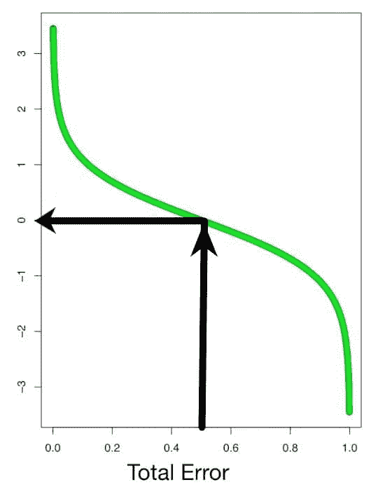
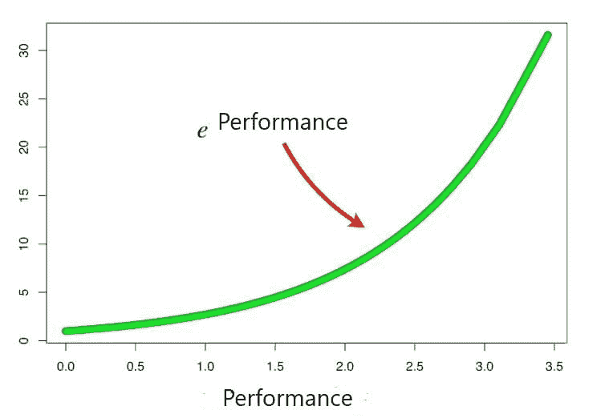
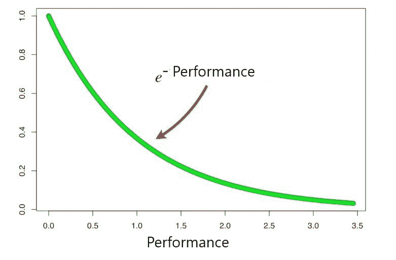

# 从零实现 AdaBoost 算法

> 原文：[`www.kdnuggets.com/2020/12/implementing-adaboost-algorithm-from-scratch.html`](https://www.kdnuggets.com/2020/12/implementing-adaboost-algorithm-from-scratch.html)

评论

**由 [James Ajeeth J](https://www.linkedin.com/in/jamesajeeth/) 提供，Praxis 商学院**

在本文结束时，你将能够：

+   理解自适应提升 (AdaBoost) 算法的工作原理和数学原理。

+   能够从零开始编写 AdaBoost 的 Python 代码。

* * *

## 我们的前三大课程推荐

 1\. [谷歌网络安全证书](https://www.kdnuggets.com/google-cybersecurity) - 快速进入网络安全职业生涯。

 2\. [谷歌数据分析专业证书](https://www.kdnuggets.com/google-data-analytics) - 提升你的数据分析技能

 3\. [谷歌 IT 支持专业证书](https://www.kdnuggets.com/google-itsupport) - 支持你的组织的 IT 工作

* * *

### **提升介绍：**

提升是一种集成技术，旨在通过多个弱分类器创建强分类器。与许多机器学习模型专注于单一模型的高质量预测不同，提升算法通过训练一系列弱模型来改进预测能力，每个模型都弥补其前任的不足。提升赋予机器学习模型提升预测准确性的能力。

### **AdaBoost：**

AdaBoost，简称自适应 [提升](https://en.wikipedia.org/wiki/Boosting_(meta-algorithm))，是由 [Yoav Freund](https://en.wikipedia.org/wiki/Yoav_Freund) 和 [Robert Schapire](https://en.wikipedia.org/wiki/Robert_Schapire) 提出的 [机器学习](https://en.wikipedia.org/wiki/Machine_learning) [算法](https://en.wikipedia.org/wiki/Meta-algorithm)。AdaBoost 技术遵循深度为一的决策树模型。AdaBoost 实质上是桩森林而非树森林。AdaBoost 通过对难以分类的实例施加更多权重，对已处理良好的实例施加较少权重来工作。AdaBoost 算法旨在解决分类和回归问题。

AdaBoost 的思想：

+   桩模型（一个节点和两个叶子）在进行准确分类时效果并不好，所以它不过是一个弱分类器/弱学习器。许多弱分类器的组合形成了强分类器，这也是 AdaBoost 算法的原理。

+   一些桩模型的表现优于其他模型或分类效果更好。

+   连续的桩模型会考虑之前桩模型的错误。

### **从零开始的 AdaBoost 算法：**

在这里，我使用了 Iris 数据集作为从零开始构建算法的示例，并且为了更好地理解，只考虑了两个类别（Versicolor 和 Virginica）。

### **步骤 1：对所有观察值分配相等的权重**

初始时对数据集中每个记录分配相同的权重。

**样本权重 = 1/N**

其中 N = 记录数量

### **步骤 2：使用 stumps 对随机样本进行分类**

从原始数据中用替换抽取随机样本，概率等于样本权重，并拟合模型。这里 **AdaBoost 中使用的模型（基学习器）是决策树。** 决策树是创建深度为 1 的树，只有一个节点和两个叶子，通常称为 stump。将模型拟合到随机样本中，并对原始数据进行分类预测。

‘pred1’ 是新预测的类别。

### **步骤 3：计算总错误**

总错误率即为误分类记录的权重之和。

**总错误** = **误分类记录的权重**

总错误将始终在 0 和 1 之间。

0 代表完美的 stump（正确分类）

1 代表弱 stump（误分类）

### **步骤 4：计算 Stump 的性能**

使用总错误率来确定基学习器的性能。计算得到的 stump(α) 值用于在连续迭代中更新权重，也用于最终预测计算。

**stump 的性能(**α**)** **= ½ ln (1 – 总错误/总错误)**

案例：

+   如果总错误率为 0.5，则 stump 的性能为零。

+   如果总错误为 0 或 1，则性能将分别变为无穷大或负无穷大。

当总错误等于 1 或 0 时，上述方程会表现出异常。因此，在实际操作中会加入一个小的误差项来防止这种情况发生。

当性能(α) 相对较大时，stump 在分类记录方面表现良好。当性能(α) 相对较低时，stump 在分类记录方面表现不佳。**利用性能参数(α)，我们可以增加错误分类记录的权重，并减少正确分类记录的权重。**

### **步骤 5：更新权重**

根据 stump(α) 的性能更新权重。我们需要下一个 stump 正确分类误分类记录，通过增加相应的样本权重并减少正确分类记录的样本权重。

**新权重 = 权重 * e^((性能))** **→** **误分类记录**

**新权重 = 权重 * e^(-(性能))** **→** **正确分类记录**

如果 ‘Label’ 和 ‘pred1’ 相同（即 1 或 -1），那么将值代入上述方程将得到正确分类记录的方程。类似地，如果值不同，将值代入上述方程将得到误分类记录的方程。

关于 e^(性能) 的简短说明，即用于误分类

当性能相对较高时，最后一个决策树在分类记录方面表现良好，现在新样本权重将远大于旧的。当性能相对较低时，最后一个决策树在分类记录方面表现较差，现在新样本权重仅比旧的稍大。

关于 e^-(性能) 的简短说明，即用于没有误分类

当性能相对较高时，最后一个决策树在分类记录方面表现良好，现在新样本权重将比旧的要小得多。当性能相对较低时，最后一个决策树在分类记录方面表现较差，现在新样本权重仅比旧的稍小。

在这里，更新后的权重总和不等于 1，而初始样本权重的总和等于 1。因此，为了实现这一点，我们将除以一个数，这个数就是更新后的权重之和（归一化常数）。

**归一化常数 =** ∑ **新权重**

**归一化权重 = 新权重 / 归一化常数**

现在归一化权重的总和等于 1。

‘prob2’ 是更新后的权重。

### **步骤 6：迭代中更新权重**

使用归一化权重来生成森林中的第二个决策树。创建一个与原始数据集大小相同的新数据集，根据更新后的样本权重进行重复。这使得误分类的记录有更高的被选中概率。通过更新权重进行特定次数的迭代，重复步骤 2 到 5。

‘prob4’ 是每个观察值的最终权重。

### **步骤 7：最终预测**

通过获取最终预测值加权和的符号来完成最终预测。

**最终预测/符号（加权和） = ∑ (α[i]*（每次迭代的预测值）)**

例如：5 个弱分类器可能预测值为 1.0、1.0、-1.0、1.0、-1.0。通过多数投票，看起来模型会预测为 1.0 或第一类。这 5 个弱分类器的性能（α）值分别为 0.2、0.5、0.8、0.2 和 0.9。计算这些预测的加权和结果为 -0.8，这将是 -1.0 或第二类的集成预测。

计算：

t = 1.0*0.2 + 1.0*0.5 - 1.0*0.8 + 1.0*0.2 - 1.0*0.9 = -0.8

仅考虑符号的话，最终预测将是 -1.0 或第二类。

**AdaBoost 算法的优势：**

+   AdaBoost 算法的许多优点之一是它快速、简单且易于编程。

+   Boosting 已被证明对过拟合具有鲁棒性。

+   它已经扩展到二分类问题之外的学习问题（即）可以用于文本或数值数据。

**缺点：**

+   AdaBoost 对噪声数据和异常值可能很敏感。

+   弱分类器过于薄弱可能会导致低边际和过拟合。

### **结论：**

AdaBoost 帮助为每个新的分类器选择训练集，这些分类器的训练基于前一个分类器的结果。同时，在合并结果时，它确定每个分类器提议答案的权重。它将弱学习器组合成一个强学习器，以纠正分类错误，这也是第一个成功的用于二分类问题的提升算法。

代码文件和数据的 GitHub 链接：

[`github.com/jamesajeeth/Data-Science/tree/master/Adaboost%20from%20scratch`](https://github.com/jamesajeeth/Data-Science/tree/master/Adaboost%20from%20scratch)

**参考文献：**

书籍：

+   Hastie, Trevor, Tibshirani, Robert, Friedman, Jerome, *《统计学习的元素：数据挖掘、推断与预测（第二版）》*

站点：

+   [Adaboost 算法简述](https://www.educba.com/adaboost-algorithm/)

+   [Statquest](https://statquest.org/adaboost-clearly-explained/)

+   [维基百科](https://en.wikipedia.org/wiki/AdaBoost)

**个人简介：** [**James Ajeeth J**](https://www.linkedin.com/in/jamesajeeth/) 是印度班加罗尔 Praxis 商学院的研究生。

**相关：**

+   机器学习的集成方法：AdaBoost

+   探索蛮力 K-近邻算法

+   KNN 中最常用的距离度量及何时使用它们

### 更多相关话题

+   [在 Scikit-learn 中实现 Adaboost](https://www.kdnuggets.com/2022/10/implementing-adaboost-scikitlearn.html)

+   [从头开始的机器学习：决策树](https://www.kdnuggets.com/2022/11/machine-learning-scratch-decision-trees.html)

+   [用 NumPy 从头开始进行线性回归](https://www.kdnuggets.com/linear-regression-from-scratch-with-numpy)

+   [如何从头开始构建和训练 Transformer 模型…](https://www.kdnuggets.com/how-to-build-and-train-a-transformer-model-from-scratch-with-hugging-face-transformers)

+   [通过实现来理解：决策树](https://www.kdnuggets.com/2023/02/understanding-implementing-decision-tree.html)

+   [在商业中实施推荐系统的十个关键经验](https://www.kdnuggets.com/2022/07/ten-key-lessons-implementing-recommendation-systems-business.html)
