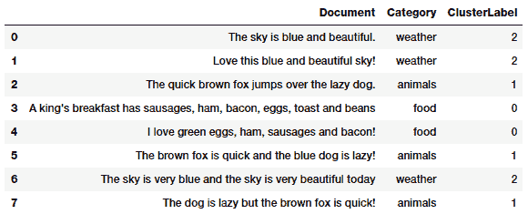
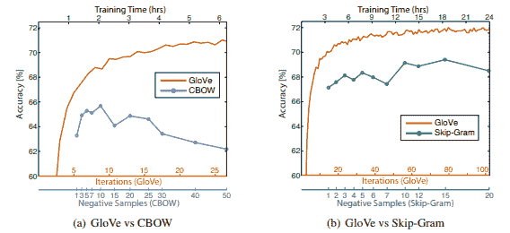

# 实现深度学习方法和文本数据特征工程：GloVe 模型

> 原文：[`www.kdnuggets.com/2018/04/implementing-deep-learning-methods-feature-engineering-text-data-glove.html`](https://www.kdnuggets.com/2018/04/implementing-deep-learning-methods-feature-engineering-text-data-glove.html)

 评论

> **编辑注：** 本文仅为更为全面深入原文的一部分，原文[在此](https://towardsdatascience.com/understanding-feature-engineering-part-4-deep-learning-methods-for-text-data-96c44370bbfa)提供，涵盖了远超本文的内容。

### GloVe 模型

* * *

## 我们的三大课程推荐

 1\. [Google 网络安全证书](https://www.kdnuggets.com/google-cybersecurity) - 快速进入网络安全职业轨道。

 2\. [Google 数据分析专业证书](https://www.kdnuggets.com/google-data-analytics) - 提升你的数据分析能力

 3\. [Google IT 支持专业证书](https://www.kdnuggets.com/google-itsupport) - 支持你的组织的 IT 需求

* * *

GloVe 模型代表全球向量，是一种无监督学习模型，可以用来获取类似于 Word2Vec 的稠密词向量。然而，技术上有所不同，训练是在聚合的全球词词共现矩阵上进行的，为我们提供了具有有意义子结构的向量空间。这种方法由 Pennington 等人在斯坦福大学发明，我推荐你阅读原始论文[*《GloVe: Global Vectors for Word Representation》*由 Pennington 等人撰写](https://nlp.stanford.edu/pubs/glove.pdf)，这是一篇出色的文章，可以帮助你了解这个模型的工作原理。

我们不会在这里过多详细讲解模型的从零实现，但如果你对实际代码感兴趣，可以查看[*官方 GloVe 页面*](https://nlp.stanford.edu/projects/glove/)。我们在这里保持简单，尝试理解 GloVe 模型背后的基本概念。我们已经讨论过基于计数的矩阵分解方法，如 LSA，以及预测方法，如 Word2Vec。论文声称，目前这两类方法都存在显著缺陷。像 LSA 这样的算法有效地利用了统计信息，但在诸如词语类比任务（比如发现语义相似的词汇）上表现较差。像 skip-gram 这样的方法在类比任务上可能表现更好，但在全局层面上对语料库的统计信息利用不充分。

GloVe 模型的基本方法是首先创建一个巨大的词语-上下文共现矩阵，该矩阵包含（词语，上下文）对，每个元素表示一个词语与上下文（可以是一系列词语）共现的频率。然后，应用矩阵因式分解来近似这个矩阵，如下图所示。


GloVe 模型实现的概念模型

考虑到***词语-上下文 (WC)*** 矩阵、***词语-特征 (WF)*** 矩阵和***特征-上下文 (FC)*** 矩阵，我们尝试因式分解`**WC = WF x FC**`，以便通过将 ***WF*** 和 ***FC*** 相乘来重建 ***WC***。为此，我们通常将 ***WF*** 和 ***FC*** 初始化为一些随机权重，并尝试将它们相乘以得到 ***WC’***（WC 的近似值），并测量其与 ***WC*** 的接近程度。我们使用[*随机梯度下降 (SGD)*](https://en.wikipedia.org/wiki/Stochastic_gradient_descent) 多次进行此操作，以最小化误差。最终，***词语-特征矩阵 (WF)*** 为每个词语提供了词语嵌入，其中 ***F*** 可以设置为特定的维度。一个非常重要的点是，Word2Vec 和 GloVe 模型在工作方式上非常相似。它们都旨在构建一个向量空间，其中每个词语的位置受到其邻近词语的上下文和语义的影响。Word2Vec 从词语共现对的局部个体示例开始，而 GloVe 从语料库中所有词语的全局聚合共现统计数据开始。

### 将 GloVe 特征应用于机器学习任务

让我们尝试利用基于 GloVe 的嵌入进行文档聚类任务。非常流行的`[**spacy**](https://spacy.io/)` 框架具有利用不同语言模型的 GloVe 嵌入的功能。你还可以 [获取预训练词向量](https://nlp.stanford.edu/projects/glove/) 并根据需要使用 `gensim` 或 `spacy` 加载它们。我们将首先安装 spacy 并使用 [en_vectors_web_lg](https://spacy.io/models/en#en_vectors_web_lg) 模型，该模型包含 300 维的词向量，基于 GloVe 在 [Common Crawl](http://commoncrawl.org/) 上训练。

```py
# Use the following command to install spaCy
> pip install -U spacy

OR
> conda install -c conda-forge spacy

# Download the following language model and store it in disk
https://github.com/explosion/spacy-models/releases/tag/en_vectors_web_lg-2.0.0

# Link the same to spacy 
> python -m spacy link ./spacymodels/en_vectors_web_lg-2.0.0/en_vectors_web_lg en_vecs

Linking successful
    ./spacymodels/en_vectors_web_lg-2.0.0/en_vectors_web_lg --> ./Anaconda3/lib/site-packages/spacy/data/en_vecs

You can now load the model via spacy.load('en_vecs')
```

在 `spacy` 中也有自动安装模型的方法，如果需要更多信息，你可以查看他们的 [Models & Languages page](https://spacy.io/usage/models)。我遇到了一些问题，因此必须手动加载模型。现在我们将使用 `spacy` 加载我们的语言模型。

```py
Total word vectors: 1070971
```

这验证了所有内容正常工作。现在让我们获取玩具语料库中每个词的 GloVe 嵌入。


我们玩具语料库中词语的 GloVe 嵌入

现在我们可以使用 t-SNE 来可视化这些嵌入，类似于我们使用 Word2Vec 嵌入时所做的那样。


在我们的玩具语料库上可视化 GloVe 词嵌入

`spacy` 的美妙之处在于，它会自动为每个文档中的词提供平均嵌入，而无需像我们在 Word2Vec 中实现的那样编写函数。我们将利用这一点来获取我们语料库的文档特征，并使用[***k-means***](https://en.wikipedia.org/wiki/K-means_clustering) 聚类来对文档进行分类。



基于我们文档特征的 GloVe 分配的簇

我们观察到一致的簇，类似于我们从 Word2Vec 模型中获得的结果，这很好！GloVe 模型声称在许多场景下性能优于 Word2Vec 模型，如下图所示，来自[Pennington 等人的原始论文](https://nlp.stanford.edu/pubs/glove.pdf)。



GloVe 与 Word2Vec 性能比较（来源：[`nlp.stanford.edu/pubs/glove.pdf`](https://nlp.stanford.edu/pubs/glove.pdf)由 Pennington 等人提供）

上述实验是在相同的 6B 令牌语料库（维基百科 2014 + Gigaword 5）上训练 300 维向量，使用相同的 400,000 词汇表和对称的 10 大小上下文窗口完成的，如果有人对细节感兴趣的话。

**个人简介：[Dipanjan Sarkar](https://www.linkedin.com/in/dipanzan)** 是一位 @Intel 的数据科学家、作者、@Springboard 的导师、作家以及体育和情景喜剧迷。

[原始](https://towardsdatascience.com/understanding-feature-engineering-part-4-deep-learning-methods-for-text-data-96c44370bbfa)。已获转载许可。

**相关：**

+   文本数据预处理：Python 中的逐步指南

+   文本数据预处理的通用方法

+   接近文本数据科学任务的框架

### 更多相关主题

+   [特征商店峰会 2022：免费特征工程会议](https://www.kdnuggets.com/2022/10/hopsworks-feature-store-summit-2022-free-conference-feature-engineering.html)

+   [机器学习中的替代特征选择方法](https://www.kdnuggets.com/2021/12/alternative-feature-selection-methods-machine-learning.html)

+   [机器学习中的实用特征工程方法](https://www.kdnuggets.com/2023/07/practical-approach-feature-engineering-machine-learning.html)

+   [构建可处理的多变量特征工程管道](https://www.kdnuggets.com/2022/03/building-tractable-feature-engineering-pipeline-multivariate-time-series.html)

+   [使用 RAPIDS cuDF 利用 GPU 进行特征工程](https://www.kdnuggets.com/2023/06/rapids-cudf-leverage-gpu-feature-engineering.html)

+   [初学者的特征工程](https://www.kdnuggets.com/feature-engineering-for-beginners)
