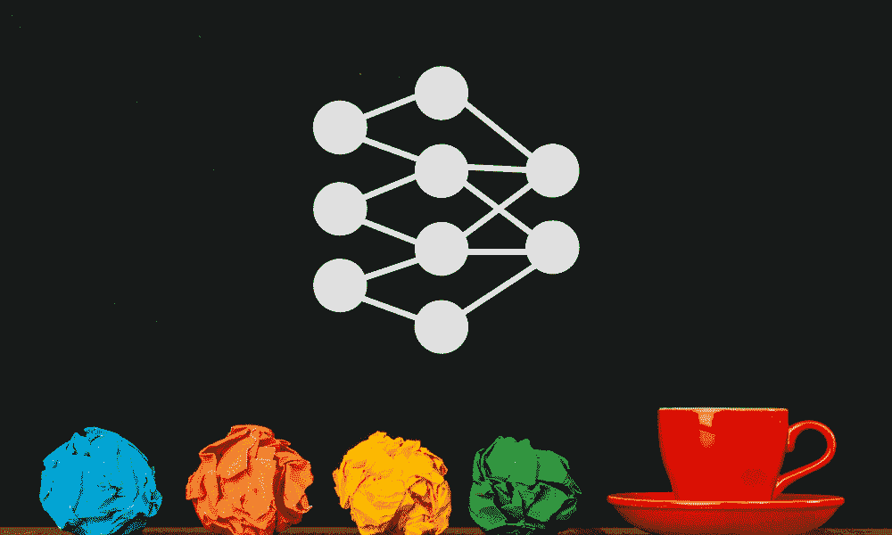

# 排列在神经网络预测中的重要性

> 原文：[`www.kdnuggets.com/2022/12/importance-permutation-neural-network-predictions.html`](https://www.kdnuggets.com/2022/12/importance-permutation-neural-network-predictions.html)

图片由编辑提供

排列表示每一种可能的排列方式，无论是事物还是数字。排列在以数学为中心的学科中很重要，例如统计学，但它也影响神经网络所做的预测。这里是更详细的介绍。

* * *

## 我们的三大课程推荐

 1\. [Google 网络安全证书](https://www.kdnuggets.com/google-cybersecurity) - 快速进入网络安全职业道路。

 2\. [Google 数据分析专业证书](https://www.kdnuggets.com/google-data-analytics) - 提升你的数据分析技能

 3\. [Google IT 支持专业证书](https://www.kdnuggets.com/google-itsupport) - 支持你在 IT 领域的组织

* * *

# 排列可以确定统计学意义

数据科学家经常发现自己需要更多地了解作为信息来源的总体。然而，他们仍然必须确定统计学意义。在处理时间序列数据时，运行排列检验是一个实用的方法。

排列检验估算了总体分布。在获取这些信息后，数据科学家可以确定观察值相对于总体的稀有程度。排列检验提供了所有可能排列的样本，而不替换任何值。

它们在样本量较小的情况下也有很高的有效性。因此，排列检验可以帮助人们确定他们的神经网络模型是否揭示了具有统计学意义的发现。

这些检验还可以帮助人们确定他们可以多大程度上信任模型的结果。评估准确性可能极其重要，这取决于模型的用途。在将模型应用于医疗诊断或财务决策之前，人们必须对模型的表现有高度信心。

# 排列可以展示哪些数据集特征影响有用的预测

许多神经网络依赖于黑箱模型。它们在广泛的应用中非常准确。然而，通常需要一定的工作来观察预测因素对最终预测的影响。

一种叫做排列特征重要性的选项提供了一种解决这一障碍的方法。它向数据科学家展示哪些数据集特征具有预测能力，无论使用什么模型。

确定模型中特征重要性的技术允许人们根据相对预测能力对预测器进行排名。随机排列通过显示特征的重新排列是否会导致预测准确性下降来发挥作用。

也许质量下降是最小的。这表明与原始预测器相关的信息对生成整体预测没有重大影响。

人们可以继续对模型预测器进行排名，直到得到一个值的集合，显示出[哪些特征最重要](https://www.geeksforgeeks.org/machine-learning-explainability-using-permutation-importance/)和最不重要以生成准确预测。数据科学家还可以使用排列特征重要性来调试模型并获得有关整体性能的更好见解。

# 排列影响模型提供的知识

一个优秀的数据科学家必须始终[探索模型提供的细节](https://www.successbydesign.com/blogs/news/stem-in-elementary-classrooms)并质疑相关结论。许多专业人士在小学的 STEM 课程中学会了这种思维方式。排列是神经网络预测的一个必要方面，因为它决定了模型提供或不提供什么信息。对排列的熟悉有助于数据科学家构建和调整他们的雇主或客户所希望和期望的模型。

考虑一个公司需要一个与客户点击网站相关的神经网络模型的情况。决策者可能希望了解有多少客户通过特定路径浏览网站。模型必须计算排列。

另一方面，要求机器学习模型的人可能希望了解访问网站上某些页面组的人员情况。这种洞察与组合有关，而不是排列。准确了解一个人希望从神经网络模型中获得什么信息有助于确定使用何种类型以及排列在其中的作用。

此外，神经网络在[训练数据集包含相关信息](https://rehack.com/featured/artificial-intelligence-neural-networks-and-how-they-work/)时将产生最佳结果。谷歌的机器学习工程师还在[研究所谓的排列不变](https://ai.googleblog.com/2021/11/permutation-invariant-neural-networks.html)神经网络代理。当每个代理的感官神经元接收来自环境的输入时，它会即时理解意义和上下文。

这与假设固定含义相对。研究表明，即使模型包含冗余或噪声信息，排列不变的神经网络代理也能表现良好。

# 排列对神经网络的准确性和相关性至关重要

这些只是为什么排列在使神经网络展现最佳性能方面发挥着关键作用的一些原因。理解排列的影响可以帮助数据科学家构建和使用模型，从而获得更好的结果。

**[April Miller](https://www.linkedin.com/in/april-j-miller/)** 是 [ReHack](https://rehack.com/) 杂志的消费技术主编。她有创造高质量内容的经验，这些内容能够为我合作的出版物带来流量。

### 更多相关内容

+   [庆祝对数据隐私重要性的认识](https://www.kdnuggets.com/2022/01/celebrating-awareness-importance-data-privacy.html)

+   [机器学习不像你的大脑 第六部分：精确突触权重的重要性](https://www.kdnuggets.com/2022/08/machine-learning-like-brain-part-6-importance-precise-synapse-weights-ability-set-quickly.html)

+   [数据科学中实验设计的重要性](https://www.kdnuggets.com/2022/08/importance-experiment-design-data-science.html)

+   [机器学习中预处理的重要性](https://www.kdnuggets.com/2023/02/importance-preprocessing-machine-learning.html)

+   [概率在数据科学中的重要性](https://www.kdnuggets.com/2023/02/importance-probability-data-science.html)

+   [机器学习中可重复性的重要性](https://www.kdnuggets.com/2023/06/importance-reproducibility-machine-learning.html)
