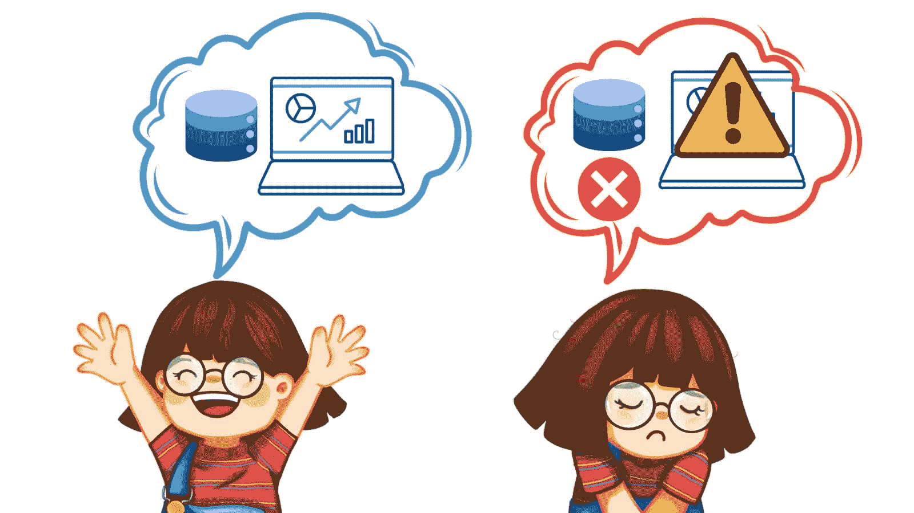

# 机器学习中可重复性的**重要性**

> 原文：[`www.kdnuggets.com/2023/06/importance-reproducibility-machine-learning.html`](https://www.kdnuggets.com/2023/06/importance-reproducibility-machine-learning.html)

作者提供的图片

当我自学机器学习时，我经常尝试跟随项目教程进行编码。我会按照作者列出的步骤操作。但有时，我的模型表现会比教程作者的模型更差。也许你也遇到过类似的情况。或者你刚刚从 GitHub 上拉取了同事的代码。你的模型的性能指标与同事报告的指标不同。*所以做相同的事情并不能保证相同的结果，对吧？* 这是机器学习中一个普遍存在的问题：**可重复性**的挑战。

* * *

## 我们的三大课程推荐

 1\. [谷歌网络安全证书](https://www.kdnuggets.com/google-cybersecurity) - 快速进入网络安全职业生涯。

 2\. [谷歌数据分析专业证书](https://www.kdnuggets.com/google-data-analytics) - 提升您的数据分析技能

 3\. [谷歌 IT 支持专业证书](https://www.kdnuggets.com/google-itsupport) - 支持您的组织的 IT

* * *

毫无疑问：机器学习模型只有在其他人能够重复实验并重现结果时才有用。从典型的“它在我的机器上有效”问题到机器学习模型训练方式的细微变化，可重复性面临许多挑战。

在这篇文章中，我们将深入探讨机器学习中可重复性的挑战和重要性，以及数据管理、版本控制和实验跟踪在解决机器学习可重复性挑战中的作用。

# 在机器学习的背景下什么是可重复性？

让我们看看如何在机器学习的背景下最好地定义可重复性。

假设有一个现有项目使用特定的机器学习算法和给定的数据集。给定数据集和算法，我们应该能够运行算法（任意次数），并在每次运行中重现（或复制）结果。

但机器学习中的可重复性并非没有挑战。我们已经讨论了其中的一些问题，让我们在下一节中更详细地讨论这些问题。

# 机器学习中的可重复性挑战

对于任何应用程序，都存在可靠性和可维护性等挑战。然而，在机器学习应用程序中，还存在额外的挑战。

当我们谈论机器学习应用时，我们通常指的是通常包括以下步骤的端到端机器学习管道：

作者提供的图像

因此，可重复性挑战可能由于这些步骤中的一个或多个变化而出现。大多数变化可以通过以下方式之一来捕捉：

+   环境变化

+   代码更改

+   数据更改

我们来看看这些变化如何阻碍可重复性。

## 环境变化

Python 和基于 Python 的机器学习框架使得开发 ML 应用变得轻而易举。然而，Python 中的依赖管理——管理一个项目所需的不同库和版本——是一项非平凡的挑战。即使是使用不同版本的库或调用使用已弃用参数的函数，也足以破坏代码。

这也包括操作系统的选择。还有一些与硬件相关的挑战，例如 GPU 浮点精度的差异等。

## 代码更改

从输入数据集的洗牌以确定哪些样本进入训练数据集，到训练神经网络时的权重随机初始化——随机性在机器学习中扮演着重要角色。

设置不同的随机种子可能会导致完全不同的结果。对于我们训练的每一个模型，都有一组超参数。因此，调整一个或多个超参数也可能导致不同的结果。

## 数据更改

作者提供的图像

即使在相同的数据集下，我们也看到超参数值和随机性的不一致会使得复制结果变得困难。因此，当数据发生变化——数据分布的变化、记录子集的修改或某些样本的丢失——会使得结果的复制变得困难。

总结：当我们尝试复制机器学习模型的结果时，即使是代码、使用的数据集以及机器学习模型运行的环境中最小的变化，也可能阻止我们得到与原始模型相同的结果。

# 如何解决可重复性挑战

现在我们将看看如何解决这些挑战。

作者提供的图像

## 数据管理

我们看到，可重复性面临的最明显挑战之一是数据。某些数据管理方法如数据集版本控制可以帮助我们跟踪数据集的变化，并存储有用的元数据。

## 版本控制

代码的任何更改都应使用版本控制系统（如 Git）进行跟踪。

在现代软件开发中，你可能遇到过 CI/CD 管道，这使得跟踪更改、测试新更改和推送到生产变得更简单高效。

在其他软件应用中，跟踪代码的变化是简单的。然而，在机器学习中，代码的变化也可能涉及到所使用算法和超参数值的变化。即使是简单的模型，我们可以尝试的可能性也是组合性巨大的。这就是实验跟踪变得相关的地方。

## 实验跟踪

构建机器学习应用程序等同于广泛的实验。从算法到超参数，我们尝试不同的算法和超参数值。因此，跟踪这些实验非常重要。

跟踪机器学习实验包括：

+   记录超参数调整

+   记录模型的性能指标、模型检查点

+   存储关于数据集和模型的有用元数据

## 机器学习实验跟踪、数据管理及其他工具

如所见，数据集版本控制、代码变更跟踪和机器学习实验跟踪复现了机器学习应用程序。以下是一些可以帮助你构建可复现机器学习流程的工具：

+   [Weights and Biases](https://wandb.ai/site)

+   [MLflow](https://mlflow.org/)

+   [Neptune.ai](https://neptune.ai/)

+   [Comet ML](https://www.comet.com/site/)

+   [DVC](https://dvc.org/)

# 总结

总结一下，我们回顾了机器学习中可复现性的意义和挑战。我们讨论了数据和模型版本控制以及实验跟踪等方法。此外，我们还列出了一些你可以用来进行实验跟踪和更好地管理数据的工具。

DataTalks.Club 的 [MLOps Zoomcamp](https://github.com/DataTalksClub/mlops-zoomcamp) 是一个出色的资源，可以让你获得这些工具的一些经验。如果你喜欢构建和维护端到端的机器学习管道，你可能会对了解 MLOps 工程师的角色感兴趣。

**[Bala Priya C](https://www.linkedin.com/in/bala-priya/)** 是一位来自印度的开发者和技术作家。她喜欢在数学、编程、数据科学和内容创作的交集上工作。她的兴趣和专长包括 DevOps、数据科学和自然语言处理。她喜欢阅读、写作、编程和咖啡！目前，她正在通过撰写教程、使用指南、观点文章等与开发者社区分享她的知识。

### 更多相关内容

+   [机器学习不像你的大脑第六部分：重要性……](https://www.kdnuggets.com/2022/08/machine-learning-like-brain-part-6-importance-precise-synapse-weights-ability-set-quickly.html)

+   [机器学习中预处理的重要性](https://www.kdnuggets.com/2023/02/importance-preprocessing-machine-learning.html)

+   [庆祝对数据隐私重要性的认识](https://www.kdnuggets.com/2022/01/celebrating-awareness-importance-data-privacy.html)

+   [实验设计在数据科学中的重要性](https://www.kdnuggets.com/2022/08/importance-experiment-design-data-science.html)

+   [概率在数据科学中的重要性](https://www.kdnuggets.com/2023/02/importance-probability-data-science.html)

+   [数据清洗在数据科学中的重要性](https://www.kdnuggets.com/2023/08/importance-data-cleaning-data-science.html)
