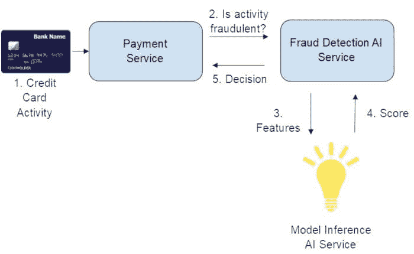
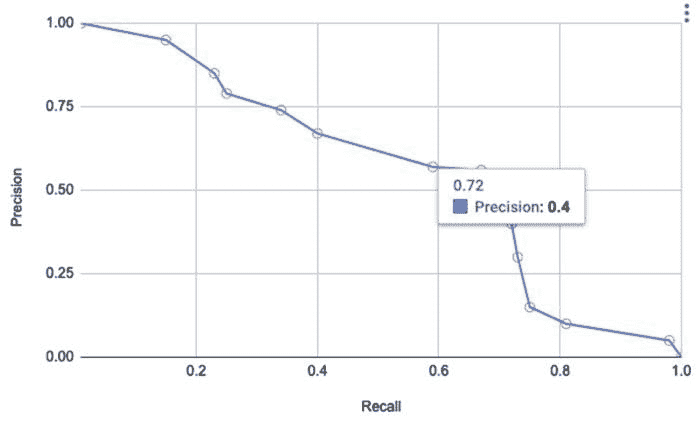
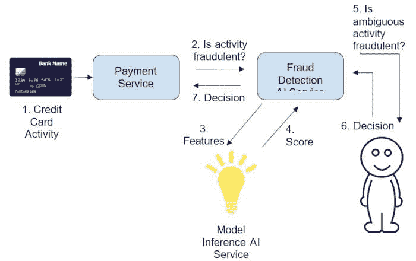

# 通过人类参与提高模型性能

> 原文：[`www.kdnuggets.com/2021/04/improving-model-performance-through-human-participation.html`](https://www.kdnuggets.com/2021/04/improving-model-performance-through-human-participation.html)

评论

**由 [Preetam Joshi](https://www.linkedin.com/in/preetambjoshi/)，Netflix 的高级软件工程师和 [Mudit Jain](https://www.linkedin.com/in/muditjai/)，Google 的软件工程师**。

*人类 + 人工智能（图片来源：[Pixabay](https://pixabay.com/photos/technology-hands-agreement-ok-4256272/)）。*

某些领域对假阳性非常敏感。一个例子是信用卡欺诈检测，在这种情况下，错误地将活动分类为欺诈可能会对发卡金融机构的声誉产生重大负面影响 [1]。另一个例子是使用语言模型（如 GPT-3）生成文本响应的自动聊天机器人 [2]。审核生成的文本很重要，以确保至少不会生成不当语言（如仇恨言论、脏话等）。

另一个高度敏感的领域是医疗领域，在这里，像癌症诊断这样的内容对假阳性非常敏感 [3]。在下面的部分中，我们将首先描述一个使用 ML 模型进行推断的系统，然后详细说明需要哪些修改以将人类代理纳入推断循环。

### 基于模型的推断

*图 1\. 经典模型推断系统。*

让我们从一个典型的系统开始，该系统用于处理信用卡欺诈用例的机器学习模型。图 1 显示了一个简化的系统视图和模型单独负责决定给定活动是否欺诈的事件序列。

**如何选择阈值？**

阈值的选择是基于对精确度和召回率的要求 [5]。在图 1 中所示的示例中，精确度定义为正确预测的欺诈活动数量（真正例）除以预测为欺诈的总活动数（真正例 + 假阳性）。召回率定义为正确预测的欺诈活动数量（真正例）除以正确预测为欺诈的活动数量与实际欺诈活动数之和（真正例 + 假阴性）。在大多数情况下，需要在精确度和召回率之间做出权衡以实现系统的目标。一个有用的工具是精确度-召回率曲线。图 2 说明了精确度-召回率曲线。

*图 2\. 精确度-召回率曲线。*

注意到在更高的召回率下精确度会下降。在召回率为 0.72 时，精确度降到大约 0.4。为了捕捉 70% 的欺诈案件，我们将遭遇较高数量的假阳性，精确度为 40%。在我们的情况下，假阳性数量不可接受，因为这会导致非常糟糕的客户体验。我们需要在合理的召回率下获得更高的精确度。请注意，什么算作合理的假阳性数量是主观的。对于我们的用例，从图 1 中，我们需要精确度大于 0.99。

尽管我们做出了提高精确度的权衡，但在 0.99 的精确度下，召回率为 0.15，这还不够。为了实现更高的召回率，我们将获得较低的精确度，这对业务来说是不可接受的。在下一节中，我们将讨论如何利用人工输入来实现更高的总体精确度和更高的召回率。

### 人工参与

图 3 显示了一个包含人工互动的修改系统。

*图 3\. 通过人工互动提升模型性能。*

提高召回率的一种方法是将人工代理纳入推理循环。在这种设置中，模型置信度低的活动子集将被发送给人工代理进行手动检查。在选择确定低置信度/模糊预测子集的阈值时，重要的是要考虑将发送给人工代理的模糊活动的数量，因为后者是稀缺资源。为了帮助选择阈值，可以使用精确度-召回率-阈值图（图 4）。

*图 4\. 精确度-召回率-阈值 曲线*。

在我们的案例中，假设接近 1.0 的分数表示正标签（欺诈），接近 0.0 的分数表示负标签（非欺诈）。图 4 中高亮了两个区域：

1.  绿色区域表示高置信度的正标签区域，即允许自动化模型决策，模型精确度令人满意（假阳性率低通常被最终用户接受）。

1.  黄色区域表示低置信度的正标签区域，其中自动化模型决策的精确度水平不可接受（高假阳性率对业务产生了显著的负面影响）。

黄色区域是一个很好的候选区域，可以通过人工检查来提高精度。相同的过程也可以用于分析负标签——接近 0.0 的区域是高置信度区域，而超过某个阈值，结果变得模糊。可以将黄色区域的所有项目或部分项目发送进行人工检查。在人工检查期间，人工审查员利用他们通过严格培训过程获得的判断力和经验来决定活动的最终结果——在我们的案例中是欺诈与否。这里的关键假设是，人工审查员在处理模糊案例时比机器学习模型更出色。

如前所述，人力资源稀缺。因此，发送给人工审查员的请求量在选择阈值时是一个重要的考虑因素。图 5 显示了阈值与体积和召回率的关系示例。体积定义为每小时发送给人工审查员的项目数量。从图 5 中可以看出，阈值为 0.7 时，体积为 16K 项目（每小时）。

*图 5\. 召回率与阈值的体积（每小时请求数量）图示。*

图 4 和图 5 中的图表都可以用来选择合适的阈值，以在可接受的人力审查量下获得期望的召回率。我们来做一个快速的练习，通过这两个图来确定阈值。在召回率为 0.59（阈值为 0.7）时，审查量（见图 5）大约为 16K 项目/小时。在相同的召回率下，模型精度大约为 0.6（见图 4）。假设人工审查员池能够处理 16K 项目/小时的审查量，并且假设人工审查员的精度和召回率为 95%，那么在人力审查后的精度将介于 0.95 和 0.99 之间。在这种设置下，我们能够将召回率从 0.15 提升到 0.56（0.59 [模型] * 0.95 [人工]），同时保持精度水平高于 0.95。

**使用人工审查员的最佳实践**

为了实现高质量的人工审查，重要的是为负责手动审查项目的人工审查员建立一个明确的培训流程。精心设计的培训计划和定期的反馈循环将帮助维持手动审查项目的高质量标准。这种严格的培训和反馈循环不仅有助于减少人为错误，还能帮助保持每项决策的服务水平协议（SLA）要求。

另一种稍微昂贵的策略是对每个手动审查的项目采用三人投票的方法，即使用 3 名审查员审查同一项目，并根据 3 名审查员的多数票决定最终结果。此外，记录审查员之间的分歧，以便团队可以回顾这些分歧，完善其判断政策。

适用于微服务的最佳实践同样适用于此。这包括对以下内容的适当监控：

+   从系统接收项目到做出决策的端到端延迟

+   代理池的整体健康状况

+   发送给人工审核的项目数量

+   对项目分类的每小时统计数据

最后，由于各种原因，模型的精确度和召回率可能会随时间变化 [4]。重要的是要通过跟踪精确度/召回率来重新审视所选择的阈值。

### 结论

我们回顾了一个涉及人类代理的 ML 推理系统如何在保持高精确度的同时提高召回率。这种方法在对假阳性敏感的用例中特别有用。精确度-召回率-阈值曲线是选择人工审核和自动模型决策阈值的一个很好的工具。然而，涉及人类代理会增加成本，并可能导致在经历快速增长的系统中的瓶颈。在考虑这样的系统时，仔细权衡这些方面是很重要的。

### 参考文献

1.  FCase 文章 [`fcase.io/a-major-challenge-false-positives/#twelve`](https://fcase.io/a-major-challenge-false-positives/#twelve)

1.  微软聊天机器人著名的问题 [`spectrum.ieee.org/tech-talk/artificial-intelligence/machine-learning/in-2016-microsofts-racist-chatbot-revealed-the-dangers-of-online-conversation`](https://spectrum.ieee.org/tech-talk/artificial-intelligence/machine-learning/in-2016-microsofts-racist-chatbot-revealed-the-dangers-of-online-conversation)

1.  假阳性癌症筛查可能会影响患者接受未来筛查的意愿 [`www.ncbi.nlm.nih.gov/pmc/articles/PMC5992010/`](https://www.ncbi.nlm.nih.gov/pmc/articles/PMC5992010/)

1.  “你能相信你模型的不确定性吗？在数据集偏移下评估预测不确定性”，Yaniv Ovadia 等 [`arxiv.org/abs/1906.02530`](https://arxiv.org/abs/1906.02530)

1.  精确度和召回率 [`en.wikipedia.org/wiki/Precision_and_recall`](https://en.wikipedia.org/wiki/Precision_and_recall)

**个人简介：** [Preetam Joshi](https://www.linkedin.com/in/preetambjoshi/) 是 Netflix 的高级软件工程师，专注于应用机器学习和机器学习基础设施。他曾在 Thumbtack 和 Yahoo 工作过。他获得了乔治亚理工学院计算学院的硕士学位。

[Mudit Jain](https://www.linkedin.com/in/muditjai/) 是谷歌的自动化机器学习 NLP 工程师，专注于 Google Cloud 平台。他曾在微软工作过。他获得了印度理工学院坎普尔分校计算机科学与工程学士学位。

**相关：**

+   [为什么 AI 系统需要人类干预才能良好运行？](https://www.kdnuggets.com/2020/06/ai-systems-need-human-intervention.html)

+   [如何评估你的机器学习模型的性能](https://www.kdnuggets.com/2020/09/performance-machine-learning-model.html)

+   [傻瓜指南：精准度、召回率和混淆矩阵](https://www.kdnuggets.com/2020/01/guide-precision-recall-confusion-matrix.html)

* * *

## 我们的三大课程推荐

 1\. [谷歌网络安全证书](https://www.kdnuggets.com/google-cybersecurity) - 快速进入网络安全职业轨道。

 2\. [谷歌数据分析专业证书](https://www.kdnuggets.com/google-data-analytics) - 提升你的数据分析技能

 3\. [谷歌 IT 支持专业证书](https://www.kdnuggets.com/google-itsupport) - 支持你的组织 IT

* * *

### 更多相关内容

+   [提升 SQL 查询性能的 5 个技巧](https://www.kdnuggets.com/5-tips-for-improving-sql-query-performance)

+   [超越准确性：使用 NLP 测试库评估和改进模型](https://www.kdnuggets.com/2023/04/john-snow-beyond-accuracy-nlp-test-library.html)

+   [提升你的机器学习模型性能！](https://www.kdnuggets.com/2023/04/manning-boost-machine-learning-model-performance.html)

+   [使用 Python 监控 MLOps 管道中的模型性能](https://www.kdnuggets.com/2023/05/monitor-model-performance-mlops-pipeline-python.html)

+   [利用迁移学习提升模型性能](https://www.kdnuggets.com/using-transfer-learning-to-boost-model-performance)

+   [探索思维树提示：AI 如何通过搜索学习推理…](https://www.kdnuggets.com/2023/07/exploring-tree-of-thought-prompting-ai-learn-reason-through-search.html)
