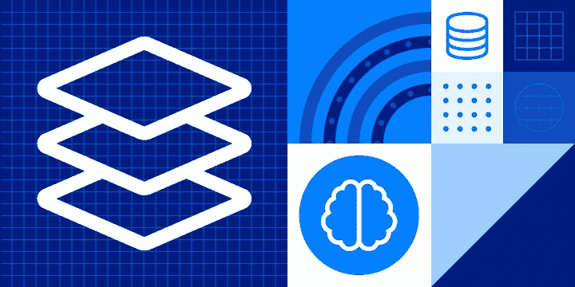
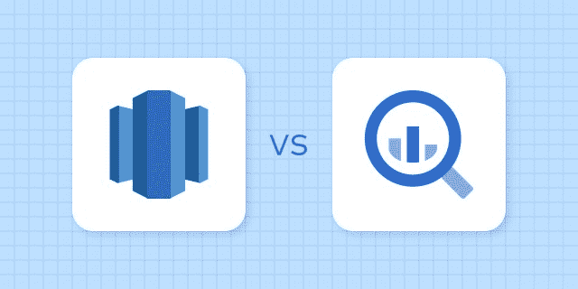

# 数据仓库中的机器学习与现代数据科学堆栈

> 原文：[`www.kdnuggets.com/2021/06/in-warehouse-machine-learning-modern-data-science-stack.html`](https://www.kdnuggets.com/2021/06/in-warehouse-machine-learning-modern-data-science-stack.html)

评论

**作者 [Nick Acosta](https://www.linkedin.com/in/nick-acosta-0a9165103/)，开发者倡导者，Fivetran 联盟**。

* * *

## 我们的前三大课程推荐

 1\. [谷歌网络安全证书](https://www.kdnuggets.com/google-cybersecurity) - 快速开启网络安全职业生涯。

 2\. [谷歌数据分析专业证书](https://www.kdnuggets.com/google-data-analytics) - 提升你的数据分析能力

 3\. [谷歌 IT 支持专业证书](https://www.kdnuggets.com/google-itsupport) - 支持组织的 IT

* * *

### 数据堆栈的融合

尽管数据分析和数据科学是相当独特的学科，但在有效实现这些学科的过程中，数据处理步骤有相当大的重叠。两者都受益于访问存储在集中位置的大量高质量数据，以及高效可靠的过程来将数据从源头带到这些中心存储库。直到最近，工作一直是用不同的技术在数据仓库（用于分析和商业智能）和数据湖（用于数据科学和机器学习）之间重复进行的。一些新服务正在努力将这些数据堆栈合并到一个环境中，这篇文章将概述这些服务及其能为数据组织带来的价值。

### 现代数据科学堆栈的好处

现代数据堆栈是一系列技术，能够将多个数据源集中到一个在分析中变得流行的云数据仓库中。它可以扩展以适应机器学习工作负载，形成所谓的[现代数据科学堆栈](https://fivetran.com/blog/modern-data-science-stack)。现代数据科学堆栈消除了数据分析和数据科学团队的孤岛和重复工作的服务，并将模型靠近它们正在训练和用于预测的数据，简化了从模型中心 AI 开发到[数据中心 AI 开发](https://www.youtube.com/watch?v=06-AZXmwHjo)的过渡。许多组织在数据仓储技术上投入了大量资金，以保持环境的安全、治理、运营、组织和性能，但一旦数据从数据仓库抽样到数据湖中，它就失去了所有这些特性。

还有三个不那么明显的好处我也想强调一下，这些是在我转向现代数据科学栈后发现的。将模型存储在数据仓库中意味着它们的预测也可以被存储并通过 SQL 查询获取。执行表查找而不是需要嵌入模型或框架来使用机器学习，可以大大推动组织中机器学习的普及。此外，因为机器学习过程中的每一步都在同一个地方、同一数据上发生，所以在训练时和服务时传递给模型的数据之间差异的可能性较小，这意味着可以大大避免[训练-服务偏差](https://www.tensorflow.org/tfx/guide/tfdv#skewdetect)及其检测工具。最后，由于机器学习过程的每一步都可以用 SQL 执行，因此可以使用像 Apache Airflow 这样的工具将不同的步骤组合成数据管道。

### 数据仓库内机器学习服务概述

**BigQuery ML 和 Redshift ML**

*AWS 和 Google Cloud 最近都为其数据仓库 Redshift（左）和 BigQuery（右）新增了机器学习功能。*

BigQuery ML 和 Redshift ML 将机器学习功能添加到 BigQuery 和 Redshift，即 Google Cloud Platform 和 AWS 各自的数据仓库。AWS 最近刚刚宣布了[Redshift ML 的普遍可用性](https://aws.amazon.com/about-aws/whats-new/2021/05/aws-announces-general-availability-of-amazon-redshift-ml/)，而[BigQuery ML](https://cloud.google.com/blog/topics/developers-practitioners/how-build-demand-forecasting-models-bigquery-ml) 已经提供了一段时间。

两者都扩展了 SQL 语法，新增了一个 CREATE MODEL 命令，允许创建机器学习模型并指定诸如模型类型、用于训练的数据表和生成预测的目标特征等参数。这些新的 SQL 命令利用自动化机器学习过程来提供数据转换和模型调整，以识别候选模型中的最佳性能。自定义模型也可以与每种工具一起使用，提供了相当大的灵活性，但每种工具在开发上都有一些限制。自定义模型必须保存为 TensorFlow 模型才能在 BigQuery 中使用，而 Redshift ML 必须使用在 AWS 数据科学开发平台 SageMaker 上部署的模型。一旦模型被训练或导入到仓库中，`SELECT` 语句可以用 `FROM` 指定一个训练好的模型来代替表进行推断，这些推断可以很容易地插入到仓库中的预测表中以供使用、审核和错误分析。

**Snowflake 和其他选项**

[Snowflake 表示](https://www.protocol.com/enterprise/databricks-snowflake-analytics)他们的“整个 AI 和 ML 计划旨在将可扩展性构建到[他们的数据仓库]中，以便你可以使用你选择的工具。”之前提到的 AWS Sagemaker 平台就是一个 Snowflake 可以集成的 ML 工具，Databricks 也是如此。Databricks 正在进行更令人印象深刻的开发，他们刚刚发布了[Delta Lake 1.0.0 版本](https://delta.io/news/delta-lake-1-0-0-released/)，该版本从相反的方向融合了数据分析和数据科学技术栈。Delta Lake 并不是将机器学习能力引入数据仓库，而是将传统的分析和商业智能能力，如 ACID 事务，添加到数据湖中，形成一个新的数据湖屋架构，为现代数据科学栈提供类似的好处。

### 评审

如果你的组织有兴趣同时进行数据分析和数据科学，有多种选项可以促进这两个学科，但它们的数据管道之间有太多的共性，因此不能为数据摄取、存储和转化单独设置工具。在仓库内的机器学习工具可以用来构建现代数据科学栈，这样可以通过将所有数据和处理这些数据的从业人员移至一个集中位置，消除数据工程和模型服务组件中出现的数据孤岛。

**简介：** [Nick Acosta](https://www.linkedin.com/company/fivetran) 是 Fivetran 的开发者倡导者和数据科学家，他在普渡大学和南加州大学学习计算机科学。Fivetran 自动化数据摄取，并很高兴成为包括亚马逊、Databricks、谷歌和 Snowflake 在内的多家组织的技术合作伙伴。

**相关：**

+   [BigQuery 与 Snowflake：数据仓库巨头的比较](https://www.kdnuggets.com/2021/06/bigquery-snowflake-comparison-data-warehouse-giants.html)

+   [云中的 ETL：通过数据仓库自动化转变大数据分析](https://www.kdnuggets.com/2021/04/etl-cloud-transforming-big-data-analytics-data-warehouse-automation.html)

+   [云数据仓库是数据存储的未来](https://www.kdnuggets.com/2021/01/cloud-data-warehouse-future-data-storage.html)

### 更多相关主题

+   [数据仓库是否应该是不可变的？](https://www.kdnuggets.com/2022/05/data-warehouse-immutable.html)

+   [如何以预算建立你的数据科学栈](https://www.kdnuggets.com/2022/01/data-science-stack-budget.html)

+   [全栈一切？数据科学与开发技术之间的组织交集](https://www.kdnuggets.com/2022/08/full-stack-everything-organizational-intersections-data-science-dev-tech.html)

+   [为什么通用语义层对你的数据栈有益的 6 个原因](https://www.kdnuggets.com/2024/01/cube-6-reasons-why-a-universal-semantic-layer-is-beneficial)

+   [弹性机器学习栈是模块化的](https://www.kdnuggets.com/2022/06/comet-resilient-ml-stack-modular.html)

+   [免费全栈 LLM 训练营](https://www.kdnuggets.com/2023/06/free-full-stack-llm-bootcamp.html)
