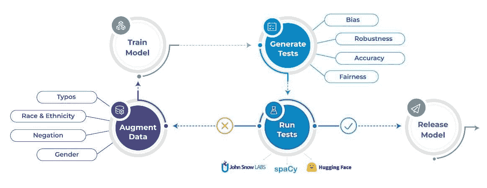
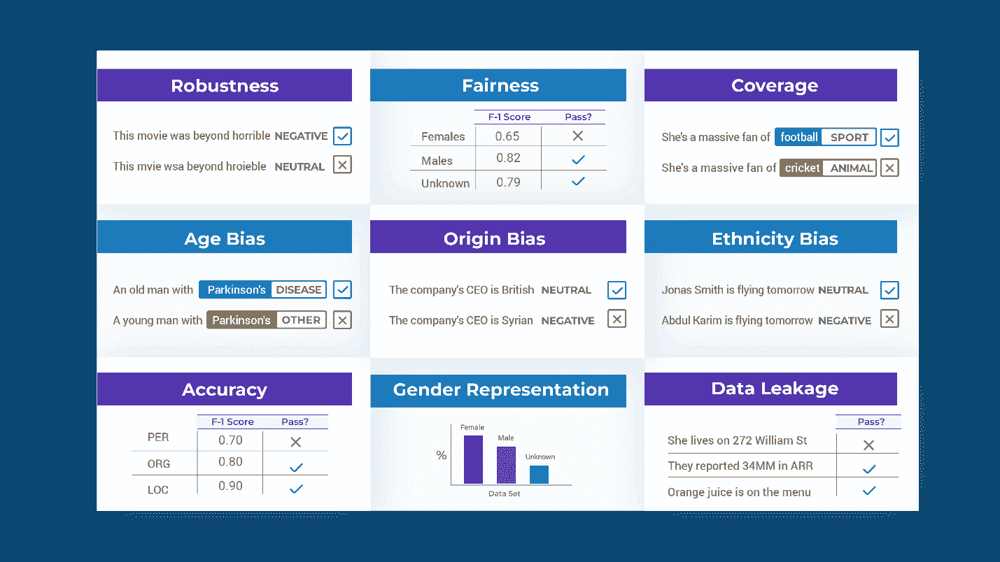

# 介绍自然语言处理的测试库

> 原文：[`www.kdnuggets.com/2023/04/introducing-testing-library-natural-language-processing.html`](https://www.kdnuggets.com/2023/04/introducing-testing-library-natural-language-processing.html)



# 负责任的 AI：目标与现实

* * *

## 我们的前三名课程推荐

 1\. [Google 网络安全证书](https://www.kdnuggets.com/google-cybersecurity) - 快速进入网络安全职业生涯。

 2\. [Google 数据分析专业证书](https://www.kdnuggets.com/google-data-analytics) - 提升你的数据分析能力

 3\. [Google IT 支持专业证书](https://www.kdnuggets.com/google-itsupport) - 支持你所在组织的 IT

* * *

虽然有很多关于训练安全、稳健和公平的 AI 模型的讨论——但很少有工具提供给数据科学家以实现这些目标。因此，生产系统中的自然语言处理（NLP）模型的前线反映了一个令人遗憾的现状。

目前的自然语言处理系统经常失败且失败得非常惨烈。[[Ribeiro 2020](https://arxiv.org/abs/2005.04118)] 显示了在替换中性词时，顶级三大云服务提供商的情感分析服务失败率为 9-16%，在更改中性命名实体时为 7-20%，在时间测试中为 36-42%，在一些否定测试中几乎为 100%。[[Song & Raghunathan 2020](https://arxiv.org/abs/2004.00053)] 显示了 50-70%的个人信息泄露到流行的词汇和句子嵌入中。[[Parrish et. al. 2021](https://arxiv.org/abs/2110.08193)] 显示了种族、性别、外貌、残疾和宗教的偏见如何根深蒂固地存在于最先进的问答模型中——有时会使可能的答案发生超过 80%的变化。[[van Aken et. al. 2022](https://arxiv.org/abs/2111.15512)] 显示了在病人记录中添加任何关于族裔的提及都会降低其预测的死亡风险——最准确的模型产生了最大的误差。

简而言之，这些系统就是不管用。我们绝不会接受一个只在某些数字上正确加法的计算器，或一个根据你放入的食物类型或时间随机改变强度的微波炉。一个经过良好工程设计的生产系统应该能在常见输入上可靠地工作。它在处理不常见输入时也应该是安全和稳健的。软件工程包括三个基本原则，以帮助我们实现这些目标。

# 应用软件工程基础

首先，**测试你的软件**。关于为什么 NLP 模型今天会失败，唯一令人惊讶的事是答案的平凡性：因为没有人测试它们。上述论文之所以新颖，是因为它们是其中的首批。如果你想交付有效的软件系统，你需要定义什么是有效，并在部署到生产环境之前测试它是否有效。每次更改软件时也应如此，因为 NLP 模型也会出现回退问题 [[Xie et. al. 2021](https://arxiv.org/abs/2105.03048)]。

其次，**不要将学术模型作为生产就绪模型重复使用**。NLP 科学进步的一个美妙方面是，大多数学者将他们的模型公开并易于重用。这加速了研究，并启用了像 [SuperGLUE](https://super.gluebenchmark.com/)、[LM-Harness](https://github.com/EleutherAI/lm-evaluation-harness) 和 [BIG-bench](https://github.com/google/BIG-bench) 这样的基准。然而，旨在复制研究结果的工具并不适合用于生产。可重复性要求模型保持不变——而不是保持其最新或随时间变得更稳健。一个常见的例子是 [BioBERT](https://arxiv.org/abs/1901.08746)，也许是最广泛使用的生物医学嵌入模型，发布于 2019 年初，因此将 COVID-19 视为一个词汇表外的词。

其三，**测试超越准确性**。由于你的 NLP 系统的业务需求包括稳健性、可靠性、公平性、毒性、效率、无偏见、无数据泄露和安全性——因此你的测试套件需要反映这些要求。[语言模型的整体评估](https://arxiv.org/abs/2211.09110) [Liang et. al 2022] 是对这些术语在不同上下文中的定义和度量的全面回顾，非常值得一读。但你需要编写自己的测试：例如，对于你的应用程序来说，包容性实际意味着什么？

良好的测试需要具体、独立且易于维护。它们还需要有版本控制和可执行性，以便将其纳入自动构建或 MLOps 工作流。nlptest 库是一个简单的框架，可以简化这一过程。

# 介绍 nlptest 库

[nlptest 库](https://www.nlptest.org) 是围绕五个原则设计的。

**开源**。这是一个基于 Apache 2.0 许可证的社区项目。它可以永久免费使用，包括商业用途，没有任何限制。背后有一个活跃的开发团队，你可以参与贡献或分叉代码。

**轻量级**。这个库可以在你的笔记本电脑上运行——不需要集群、高内存服务器或 GPU。只需运行 `pip install nlptest` 就能安装，并且可以离线运行（即在 VPN 或高合规企业环境中）。然后，生成和运行测试可以在三行代码内完成：

```py
from nlptest import Harness
h = Harness(task="ner", model="ner.dl", hub=”johnsnowlabs”)
h.generate().run().report()
```

这段代码导入库，为指定模型从 John Snow Labs 的 NLP 模型中心创建一个新的命名实体识别（NER）任务的测试工具，自动生成测试用例（基于默认配置），运行这些测试，并打印出报告。

测试本身存储在 pandas 数据框中，这使得它们易于编辑、过滤、导入或导出。整个测试工具可以被保存和加载，因此要运行之前配置的测试套件的回归测试，只需调用 `h.load("filename").run()`。

**跨库**。库支持 [transformers](https://huggingface.co/docs/transformers/index)、[Spark NLP](https://nlp.johnsnowlabs.com/) 和 [spacy](https://spacy.io/)。扩展框架以支持额外的库非常容易。作为 AI 社区，我们没有必要重复构建测试生成和执行引擎。这些库中的任何预训练或自定义 NLP 流水线都可以进行测试：

```py
# a string parameter to Harness asks to download a pre-trained pipeline or model
h1 = Harness(task="ner", model="dslim/bert-base-NER", hub=”huggingface”)
h2 = Harness(task="ner", model="ner.dl", hub=”johnsnowlabs”)
h3 = Harness(task="ner", model="en_core_web_md", hub=”spacy”)

# alternatively, configure and pass an initialized pipeline object
pipe = spacy.load("en_core_web_sm", disable=["tok2vec", "tagger", "parser"])
h4 = Harness(task=“ner”, model=pipe, hub=”spacy”)
```

**可扩展**。由于有数百种潜在的测试类型和度量需要支持，许多项目对 NLP 任务的额外兴趣，以及自定义需求，已经付出了大量的思考，以便于实现和重用新的测试类型。

例如，对于美国英语的内置偏见测试类型之一，将名字替换为白人、黑人、亚洲人或西班牙裔常见的名字。但是，如果你的应用程序面向印度或巴西呢？那基于年龄或残疾的偏见测试呢？如果你想到了一种不同的测试通过标准怎么办？

nlptest 库是一个框架，它使你能够轻松编写并组合不同类型的测试。TestFactory 类定义了一个标准 API，用于配置、生成和执行不同的测试。我们已经尽力让你能够轻松地贡献或定制这个库以满足你的需求。

**测试模型和数据**。当模型还没有准备好进行生产时，问题通常出在用于训练或评估模型的数据集上——而不是模型架构本身。一个常见的问题是标记错误的训练示例，这在广泛使用的数据集中被证明是普遍存在的 [[Northcutt et. al. 2021](https://arxiv.org/abs/2103.14749)]。另一个问题是表示偏差：一个常见的挑战是，找出模型在不同种族之间的表现如何，因为没有足够的测试标签来计算一个可用的度量。因此，库可能会使测试失败，并告诉你需要更改训练和测试集以代表其他群体，修复可能的错误，或训练边缘情况。

因此，测试场景由一个任务、一个模型和一个数据集定义，即：

```py
h = Harness(task  = "text-classification",
            model = "distilbert_base_sequence_classifier_toxicity",
            data  = “german hatespeech refugees.csv”,
            hub = “johnsnowlabs”)
```

除了使库能够为模型和数据提供全面的测试策略外，这种设置还使你能够使用生成的测试来增强你的训练和测试数据集，这可以大大缩短修复模型并使其准备生产的时间。

接下来的章节描述了`nlptest`库帮助你自动化的三个任务：生成测试、运行测试和数据增强。



## 1\. 自动生成测试

`nlptest`与过去的测试库之间的一个巨大区别是，现在可以在一定程度上自动生成测试。每个 TestFactory 可以定义多种测试类型，并为每种类型实现测试用例生成器和测试用例运行器。

生成的测试作为一个表格返回，包含“测试用例”和“预期结果”列，这些列取决于特定的测试。这两列旨在可读，以便业务分析师可以在需要时手动审查、编辑、添加或删除测试用例。例如，以下是由 RobustnessTestFactory 为文本“I live in Berlin.”生成的一些 NER 任务测试用例：

| **测试类型** | **测试用例** | **预期结果** |
| --- | --- | --- |
| remove_punctuation | 我住在柏林 | 柏林：地点 |
| lowercase | i live in berlin. | berlin: Location |
| add_typos | I liive in Berlin. | 柏林：地点 |
| add_context | 我住在柏林。 #citylife | 柏林：地点 |

这里是由 BiasTestFactory 生成的文本分类任务的测试用例，使用基于美国种族的姓名替换，从文本“John Smith is responsible”开始：

| **测试类型** | **测试用例** | **预期结果** |
| --- | --- | --- |
| replace_to_asian_name | Wang Li is responsible | 积极情感 |
| replace_to_black_name | Darnell Johnson is responsible | 负面情感 |
| replace_to_native_american_name | Dakota Begay is responsible | 中性情感 |
| replace_to_hispanic_name | Juan Moreno is responsible | 负面情感 |

这里是由 FairnessTestFactory 和 RepresentationTestFactory 类生成的测试用例。表示测试可能需要测试数据集中包含至少 30 名男性、女性和未指定性别的患者。公平性测试可能要求在对这些性别类别中的数据切片进行测试时，测试模型的 F1 得分至少为 0.85：

| **测试类型** | **测试用例** | **预期结果** |
| --- | --- | --- |
| min_gender_representation | 男性 | 30 |
| min_gender_representation | 女性 | 30 |
| min_gender_representation | 未知 | 30 |
| min_gender_f1_score | 男性 | 0.85 |
| min_gender_f1_score | 女性 | 0.85 |
| min_gender_f1_score | 未知 | 0.85 |

关于测试用例需要注意的重要事项：

+   “测试用例”和“预期结果”的含义取决于测试类型，但在每种情况下都应该是人类可读的。这是为了在你调用`h.generate()`后，可以手动审查生成的测试用例列表，并决定保留或编辑哪些用例。

+   由于测试表格是一个 pandas 数据框，你也可以在笔记本内直接编辑（使用 Qgrid），或将其导出为 CSV 文件，并让业务分析师在 Excel 中编辑。

+   虽然自动化完成了 80% 的工作，你通常仍需手动检查测试。例如，如果你在测试一个假新闻检测器，那么将“巴黎是法国的首都”替换为“巴黎是苏丹的首都”的 replace_to_lower_income_country 测试将不可避免地导致预期预测和实际预测之间的不匹配。

+   你还需要验证你的测试是否捕捉了你解决方案的业务需求。例如，上述的 FairnessTestFactory 示例没有测试非二元或其他性别身份，也没有要求性别之间的准确性几乎相等。然而，它确实使这些决策明确、易读，并且易于更改。

+   一些测试类型将只生成一个测试用例，而其他类型可能生成数百个。这是可配置的——每个 TestFactory 定义了一组参数。

+   TestFactory 类通常特定于任务、语言、地区和领域。这是有意为之，因为这允许编写更简单且更模块化的测试工厂。

## 2\. 运行测试

在生成测试用例并随心所欲地编辑后，以下是如何使用它们的方法：

1.  调用`h.run()`以运行所有测试。对于测试框架表中的每个测试用例，相关的 TestFactory 将被调用以运行测试，并返回一个通过/失败标志以及一个解释性消息。

1.  调用`h.report()`在调用`h.run()`之后。这将按测试类型分组通过比例，打印一个总结结果的表格，并返回一个标志，说明模型是否通过了测试套件。

1.  调用`h.save()`将测试框架（包括测试表）保存为一组文件。这使你能够在以后加载并运行完全相同的测试套件，例如在进行回归测试时。

这是一个为命名实体识别（NER）模型生成的报告示例，应用了来自五个测试工厂的测试：

| **类别** | **测试类型** | **失败次数** | **通过次数** | **通过率** | **最低通过率** | **是否通过？** |
| --- | --- | --- | --- | --- | --- | --- |
| robustness | remove_punctuation | 45 | 252 | 85% | 75% | TRUE |
| bias | replace_to_asian_name | 110 | 169 | 65% | 80% | FALSE |
| representation | min_gender_representation | 0 | 3 | 100% | 100% | TRUE |
| fairness | min_gender_f1_score | 1 | 2 | 67% | 100% | FALSE |
| accuracy | min_macro_f1_score | 0 | 1 | 100% | 100% | TRUE |

虽然 nlptest 做的部分工作是计算指标——模型的 F1 分数是多少？偏差分数是多少？鲁棒性分数是多少？——但一切都被框定为一个二元结果的测试：通过或失败。正如好的测试应该做的那样，这要求你明确你的应用程序所做的和未做的事情。然后，它使你能够更快且更有信心地部署模型。它还使你能够将测试列表共享给监管者——他们可以阅读它，或自行运行以重现你的结果。

## 3\. 数据增强

当你发现模型在鲁棒性或偏差方面存在不足时，改进的一种常见方法是添加专门针对这些不足的新训练数据。例如，如果你的原始数据集主要包含干净的文本（如维基百科文本——没有错别字、俚语或语法错误），或者缺乏穆斯林或印地语名字的代表性——那么将这些示例添加到训练数据集中应该能帮助模型更好地处理这些情况。

幸运的是，我们已经在某些情况下有一种方法可以自动生成这些示例——这与我们用于生成测试的方法相同。以下是数据增强的工作流程：

1.  在生成并运行测试后，调用 h.augment() 以根据测试结果自动生成增强训练数据。请注意，这必须是新生成的数据集——测试套件不能用于重新训练模型，因为下一个版本的模型将无法再次对其进行测试。在模型训练数据上进行测试是数据泄露的一个例子，这会导致测试分数被人为地抬高。

1.  新生成的增强数据集以 pandas dataframe 形式提供，你可以查看、编辑（如果需要），然后用它来重新训练或微调你的原始模型。

1.  然后，你可以在之前失败的相同测试套件上重新评估新训练的模型，通过创建新的测试工具，并调用 h.load()，接着是 h.run() 和 h.report()。

这个迭代过程使 NLP 数据科学家能够不断提升他们的模型，同时遵守他们自己道德规范、公司政策和监管机构规定的规则。

# 入门

nlptest 库现在已上线并免费提供给你。可以通过 pip install nlptest 开始使用，或访问 [nlptest.org](http://www.nlptest.org) 阅读文档和入门示例。

nlptest 也是一个早期的开源社区项目，欢迎你加入。John Snow Labs 已为该项目配备了完整的开发团队，并致力于多年改进该库，就像我们对待其他开源库一样。预计将会有频繁的更新，定期添加新的测试类型、任务、语言和平台。然而，如果你参与贡献、分享示例和文档，或者向我们反馈你最需要的内容，你将更快地获得所需的东西。访问 [nlptest on GitHub](https://github.com/johnSnowLabs/nlptest) 参与讨论。

我们期待共同努力，使安全、可靠和负责任的 NLP 成为日常现实。

### 更多相关话题

+   [自然语言处理中的 N-gram 语言建模](https://www.kdnuggets.com/2022/06/ngram-language-modeling-natural-language-processing.html)

+   [介绍 OpenLLM：用于 LLM 的开源库](https://www.kdnuggets.com/2023/07/introducing-openllm-open-source-library-llms.html)

+   [自然语言处理关键术语解释](https://www.kdnuggets.com/2017/02/natural-language-processing-key-terms-explained.html)

+   [自然语言处理任务的数据表示](https://www.kdnuggets.com/2018/11/data-representation-natural-language-processing.html)

+   [用于图像识别和自然语言处理的迁移学习](https://www.kdnuggets.com/2022/01/transfer-learning-image-recognition-natural-language-processing.html)

+   [如何开始使用 PyTorch 进行自然语言处理](https://www.kdnuggets.com/2022/04/start-natural-language-processing-pytorch.html)
