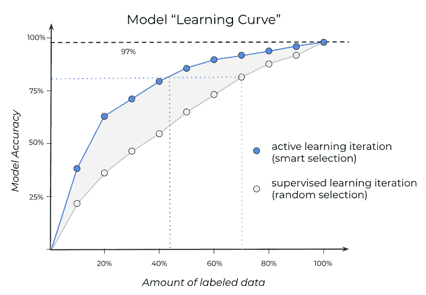

# 活跃学习简介

> 原文：[`www.kdnuggets.com/2018/10/introduction-active-learning.html`](https://www.kdnuggets.com/2018/10/introduction-active-learning.html)

 评论

**由 [Jennifer Prendki](https://www.linkedin.com/in/jennifer-prendki), Figure Eight 的机器学习副总裁**

随着数据收集和存储变得越来越便宜，数据科学家面临的数据量超过了他们能够分析的能力。而且这一趋势没有减缓的迹象：物联网设备的爆炸性增长以及新的内存密集型数据格式的出现，使得数据专业人员在原始数据的海洋中挣扎。

鉴于机器学习中最激动人心的进展需要大量数据，这确实是一个令人兴奋的时代。但这也给机器学习社区带来了全新的挑战：除非数据被标注，否则它对所有依赖监督学习方法的机器学习应用基本上是无用的。

### 数据标注：机器学习中的新瓶颈

过去十年中，人工智能最有前景的进展之一来自于深度学习模型的使用。虽然神经网络几十年前就被发现了，但它们的实际使用直到最近才得以实现，这要归功于数据量和计算能力的增加，而旧硬件根本无法提供这些。由于大多数深度学习算法使用监督学习方法且对数据需求量大，因此现在机器学习中的新瓶颈不再是数据的收集，而是标注过程的速度和准确性。毕竟，我们大多数人都熟悉“垃圾进，垃圾出”的格言。除非你拥有高质量的数据来训练模型，否则模型的性能最终会受到影响。

由于获取未标记实例现在基本上是免费的，赢得人工智能竞赛现在取决于拥有最快、最具扩展性、灵活和可靠的方式来获取数据集的质量标签。标注大量数据已经成为一个关键问题，因为待标注的数据量变得如此庞大，甚至全球所有的人工劳动都无法满足需求。例如，即使每个边界框标注几秒钟，单靠一个人对一个 10 秒钟的视频进行行人标注也可能需要几个小时，这就是为什么越来越多的公司现在专注于构建机器学习算法以自动化标注过程。单纯的人力方法根本无法扩展。

但数据的*数量*并不是唯一的问题。获取标签也往往耗时（例如，当注释员被要求对较长文档的主题进行标注时），经常容易出错（有时也具有主观性），费用昂贵（例如，“标注”患者记录为癌症阳性可能需要 MRI 扫描或其他昂贵的医学检查，或验证石油存在可能需要钻探），甚至可能很危险（例如，在地雷探测的情况下）。

### 更快标注与更聪明标注

为应对对高质量注释的急剧需求，一种人机协作的 AI 方法，其中人类注释员验证机器学习算法的输出，看起来是一种有前途的方法。它不仅可以加快处理速度，还能提高质量，因为人类干预有助于弥补算法的不准确性。

尽管这种蛮力方法有时是最佳途径，但另一个方法在 ML 社区中正在慢慢获得更多关注：即仅标注最重要的数据实例。作为数据科学家，我们习惯于认为更多的数据等于更高的模型准确率，但虽然这绝对正确，但也要承认并非所有数据都同等重要，因为并非所有例子都包含相同数量的信息。

**图 1：应对新兴的大标签危机的两种方法**

确定模型学习的最佳实例可以发生在两个不同的时间：要么在模型构建之前，要么在模型训练期间。前者通常称为优先级排序，而后者称为主动学习。

### 什么是主动学习？

尽管在流行的 ML 博客中覆盖率较低，但主动学习实际上在许多现代 ML 问题中得到了令人惊讶的充分激励，特别是当标签难以获得、耗时或昂贵时。

在主动学习中，学习算法被允许从尚未标注的实例池中主动选择下一步要标注的样本。该概念背后的基本信念是，如果机器学习算法能够选择它想学习的数据，它可能在使用较少的训练标签的情况下实现更好的准确性。这种算法被称为**主动学习者**。主动学习者可以在训练过程中动态提出查询，通常以未标注的数据实例的形式，由被称为**oracle**的人类注释员进行标注。因此，主动学习是人机协作范式成功的最有力示例之一。

**图 2：正如预期的那样，训练模型所需的数据越多，准确度越高，无论是否使用主动学习方法。然而，使用主动学习时，可以用显著更少的数据达到特定的准确度；在这个例子中，仅使用 45%的可用数据总量就可以实现 80%的准确度，而在常规监督学习的情况下则需要 70%。**

### 主动学习是如何工作的？

主动学习可以通过不同的**场景**来实现。本质上，决定是否查询特定标签归结为判断获取标签的收益是否抵消了收集该信息的成本。实际上，这个决策可以根据科学家是否有有限的预算或只是试图最小化标记费用的不同而采取几种形式。总体而言，主动学习可以分为三种不同的类别：

**基于流的选择性采样场景**涉及确定询问数据集中某个特定未标记条目的标签是否足够有益。随着模型的训练和数据实例的呈现，它会立即决定是否需要查看标签。这种方法的缺点自然在于没有保证数据科学家会保持在其预算范围内。

**基于池的采样场景**也是最为人知的一个。它尝试在选择最佳查询或一组最佳查询之前评估整个数据集。主动学习者通常最初在一个完全标记的数据子集上进行训练，从而生成模型的第一个版本，该模型随后用于识别哪些实例对下一次迭代（或主动学习循环）注入训练集最有益。其最大的缺点之一在于其内存需求非常高。

**成员查询合成场景**可能并不适用于所有情况，因为它涉及生成合成数据。在这种场景下，学习者可以构造自己的例子进行标记。这种方法在生成数据实例较为容易时，对于解决冷启动问题（如搜索引擎中的问题）是非常有前途的。

主动学习与强化学习有何不同？

尽管强化学习和主动学习都可以减少模型所需的标签数量，但它们是非常不同的概念。

一方面，我们有强化学习。强化学习是一种目标导向的学习方法，受到行为心理学的启发，它允许你从环境中获得输入。因此，强化学习意味着代理在使用过程中会变得更好：它在使用中学习。当我们人类从错误中学习时，我们实际上是在进行一种强化学习方法。没有实际的训练阶段；而是代理通过试错过程使用预定的奖励函数来学习，该函数反馈关于特定动作的效果如何。技术上讲，强化学习不需要提供数据，而是随着进程生成自己的数据。

主动学习，另一方面，更接近于传统的监督学习。实际上，它是一种半监督学习（同时使用标注数据和未标注数据）。这一概念的核心思想是，并非所有数据的价值相同，标注一个小样本的数据可能会达到相同的准确性（如果不是更高），唯一的挑战是确定这个样本是什么。主动学习是指在训练阶段逐步动态地标注数据，以便让算法识别哪个标签对其学习更有信息量，从而更快地学习。

### 如何决定标注哪一行？

用于确定下一个需要标注的数据实例的方法称为**查询策略**。下面列出的是那些最常用和研究的策略：

#### 不确定性采样

对于那些查询策略，首先在一个相对较小的标注数据样本上训练一个模型；然后将这个模型应用于数据集的（未标注的）其余部分。该算法基于通过推理步骤获得的信息选择下一个主动学习循环中需要标注的实例。

在这些策略中，最受欢迎的是**最小置信度**策略，其中模型选择那些置信度最低的实例进行标注。另一种常见策略叫做**边际采样**：在这种情况下，算法选择那些两个最可能的标签之间的边际较小的实例，这意味着分类器在区分这两个最可能的类别时遇到了困难。这两种策略旨在帮助模型在特定类别之间进行区分，并且在减少特定分类错误方面表现出色。然而，如果目标函数是减少对数损失，则通常**基于熵**的方法更为合适，在这种方法中，学习者简单地查询模型在预测中具有最高输出方差的未标注实例。

#### 查询委员会（即，QBC）

使用这些策略，对相同标记训练集的不同模型进行训练，并用于推断其余（尚未标记）数据。对于观察到最大分歧的实例，被认为是最具信息性的。这一框架的核心思想是最小化版本空间，即与当前标记训练数据一致的假设集合。

#### 预期影响

这些查询策略考察新标签的增加对模型整体性能的影响。**期望模型变化**策略旨在识别那些如果已知标签将对当前模型产生最大变化的实例。**期望误差减少**策略衡量的不是模型可能发生的变化量，而是模型的泛化误差可能减少的量。这种策略面临的挑战之一是，它也是最计算上昂贵的查询框架。由于最小化期望损失函数通常没有封闭形式的解，因此使用**方差减少**方法作为代理。

总的来说，这些方法学将输入空间整体考虑，而不是像不确定性采样或 QBC 那样关注个别实例，这使得它们在选择离群点时具有明显的优势。

#### 密度加权方法

之前的框架描述了那些识别最具信息性的实例的策略，这些实例被认为是不确定性最高的。然而，另一种看待问题的方法是，数据集中最有价值的实例不一定是那些不确定性最大的，而是那些最能代表数据底层分布的实例：这就是**信息密度**框架的核心思想。

### 性能与限制

超过 90%的进行过主动学习工作的研究者声称他们的期望得到或完全或部分满足。这非常令人鼓舞，但人们不禁想知道其他情况下发生了什么。

现实情况是，主动学习仍未被很好地理解。例如，有一些关于 NER 的[深度主动学习的有前景的工作](https://arxiv.org/pdf/1707.05928.pdf)，但[许多重大问题仍然存在](http://burrsettles.com/pub/settles.activelearning.pdf)。例如，几乎没有研究预测特定任务或数据集是否特别容易从主动学习方法中受益。

最终，主动学习是一种特定的半监督学习情况，这类算法已被证明对偏见非常敏感，特别是因为它们容易自我满足于从基于相对较小数据集训练的模型中识别出的模式中得到的初始信念。随着高效标注成为机器学习中越来越关键的组成部分，可以预期未来几年将会有更多关于这个主题的研究成果发表。

**简介**: [詹妮弗·普伦基](https://www.linkedin.com/in/jennifer-prendki)是一位数据科学领袖和数据策略师，她非常享受设想数据科学的未来并推广它。詹妮弗特别擅长培养和管理早期阶段的数据团队，并且非常擅长管理混合团队，包括产品经理、数据科学家、数据分析师和各类工程师（前端、后端、系统等）。

**相关:**

+   [如何将主动学习应用于您的企业](https://www.kdnuggets.com/2018/09/figure-eight-active-learning-work-your-enterprise.html)

+   [机器学习训练数据的基本指南](https://www.kdnuggets.com/2018/08/figure-eight-essential-guide-training-data-machine-learning.html)

+   [2018 年数据科学家报告已发布](https://www.kdnuggets.com/2018/08/figure-eight-2018-data-scientist-report.html)

* * *

## 我们的前三推荐课程

 1\. [谷歌网络安全证书](https://www.kdnuggets.com/google-cybersecurity) - 快速进入网络安全职业轨道。

 2\. [谷歌数据分析专业证书](https://www.kdnuggets.com/google-data-analytics) - 提升您的数据分析水平

 3\. [谷歌 IT 支持专业证书](https://www.kdnuggets.com/google-itsupport) - 支持您的组织在 IT 领域

* * *

### 相关主题

+   [KDnuggets 新闻，4 月 27 日：关于带代码的论文简要介绍；…](https://www.kdnuggets.com/2022/n17.html)

+   [统计学习导论，Python 版：免费书籍](https://www.kdnuggets.com/2023/07/introduction-statistical-learning-python-edition-free-book.html)

+   [深度学习库介绍：PyTorch 和 Lightning AI](https://www.kdnuggets.com/introduction-to-deep-learning-libraries-pytorch-and-lightning-ai)

+   [回到基础第 3 周：机器学习导论](https://www.kdnuggets.com/back-to-basics-week-3-introduction-to-machine-learning)

+   [使用 PyCaret 进行二分类入门](https://www.kdnuggets.com/2021/12/introduction-binary-classification-pycaret.html)

+   [使用 PyCaret 在 Python 中进行聚类入门](https://www.kdnuggets.com/2021/12/introduction-clustering-python-pycaret.html)
