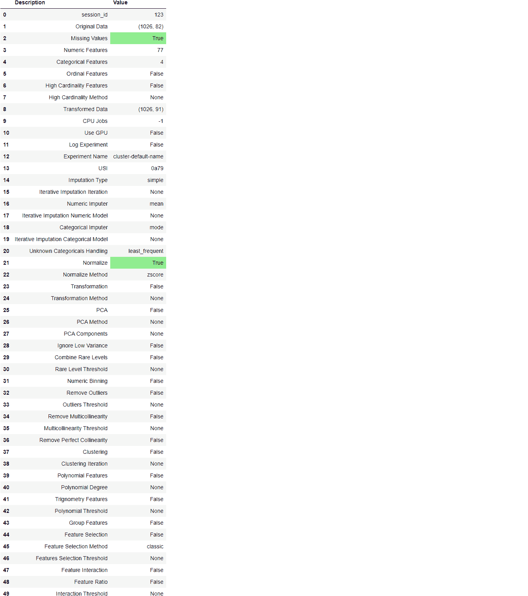
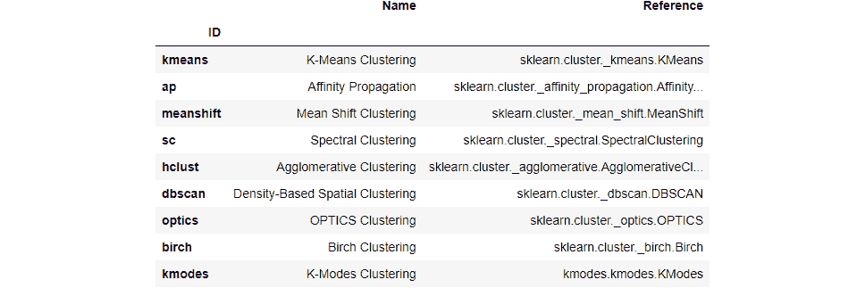
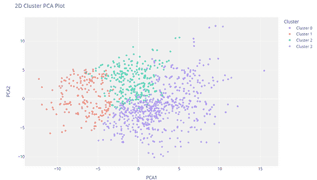
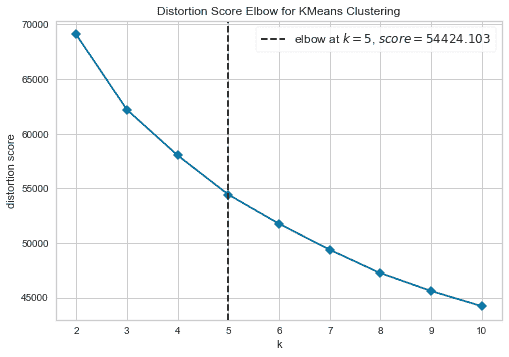
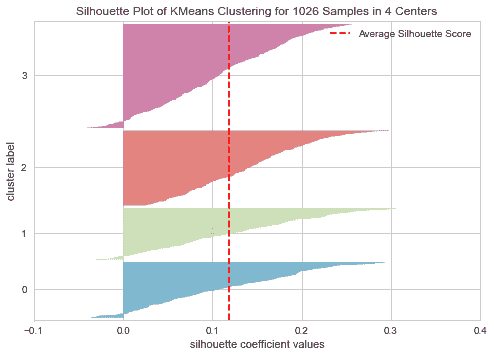
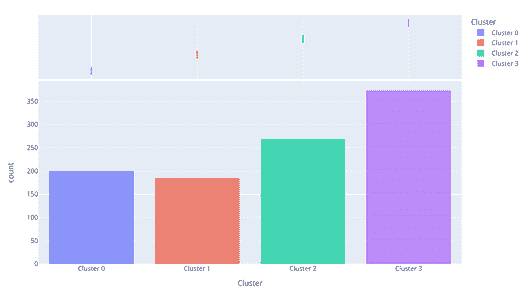
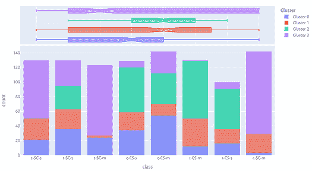
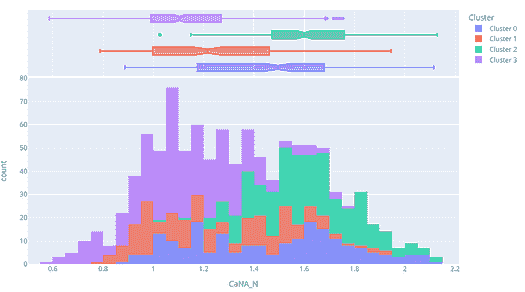
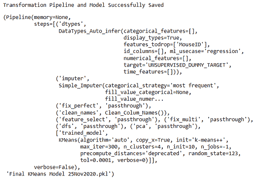

# 使用 PyCaret 进行 Python 中的集群分析简介

> 原文：[`www.kdnuggets.com/2021/12/introduction-clustering-python-pycaret.html`](https://www.kdnuggets.com/2021/12/introduction-clustering-python-pycaret.html)

评论

**由 [Moez Ali](https://www.linkedin.com/in/profile-moez/)，PyCaret 创始人及作者**  


图片来源：[Paola Galimberti](https://unsplash.com/@paolaccia?utm_source=medium&utm_medium=referral) 在 [Unsplash](https://unsplash.com/?utm_source=medium&utm_medium=referral)

## 1\. 介绍

[PyCaret](https://www.pycaret.org/) 是一个开源低代码机器学习库，旨在自动化机器学习工作流程。它是一个端到端的机器学习和模型管理工具，可以显著加快实验周期，提高生产力。

与其他开源机器学习库相比，PyCaret 是一个低代码库，可以用几行代码替代数百行代码。这使得实验速度和效率成倍提高。PyCaret 本质上是多个机器学习库和框架（如 scikit-learn、XGBoost、LightGBM、CatBoost、spaCy、Optuna、Hyperopt、Ray 等）的 Python 封装器。

PyCaret 的设计和简洁性受到市民数据科学家新兴角色的启发，这一术语最早由 Gartner 提出。市民数据科学家是能够执行既简单又中等复杂的分析任务的高级用户，这些任务以前需要更多的技术专长。

要了解更多关于 PyCaret 的信息，可以查看官方 [网站](https://www.pycaret.org/) 或 [GitHub](https://www.github.com/pycaret/pycaret)。

## 2\. 教程目标

在本教程中，我们将学习：

+   **获取数据：** 如何从 PyCaret 仓库导入数据。

+   **设置环境：** 如何在 PyCaret 的无监督 [集群模块](https://pycaret.readthedocs.io/en/latest/api/clustering.html) 中设置实验。

+   **创建模型：** 如何训练无监督集群模型，并为训练数据集分配集群标签以便进一步分析。

+   **绘图模型：** 如何使用各种图表（肘部法、轮廓图、分布图等）分析模型性能。

+   **预测模型：** 如何根据训练好的模型为新的未见数据集分配集群标签。

+   **保存/加载模型：** 如何保存/加载模型以供将来使用。

## 3\. 安装 PyCaret

安装很简单，只需几分钟。PyCaret 的默认安装通过 pip 只安装 `requirements.txt` 文件中列出的硬依赖。

```py
pip install pycaret
```

要安装完整版：

```py
pip install pycaret[full]
```

## 4\. 什么是集群？

聚类是将一组对象分组的任务，使得同一组（称为簇）中的对象彼此之间比与其他组中的对象更相似。它是一种探索性数据挖掘活动，是统计数据分析中常用的技术，广泛应用于许多领域，包括机器学习、模式识别、图像分析、信息检索、生物信息学、数据压缩和计算机图形学。聚类的一些常见现实生活应用包括：

+   基于购买历史或兴趣进行客户细分，以设计有针对性的营销活动。

+   根据标签、主题和文档内容将文档分类到多个类别中。

+   在社会科学/生活科学实验中分析结果，以发现数据中的自然分组和模式。

## 5. PyCaret 中聚类模块概述

[PyCaret 的聚类模块](https://pycaret.readthedocs.io/en/latest/api/clustering.html) (`pycaret.clustering`) 是一个无监督机器学习模块，用于将一组对象分组，使得同一组（称为簇）中的对象彼此之间比与其他组中的对象更相似。

PyCaret 的聚类模块提供了多个预处理功能，可以在通过 `setup` 函数初始化设置时进行配置。它有超过 8 种算法和多种图形来分析结果。PyCaret 的聚类模块还实现了一个独特的函数 `tune_model`，允许你调整聚类模型的超参数，以优化监督学习目标，如分类的 `AUC` 或回归的 `R2`。

## 6. 教程数据集

在本教程中，我们将使用来自 UCI 的数据集，称为 [**Mice Protein Expression**](https://archive.ics.uci.edu/ml/datasets/Mice+Protein+Expression)。该数据集包含 77 种蛋白质的表达水平，这些蛋白质在皮层的核分数中产生了可检测的信号。数据集每种蛋白质包含总共 1080 次测量。每次测量可以视为一个独立的样本（小鼠）。

## 数据集引用：

Higuera C, Gardiner KJ, Cios KJ (2015) 自组织特征图识别在小鼠唐氏综合症模型中学习关键的蛋白质。PLoS ONE 10(6): e0129126. [Web Link] journal.pone.0129126

你可以从原始来源[**找到这里**](https://archive.ics.uci.edu/ml/datasets/Mice+Protein+Expression)下载数据，并使用 pandas[**（学习如何）**](https://pandas.pydata.org/pandas-docs/stable/reference/api/pandas.read_csv.html)加载它，或者你可以使用 PyCaret 的数据仓库，通过 `get_data()` 函数加载数据（这将需要互联网连接）。

```py
from pycaret.datasets import get_data
dataset = get_data('mice')
```


```py
**# check the shape of data**
dataset.shape>>> (1080, 82)
```

为了演示 `predict_model` 函数在未见数据上的使用，原始数据集中已保留了 5%（54 条记录）的样本，以便在实验结束时用于预测。

```py
data = dataset.sample(frac=0.95, random_state=786)
data_unseen = dataset.drop(data.index)

data.reset_index(drop=True, inplace=True)
data_unseen.reset_index(drop=True, inplace=True)

print('Data for Modeling: ' + str(data.shape))
print('Unseen Data For Predictions: ' + str(data_unseen.shape))**>>> Data for Modeling: (1026, 82)
>>> Unseen Data For Predictions: (54, 82)**
```

## 8. 在 PyCaret 中设置环境

`setup`函数在 PyCaret 中初始化环境并创建用于建模和部署的转换管道。`setup`必须在执行 pycaret 中的任何其他函数之前调用。它只需要一个必需的参数：一个 pandas 数据框。所有其他参数都是可选的，可用于自定义预处理管道。

当`setup`执行时，PyCaret 的推断算法将基于某些属性自动推断所有特征的数据类型。数据类型应该被正确推断，但这并不总是如此。为了解决这个问题，PyCaret 在执行`setup`时会显示提示，要求确认数据类型。如果所有数据类型正确，可以按回车键；如果要退出设置，可以输入`quit`。

确保数据类型的正确性在 PyCaret 中非常重要，因为它会自动执行多个特定类型的预处理任务，这些任务对机器学习模型至关重要。

或者，你也可以使用`numeric_features`和`categorical_features`参数在`setup`中预先定义数据类型。

```py
from pycaret.clustering import *

exp_clu101 = setup(data, normalize = True, 
                   ignore_features = ['MouseID'],
                   session_id = 123)
```



一旦`setup`成功执行，它会显示包含有关实验的重要信息的网格。大多数信息与在`setup`执行时构建的预处理管道相关。虽然这些特征的大多数超出了本教程的范围，但需要注意以下几点：

+   **session_id：**一个伪随机数，在所有函数中作为种子分布，以便后续的可重复性。如果没有传递`session_id`，则会自动生成一个随机数，并分配给所有函数。在此实验中，`session_id`设置为`123`以便后续的可重复性。

+   **缺失值：**当原始数据中存在缺失值时，这将显示为 True。请注意，信息网格中的`Missing Values`显示为`True`，因为数据包含缺失值，这些缺失值通过`mean`自动填充数值特征，通过`constant`自动填充分类特征。填充方法可以通过`numeric_imputation`和`categorical_imputation`参数在`setup`函数中更改。

+   **原始数据：**显示数据集的原始形状。在此实验中，(1026, 82)表示 1026 个样本和 82 个特征。

+   **转换后的数据：**显示转换后的数据集的形状。请注意，原始数据集的形状 (1026, 82) 被转换为 (1026, 91)。特征数量增加是由于数据集中分类特征的编码。

+   **数值特征：**推断为数值型的特征数量。在此数据集中，82 个特征中的 77 个被推断为数值型。

+   **分类特征：** 推断为分类的特征数量。在此数据集中，82 个特征中有 5 个被推断为分类特征。还要注意，我们通过`ignore_feature`参数忽略了一个分类特征`MouseID`，因为它是每个样本的唯一标识符，我们不希望在模型训练过程中考虑它。

请注意，一些对建模至关重要的任务会自动处理，例如缺失值填补、分类编码等。`setup`函数中的大多数参数是可选的，用于自定义预处理管道。这些参数超出了本教程的范围，但我会在以后写更多内容。

## 9\. 创建模型

在 PyCaret 中训练聚类模型很简单，类似于在 PyCaret 的监督学习模块中创建模型的方式。使用`create_model`函数创建一个聚类模型。此函数返回一个训练好的模型对象和一些无监督的度量。请参见下面的示例：

```py
kmeans = create_model('kmeans')
```


```py
print(kmeans)**>>> OUTPUT** KMeans(algorithm='auto', copy_x=True, init='k-means++', max_iter=300,
       n_clusters=4, n_init=10, n_jobs=-1, precompute_distances='deprecated',
       random_state=123, tol=0.0001, verbose=0)
```

我们使用`create_model`训练了一个无监督的 K-Means 模型。请注意，`n_clusters`参数被设置为`4`，这是当你未向`num_clusters`参数传递值时的默认值。在下面的示例中，我们将创建一个具有 6 个簇的`kmodes`模型。

```py
kmodes = create_model('kmodes', num_clusters = 6)
```


```py
print(kmodes)**>>> OUTPUT** KModes(cat_dissim=<function matching_dissim at 0x00000168B0B403A0>, init='Cao',
       max_iter=100, n_clusters=6, n_init=1, n_jobs=-1, random_state=123,
       verbose=0)
```

要查看模型库中可用模型的完整列表，请检查文档或使用`models`函数。

```py
models()
```



## 10\. 指定模型

现在我们已经训练了一个模型，我们可以通过使用`assign_model`函数将聚类标签分配给我们的训练数据集（1026 个样本）。

```py
kmean_results = assign_model(kmeans)
kmean_results.head()
```


请注意，原始数据集中添加了一个名为`Cluster`的新列。

请注意，结果中还包含了我们在`setup`过程中实际上删除的`MouseID`列。无需担心，它不会用于模型训练，而只是当调用`assign_model`时，才会被添加到数据集中。

## 11\. 绘制模型

`plot_model`函数用于分析聚类模型。此函数接受一个训练好的模型对象，并返回一个图表。

## 11.1 聚类 PCA 图

```py
plot_model(kmeans)
```



聚类标签会自动着色并显示在图例中。当你将鼠标悬停在数据点上时，你会看到额外的特征，这些特征默认使用数据集的第一列（在本例中是 MouseID）。你可以通过传递`feature`参数来更改此设置，并且如果你希望在图上打印标签，可以将`label`设置为`True`。

## 11.2 肘部图

```py
plot_model(kmeans, plot = 'elbow')
```



肘部法则是一种启发式方法，用于解释和验证簇内分析的一致性，旨在帮助找到数据集中的适当簇数。在这个示例中，上面的肘部图建议 `5` 是最优的簇数。

[**了解更多关于肘部图的信息**](https://blog.cambridgespark.com/how-to-determine-the-optimal-number-of-clusters-for-k-means-clustering-14f27070048f)

## 11.3 轮廓图

```py
plot_model(kmeans, plot = 'silhouette')
```



Silhouette（轮廓系数）是一种解释和验证数据簇内部一致性的方法。该技术提供了一个简洁的图形表示，显示了每个对象被分类的效果。换句话说，轮廓值是衡量一个对象与其自身簇（凝聚度）相比，与其他簇（分离度）的相似程度。

[**了解更多关于轮廓图的信息**](https://scikit-learn.org/stable/auto_examples/cluster/plot_kmeans_silhouette_analysis.html)

## 11.4 分布图

```py
plot_model(kmeans, plot = 'distribution')
```



分布图显示了每个簇的大小。当将鼠标悬停在条形上时，会看到分配到每个簇的样本数量。从上面的例子中，我们可以观察到簇 3 拥有最多的样本。我们还可以使用 `distribution` 图来查看簇标签与任何其他数值或类别特征的分布情况。

```py
plot_model(kmeans, plot = 'distribution', feature = 'class')
```



在上述示例中，我们使用了 `class` 作为特征，因此每个条形代表一个 `class`，并用簇标签（右侧图例）着色。我们可以观察到 `t-SC-m` 和 `c-SC-m` 类别大多由 `Cluster 3` 主导。我们也可以使用相同的图来查看任何连续特征的分布。

```py
plot_model(kmeans, plot = 'distribution', feature = 'CaNA_N')
```



## 12\. 在未见数据上进行预测

`predict_model` 函数用于为新的未见数据集分配簇标签。我们现在将使用训练好的 `kmeans` 模型来预测存储在 `data_unseen` 中的数据。这个变量在教程开始时创建，包含了原始数据集中从未暴露于 PyCaret 的 54 个样本。

```py
unseen_predictions = predict_model(kmeans, data=data_unseen)
unseen_predictions.head()
```


## 13\. 保存模型

我们现在已经完成了实验，通过使用我们的 `kmeans` 模型在未见数据上预测标签。

这标志着我们实验的结束，但还有一个问题需要回答：当你有更多新数据需要预测时会发生什么？你需要重新进行整个实验吗？答案是否定的，PyCaret 的内置函数 `save_model` 允许你保存模型及整个转换管道，以便以后使用。

```py
save_model(kmeans,’Final KMeans Model 25Nov2020')
```



要在未来某个日期在相同或不同环境中加载已保存的模型，我们可以使用 PyCaret 的 `load_model` 函数，然后轻松地将已保存的模型应用于新的未见数据进行预测。

```py
saved_kmeans = load_model('Final KMeans Model 25Nov2020')
new_prediction = predict_model(saved_kmeans, data=data_unseen)
new_prediction.head()
```


## 14\. 总结 / 下一步？

我们仅覆盖了[PyCaret 的聚类模块](https://pycaret.readthedocs.io/en/latest/api/clustering.html)的基础内容。在接下来的教程中，我们将深入探讨高级预处理技术，这些技术允许你完全自定义你的机器学习管道，是任何数据科学家必须了解的。

感谢阅读 [????](https://emojipedia.org/folded-hands/)

## 重要链接

⭐ [教程](https://github.com/pycaret/pycaret/tree/master/tutorials) 新接触 PyCaret？查看我们的官方笔记本！

???? [示例笔记本](https://github.com/pycaret/pycaret/tree/master/examples) 由社区创建。

???? [博客](https://github.com/pycaret/pycaret/tree/master/resources) 贡献者的教程和文章。

???? [文档](https://pycaret.readthedocs.io/en/latest/index.html) PyCaret 的详细 API 文档。

???? [视频教程](https://www.youtube.com/channel/UCxA1YTYJ9BEeo50lxyI_B3g) 我们来自各种活动的视频教程。

???? [讨论](https://github.com/pycaret/pycaret/discussions) 有问题？与社区和贡献者互动。

????️ [更新日志](https://github.com/pycaret/pycaret/blob/master/CHANGELOG.md) 更改和版本历史。

???? [路线图](https://github.com/pycaret/pycaret/issues/1756) PyCaret 的软件和社区发展计划。

**个人简介：[Moez Ali](https://www.linkedin.com/in/profile-moez/)** 撰写关于 PyCaret 及其实际应用的文章，如果你希望自动获取通知，可以关注 Moez 的 [Medium](https://medium.com/@moez-62905)、[LinkedIn](https://www.linkedin.com/in/profile-moez/) 和 [Twitter](https://twitter.com/moezpycaretorg1)。

[原文](https://towardsdatascience.com/introduction-to-clustering-in-python-with-pycaret-5d869b9714a3)。已获转载许可。

**相关：**

+   使用 PyCaret 的新时间序列模块

+   使用 PyCaret 进行二分类介绍

+   初学者的端到端机器学习指南

* * *

## 我们的前三大课程推荐

 1\. [谷歌网络安全证书](https://www.kdnuggets.com/google-cybersecurity) - 快速进入网络安全职业道路。

 2\. [谷歌数据分析专业证书](https://www.kdnuggets.com/google-data-analytics) - 提升你的数据分析技能

 3\. [谷歌 IT 支持专业证书](https://www.kdnuggets.com/google-itsupport) - 支持你的组织的 IT 工作

* * *

### 更多相关内容

+   [释放聚类：理解 K-Means 聚类](https://www.kdnuggets.com/2023/07/clustering-unleashed-understanding-kmeans-clustering.html)

+   [使用 PyCaret 的二分类介绍](https://www.kdnuggets.com/2021/12/introduction-binary-classification-pycaret.html)

+   [揭示隐藏模式：层次聚类简介](https://www.kdnuggets.com/unveiling-hidden-patterns-an-introduction-to-hierarchical-clustering)

+   [宣布 PyCaret 3.0：开源、低代码的 Python 机器学习](https://www.kdnuggets.com/2023/03/announcing-pycaret-30-opensource-lowcode-machine-learning-python.html)

+   [开始使用 PyCaret](https://www.kdnuggets.com/2022/11/getting-started-pycaret.html)

+   [k-means 聚类的质心初始化方法](https://www.kdnuggets.com/2020/06/centroid-initialization-k-means-clustering.html)
