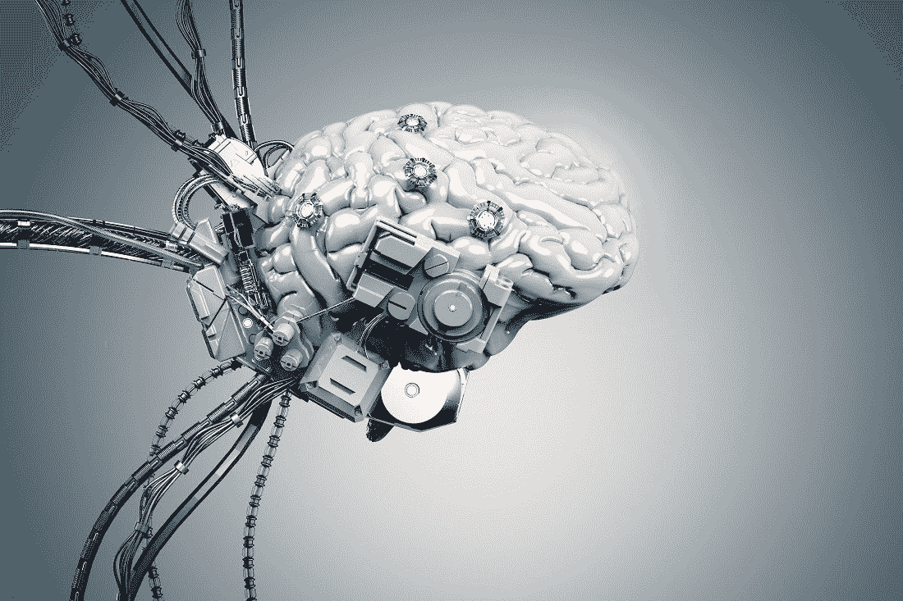
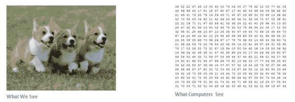
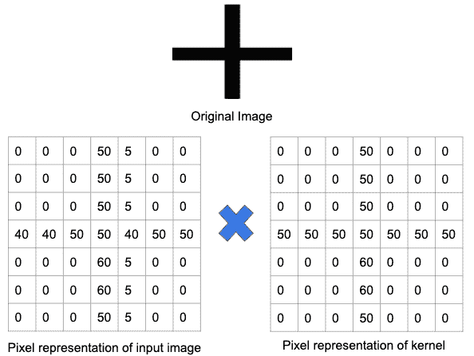
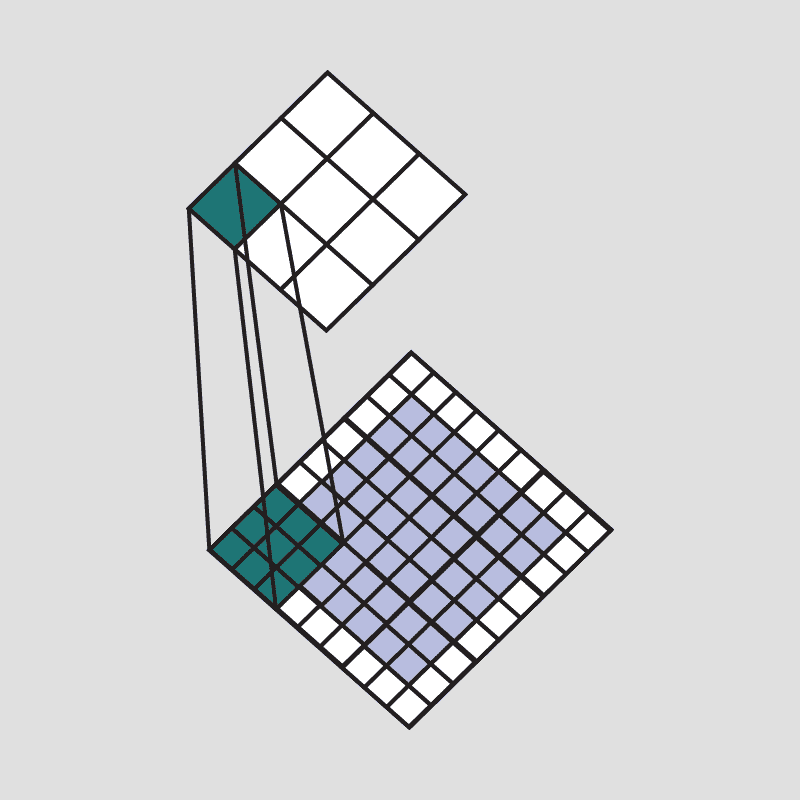
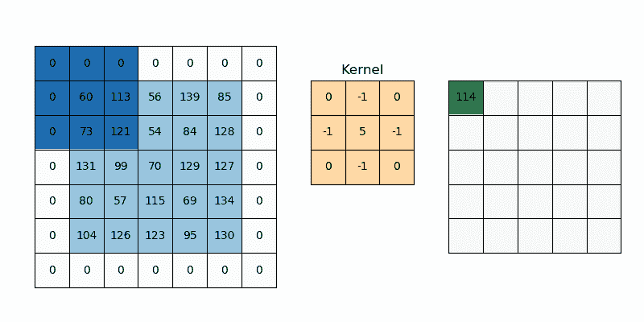
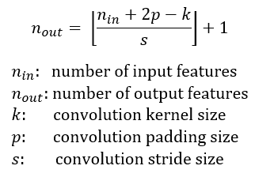
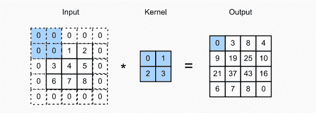
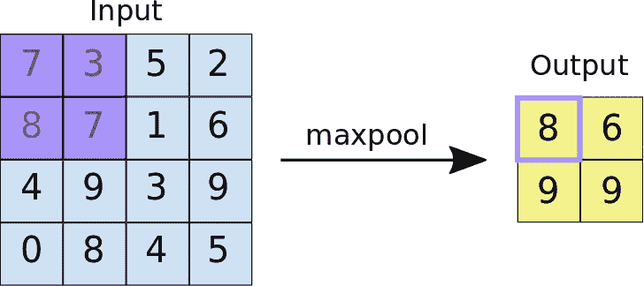
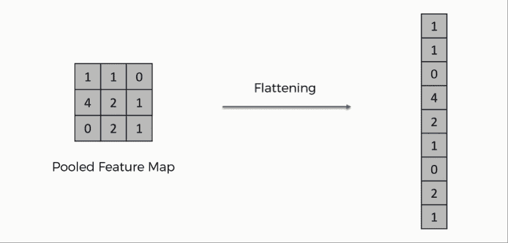
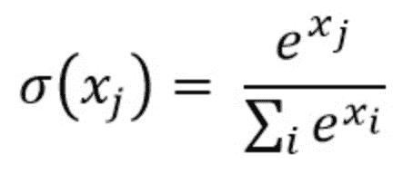

# 卷积神经网络简介

> 原文：[`www.kdnuggets.com/2020/06/introduction-convolutional-neural-networks.html`](https://www.kdnuggets.com/2020/06/introduction-convolutional-neural-networks.html)

评论

[致谢](https://nulltx.com/deep-neural-network-creates-surprisingly-accurate-simulations-of-the-universe/)

* * *

## 我们的前三个课程推荐

 1\. [Google 网络安全证书](https://www.kdnuggets.com/google-cybersecurity) - 快速进入网络安全职业轨道

 2\. [Google 数据分析专业证书](https://www.kdnuggets.com/google-data-analytics) - 提升你的数据分析能力

 3\. [Google IT 支持专业证书](https://www.kdnuggets.com/google-itsupport) - 支持你的组织的 IT

* * *

你是否想过面部识别如何在 [社交媒体](https://www.simplilearn.com/essentials-of-social-media-marketing-article) 上工作，或者对象检测如何在自动驾驶汽车中发挥作用，或者疾病检测如何通过视觉影像在医疗保健中完成？这一切都得益于卷积神经网络（CNN）。

### 介绍

就像孩子学习识别对象一样，我们需要向算法展示数百万张图片，才能使其对输入进行归纳并对从未见过的图像进行预测。

计算机的“视野”与我们不同。它们的世界仅由数字构成。每个图像可以表示为二维的数字数组，称为像素。

[致谢](https://www.commonlounge.com/discussion/c9975025c9ff473c8f9ed2c4b1c3ea6a)

但它们以不同的方式感知图像，并不意味着我们不能训练它们像我们一样识别模式。我们只需要考虑图像的不同之处。

要教一个算法识别图像中的对象，我们使用一种特定类型的 [人工神经网络](https://medium.com/@daphn3cor/building-a-3-layer-neural-network-from-scratch-99239c4af5d3)：卷积神经网络（CNN）。它们的名称源自网络中一种重要操作叫做 [卷积](https://en.wikipedia.org/wiki/Convolution)。

### 卷积神经网络

**卷积神经网络（CNN 或 ConvNets）** 是普通的神经网络，假设输入是图像。它们用于分析和分类图像，通过相似性对图像进行聚类，并在框架内执行对象识别。例如，卷积神经网络（ConvNets 或 CNNs）用于识别面孔、个人、路标、肿瘤、鸭嘴兽以及视觉数据的许多其他方面。

### CNN 的生物学连接

当你第一次听到卷积神经网络这个术语时，你可能会想到与神经科学或生物学有关的东西，你的想法是对的。某种程度上。CNN 确实从视觉皮层中获得了生物学上的启发。视觉皮层有小区域的细胞对视觉场的特定区域敏感。

这个想法在 1962 年通过 Hubel 和 Wiesel 的一项引人入胜的实验得到了扩展（[视频](https://www.youtube.com/watch?v=Cw5PKV9Rj3o)），他们展示了大脑中的某些单个神经元细胞仅在特定方向的边缘存在时才会响应（或发放）。例如，一些神经元在暴露于垂直边缘时会发放，而在水平或对角边缘出现时也会发放。Hubel 和 Wiesel 发现所有这些神经元都以柱状结构组织在一起，并且它们能够共同产生视觉感知。系统内专门组件具有特定任务的这种思想（视觉皮层中的神经细胞寻找特定特征）也是机器使用的基础，并且是 CNN 的基础。

在你继续之前，如果你是深度学习的初学者，我强烈建议查看下面的文章，以便对神经网络有一个基本的理解。

**人工神经网络简介**

### 卷积神经网络如何学习？

图像由像素组成。每个像素由 0 到 255 之间的一个数字表示。因此，每个图像都有一个数字表示，这就是计算机能够处理图像的方式。

CNN 图像检测/分类中有 4 个主要操作。

1.  卷积

1.  激活图

1.  最大池化

1.  扁平化

1.  全连接层

### 1.1 卷积

卷积操作在 1D 的两个信号和 2D 的两幅图像上进行。数学上，卷积是两个函数的综合积分，展示了一个函数如何修改另一个函数：

卷积层的主要目的是检测图像中的特征或视觉特征，例如边缘、线条、颜色斑点等。这是一个非常有趣的特性，因为一旦它在图像的特定点学会了某个特征，它就能在图像的任何部分识别它。

CNN 使用**滤波器**（也称为**卷积核**、**特征检测器**）来检测图像中是否存在诸如边缘等特征。滤波器只是一个值矩阵，称为权重，经过训练以检测特定特征。滤波器在图像的每个部分移动，以检查是否存在其预期检测的特征。为了提供一个值，表示它对特定特征存在的信心，滤波器执行**卷积操作**，这是一种矩阵之间逐元素的乘积和求和。

当图像的某部分存在特征时，滤波器与该部分图像之间的卷积操作结果是一个高值的实数。如果特征不存在，结果值则较低。

在下图中，训练用于检测加号的滤波器被应用于图像的一部分。由于该部分图像包含了滤波器所寻找的相同加号，卷积操作的结果是一个大数值。

> **卷积（逐元素乘积和求和）** = (50*50)+(50*50)+(50*50)+(50*50)+(50*50)+(60*60)+(60*60)+(40*50)+(40*50)+(50*50)+(50*50)+(40*50)+(50*50)+(50*50) = **非常大的实数**

但是当相同的滤波器/核应用于具有显著不同边缘集合的图像部分时，卷积的输出会很小，这意味着没有明显的加号存在，逐元素乘积和求和将导致零或非常小的值。

因此，我们需要 N 个特征检测器来检测图像的不同曲线/边缘。

[特征检测实例](https://www.analyticssteps.com/blogs/convolutional-neural-network-cnn-graphical-visualization-code-explanation)

将该滤波器应用于整个图像的结果是一个称为**特征图或卷积特征**的输出矩阵，它存储了该滤波器在图像不同部分上的卷积结果。由于我们有多个滤波器，因此我们得到一个 3D 输出：每个滤波器一个 2D 特征图。滤波器必须具有与输入图像相同的通道数，以便进行逐元素乘法。

此外，可以通过使用**步幅**值，在不同的间隔上滑动滤波器到输入图像上。步幅值决定了滤波器在每一步移动的距离。

[滤波器在 2D 图像上的卷积](http://www.michaelfxu.com/neural%20networks%20series/neural-networks-pt3-cnn/)

我们可以确定给定卷积块的输出层数量：

### 1.2 填充

应用卷积层时一个棘手的问题是我们往往会丢失图像边缘的像素。由于我们通常使用小型核，对于任何给定的卷积，我们可能只会丢失几个像素，但随着我们应用许多连续的卷积层，这种丢失会逐渐积累。

> **填充是指在图像被 CNN 的核处理时，添加到图像上的像素数量。**

一个解决方案是通过在图像周围添加零（零填充）来帮助核处理图像，从而为核提供更多的覆盖图像的空间。对 CNN 处理的图像添加填充可以实现更准确的图像分析。

在输入图像的周围添加额外的零，以便捕获所有特征。

### 2.1 激活图

这些特征图必须经过非线性映射。特征图与偏置项相加，并通过非线性激活函数**ReLu**。激活函数的目的是将非线性引入网络中，因为图像由彼此不线性的不同对象组成，所以图像具有高度的非线性。

### 2.2 最大池化

ReLU 之后是一个池化步骤，在该步骤中，CNN 对卷积特征进行下采样（以节省处理时间），同时还减少图像的大小。这有助于减少过拟合，如果 CNN 接收到过多的信息，特别是当这些信息在分类图像时不相关时，过拟合会发生。

有不同类型的池化，例如最大池化和最小池化。在**最大池化**中，窗口按照设定的步幅值在图像上滑动。在每一步，窗口内的最大值会被池化到输出矩阵中，因此得名最大池化。

这些值形成一个新的矩阵，称为**池化特征图**。

最大池化的一个额外好处是，它迫使网络关注少数神经元，而不是所有神经元，这对网络有正则化作用，使其不易过拟合训练数据，并希望能够很好地泛化。

### 3.3 扁平化

经过多个卷积层和下采样操作后，图像的 3D 表示会转换成一个特征向量，该特征向量会传入多层感知机以输出概率。下图描述了扁平化操作：

扁平化操作

行被连接起来形成一个长特征向量。如果存在多个输入层，则这些行也会连接起来形成一个更长的特征向量。

### 4\. 全连接层

在这一步，扁平化的特征图会传递给一个神经网络。这一步包括输入层、全连接层和输出层。全连接层类似于 ANN 中的隐藏层，但在这种情况下，它是完全连接的。输出层是我们得到预测类别的地方。信息会通过网络传递，并计算预测的误差。然后，误差会通过系统进行反向传播，以改进预测。

全连接层

密集层神经网络产生的最终输出通常不会加起来等于一。然而，这些输出必须被缩减到零到一之间的数值，这些数值代表每个类别的概率。这就是 Softmax 函数的作用。

因此，这一密集层的输出会传递给**Softmax 激活函数**，该函数将所有最终密集层的输出映射到一个元素总和为一的向量中：

其中 x 表示最终层输出中的每个元素。

全连接层的工作方式是查看前一层的输出（我们记得应该表示高层特征的激活图），并确定哪些特征与特定类别最相关。例如，如果程序预测某图像是狗，它将在表示高层特征如爪子或四条腿等的激活图中具有高值。同样，如果程序预测某图像是鸟，它将在表示高层特征如翅膀或喙等的激活图中具有高值。全连接层查看哪些高层特征最强烈地与特定类别相关，并具有特定的权重，以便当你计算权重和前一层之间的乘积时，可以得到不同类别的正确概率。

让我们总结一下 CNN 如何识别的整个过程：

+   图像中的像素被送入执行卷积操作的卷积层。

+   它生成一个卷积映射。

+   卷积映射应用于 ReLU 函数生成一个整流特征图。

+   图像经过多次卷积和 ReLU 层处理以定位特征。

+   使用不同的池化层和各种滤波器来识别图像的特定部分。

+   池化特征图被展平并馈送到全连接层以获得最终输出。

### 使用 Keras 实现 CNN

现在，让我们编写能够分类图像的代码。这段代码可以在大多数图像数据集上应用，只需稍作修改。因此，一旦你拥有图像数据，将它们分开到文件夹中并命名，例如训练集和测试集。

### 构建 CNN

在这一步，第一步是构建包含以下提到的层的卷积神经网络：

+   ***Sequential*** 用于初始化神经网络。

+   ***Convolution2D***用于构建处理图像的卷积网络。

+   ***MaxPooling2D*** 层用于添加池化层。

+   ***Flatten***是将池化特征图转换为传递到全连接层的单列的函数。

+   ***Dense***添加了一个全连接层到神经网络中。

一旦网络建立完成，然后使用 [随机梯度下降(SGD)](https://en.wikipedia.org/wiki/Stochastic_gradient_descent) 来编译/训练网络。梯度下降在我们有凸曲线时效果很好。但如果我们没有凸曲线，梯度下降会失败。因此，在随机梯度下降中，每次迭代随机选择一些样本，而不是整个数据集。

现在网络已经编译完毕，是时候用训练图像来训练 CNN 模型了。

**将 CNN 适配到图像上**

执行图像增强，与其用大量图像训练模型，不如用较少的图像进行训练，并通过不同角度和修改图像来训练模型。Keras 有一个**ImageDataGenerator**类，可以让用户以非常简单的方式动态执行图像增强。

一旦你用训练图像数据集训练了你的 CNN 网络，就该检查模型的准确性了。

### 结论

CNN 是最好的人工神经网络，它不仅用于图像建模，还有许多其他应用。基于 CNN 架构有很多改进版，如 [AlexNet、VGG、YOLO](https://medium.com/analytics-vidhya/cnns-architectures-lenet-alexnet-vgg-googlenet-resnet-and-more-666091488df5) 等。

好了，这篇文章就到这里，希望你们喜欢阅读。如果这篇文章对你们有帮助，我会很高兴。欢迎在评论区分享你们的评论/想法/反馈。

**感谢阅读！！！**

**简历：[Nagesh Singh Chauhan](https://www.linkedin.com/in/nagesh-singh-chauhan-6936bb13b/)** 是 CirrusLabs 的一个大数据开发人员。他在电信、分析、销售、数据科学等多个领域有超过 4 年的工作经验，专注于多个大数据组件。

[原文](https://levelup.gitconnected.com/introduction-to-convolutional-neural-networks-cnn-1ee504bc20c3)。经许可转载。

**相关：**

+   每个数据科学家应该阅读的 5 篇 CNN 论文

+   机器学习中的模型评估指标

+   主成分分析（PCA）的降维

### 更多相关内容

+   [卷积神经网络（CNNs）的图像分类](https://www.kdnuggets.com/2022/05/image-classification-convolutional-neural-networks-cnns.html)

+   [卷积神经网络的全面指南](https://www.kdnuggets.com/2023/06/comprehensive-guide-convolutional-neural-networks.html)

+   [用 PyTorch 构建卷积神经网络](https://www.kdnuggets.com/building-a-convolutional-neural-network-with-pytorch)

+   [在神经网络之前尝试的 10 件简单事情](https://www.kdnuggets.com/2021/12/10-simple-things-try-neural-networks.html)

+   [用 PyTorch 解释性神经网络](https://www.kdnuggets.com/2022/01/interpretable-neural-networks-pytorch.html)

+   [深度神经网络不会引导我们走向 AGI](https://www.kdnuggets.com/2021/12/deep-neural-networks-not-toward-agi.html)
