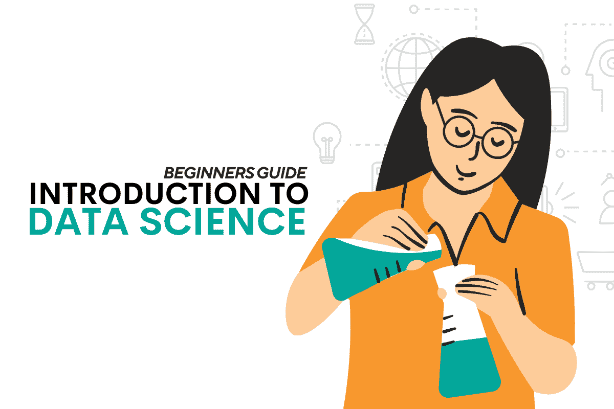
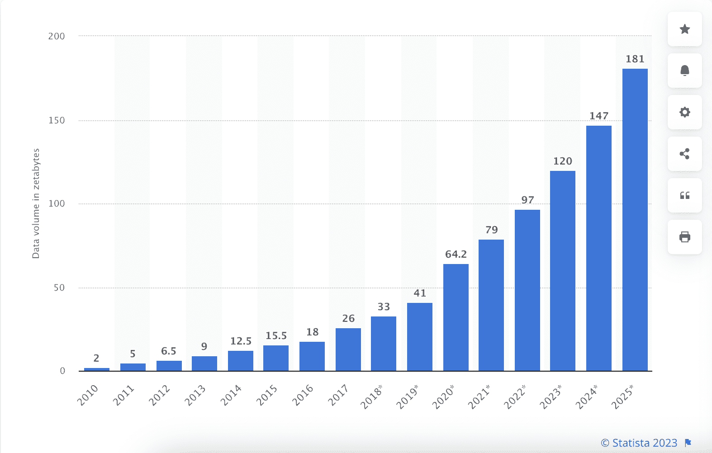
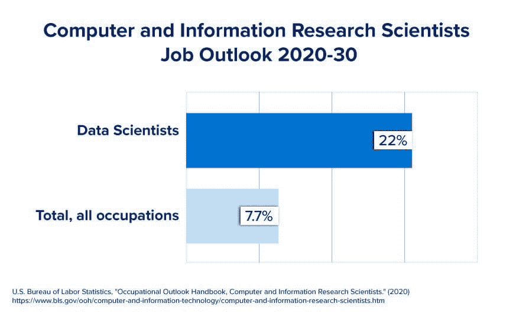

# 数据科学入门：初学者指南

> 原文：[`www.kdnuggets.com/2023/07/introduction-data-science-beginner-guide.html`](https://www.kdnuggets.com/2023/07/introduction-data-science-beginner-guide.html)

作者提供的图片

你在过去的二十年里没有生活在石头下，所以你可能或多或少知道什么是数据科学。你可能希望对其进行简要概述，以了解开始学习数据科学并找到工作所需的内容。

* * *

## 我们的三大课程推荐

 1\. [谷歌网络安全证书](https://www.kdnuggets.com/google-cybersecurity) - 快速进入网络安全职业轨道。

 2\. [谷歌数据分析专业证书](https://www.kdnuggets.com/google-data-analytics) - 提升你的数据分析技能

 3\. [谷歌 IT 支持专业证书](https://www.kdnuggets.com/google-itsupport) - 支持你的组织的 IT 需求

* * *

本文将为你提供的要点如下：

+   数据科学的核心点是：数据进入，洞察输出。数据科学家的工作是管理数据到洞察的每个阶段。

+   你需要哪些工具、技术和技能才能获得数据科学工作。

+   数据科学作为职业的整体状况。

如果这听起来像是你在寻找的内容，那就让我们深入了解吧。

# 什么是数据科学？

正如我之前所说，数据科学最好总结为一个数据到洞察的流程。作为数据科学家，无论你在哪家公司，你都会执行以下任务：

+   提取数据

+   清洗或处理数据

+   分析数据

+   识别模式或趋势

+   在数据上构建预测和统计模型

+   可视化和沟通数据

简而言之，你在解决问题、做出预测、优化过程和指导战略决策。

因为很少有公司能准确掌握数据科学家的工作内容，所以你可能还会有其他责任。一些雇主希望数据科学家在角色中加入信息安全或网络安全的职责。其他人可能期望数据科学家具备云计算、数据库管理、数据工程或软件开发的专长。要准备好担任多个角色。

这份工作之所以重要，不是因为《哈佛商业评论》称其为 21 世纪最性感的工作，而是因为数据量在不断增加，而很少有人知道如何将数据转化为洞察。作为数据科学家，你能看清全貌。

**全球从 2010 年到 2020 年创建、捕捉、复制和消费的数据/信息量，以及 2021 年至 2025 年的预测**

来源：[`www.statista.com/statistics/871513/worldwide-data-created/`](https://www.statista.com/statistics/871513/worldwide-data-created/)

# 数据科学中的关键概念

现在你已经了解了大概念。让我们来看看数据科学中的一些关键概念。如果你能设想数据到见解的流程，我将确定每个关键概念的作用。

## 数据处理

在流程的最开始，你得到的是一堆混合质量的数据。一个著名的（而且[不正确的](https://blog.ldodds.com/2020/01/31/do-data-scientists-spend-80-of-their-time-cleaning-data-turns-out-no/)）统计数据指出数据科学家花费 80%的时间来清理数据。虽然这可能没有那么高，但建立数据处理流程和调整数据是工作中的重要部分。

想象一下你是一个电商公司的数据科学家。在那里，数据处理可能涉及清理和转换客户交易数据，合并和调和来自不同来源的数据，如网站分析和客户关系管理（CRM）系统，以及处理缺失或不一致的数据。

你可能需要标准化格式，删除重复项或 NaN，并处理离群值或错误条目。这个过程确保数据准确、一致，并准备好进行分析。

## 数据探索和可视化

一旦数据被整理好，你现在可以开始查看它了。你可能认为数据科学家会立刻将统计模型应用于数据，但事实是模型种类繁多。首先，你需要了解你所拥有的数据类型。然后你可以寻找重要的见解和预测。

例如，如果你是 GitHub 的数据科学家，数据探索可能涉及分析平台上的用户活动和参与度。你可以查看提交次数、拉取请求和问题等指标，以及用户互动和合作情况。通过探索这些数据，你可以了解用户如何与平台互动，识别受欢迎的代码库，并发现软件开发实践中的趋势。

由于大多数人对图片的意义解析要优于对表格的解析，因此数据可视化也被纳入数据探索中。例如，作为 GitHub 的数据科学家，你可能会使用折线图来展示随时间变化的提交次数。柱状图可以用来比较平台上不同编程语言的流行度。网络图可以用来展示用户或代码库之间的合作关系。

来源：[`www.reddit.com/r/DataScienceMemes/comments/nzoogr/i_dont_like_gravy/`](https://www.reddit.com/r/DataScienceMemes/comments/nzoogr/i_dont_like_gravy/)

## 统计分析

在数据科学的数据到洞见流程的这一阶段，你已经完成了前两个部分的数据处理。数据已经到位，你正在对其进行探查和分析。现在是时候提取洞见了。最后，你可以对你的数据进行一些统计分析。

假设你是一家类似于 Hello Fresh 的公司的数据科学家。你可能会进行线性回归等统计分析，以了解影响客户流失的因素，使用聚类算法根据客户的偏好或行为对客户进行分组，或进行假设检验以确定营销活动的有效性。这些统计分析有助于揭示数据中的关系、模式和重要发现。

## 机器学习

数据科学家的酷炫之处在于他们可以预测未来。想象数据到洞见的流程。你对过去和现在的情况有了洞察。但你的老板可能会问：如果我们添加一种新产品会发生什么？如果我们在周一关门会怎么样？如果我们将一半的车队转换为电动车会怎样？

作为数据科学家，你像看水晶球一样利用机器学习创建智能预测。例如，假设你是物流公司 FedEx 的数据科学家。你可以利用历史运输数据、天气数据以及其他相关变量来开发预测模型。这些模型可以预测运输量、估计交货时间、优化路线规划或预测潜在的延误。

通过使用回归、时间序列分析或神经网络等机器学习算法，你可以预测添加一个新的配送中心对交货时间的影响，模拟不同操作变更对运输成本的影响，或预测对特定运输服务的客户需求。

## 沟通与商业智能

数据科学中最重要的概念不是机器学习或数据清洗，而是沟通。你需要将这些洞见呈现给公司中的决策者，他们可能对神经网络和梯度提升算法一无所知。沟通和商业敏锐度在数据科学中都是关键概念。

想象你是一家类似于 Meta 的公司的数据科学家。你刚刚发现用户参与指标与客户留存率之间有显著的相关性，但你需要将其与一位不熟悉“统计显著性”概念的营销副总裁分享。你还需要熟悉客户终生价值（CLV），以便能够解释你发现的相关性和重要性。

# 数据科学家的基本技能

我们已经覆盖了数据科学中的关键概念。现在让我们来看一下作为数据科学家你需要掌握的基本技能。如果你有兴趣了解更多，我在这里介绍了一些更具体的[数据科学家所需技能](https://www.stratascratch.com/blog/what-skills-do-you-need-as-a-data-scientist/?utm_source=blog&utm_medium=click&utm_campaign=kdn+intro+to+ds)。

## 编程语言、数据查询和数据可视化

很难对技能的重要性进行排名——数据科学家需要各种技能，这些技能都同等重要。也就是说，如果有一种技能是绝对不可或缺的，那一定是编码。

编码分为几个方面——你需要编程语言，通常是 R 或 Python（或两者）。你还需要数据检索和操作的查询语言，如 SQL（结构化查询语言）用于关系数据库。最后，你可能还需要了解其他语言或程序，如 Tableau 进行数据可视化，尽管值得一提的是，现在很多数据可视化是用 Python 或 R 完成的。

## 数学

还记得我之前提到的统计学吗？作为数据科学家，你需要知道如何进行数学计算。数据可视化只能走到一定程度，之后你需要一些实际的统计显著性。关键的数学技能包括：

+   概率与统计：概率分布、假设检验、统计推断、回归分析和方差分析（ANOVA）。这些技能使你能够做出可靠的统计判断，并从数据中得出有意义的结论。

+   线性代数：向量和矩阵运算、线性方程组的求解、矩阵分解、特征值和特征向量，以及矩阵变换。

+   微积分：你需要熟悉导数、梯度和优化等概念，以训练模型、优化和微调模型。

+   离散数学：如组合学、图论和算法。你将使用这些知识进行网络分析、推荐系统和算法设计。对于开发处理大规模数据的算法来说，这非常重要。

## 模型管理

让我们谈谈模型。作为数据科学家，你需要知道如何构建、部署和维护模型。这包括确保模型与现有基础设施的无缝集成，解决可扩展性和效率问题，并持续评估模型在实际场景中的表现。

在技术方面，这意味着你需要熟悉：

+   机器学习库：这些包括 Python 中的 scikit-learn、TensorFlow、PyTorch 或 Keras 进行深度学习，以及 XGBoost 或 LightGBM 进行梯度提升。

+   模型开发框架：如 Jupyter Notebook 或 JupyterLab，用于互动和协作的模型开发。

+   云平台：考虑使用亚马逊网络服务（AWS）、微软 Azure 或谷歌云平台（GCP）来部署和扩展机器学习模型。

+   自动化机器学习（AutoML）：Google AutoML、H2O.ai 或 DataRobot 自动化构建机器学习模型的过程，无需大量手动编码。

+   模型部署与服务：Docker 和 Kubernetes 通常用于将模型打包并部署为容器。这些工具使得模型可以在不同环境中部署和扩展。此外，像 Python 中的 Flask 或 Django 工具可以让你创建 Web API 来服务模型，并将其集成到生产系统中。

+   模型监控与评估：使用 Prometheus、Grafana 或 ELK（Elasticsearch、Logstash、Kibana）堆栈进行日志聚合和分析。这些工具有助于跟踪模型指标、检测异常，并确保模型随着时间的推移继续表现良好。

## 沟通

到目前为止，我们已经覆盖了“硬技能”。现在，让我们思考一下你需要什么软技能。如我在“概念”部分提到的，你需要的一项重要技能是沟通。以下是作为数据科学家你需要进行的一些沟通示例：

+   数据讲述：你需要将复杂的技术概念转化为清晰、简洁且引人入胜的叙述，这些叙述能够引起你的听众共鸣，包括你的分析的重要性及其对决策的影响。

+   可视化：是的，数据可视化在沟通技能中有一个小节。除了创建图表的技术能力，你还应该知道何时、何种类型以及如何谈论你的数据可视化。

+   协作与团队合作：没有数据科学家在孤立环境中工作。你将与数据工程师、业务分析师和领域专家合作。练习你的积极倾听和建设性反馈技能。

+   客户管理：这并非所有数据科学家的情况，但有时你会直接与客户或外部利益相关者合作。你需要培养强大的客户管理技能，包括理解他们的需求、管理期望以及定期提供项目进展更新。

+   持续学习与适应能力：最后但同样重要的是，你需要随时准备学习新事物。保持对领域最新进展的了解，并开放地获取新技能和知识。

## 商业头脑

这归结于在你业务的背景下了解一个数字的重要性。例如，你可能会发现人们在周日购买鸡蛋与天气之间存在高度显著的关系。但这对你的业务有何意义？

在这种情况下，你可能会进一步分析，发现周日鸡蛋购买的增加与晴朗的天气相关，这表明客户在天气良好时更可能参与户外活动或举办早午餐。这一洞察可以被超市或餐厅利用，以便相应地计划库存和促销活动。

通过将数据模式与业务结果联系起来，你可以提供战略指导和可操作的建议。在这个例子中，这可能涉及到在晴朗的周末优化与鸡蛋相关的营销活动，或探索与本地早午餐场所的合作。

# 数据科学工作流程

[数据科学家做什么](https://www.stratascratch.com/blog/what-does-a-data-scientist-do/?utm_source=blog&utm_medium=click&utm_campaign=kdn+intro+to+ds)？为了了解这一点，让我们看看数据科学项目中涉及的典型步骤：问题定义、数据收集、数据清理、探索性数据分析、模型构建、评估和沟通。

我将通过一个例子来说明每一步：在本节其余部分中，假设你作为一家电子商务公司的数据科学家，公司营销团队希望提高客户留存率。

## 1\. 问题定义：

这意味着你需要了解业务目标，明确问题陈述，并定义衡量客户留存的关键指标。

你将致力于识别导致客户流失的因素，并制定减少流失率的策略。

为了衡量客户留存，你需要定义关键指标，包括客户流失率、客户生命周期价值（CLV）、重复购买率或客户满意度评分。通过定义这些指标，你建立了一种量化的方法来跟踪和评估提高客户留存的策略效果。

## 2\. 数据收集

收集相关的数据源，如客户购买历史、人口统计信息、网站互动和客户反馈。这些数据可以从数据库、API 或第三方来源获取。

## 3\. 数据清理

收集的数据几乎肯定会包含缺失值、异常值或不一致之处。在数据清理阶段，你需要通过处理缺失值、删除重复项、处理异常值和确保数据完整性来预处理和清理数据。

## 4\. 探索性数据分析（EDA）

接下来，通过可视化数据、检查统计摘要、识别相关性以及发现模式或异常来深入了解数据及其特征。例如，你可能会发现经常购买的客户通常具有更高的留存率。

## 5\. 模型构建

开发预测模型来分析不同变量与客户留存之间的关系。例如，你可以构建像逻辑回归或随机森林这样的机器学习模型，以预测客户流失的可能性，基于诸如购买频率、客户人口统计信息或网站参与指标等各种因素。

## 6\. 评估

使用准确率、精确率、召回率或 ROC 曲线下面积等指标来评估模型的性能。你通过交叉验证或训练-测试拆分等技术来验证模型的可靠性。

## 7\. 沟通

你已经获得了一些发现——现在与大家分享吧。按照我们的示例，你需要能够在你所在公司的业务背景以及更广泛的商业环境中，智能地讨论你的客户流失结果。让大家关注，并解释这个特定发现的重要性以及他们应该怎么做。

例如，在分析客户流失后，你可能会发现客户满意度评分和流失率之间存在显著的相关性。

当你与市场营销团队或高级主管分享时，你需要有效地传达其影响和可操作的见解。你会解释通过改进客户支持、个性化体验或有针对性的促销，关注提升客户满意度，公司可以减轻流失、保留更多客户，并*最终*带来更高的收入。

此外，你需要将这一发现置于更广泛的商业环境中进行分析。比较你公司与竞争对手的流失率。

所以这就是你如何从数据湖转变为实际业务输入。*最终*，请记住数据科学是迭代和循环的。你会重复这个过程的各个步骤以及整个过程，以寻求有趣的见解，回答商业问题，并为你的雇主解决问题。

# 数据科学应用

数据科学是一个广阔的领域。你可以发现数据科学家几乎在每一个行业、任何规模的公司中工作。这是一个关键角色。

这里有一些现实世界的例子，展示了数据科学在解决复杂问题中的影响：

+   医疗保健：数据科学家分析大量医疗数据以改善患者结果和医疗服务。他们开发预测模型以识别高风险患者，优化治疗计划，并检测疾病爆发中的模式。

+   财务：考虑风险评估、欺诈检测、算法交易和投资组合管理。数据科学家开发模型，以帮助做出明智的投资决策和管理金融风险。

+   运输与物流：数据科学家优化路线规划，减少燃料消耗，提高供应链效率，并预测维护需求。

+   零售和电子商务：数据科学家分析客户数据、购买历史、浏览模式和人口统计信息，开发模型以推动客户参与，增加销售，并改善客户满意度。

# 数据科学入门

好的，这信息量很大。到现在为止，你应该已经清楚数据科学是什么，它如何运作，你应该熟悉哪些工具和技术，以及数据科学家的工作内容。

现在我们来看一下在哪里学习和实践数据科学。这可能会成为一篇独立的文章，所以我将链接到你可以开始的资源列表。

1.  最佳免费数据科学课程

1.  数据科学的最佳学习资源（书籍、课程和教程）

1.  [适合初学者的最佳 Python 数据科学项目](https://www.stratascratch.com/blog/python-data-science-projects-for-boosting-your-portfolio/)

1.  [最佳计算机科学书籍](https://blog.boot.dev/computer-science/computer-science-books/)

1.  数据科学可视化最佳实践

1.  获取数据以进行数据科学项目的最佳网站

1.  最佳平台以练习关键数据科学技能

1.  [最佳数据科学社区](https://bootcamp.cvn.columbia.edu/blog/data-scientist-career-path/) 

总的来说，我建议你这样做：

1.  制定你需要的技能清单，参考这篇博客文章和数据科学家的职位描述。

1.  先从免费资源入门，然后寻找优质的付费平台以深入学习。

1.  建立项目和库的组合。

1.  在像 Kaggle 和 StrataScratch 这样的平台上进行实践。

1.  获得认证——一些平台如 LinkedIn 提供认证，以证明你具备相关技能。

1.  开始申请。

1.  网络建设——加入社区、Slack 群组和 LinkedIn 群组，参加活动。

最终，你可以预期这个过程会需要一些时间。但最终是值得的。

## 职业机会和职业路径

尽管[FAANG 裁员](https://money.usnews.com/careers/best-jobs/rankings/the-100-best-jobs)的新闻不断，依据[US News and World Report 2022](https://money.usnews.com/careers/best-jobs/rankings/the-100-best-jobs)的排名，信息安全分析师、软件开发人员、数据科学家和统计学家仍位列前十名工作。

来源: [`bootcamp.cvn.columbia.edu/blog/data-scientist-career-path/`](https://bootcamp.cvn.columbia.edu/blog/data-scientist-career-path/)

求职市场依然火热。公司仍然需要数据科学家。如果你在找数据科学家的工作时遇到困难，请记住你不必从零开始。我建议你从更初级的岗位入手，随着时间的推移逐步过渡到这一角色。你可以从数据分析师、数据工程师或机器学习工程师做起。

# 结论

很难为数据科学写一个介绍，因为这是一个庞大的领域，正在不断发展，越来越多的技术和工具每天都在添加。如果你从这篇文章中学到几件事，那就是：

+   **数据科学需要多学科的综合方法**。你需要掌握来自多个领域的技能，包括统计学、机器学习、编程和领域专长。而学习是永无止境的。

+   **数据科学是迭代的**。它非常依赖过程，但你可以期待在继续工作过程中反复优化和更新你的过程。成功且快乐的数据科学家拥抱实验。

+   **软技能至关重要**。你不能仅仅成为一个 Python 高手；你需要用故事、数据和图表将发现和见解传达给非技术利益相关者。

希望这些能为你提供一个起点。数据科学是一个既有回报又具挑战性的职业道路。如果你学习这些技能并付诸实践，你将能够迅速进入这个领域。

**[内特·罗西迪](https://www.stratascratch.com)** 是一名数据科学家，专注于产品战略。他还是一名兼职教授，教授分析学，并且是 [StrataScratch](https://www.stratascratch.com/) 的创始人，该平台帮助数据科学家通过来自顶级公司的真实面试题来准备面试。你可以通过 [Twitter: StrataScratch](https://twitter.com/StrataScratch) 或 [LinkedIn](https://www.linkedin.com/in/nathanrosidi/) 与他联系。

### 更多相关内容

+   [初学者的数据科学异常检测技术指南](https://www.kdnuggets.com/2023/05/beginner-guide-anomaly-detection-techniques-data-science.html)

+   [初学者的数据工程指南](https://www.kdnuggets.com/2023/07/beginner-guide-data-engineering.html)

+   [初学者的数据清理指南（使用 Pyjanitor）](https://www.kdnuggets.com/beginners-guide-to-data-cleaning-with-pyjanitor)

+   [初学者的端到端机器学习指南](https://www.kdnuggets.com/2021/12/beginner-guide-end-end-machine-learning.html)

+   [基本机器学习算法：初学者指南](https://www.kdnuggets.com/2021/05/essential-machine-learning-algorithms-beginners.html)

+   [初学者的 Q 学习指南](https://www.kdnuggets.com/2022/06/beginner-guide-q-learning.html)
