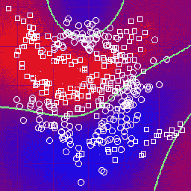
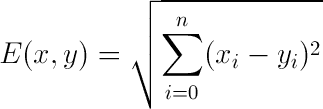
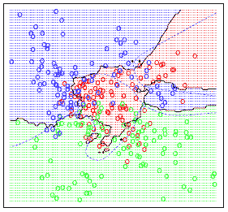

# k-近邻简介

> 原文：[`www.kdnuggets.com/2018/03/introduction-k-nearest-neighbors.html`](https://www.kdnuggets.com/2018/03/introduction-k-nearest-neighbors.html)

 评论

**作者 [Devin Soni](https://www.linkedin.com/in/devinsoni/)，计算机科学学生**



* * *

## 我们的前三大课程推荐

 1\. [谷歌网络安全证书](https://www.kdnuggets.com/google-cybersecurity) - 快速进入网络安全职业道路。

 2\. [谷歌数据分析专业证书](https://www.kdnuggets.com/google-data-analytics) - 提升你的数据分析技能

 3\. [谷歌 IT 支持专业证书](https://www.kdnuggets.com/google-itsupport) - 支持你的组织的 IT 需求

* * *

**k-近邻 (kNN)** 分类方法是机器学习中最简单的方法之一，也是入门机器学习和分类的绝佳方式。在其最基本的层面上，它本质上是通过查找训练数据中最相似的数据点进行分类，并根据这些数据点的分类做出有根据的猜测。尽管这种方法非常简单易懂和实现，但它在许多领域中得到了广泛应用，如**推荐系统**、**语义搜索**和**异常检测**。

正如我们在任何机器学习问题中需要做的那样，我们必须首先找到一种方法将数据点表示为**特征向量**。特征向量是数据的数学表示，由于数据的期望特征可能不具有内在的数值性质，因此可能需要预处理和特征工程来创建这些向量。对于具有**N**个唯一特征的数据，特征向量将是长度为**N**的向量，其中向量的**I**项表示该数据点在特征**I**上的值。因此，每个特征向量可以被视为**R^N**中的一个点。

现在，与大多数其他分类方法不同，kNN 属于**惰性学习**，这意味着在分类之前**没有明确的训练阶段**。相反，对数据的任何尝试进行概括或抽象都是在分类时进行的。虽然这意味着我们可以在获取数据后立即开始分类，但这种算法存在一些固有问题。我们必须能够将整个训练集保存在内存中，除非我们对数据集进行某种类型的缩减，否则执行分类可能会很耗费计算资源，因为算法会遍历所有数据点进行每次分类。**由于这些原因，kNN 在特征较少的小型数据集上效果最佳。**

一旦我们形成了训练数据集，该数据集表示为**M** x**N** 矩阵，其中**M** 是数据点的数量，**N** 是特征的数量，我们现在可以开始分类。kNN 方法的要点是，对于每个分类查询：

```py
1. Compute a distance value between the item to be classified and every item in the training data-set

2. Pick the k closest data points (the items with the k lowest distances)

3. Conduct a “majority vote” among those data points — the dominating classification in that pool is decided as the final classification

```

在进行分类之前，必须做出两个重要决定。一个是将要使用的**k**值；这可以是任意决定的，或者你可以尝试**交叉验证**以找到最佳值。下一个也是最复杂的，是将使用的**距离度量**。

计算距离有很多不同的方法，因为这是一个相当模糊的概念，使用的适当度量标准总是由数据集和分类任务决定。然而，**欧几里得距离** 和 **余弦相似度** 是两种流行的方法。

欧几里得距离可能是你最熟悉的一种；它本质上是通过将训练数据点从待分类点中减去得到的向量的大小。



欧几里得距离的一般公式

另一个常见的度量标准是余弦相似度。余弦相似度不是计算大小，而是使用两个向量之间的方向差异。


余弦相似度的一般公式

选择一个度量标准通常是棘手的，最好是使用交叉验证来决定，除非你有一些先验的见解可以明确指导使用一个而不是另一个。例如，对于像词向量这样的情况，你可能会想使用余弦相似度，因为词的方向比成分值的大小更有意义。一般来说，这两种方法的运行时间大致相同，并且都会受到高维数据的影响。

在完成上述所有操作并决定度量标准之后，kNN 算法的结果是一个决策边界，将**R^N**划分为若干部分。每个部分（下图中颜色不同）表示分类问题中的一个类别。边界不一定由实际的训练样本形成——它们是通过使用距离度量和可用的训练点来计算的。通过将**R^N**分成（小）块，我们可以计算该区域中一个假设数据点最可能的类别，从而将该块标记为该类别的区域。



这些信息就是开始实现算法所需的全部，进行实现应该相对简单。当然，还有很多方法可以改进这个基础算法。常见的修改包括加权，以及特定的预处理以减少计算和减少噪声，比如各种特征提取和降维算法。此外，kNN 方法也被用于回归任务，尽管不那么常见，其操作方式与分类器类似，通过平均来进行。

**个人简介：[Devin Soni](https://www.linkedin.com/in/devinsoni/)** 是一名计算机科学学生，对机器学习和数据科学感兴趣。他将在 2018 年成为 Airbnb 的一个软件工程实习生。可以通过[LinkedIn](https://www.linkedin.com/in/devinsoni/)联系他。

[原文](https://towardsdatascience.com/introduction-to-k-nearest-neighbors-3b534bb11d26)。经许可转载。

**相关：**

+   马尔可夫链简介

+   机器学习新手的前 10 大算法巡礼

+   K-最近邻——最懒的机器学习技术

### 更多相关话题

+   [从理论到实践：构建一个 k-最近邻分类器](https://www.kdnuggets.com/2023/06/theory-practice-building-knearest-neighbors-classifier.html)

+   [分类的最近邻](https://www.kdnuggets.com/2022/04/nearest-neighbors-classification.html)

+   [Scikit-learn 中的 K-最近邻](https://www.kdnuggets.com/2022/07/knearest-neighbors-scikitlearn.html)

+   [使用 PyCaret 进行二分类简介](https://www.kdnuggets.com/2021/12/introduction-binary-classification-pycaret.html)

+   [使用 PyCaret 在 Python 中进行聚类简介](https://www.kdnuggets.com/2021/12/introduction-clustering-python-pycaret.html)

+   [数据科学的基础数学：奇异值分解的视觉介绍](https://www.kdnuggets.com/2022/06/essential-math-data-science-visual-introduction-singular-value-decomposition.html)
