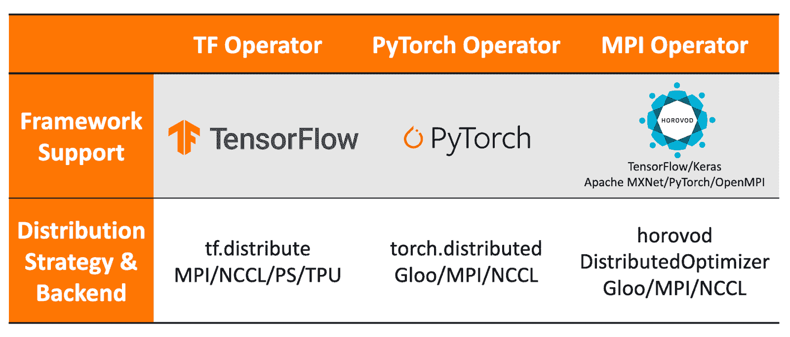

# Kubeflow MPI Operator 及其在行业中的应用

> 原文：[`www.kdnuggets.com/2020/03/introduction-kubeflow-mpi-operator-industry-adoption.html`](https://www.kdnuggets.com/2020/03/introduction-kubeflow-mpi-operator-industry-adoption.html)

评论

**由 [Yuan Tang](https://twitter.com/TerryTangYuan) (Ant Financial), [Wei Yan](https://www.linkedin.com/in/wei-yan-a6037337/) (Ant Financial), 和 [Rong Ou](https://www.linkedin.com/in/rongou/) (NVIDIA)**

Kubeflow 最近刚刚 [宣布了其首个主要的 1.0 版本](https://medium.com/kubeflow/kubeflow-1-0-cloud-native-ml-for-everyone-a3950202751)，使机器学习工程师和数据科学家能够利用云资产（无论是公共的还是本地的）进行机器学习工作负载。在这篇文章中，我们想介绍 [MPI Operator](https://github.com/kubeflow/mpi-operator) ([文档](https://www.kubeflow.org/docs/components/training/mpi/))，这是 Kubeflow 的核心组件之一，目前处于 alpha 阶段，它使得在 Kubernetes 上运行同步的、allreduce 风格的分布式训练变得容易。

* * *

## 我们的前三大课程推荐

 1\. [Google 网络安全证书](https://www.kdnuggets.com/google-cybersecurity) - 快速进入网络安全职业道路。

 2\. [Google 数据分析专业证书](https://www.kdnuggets.com/google-data-analytics) - 提升你的数据分析技能

 3\. [Google IT 支持专业证书](https://www.kdnuggets.com/google-itsupport) - 支持你所在组织的 IT 事务

* * *

当前有两种主要的分布式训练策略：一种是基于参数服务器的，另一种是基于集体通信原语（如 allreduce）的。

基于参数服务器的分布式策略依赖于集中式参数服务器来协调各个工作节点，负责从工作节点收集梯度并将更新后的参数发送给工作节点。下图展示了在这种分布式训练策略下，参数服务器和工作节点之间的互动。

尽管基于参数服务器的分布式训练可以通过增加更多的工作节点和参数服务器来支持训练非常大的模型和数据集，但在优化性能时仍然面临额外的挑战：

+   确定工作节点与参数服务器的正确比例并不容易。例如，如果仅使用少量参数服务器，网络通信很可能会成为训练的瓶颈。

+   如果使用了多个参数服务器，通信可能会使网络连接饱和。

+   工作节点和参数服务器的内存配额需要细致调整，以避免内存溢出错误或内存浪费。

+   如果模型可以适应每个工作节点的计算资源，当模型被分割到多个参数服务器时，会引入额外的维护和通信开销。

+   我们需要在每个参数服务器上复制模型以支持容错，这需要额外的计算和存储资源。

相对而言，基于集体通信原语的分布式训练，如 [allreduce](https://mpitutorial.com/tutorials/mpi-reduce-and-allreduce/)，在某些使用场景中可能更高效且更易于使用。在基于 allreduce 的分布式训练策略下，每个工作节点存储一整套模型参数。换句话说，不需要参数服务器。基于 allreduce 的分布式训练可以解决许多上述提到的挑战：

+   每个工作节点存储一整套模型参数，不需要参数服务器，因此在必要时增加更多的工作节点是直接的。

+   可以通过重新启动失败的工作节点并从任何现有工作节点加载当前模型来轻松恢复工作节点中的故障。模型无需复制以支持容错。

+   通过充分利用网络结构和集体通信算法，模型可以更高效地更新。例如，在 [ring-allreduce 算法](http://research.baidu.com/bringing-hpc-techniques-deep-learning/)中，每个 N 个工作节点只需与两个同伴工作节点进行 2 * (N − 1)次通信，就能完全更新所有模型参数。

+   扩展和缩减工作节点数量就像重建底层 allreduce 通信器和重新分配工作节点中的排名一样简单。

许多现有技术提供了这些集体通信原语的实现，如 [NCCL](https://github.com/NVIDIA/nccl)、 [Gloo](https://github.com/facebookincubator/gloo/)以及各种不同的 [MPI](https://www.mpi-forum.org/)实现。

MPI Operator 提供了一个通用的 [Custom Resource Definition (CRD)](https://kubernetes.io/docs/concepts/extend-kubernetes/api-extension/custom-resources/#customresourcedefinitions)，用于定义单个 CPU/GPU、多 CPU/GPUs 和多个节点上的训练作业。它还实现了一个自定义控制器来管理 CRD，创建依赖资源，并协调期望的状态。

与仅支持单一机器学习框架的其他 Kubeflow 操作器（如[TF Operator](https://github.com/kubeflow/tf-operator)和[PyTorch Operator](https://github.com/kubeflow/pytorch-operator)）不同，MPI Operator 与底层框架解耦，因此可以与许多框架良好配合，如[Horovod](https://github.com/horovod/horovod/)、[TensorFlow](https://www.tensorflow.org/)、[PyTorch](https://pytorch.org/)、[Apache MXNet](https://mxnet.apache.org/)以及各种集体通信实现，如[OpenMPI](https://www.open-mpi.org/)。

有关不同分布式训练策略、各种 Kubeflow 操作器之间的比较的更多详细信息，请查看[我们在 KubeCon Europe 2019 的演示](https://kccnceu19.sched.com/event/MPaT)。

### 示例 API 规范

我们一直在与社区和行业用户密切合作，以改进 MPI Operator 的 API 规范，使其适用于多种不同的使用场景。以下是一个示例：

注意，MPI Operator 提供了一个灵活且用户友好的 API，这个 API 在其他 Kubeflow 操作器中保持一致。

用户可以通过修改模板中的相关部分，轻松定制启动器和工作 Pod 的规范。例如，定制使用各种类型的计算资源，如 CPU、GPU、内存等。

此外，以下是一个示例规范，执行分布式 TensorFlow 训练作业，使用存储在[TFRecords](https://www.tensorflow.org/tutorials/load_data/tfrecord)格式中的 ImageNet 数据，存储在[Kubernetes 卷](https://kubernetes.io/docs/reference/glossary/?all=true#term-volume)中：

### 架构

MPI Operator 包含一个自定义控制器，该控制器监听 MPIJob 资源的变化。当创建新的 MPIJob 时，控制器会经过以下*逻辑*步骤：

1.  创建一个[ConfigMap](https://kubernetes.io/docs/reference/glossary/?all=true#term-configmap)，其中包含：

    +   一个辅助的 shell 脚本，可以被`mpirun`代替`ssh`使用。它调用`kubectl exec`进行远程执行。

    +   一个主机文件，列出了工作节点[StatefulSet](https://kubernetes.io/docs/reference/glossary/?all=true#term-statefulset)中的 Pods（形式为${job-id}-worker-0、${job-id}-worker-1 等），以及每个 Pod 中可用的插槽（CPU/GPU）。

1.  创建[RBAC](https://kubernetes.io/docs/reference/glossary/?all=true#term-rbac)资源（角色、服务账户、角色绑定），以允许远程执行（pods/exec）。

1.  等待工作 Pod 准备好。

1.  创建启动器任务。它在第 2 步创建的[服务账户](https://kubernetes.io/docs/reference/glossary/?all=true#term-service-account)下运行，并设置执行`mpirun`命令所需的环境变量。`kubectl`二进制文件通过初始化容器传递到 emptyDir 卷。

1.  启动器任务完成后，将工作节点 StatefulSet 中的副本数设置为 0。

欲了解更多细节，请查看[MPI Operator 的设计文档](https://github.com/kubeflow/community/blob/master/proposals/mpi-operator-proposal.md)。

### 行业采用

在撰写本文时，[已有 13 家公开的行业采用者](https://github.com/kubeflow/mpi-operator/blob/master/ADOPTERS.md)以及许多与社区紧密合作的其他公司。如果您的公司希望被加入采用者列表，请在[GitHub](https://github.com/kubeflow/mpi-operator)上向我们发送拉取请求！

### Ant Financial

在[Ant Financial](https://www.antfin.com/)，[我们管理着数万节点的 Kubernetes 集群](https://kubernetes.io/case-studies/ant-financial/)，并已部署了 MPI Operator 及其他 Kubeflow 操作器。MPI Operator 利用网络结构和集体通信算法，使用户无需担心工作节点和参数服务器之间的最佳比例，以获得最佳性能。用户可以专注于构建模型架构，而无需花时间调整用于分布式训练的下游基础设施。

生成的模型已经广泛应用于生产中，并在许多不同的实际场景中经过了检验。其中一个显著的应用案例是[Saofu](https://yq.aliyun.com/articles/563095)——一个移动应用，用户可以通过增强现实扫描任何“[福](https://zh.wikipedia.org/wiki/%E7%A6%8F%E5%AD%97)”（代表财富的汉字）来参与抽奖，每位用户都会收到一个包含大笔金额的虚拟红包。

### Bloomberg

[Bloomberg](https://www.bloomberg.com/)，全球商业和金融信息及新闻的领袖，拥有海量的数据——从历史新闻到实时市场数据及其他各种信息。Bloomberg 的 Data Science Platform 旨在让公司的内部机器学习工程师和数据科学家更容易地利用数据和算法模型进行日常工作，包括训练任务和用于他们所构建的最先进解决方案中的自动机器学习模型。

“Bloomberg 的 Data Science Platform 提供了类似 Kubeflow 的 TFJob 的 TensorFlowJob CRD，使公司的数据科学家能够轻松训练神经网络模型。最近，Data Science Platform 团队通过 MPI Operator 在 TensorFlowJob 中启用了基于 Horovod 的分布式训练作为实现细节。使用后端的 MPIJob 使 Bloomberg Data Science Platform 团队能够迅速为其机器学习工程师提供一种强大的方式，在几小时内使用公司的大量文本数据训练一个[BERT 模型](https://arxiv.org/abs/1810.04805)，”Bloomberg 的软件工程师郑成建表示。

### Caicloud

[Caicloud Clever](https://intl.caicloud.io/products/clever) 是一个基于 Caicloud 容器云平台的人工智能云平台，具备强大的硬件资源管理和高效的模型开发能力。Caicloud 的产品已部署在许多 500 强中国公司中。

“Caicloud Clever 支持包括 TensorFlow、Apache MXNet、Caffe、PyTorch 在内的多种 AI 模型训练框架，借助 Kubeflow tf-operator、pytorch-operator 等”，Caicloud Clever 团队的 AI 基础设施工程师 Ce Gao 表示。“同时，RingAllReduce 分布式训练支持的需求正在增加，以提升客户成熟度。”

Kubeflow MPI operator 是一个用于 allreduce 风格分布式训练的 Kubernetes Operator。Caicloud Clever 团队采用了 MPI Operator 的 v1alpha2 API。Kubernetes 本地 API 使其容易与平台上的现有系统进行协作。

### Iguazio

[Iguazio](https://www.iguazio.com/) 提供了一个以自动化、性能、可扩展性和开源工具使用为重点的云原生数据科学平台。

根据 Iguazio 的创始人兼 CTO Yaron Haviv 的说法：“我们评估了各种机制，以便在最小的开发者努力下扩展深度学习框架，发现使用 Horovod 与 Kubernetes 上的 MPI Operator 的组合是最好的工具，因为它支持横向扩展，支持 TensorFlow 和 PyTorch 等多个框架，并且不需要太多额外的编码或复杂的参数服务器使用。”

Iguazio 已经将 MPI Operator 集成到其托管服务和快速数据层中，以实现最大可扩展性，并通过开源项目如[MLRun](https://github.com/mlrun/mlrun)（用于 ML 自动化和跟踪）简化使用。查看[this blog post](https://towardsdatascience.com/gpu-as-a-service-on-kubeflow-fast-scalable-and-efficient-ml-c5783b95d192)中的示例应用，展示了 Iguazio 如何使用 MPI Operator。

### Polyaxon

[Polyaxon](https://polyaxon.com/) 是一个用于 Kubernetes 上可重复和可扩展机器学习的平台，它允许用户更快地迭代他们的研究和模型创建。Polyaxon 为数据科学家和机器学习工程师提供了一个简单的抽象，以简化他们的实验工作流程，并提供了一个非常一致的抽象来使用流行框架如 Scikit-learn、TensorFlow、PyTorch、Apache MXNet、Caffe 等进行训练和跟踪模型。

“几个 Polyaxon 用户和客户请求一种简便的方法来执行 allreduce 风格的分布式训练，MPI Operator 是提供这种抽象的完美解决方案。Polyaxon 已部署在几家公司和研究机构中，公共 docker hub 的下载量超过 900 万。”，Polyxagon 的联合创始人 Mourad Mourafiq 说道。

### 社区与贡献召集

我们感谢 [来自 11 个组织的超过 28 名个人贡献者](https://github.com/kubeflow/mpi-operator/graphs/contributors)，包括阿里云、亚马逊 Web 服务、蚂蚁金服、彭博、开源云、谷歌云、华为、Iguazio、NVIDIA、Polyaxon 和腾讯，他们直接为 MPI Operator 的代码库做出了贡献，还有许多提交问题或帮助解决问题、提问和回答问题、参与激励讨论的其他人。我们已经整理了一个 [路线图](https://github.com/kubeflow/mpi-operator/blob/master/ROADMAP.md)，提供了关于 MPI Operator 在未来版本中如何发展的高级概述，我们欢迎社区的任何贡献！

我们的里程碑成就离不开极其活跃的社区。查看我们的 [社区页面](https://www.kubeflow.org/docs/about/community/) 以了解如何加入 Kubeflow 社区！

[原文](https://medium.com/kubeflow/introduction-to-kubeflow-mpi-operator-and-industry-adoption-296d5f2e6edc)。经授权转载。

**相关：**

+   Kubeflow 如何将 AI 添加到你的 Kubernetes 部署中

+   2020 年最有用的机器学习工具

+   简易的一键 Jupyter Notebook

### 更多相关话题

+   [Ploomber 与 Kubeflow：简化 MLOps](https://www.kdnuggets.com/2022/02/ploomber-kubeflow-mlops-easier.html)

+   [AI 在算法交易中的采纳如何影响金融行业](https://www.kdnuggets.com/2022/04/adoption-ai-algorithmic-trading-affected-finance-industry.html)

+   [边缘 AI 的前景及有效采纳的途径](https://www.kdnuggets.com/the-promise-of-edge-ai-and-approaches-for-effective-adoption)

+   [SQL LIKE 操作符示例](https://www.kdnuggets.com/2022/09/sql-like-operator-examples.html)

+   [如何（不）使用 Python 的海象操作符](https://www.kdnuggets.com/how-not-to-use-pythons-walrus-operator)

+   [云存储采纳是当前商业的迫切需求](https://www.kdnuggets.com/2022/02/cloud-storage-adoption-need-hour-business.html)
