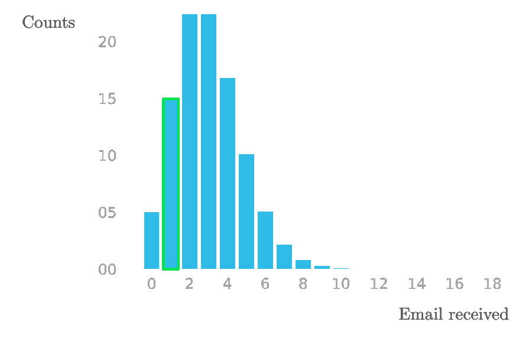
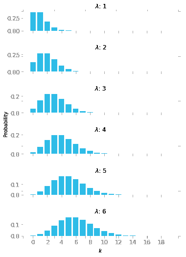

# 数据科学的基础数学：泊松分布

> 原文：[`www.kdnuggets.com/2020/12/introduction-poisson-distribution-data-science.html`](https://www.kdnuggets.com/2020/12/introduction-poisson-distribution-data-science.html)

评论

*泊松分布*，以法国数学家丹尼斯·西蒙·泊松命名，是一种离散分布函数，用于描述事件在固定时间（或空间）区间内发生特定次数的概率。它用于建模基于计数的数据，例如一小时内到达邮箱的邮件数量或一天内进入商店的顾客数量等。

* * *

## 我们的前三大课程推荐

 1\. [谷歌网络安全证书](https://www.kdnuggets.com/google-cybersecurity) - 快速进入网络安全职业生涯。

 2\. [谷歌数据分析专业证书](https://www.kdnuggets.com/google-data-analytics) - 提升你的数据分析能力。

 3\. [谷歌 IT 支持专业证书](https://www.kdnuggets.com/google-itsupport) - 支持组织的 IT 需求。

* * *

### 数学定义

让我们从一个例子开始，图 1 展示了莎拉在一小时间隔内收到的邮件数量。



*图 1：莎拉在过去 100 小时内每小时接收的邮件数量。*

柱状图的高度显示了莎拉观察到相应邮件数量的一小时间隔数。例如，突出显示的柱状图显示大约有 15 个一小时的时间段，她收到了一封邮件。

泊松分布由预期事件数量*λ*（发音为“lambda”）进行参数化。该分布是一个函数，将事件的发生次数（下一个公式中的整数*k*）作为输入，输出对应的概率（即发生*k*次事件的概率）。

泊松分布，记作*Poi*，表示如下：


对于*k = 0, 1, 2, ...*

*Poi(k; λ)*的公式返回给定参数*λ*的观察*k*事件的概率，其中*λ*对应于该时间段内预期的发生次数。

> **离散分布**
> 
> 请注意，二项分布和泊松分布都是离散的：它们给出离散结果的概率：泊松分布的事件发生次数和二项分布的成功次数。然而，虽然二项分布计算离散试验的离散次数（如抛硬币的次数），泊松分布考虑的是无限次数的试验（每次试验对应于非常小的一段时间），每个事件的概率非常小。

你可以参考下面的部分以查看泊松分布是如何从二项分布中推导出来的。

### 示例

Priya 在国家公园录制鸟鸣，使用放置在树上的麦克风。她记录了鸟鸣叫的次数，并希望建模一分钟内的鸟鸣叫数量。为此任务，她将假设检测到的鸟是独立的。

查看过去几小时的数据，Priya 观察到平均每分钟检测到两只鸟。因此，值 2 可能是分布参数*λ*的一个好候选值。她的目标是知道在下一分钟内特定数量的鸟鸣叫的概率。

让我们从你上面看到的公式实现泊松分布函数：

```py
def poisson_distribution(k, lambd):
    return (lambd ** k * np.exp(-lambd)) / np.math.factorial(k)
```

记住*λ*是鸟在一分钟内鸣叫的预期次数，所以在这个例子中，你有*λ=2*。函数`poisson_distribution(k, lambd)`接受*k*和*λ*的值，并返回观察到*k*次事件的概率（即记录到*k*只鸟鸣叫）。

例如，Priya 在下一分钟观察到 5 只鸟的概率为：

```py
poisson_distribution(k=5, lambd=2)
```

```py
0.03608940886309672
```

5 只鸟在下一分钟鸣叫的概率约为 0.036（3.6%）。

与二项函数类似，对于较大的*k*值，这将导致溢出。因此，你可能需要使用模块`scipy.stats`中的`poisson`，如下所示：

```py
from scipy.stats import poisson

poisson.pmf(5, 2)
```

```py
0.03608940886309672
```

让我们绘制不同值的*k*的分布图：

```py
lambd=2

k_axis = np.arange(0, 25)
distribution = np.zeros(k_axis.shape[0])
for i in range(k_axis.shape[0]):
    distribution[i] = poisson.pmf(i, lambd)

plt.bar(k_axis, distribution)
# [...] Add axes, labels...
```


*图 2: *λ=2*的泊松分布。*

对应于*k*值的概率在图中的概率质量函数中进行了总结。

1.  你可以看到，在下一分钟内，Priya 听到一两只鸟鸣叫的可能性最大。

最后，你可以为不同值的*λ*绘制函数：

```py
f, axes = plt.subplots(6, figsize=(6, 8), sharex=True)

for lambd in range(1, 7):

    k_axis = np.arange(0, 20)
    distribution = np.zeros(k_axis.shape[0])
    for i in range(k_axis.shape[0]):
        distribution[i] = poisson.pmf(i, lambd)

    axes[lambd-1].bar(k_axis, distribution)
    axes[lambd-1].set_xticks(np.arange(0, 20, 2))
    axes[lambd-1].set_title(f"$\lambda$: {lambd}")

# Add axes labels etc.
```



*图 3: 不同值的*λ*的泊松分布。*

图 3 显示了不同值的*λ*的泊松分布，在某些情况下看起来有点像正态分布。然而，泊松分布是离散的，当*λ*值较低时不对称，并且被限制为零。

### 附加：推导泊松分布

让我们看看泊松分布是如何从二项分布中推导出来的。

在[数据科学的基本数学](https://bit.ly/3n8O2n1)中，你看到如果你多次运行一个随机实验，获得`mm`次成功的概率，在*N*次试验中，每次试验成功的概率为*μ*，可以通过二项分布计算：


### **问题陈述**

你如何使用二项公式来建模在*给定时间间隔*内观察事件一定次数的概率，而不是在一定次数的试验中？这里有一些问题：

1.  你不知道 NN，因为没有特定的试验次数，只有一个时间窗口。

1.  你不知道μμ，但你知道事件发生的预期次数。例如，你知道在过去的 100 小时里，你平均每小时收到 3 封电子邮件，你想知道在下一个小时内收到 5 封电子邮件的概率。

让我们从数学上处理这些问题。

为了解决第一个问题，你可以将时间视为小的离散块。我们称这些块为ϵϵ（发音为“epsilon”），如图 4 所示。如果你将每个块视为一次试验，你就有*N*个块。


>*图 4：你可以将连续时间划分为长度为ϵ的段。*

连续时间尺度的估计在*ϵ*非常小的时候更准确。如果ϵϵ很小，段数*N*将会很大。此外，由于段很小，每个段的成功概率也很小。

总结一下，你想要修改二项分布以便能够建模一个非常大的试验次数，每次试验的成功概率非常小。诀窍在于考虑*N*趋向于无穷大（因为连续时间通过*ϵ*的值趋向于零来进行近似）。

### **更新二项公式**

让我们在这种情况下找到μμ并将其替换到二项公式中。你知道在一段时间*t*内事件的预期次数，我们称之为*λ*（发音为“lambda”）。由于你将*t*分成长度为*ϵ*的小间隔，你有试验次数：


你有*λ*作为*N*次试验中的成功次数。所以在一次试验中成功的概率*μ*是：


将μμ替换到二项公式中，你得到：


通过展开表达式，将二项系数写为阶乘（如在[数据科学的基本数学](https://bit.ly/3n8O2n1)中所做），并使用公式，你得到：


我们来考虑这个表达式的第一个元素。如果你声明 NN 趋向于无穷大（因为*ϵ*趋向于零），你得到：


这是因为 *k* 可以在与 *N* 相比小时被忽略。例如，你有：


这近似于 

因此，第一个比率变为：


然后，利用  的事实，你得到：


最后，由于  在 *N* 趋近于无穷大时趋近于 1：


让我们将这些代入二项分布的公式中：


这是泊松分布，记作 *Poi*：


对于 *k = 0, 1, 2, ...*

**个人简介：[哈德里安·让](https://hadrienj.github.io/)** 是一名机器学习科学家。他拥有巴黎高等师范学院的认知科学博士学位，在那里他使用行为和电生理数据研究听觉感知。他曾在工业界工作，构建了用于语音处理的深度学习管道。在数据科学与环境交汇处，他从事关于使用深度学习分析音频记录的生物多样性评估项目。他还定期在 Le Wagon（数据科学训练营）创建内容并教授课程，并在他的博客（[hadrienj.github.io](http://hadrienj.github.io)）上撰写文章。

[原文](https://hadrienj.github.io/posts/Essential-Math-poisson_distribution/)。经授权转载。

**相关：**

+   数据科学的基础数学：概率密度函数与概率质量函数

+   数据科学的基础数学：积分与曲线下的面积

+   数据科学与机器学习的免费数学课程

### 进一步了解此主题

+   [如何使用 Python 确定最佳拟合数据分布](https://www.kdnuggets.com/2021/09/determine-best-fitting-data-distribution-python.html)

+   [正态分布综合指南](https://www.kdnuggets.com/2022/06/comprehensive-guide-normal-distribution.html)

+   [如何克服对数学的恐惧并学习数据科学中的数学](https://www.kdnuggets.com/2021/03/overcome-fear-learn-math-data-science.html)

+   [数据科学的基础数学：奇异值分解的视觉介绍](https://www.kdnuggets.com/2022/06/essential-math-data-science-visual-introduction-singular-value-decomposition.html)

+   [数据科学的基础数学：特征向量及其在 PCA 中的应用](https://www.kdnuggets.com/2022/06/essential-math-data-science-eigenvectors-application-pca.html)

+   [数据科学需要多少数学？](https://www.kdnuggets.com/2020/06/math-data-science.html)
