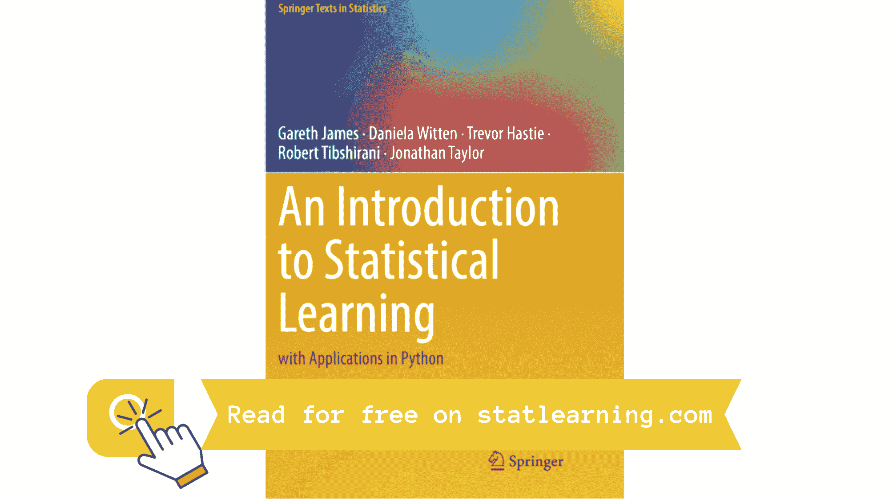
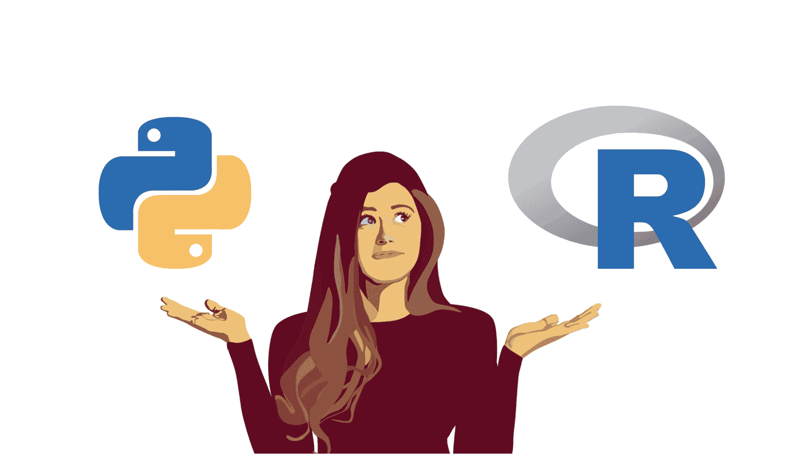
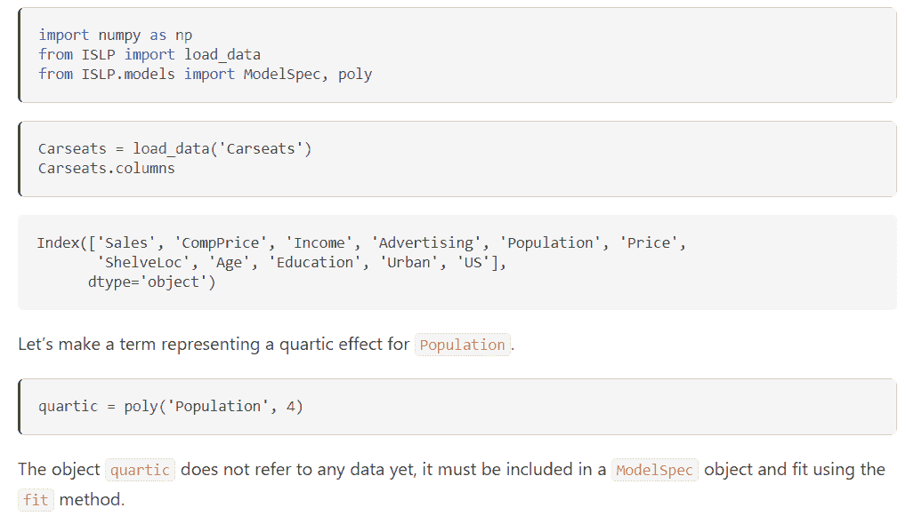

# 统计学习导论，Python 版：免费书籍

> 原文：[`www.kdnuggets.com/2023/07/introduction-statistical-learning-python-edition-free-book.html`](https://www.kdnuggets.com/2023/07/introduction-statistical-learning-python-edition-free-book.html)

图片由作者提供

多年来，[Introduction to Statistical Learning with Applications in R](https://hastie.su.domains/ISLR2/ISLRv2_corrected_June_2023.pdf)，更为人熟知的 ISLR，一直被机器学习初学者和从业者视为最好的机器学习教科书之一。

* * *

## 我们的三大课程推荐

 1\. [Google 网络安全证书](https://www.kdnuggets.com/google-cybersecurity) - 快速进入网络安全职业生涯。

 2\. [Google 数据分析专业证书](https://www.kdnuggets.com/google-data-analytics) - 提升你的数据分析能力

 3\. [Google IT 支持专业证书](https://www.kdnuggets.com/google-itsupport) - 支持你的组织的 IT 工作

* * *

现在，Python 版的书籍，[Introduction to Statistical Learning with Applications in Python](https://hastie.su.domains/ISLP/ISLP_website.pdf)——或称**ISL with Python**——终于来了，社区的兴奋之情更是与日俱增！

# ISL with Python 来了。太棒了！但为什么呢？

很高兴你问了。????

如果你在机器学习领域待了很久，那么你可能已经听说、阅读或使用过这本书的 R 版本。而你也知道自己最喜欢其中的哪些内容。但这是我的故事。

在我开始研究生课程的那个夏天，我决定自学机器学习。我很幸运在机器学习的早期阶段遇到了 ISLR。ISLR 的作者非常擅长将复杂的机器学习算法拆解成易于理解的方式——包括所需的数学基础——而不会让学习者感到不堪重负。这是我喜欢这本书的一个方面。

**然而，ISLR 中的代码示例和实验是在 R 中进行的**。遗憾的是，当时我并不懂 R，但对 Python 编程很熟悉。所以我有两个选择。

图片由作者提供

我可以自学 R。或者我可以使用其他资源——教程和文档——在 Python 中构建模型。像大多数其他 Python 爱好者一样，我选择了第二个选项（是的，更熟悉的路线，我知道）。

虽然 R 在统计分析方面表现出色，但如果你刚开始你的数据之旅，Python 是一个很好的首选语言。

**但这不再是问题了！因为这个新的 Python 版让你可以边编码边构建 Python 中的机器学习模型。** 不再担心为了跟上进度而必须学习一种新的编程语言。

故事时间结束了！让我们仔细看看本书的内容。

# ISL 与 Python 的内容

就内容而言，Python 版与 R 版相似。然而，这是对 Python 的适当调整，这是可以预期的。这本书还包括一个 Python 编程速成课程部分，以学习基础知识。

本书涵盖了足够的广度。从统计学习基础、监督学习和无监督学习算法到深度学习等，本书被组织为以下章节：

+   统计学习

+   线性回归

+   分类

+   重采样方法

+   线性模型选择和正则化

+   超越线性

+   基于树的方法

+   支持向量机

+   深度学习（涵盖基础神经网络到卷积网络和递归神经网络）

+   生存分析与删失数据

+   无监督学习

+   多重测试（深入探讨假设检验）

# ISLP Python 包

本书使用的数据集来自公开可用的资源库，如 UCI 机器学习库以及其他类似资源。一些例子包括关于自行车共享、信用卡违约、基金管理和犯罪率的数据集。

学习从各种来源收集数据，通过网络抓取过程，以及从来源导入数据，对数据科学项目至关重要。

然而，对于不熟悉数据收集步骤的学习者来说，如果他们想用这本书来掌握理论和实际部分，可能会在学习过程中引入摩擦。

为了提供顺畅的学习体验，本书配有一个附带的 ISLP 包：

+   ISLP 包适用于所有主要平台：Linux、Windows 和 MacOS。

+   你可以使用 pip 安装 ISLP：`pip install islp`，最好在你机器上的虚拟环境中安装。

ISLP 包有一个 [全面的文档](https://islp.readthedocs.io/en/latest/)。ISLP 包提供数据加载工具。当你处理特定数据集时，文档页面为你提供了关于数据集的各种特征、记录数量以及将数据加载到 pandas dataframe 的起始代码的可访问信息。

它还具有创建更高阶特征的辅助函数和功能，如多项式和样条特征。

生成多项式特征 | [来自 ISLP 文档的图像](https://islp.readthedocs.io/en/latest/transforms/poly.html)

为了更完整的学习体验，你可以从其来源读取数据，进行特征工程而不使用 ISLP 包。

当你在构建模型时，可以尝试仅使用 scikit-learn 的实现，以及 PyTorch 或 Keras 用于深度学习部分。

# 那么，这本书适合谁呢？

**数据科学和机器学习初学者**：如果你是一个喜欢自学机器学习的初学者，这本书是一个很好的学习资源。

**ML 从业者**：作为机器学习从业者，你会有构建机器学习模型的经验。但回到基础知识，例如假设检验和其他算法，仍然是有帮助的。

**教育工作者**：理论和实验室相结合使这本书成为机器学习初学课程的绝佳伴侣。如今大多数大学和数据科学训练营都教授机器学习。因此，如果你是正在教授或计划教授机器学习课程的教育工作者，这本书是一个值得考虑的优秀教材。

# 总结

就这样。用 Python 进行统计学习的介绍是这个夏天最令人兴奋的发布之一。

你可以访问 [statlearning.com](https://www.statlearning.com/) 开始阅读 Python 版。虽然电子版可以免费阅读，但亚马逊上的纸质版在首日就售罄了。因此，我们很高兴看到你能充分利用这本书。今天就开始阅读吧。祝学习愉快！

**[Bala Priya C](https://www.linkedin.com/in/bala-priya/)** 是来自印度的开发者和技术作家。她喜欢在数学、编程、数据科学和内容创作的交汇点工作。她的兴趣和专长领域包括 DevOps、数据科学和自然语言处理。她喜欢阅读、写作、编程和喝咖啡！目前，她正在通过撰写教程、操作指南、观点文章等来学习和分享她的知识，服务开发者社区。

### 更多相关内容

+   [真正免费的课程：AI & ML 版](https://www.kdnuggets.com/free-courses-that-are-actually-free-ai-ml-edition)

+   [使用 Python 的深度学习：François Chollet 的第二版](https://www.kdnuggets.com/2022/01/manning-deep-learning-python-second-edition-francois-chollet.html)

+   [如何通过索引加速 SQL 查询 [Python 版]](https://www.kdnuggets.com/2023/08/speed-sql-queries-indexes-python-edition.html)

+   [十大机器学习演示：Hugging Face Spaces 版](https://www.kdnuggets.com/2022/05/top-10-machine-learning-demos-hugging-face-spaces-edition.html)

+   [神经网络与深度学习：教科书（第 2 版）](https://www.kdnuggets.com/2023/07/aggarwal-neural-networks-deep-learning-textbook-2nd-edition.html)

+   [Pydon'ts - 编写优雅的 Python 代码：免费书评](https://www.kdnuggets.com/2022/05/pydonts-write-elegant-python-code-free-book-review.html)
