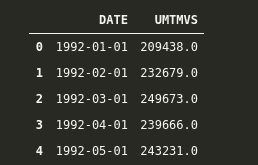
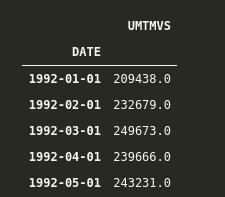
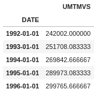
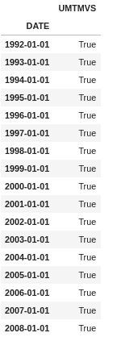
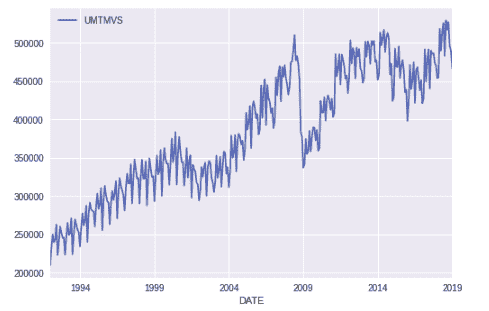
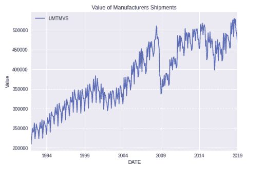
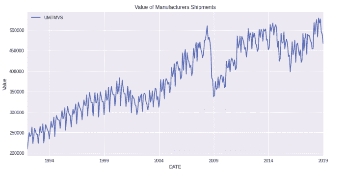
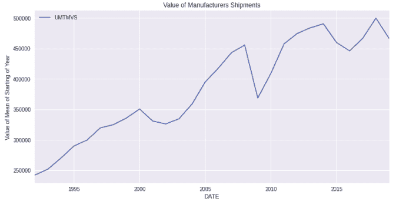
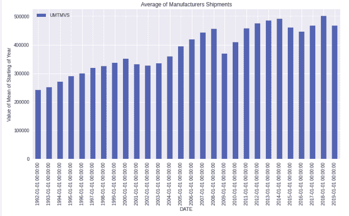
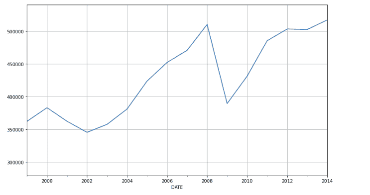

# Python 中时间序列分析简介

> 原文：[`www.kdnuggets.com/2020/09/introduction-time-series-analysis-python.html`](https://www.kdnuggets.com/2020/09/introduction-time-series-analysis-python.html)

评论

根据维基百科：

> *一个**时间序列**是按时间顺序索引（或列出或绘制）的数据点序列。最常见的是，时间序列是按等间隔的连续时间点采集的序列。因此，它是一个离散时间数据序列。时间序列的例子包括海洋潮汐的高度、太阳黑子的计数和道琼斯工业平均指数的每日收盘值。*

因此，任何在连续等间隔时间点上采集的数据集。例如，我们可以看到 [这个](https://fred.stlouisfed.org/series/UMTMVS)数据集，其为**所有制造业制造商出货量的值**。

我们将看到一些重要的要点，这些要点可以帮助我们分析任何时间序列数据集。这些要点包括：

+   **在 Pandas 中正确加载时间序列数据集**

+   **时间序列数据中的索引**

+   **使用 Pandas 进行时间重采样**

+   **滚动时间序列**

+   **使用 Pandas 绘制时间序列数据**

### 在 Pandas 中正确加载时间序列数据集

让我们在 pandas 中加载上述数据集。

```py
df = pd.read_csv('Data/UMTMVS.csv')
df.head()

```



由于我们希望将“DATE”列作为我们的索引，但仅通过读取并没有实现，因此我们需要添加一些额外的参数。

```py
df = pd.read_csv(‘Data/UMTMVS.csv’, index_col=’DATE’)
df.head()

```



很好，现在我们已经将我们的 DATE 列添加为索引，但让我们检查一下它的数据类型，以了解 Pandas 是否将索引视为简单对象还是 Pandas 内置的 DateTime 数据类型。

```py
df.index 

```


这里我们可以看到 Pandas 将我们的索引列处理为一个简单对象，所以我们需要将其转换为 DateTime。我们可以按照以下步骤进行：

```py
df.index = pd.to_datetime(df.index)
df.index

```


现在我们可以看到我们数据集的*dtype*是*datetime64[ns]*。这个“[ns]”表示它在纳秒级别上是精确的。如果我们愿意，可以将其更改为“天”或“月”。

或者，为了避免所有这些麻烦，我们可以使用 Pandas 在一行代码中加载数据，如下所示。

```py
df = pd.read_csv(‘Data/UMTMVS.csv’, index_col=’DATE’, parse_dates=True)
df.index

```


在这里，我们添加了*parse_dates=True*，所以它将自动使用我们的*index*作为日期。

### 时间序列数据中的索引

假设我想获取从*2000-01-01*到*2015-05-01*的所有数据。为了做到这一点，我们可以像这样简单地在 Pandas 中使用索引。

```py
df.loc['2000-01-01':'2015-01-01']

```


这里我们有从*2000-01-01*到*2015-01-01*的所有月份的数据。

假设我们想获取从*1992-01-01*到*2000-01-01*的所有第一个月份的数据。我们可以通过添加另一个参数来简单地实现，这个参数类似于我们在 Python 中切片列表时的操作，并在末尾添加步长参数。

在 Pandas 中，这种语法是*['开始日期':'结束日期':步长]*。现在，如果我们观察我们的数据集，它是按月份格式的，所以我们想要从 1992 年到 2000 年每 12 个月的数据。我们可以如下操作。

```py
df.loc['1992-01-01':'2000-01-01':12]

```


在这里，我们可以看到我们可以获得每年第一月的值。

### 使用 Pandas 进行时间重采样

把重采样看作是*groupby()*，我们根据任何列进行分组，然后应用聚合函数来检查我们的结果。而在时间序列索引中，我们可以基于任何*rule*进行重采样，其中我们指定是否要基于“年”或“月”或“天”或其他任何东西进行重采样。

我们重采样时间序列索引的一些重要规则是：

+   M = 月末

+   A = 年末

+   MS = 月开始

+   AS = 年开始

等等。你可以在[官方文档](https://pandas.pydata.org/pandas-docs/stable/user_guide/timeseries.html#offset-aliases)中查看详细的别名。

让我们将其应用于我们的数据集。

假设我们想计算每年开始时的运输均值。我们可以通过调用*resample*，其中*rule='AS'*表示年开始，然后调用*mean*聚合函数来实现。

我们可以如下查看它的*头部*。

```py
df.resample(rule='AS').mean().head()

```



在这里，我们根据每年的开始对索引进行了重采样（记住“AS”做了什么），然后应用了*mean*函数，现在我们得到了每年开始时的 Shipping 均值。

我们甚至可以使用自定义函数与*resample*一起使用。假设我们想要用自定义函数计算每年的总和。我们可以如下操作。

```py
def sum_of_year(year_val):
    return year_val.sum()

```

然后我们可以通过重采样来应用它，如下所示。

```py
df.resample(rule='AS').apply(year_val)

```

我们可以通过将其与进行比较来确认它工作正常

```py
df.resample(rule='AS').apply(my_own_custom) == df.resample(rule='AS').sum()

```



而且它们两个是相等的。

### 滚动时间序列

滚动也类似于时间重采样，但在滚动中，我们取任意大小的窗口，并对其执行任何函数。简单来说，我们可以说大小为*k*的滚动窗口意味着*k*个连续的值。

让我们看一个例子。如果我们想计算 10 天的滚动平均值，我们可以如下操作。

```py
df.rolling(window=10).mean().head(20) # head to see first 20 values 

```


现在我们可以看到，前 10 个值是*NaN*，因为没有足够的值来计算前 10 个值的滚动均值。它从第 11 个值开始计算均值，并继续进行。

类似地，我们可以如下检查 30 天窗口的最大值。

```py
df.rolling(window=30).max()[30:].head(20) # head is just to check top 20 values

```


注意，我在这里添加了* [30:] *，仅仅是因为前 30 个条目，即第一个窗口，没有值来计算*max*函数，因此它们是*NaN*，为了添加截图以显示前 20 个值，我只是跳过了前 30 行，但在实际操作中你不需要这样做。

在这里，我们可以看到在 30 天的滚动窗口上具有最大值。

### 使用 Pandas 绘制时间序列数据

有趣的是，Pandas 提供了一整套内置的可视化工具和技巧，可以帮助你可视化任何类型的数据。

只需在数据框上调用 *.plot* 函数，就可以获得基本的折线图。

```py
df.plot()

```



在这里，我们可以看到制造商出货量随时间的变化。注意 Pandas 如何很好地处理我们的 x 轴，即我们的时间序列索引。

我们可以通过在图上使用 *.set* 来进一步修改它，添加标题和 y 轴标签。

```py
ax = df.plot()
ax.set(title='Value of Manufacturers Shipments', ylabel='Value')

```



同样，我们可以通过 *.plot* 中的 *figsize* 参数来改变图表的大小。

```py
ax = df.plot(figsize=(12,6))
ax.set(title='Value of Manufacturers Shipments', ylabel='Value')

```



现在我们绘制每年开始值的均值。我们可以通过在重采样后调用 *.plot* 来完成，因为 'AS' 是开始年的规则。

```py
ax = df.resample(rule='AS').mean().plot(figsize=(12,6))
ax.set(title='Average of Manufacturers Shipments', ylabel='Value of Mean of Starting of Year')

```



我们还可以通过在 *.plot* 上调用 *.bar* 来绘制每年开始的平均值的条形图。

```py
ax = df.resample(rule='AS').mean().plot.bar(figsize=(12,6))
ax.set(title='Average of Manufacturers Shipments', ylabel='Value of Mean of Starting of Year');

```



同样，我们可以按如下方式绘制月初的滚动均值和正常均值。

```py
ax = df['UMTMVS'].resample(rule='MS').mean().plot(figsize=(15,8), label='Resample MS')
ax.autoscale(tight=True)
df.rolling(window=30).mean()['UMTMVS'].plot(label='Rolling window=30')

ax.set(ylabel='Value of Mean of Starting of Month',title='Average of Manufacturers Shipments')
ax.legend()

```

在这里，我们首先通过规则 = “MS”（月初）重采样绘制了每个月开始的均值。然后我们设置了 *autoscale(tight=True)*。这将移除额外的空白图部分。然后我们绘制了 30 天窗口的滚动均值。请记住，前 30 天是空的，你会在图中观察到这一点。接着，我们设置了标签、标题和图例。

这个图表的输出是


注意滚动平均数的前 30 天缺失，由于这是滚动平均数，与重采样相比，它非常平滑。

类似地，你可以根据自己的选择绘制特定日期的图表。假设我想绘制从 1995 年到 2005 年每年开始的最大值。我可以如下操作。

```py
ax = df['UMTMVS'].resample(rule='AS').max().plot(xlim=["1999-01-01","2014-01-01"],ylim=[280000,540000], figsize=(12,7))
ax.yaxis.grid(True)
ax.xaxis.grid(True)

```

在这里，我们指定了 *xlim* 和 *ylim*。请看我如何在 *xlim* 中添加了日期。主要的模式是 *xlim=['起始日期', '结束日期']*。



在这里，你可以看到 1999 年至 2014 年每年开始的最大值的输出。

### 学习成果

这篇文章到此为止。希望你现在已经了解了基础知识。

+   **正确加载 Pandas 中的时间序列数据集**

+   **时间序列数据中的索引**

+   **使用 Pandas 进行时间重采样**

+   **滚动时间序列**

+   **使用 Pandas 绘制时间序列数据**

正确掌握这些主题，并可以将其应用到自己的数据集中。

**相关：**

+   [使用 R 理解时间序列](https://www.kdnuggets.com/2020/07/understanding-time-series-r.html)

+   [如何（不）使用机器学习进行时间序列预测：续集](https://www.kdnuggets.com/2020/03/machine-learning-time-series-forecasting-sequel.html)

+   [如何使用 Python 的 datetime](https://www.kdnuggets.com/2019/06/how-use-datetime.html)

* * *

## 我们的前三课程推荐

 1\. [谷歌网络安全证书](https://www.kdnuggets.com/google-cybersecurity) - 快速进入网络安全职业生涯。

 2\. [谷歌数据分析专业证书](https://www.kdnuggets.com/google-data-analytics) - 提升你的数据分析技能

 3\. [谷歌 IT 支持专业证书](https://www.kdnuggets.com/google-itsupport) - 支持你的组织在 IT 方面

* * *

### 更多相关主题

+   [成为一名优秀数据科学家所需的 5 项关键技能](https://www.kdnuggets.com/2021/12/5-key-skills-needed-become-great-data-scientist.html)

+   [每个初学者数据科学家应该掌握的 6 种预测模型](https://www.kdnuggets.com/2021/12/6-predictive-models-every-beginner-data-scientist-master.html)

+   [2021 年最佳 ETL 工具](https://www.kdnuggets.com/2021/12/mozart-best-etl-tools-2021.html)

+   [使用管道编写干净的 Python 代码](https://www.kdnuggets.com/2021/12/write-clean-python-code-pipes.html)

+   [是什么让 Python 成为初创公司的理想编程语言](https://www.kdnuggets.com/2021/12/makes-python-ideal-programming-language-startups.html)

+   [每位数据科学家都应该了解的三个 R 库（即使你使用 Python）](https://www.kdnuggets.com/2021/12/three-r-libraries-every-data-scientist-know-even-python.html)
